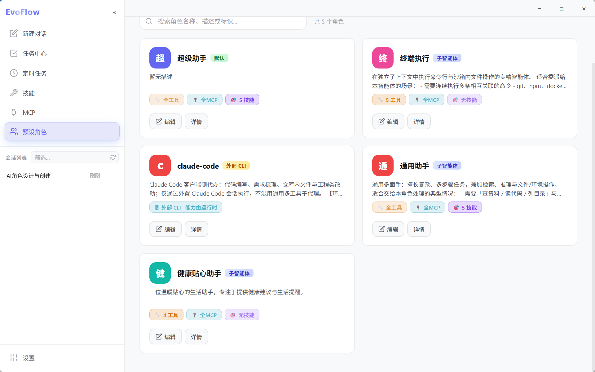

# ⚡ EvoFlow
> EvoFlow 是 **Evovex AI** 旗下的**超级 Agent 编排框架**：采用 **Supervisor 超级智能体全局主控模式**，从源头解决长任务易中断、Token 无效消耗等核心痛点，支持用户随时下达任务指令、执行过程全程透明可干预、自动交付最终结果，由可扩展技能生态驱动能力边界。

欢迎在 GitHub **Star** 关注进展，**完整源码开放**将在社区成熟后另行公布。

---
## 📑 目录
- [📦 获取产品与桌面端](#获取产品与桌面端)
- [🖼️ 界面预览](#界面预览)
- [🎯 核心价值亮点](#核心价值亮点)
- [✨ 功能总览](#功能总览)
- [💬 社区与交流](#社区与交流)
- [🙏 致谢](#致谢)

---
## 📦 获取产品与桌面端
| 内容 | 入口 |
|--------|------|
| 📥 官方发行版与桌面安装包 | [EvovexAI/EvoFlow Releases](https://github.com/EvovexAI/EvoFlow/releases) |
| 📚 使用教程 | [桌面端使用指南](https://www.evovexai.com/docs/chat/evopanel) |

---
## 🖼️ 界面预览

以下为 EvoFlow **桌面图形界面（GUI）** 示意（截图随版本更新，请以 [最新发行版](https://github.com/EvovexAI/EvoFlow/releases/latest) 为准）。完整操作见 [桌面端使用指南](https://www.evovexai.com/docs/chat/evopanel)。

  

主界面 · 流式对话与工具过程可视化

<table>
  <tr>
    <td align="center" colspan="2">
      
       Agent 管理 · 人设与工具白名单
    </td>
  </tr>
  <tr>
    <td align="center" width="50%">
      
       定时任务（一）
    </td>
    <td align="center" width="50%">
      
       定时任务（二）
    </td>
  </tr>
  <tr>
    <td align="center" width="50%">
      
       托管任务（一）
    </td>
    <td align="center" width="50%">
      
       托管任务（二）
    </td>
  </tr>
  <tr>
    <td align="center" colspan="2">
      
       浏览器操作 · Agent 驱动浏览、点击与页面交互
    </td>
  </tr>
</table>

> 截图文件目录：[docs/assets/screenshots/](docs/assets/screenshots/)（见该目录 `README.md` 中的文件名说明）

---
## 🎯 核心价值亮点
- ✅ **长任务自动闭环**  
解决传统Agent对话「长任务易中断、上下文漂移、人工值守成本高」的痛点，支持跨会话任务断点续跑、异常自动重试、局部重编排，任务全程可观测，保障自动闭环到验收

- ✅ **智能多代理调度**  
Supervisor全局总控模式，全自动完成任务全生命周期管理：自动意图澄清→方案规划→子任务依赖图拆解，基于子智能体能力画像精准分发任务，支持需求分析/设计/编码等多角色子代理分工协作，无需用户手动调度

- ✅ **无人值守托管运行**  
7×24小时托管运行能力，解放人力：后台独立沙箱隔离执行，支持暂停/恢复/终止，运行状态实时可查，任务结束自动推送Markdown结果小结到飞书，无需人工值守

- ✅ **飞书全链路联动**  
IM侧即可完成全流程操作，不用开客户端：飞书侧可直接下达各类任务指令，支持定时/周期任务配置，执行结果自动推送飞书，IM侧即可完成任务全流程管控

- ✅ **Claude Code深度协同**  
编码类任务效率提升神器：既支持直接和Claude Code实时交互完成编码/调试，也可在Supervisor模式中作为编码子代理承接开发专项任务，支持多Claude Code会话并行分工，大幅提升研发效率

- ✅ **零门槛自然语言操作**  
所有能力自然语言触发，不用复杂配置：托管任务、定时任务直接在对话中即可创建，用自然语言就能下达指令，无需学习复杂配置

- ✅ **降本增效控Token消耗**  
从源头控制Token无效消耗：工具渐进暴露机制，仅加载当前场景所需工具，大幅减少无效Token占用，降低使用成本

---
## ✨ 功能总览
### 🚀 1. 核心特色（八大支柱）
| 特色 | 说明 |
|------|------|
| **长任务与可恢复编排** | 跨会话任务监督、排队与重试，必要时局部重编排，保障任务闭环到验收 |
| **超级总控智能体（Supervisor）** | 澄清意图→方案规划→拆解为有向无环子任务依赖图；基于子Agent能力画像精准分发任务，能力与任务最优匹配；子任务上下文自动传递；全局进度调控、异常纠错与局部重编排 |
| **Claude Code 多会话协同** | 直连Claude Code交互，也可作为子代理承接编码/调试专项任务，支持多Claude Code会话并行分工与结果汇总 |
| **托管智能体与长期任务托管** | 独立沙箱隔离，支持7×24小时后台托管运行，实时查看状态与日志，支持暂停/恢复/终止，结果可追溯；支持模型提议托管任务，用户确认后执行；结束后可向飞书等IM推送Markdown结果小结 |
| **场景与工作阶段** | 按任务切换形态，遵循「先规划、再确认、后执行」流程，降低误触，控制上下文规模 |
| **工具渐进暴露 · 技能 / MCP** | 核心能力先行，扩展按需挂载；支持MCP生态扩展接入 |
| **记忆 · 任务状态 · 主线快照** | 会话/任务状态与主线快照持久化；子问题进度自动回注；Plan闸口与护栏收口，避免长对话漂移 |
| **智能体进化** | 智能体配置（模型、工具白名单、扩展）与技能生命周期协同治理，变更支持热重载 |

### 🖥️ 2. 桌面图形界面能力
| 功能域 | 说明 |
|--------|------|
| **对话模式** | Chat · Plan · Execute · Infinite；支持thinking/规划/子代理等开关组合 |
| **实时聊天** | 流式输出、Markdown渲染、多模态交互、工具调用过程可视化 |
| **模型配置** | 多提供商模型切换、thinking/vision能力开关、自定义网关地址配置 |
| **任务中心** | 任务创建/监控、批量操作、历史记录追溯 |
| **多代理与项目管理** | 项目维度隔离、Supervisor协调、上下文/记忆相互隔离 |
| **Agent 管理** | 人设身份配置、按Agent分配模型与工具白名单 |
| **工具与技能市场** | 技能浏览/启停、归档安装、MCP扩展状态管理 |
| **IM 渠道** | 支持飞书/Slack/Telegram等渠道接入，消息双向同步 |
| **定时任务** | Cron周期任务配置，支持结果推送、周期编排运行 |
| **托管任务** | 托管任务启停/参数配置，支持模型提议→用户确认执行流程 |
| **记忆管理** | 全局/Agent级记忆导入导出，外部记忆插件接入 |
| **个性化配置** | 明暗主题切换、多语言支持 |

---
## ⚖️ 许可证
本项目以 [Evovex AI 非商业许可证 1.0](LICENSE) 发布：**允许学习与非商业使用；商业使用须书面授权**（[cloud@evovexai.com](mailto:cloud@evovexai.com)）。上游与第三方组件见 [NOTICE](NOTICE)。

---
## 💬 社区与交流

| 渠道 | 说明 |
|------|------|
| [GitHub Issues](https://github.com/EvovexAI/EvoFlow/issues) | Bug 反馈、功能建议（推荐） |
| [cloud@evovexai.com](mailto:cloud@evovexai.com) | 商务与合作咨询 |
| 微信交流群 | 扫码加入中文用户群（讨论请脱敏，禁止广告） |

  

---
## 🙏 致谢
| 项目 | 说明 |
|------|------|
| [LangChain](https://github.com/langchain-ai/langchain) | LLM 抽象与工具生态 |
| [LangGraph](https://github.com/langchain-ai/langgraph) | 图式 Agent 编排 |
| [DeerFlow](https://github.com/bytedance/deer-flow) | 早期工程基线（MIT，见 [NOTICE](NOTICE)） |
