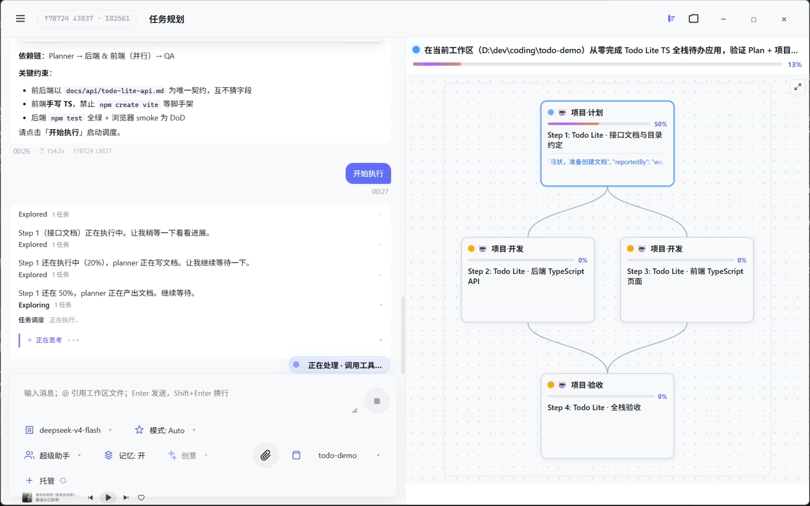
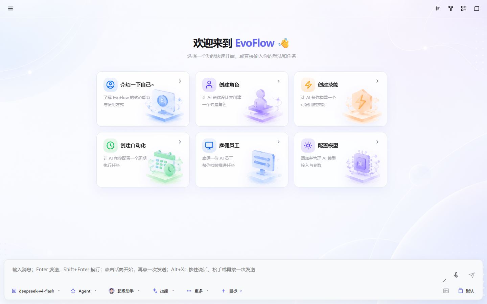

<div align="center">

# EvoFlow

**面向长任务、自主软件执行和多 Agent 协作的原生 Agent Runtime 与控制平面。**

由 [Evovex AI](https://www.evovexai.com) 打造。规划 → 拆解 → 执行 → 恢复 → 交付，全程可观测的 Agent Teams —— 不是一次性聊天，也不是单 Agent 编码 CLI 套壳。

[](https://github.com/EvovexAI/EvoFlow/releases)
[](LICENSE)
[](https://github.com/EvovexAI/EvoFlow/releases)
[](https://www.evovexai.com/docs/chat/evopanel)
[](mailto:cloud@evovexai.com)

[下载](https://github.com/EvovexAI/EvoFlow/releases) · [快速开始](#快速开始) · [文档](docs/index.md) · [贡献](CONTRIBUTING.md) · [English](README.en.md)

</div>

---

## EvoFlow 是什么

**不是**普通 AI 聊天框，**也不是**单 Agent 编码工具的套壳。它是一套 **Runtime**（规划、调度、沙箱、工具、记忆、检查点）加上 **控制平面**（EvoPanel），让你观察、干预、重试、验收长任务的每一步。

在面板中配置任意模型供应商；默认由原生 Agent Teams 执行；Skills 与 MCP 扩展能力，无需改核心。

---

## 核心能力

| | |
| --- | --- |
| **Supervisor 规划** | 澄清意图、产出可修订计划，再按依赖图执行子任务。 |
| **原生 Agent Teams** | Lead + 内置/自定义子 Agent（SOUL、模型、工具白名单）；可并发委派。 |
| **沙箱与工具** | 隔离执行、文件/命令工具、联网工具、任意 MCP。 |
| **记忆与恢复** | 线程状态持久化；暂停/恢复/取消；失败重试与局部重规划。 |
| **可观测** | 任务/子任务/工具/Token 轨迹在桌面端可见。 |
| **Skills** | `SKILL.md` 技能包（50+ 公开技能）按需加载。 |
| **渠道** | 飞书 / 微信可用；更多 IM 在路线图中。 |

深入：[为什么用 EvoFlow](docs/user/explanation/why-evoflow.md) · [Agent 体系](docs/user/explanation/agent-system.md)

---

## 演示

<p align="center">
  <a href="docs/assets/plan-supervisor/video-01-plan-clarify-to-ready.mp4">
    
  </a>
</p>

<p align="center"><sub>Plan → 结构化计划 → Agent Teams 执行。更多见 <a href="docs/assets/plan-supervisor/README.md">docs/assets/plan-supervisor</a>。</sub></p>

```text
用户请求 → Supervisor 澄清 → plan() → 确认
  → Agent Teams（隔离上下文）→ 工具 / 沙箱
  → 恢复与验收 → 产物 / 可选 IM 投递
```

---

## 快速开始

### 方式 A — 桌面安装包（最快）

1. 从 [Releases](https://github.com/EvovexAI/EvoFlow/releases) 下载：

   | 平台 | 资源 |
   | --- | --- |
   | Windows | `EvoFlow_<version>_x64-setup.exe` |
   | macOS (Apple Silicon) | `EvoFlow_<version>_aarch64.dmg` |
   | macOS (Intel) | `EvoFlow_<version>_x64.dmg` |
   | Linux | `EvoPanel_<version>_amd64.AppImage` / `.deb` |

2. 打开 EvoPanel → 配置模型与 API Key。
3. 开始对话。多步骤任务会进入 **Plan 模式** —— 审阅、确认、观察子任务。
4. 在任务中心 / Agent Trace 中观测并验收。

<details>
<summary>macOS 提示「已损坏」/ 无法验证？</summary>

尚未 Apple 公证。执行：

```bash
xattr -cr /Applications/EvoFlow.app
```

或在 **系统设置 → 隐私与安全性 → 仍要打开**。
</details>

用户指南：[5 分钟快速上手](docs/user/getting-started/quick-start.md)

### 方式 B — 从本仓库跑（贡献者）

```bash
cp config.example.yaml config.yaml   # 填入模型密钥
make docker-init && make docker-start
# 打开 http://localhost:2026
```

完整环境、检查与 PR 流程：[CONTRIBUTING.md](CONTRIBUTING.md)

---

## 文档

产品文档在 [`docs/`](docs/index.md)（MkDocs）。常用入口：

| | |
| --- | --- |
| [文档首页](docs/index.md) | Quick Links |
| [下载与安装](docs/user/getting-started/downloads.md) | 安装包 |
| [配置模型](docs/user/tutorials/configure-models.md) | Provider |
| [Plan 模式](docs/user/guides/chat/plan-mode.md) | 长任务 |
| [技能](docs/user/guides/configuration/skill-management.md) / [MCP](docs/user/guides/configuration/tools-mcp.md) | 扩展 |
| [IM 渠道](docs/user/guides/integration/im-channels.md) | 飞书 / 微信 |
| [FAQ](docs/user/guides/faq.md) | 排障 |
| [贡献指南](CONTRIBUTING.md) | 开发环境、分支、CI |

```bash
pip install -r requirements-docs.txt && mkdocs serve
```

---

## 示例提示词

```text
为本项目做一个简单的设置页。
先分析代码库，再给出计划；确认后实现并跑测试。
```

```text
分析本仓库，找出三个可维护性问题，制定计划，
并把第一个已批准的改进作为 Goal 跑起来，方便我稍后回来看。
```

更多：[目标 Agent](docs/user/guides/chat/goal-agent.md) · [案例](docs/user/cases/index.md)

---

## 截图

<p align="center">
  
</p>

更多：[截图](docs/assets/screenshots/) · [任务中心](docs/user/guides/tasks/task-center.md) · [应用中心](docs/user/guides/configuration/app-center.md)

---

## 参与贡献

欢迎缺陷报告、文档修正、Skill 与代码 PR（在可访问本源码树的前提下）。

1. 阅读 [CONTRIBUTING.md](CONTRIBUTING.md) — 环境、分支、必过检查。
2. 中文贡献导读：[docs/contribute/](docs/contribute/index.md)。
3. 遵守 [CODE_OF_CONDUCT.md](CODE_OF_CONDUCT.md)。
4. 提问渠道见 [SUPPORT.md](SUPPORT.md)。
5. 安全问题 → [SECURITY.md](SECURITY.md)（不要开公开 Issue）。

贡献路径（由易到难）：**文档** → **Skill** → **修 bug** → **Runtime / Gateway**。

---

## 授权

遵循 [Evovex AI Non-Commercial License 1.0](LICENSE)：在获得源码访问后可用于个人、教育与研究；**商业使用须书面授权**（[cloud@evovexai.com](mailto:cloud@evovexai.com)）。

并非 OSI 开源许可证。第三方组件见 [NOTICE](NOTICE)。

公开仓 [EvovexAI/EvoFlow](https://github.com/EvovexAI/EvoFlow) 当前以 **文档 + 桌面发行包** 为主；本开发树包含用于构建与贡献的完整应用源码。

---

## 安全

不要在 Issue/PR 中粘贴 API Key、Token 或客户隐私。漏洞请私密报告：[cloud@evovexai.com](mailto:cloud@evovexai.com) 或 [GitHub Security Advisories](https://github.com/EvovexAI/EvoFlow/security/advisories/new)。

---

## 致谢

| 项目 | 作用 |
| --- | --- |
| [LangGraph](https://github.com/langchain-ai/langgraph) / [LangChain](https://github.com/langchain-ai/langchain) | 运行时与 LLM 工具链 |
| [DeerFlow](https://github.com/bytedance/deer-flow) | 早期工程基线（MIT，见 NOTICE） |
| [Model Context Protocol](https://modelcontextprotocol.io) | 工具扩展标准 |
| [Tauri](https://tauri.app) | EvoPanel 桌面壳 |

---

## 联系

| 渠道 | 用途 |
| --- | --- |
| [GitHub Issues](https://github.com/EvovexAI/EvoFlow/issues) | 缺陷与功能 |
| [GitHub Discussions](https://github.com/EvovexAI/EvoFlow/discussions) | 问答与想法 |
| [cloud@evovexai.com](mailto:cloud@evovexai.com) | 商业 / 安全 |
| [evovexai.com](https://www.evovexai.com) | 产品站 |

<p align="center">
  
</p>

<div align="center">

Built by **EvovexAI** · [English](README.en.md)

</div>
