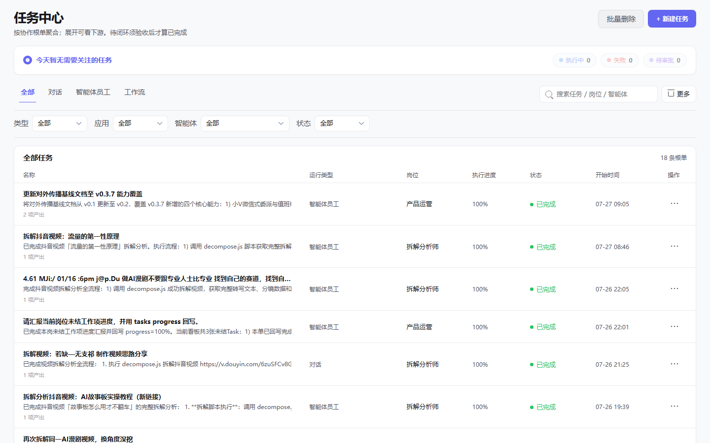
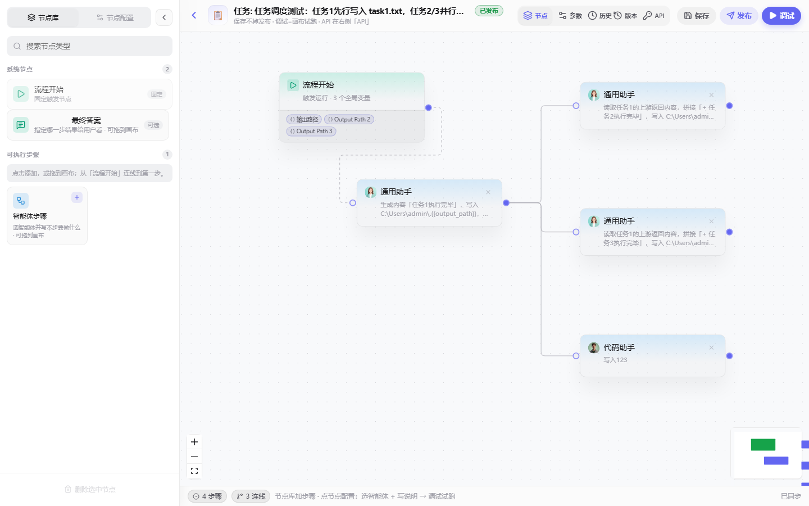
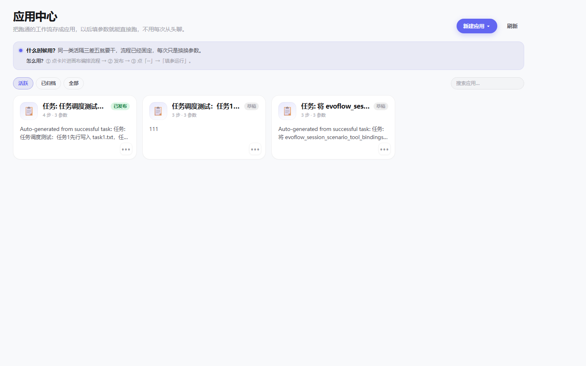
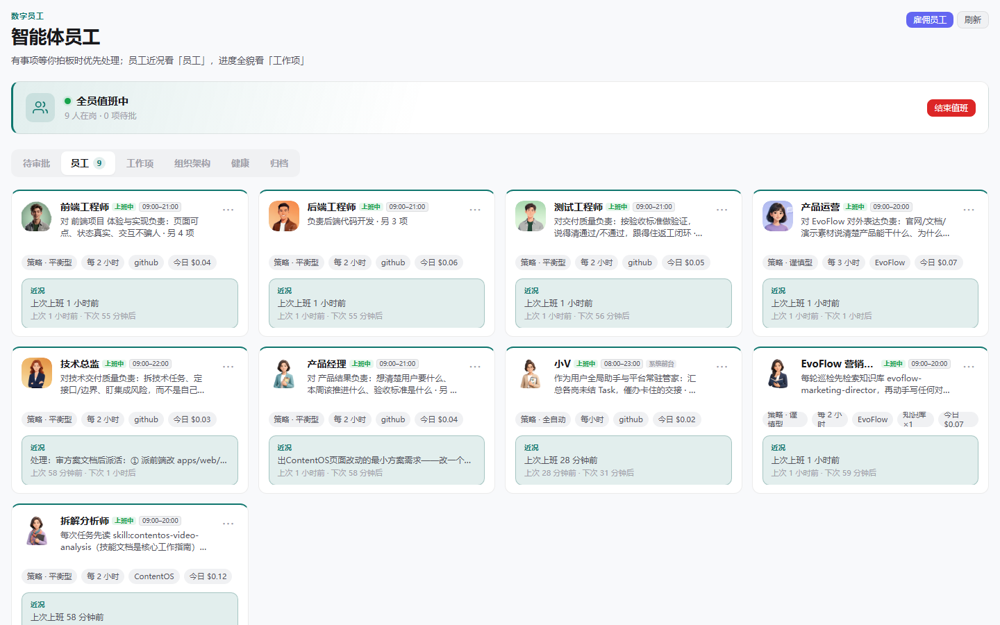
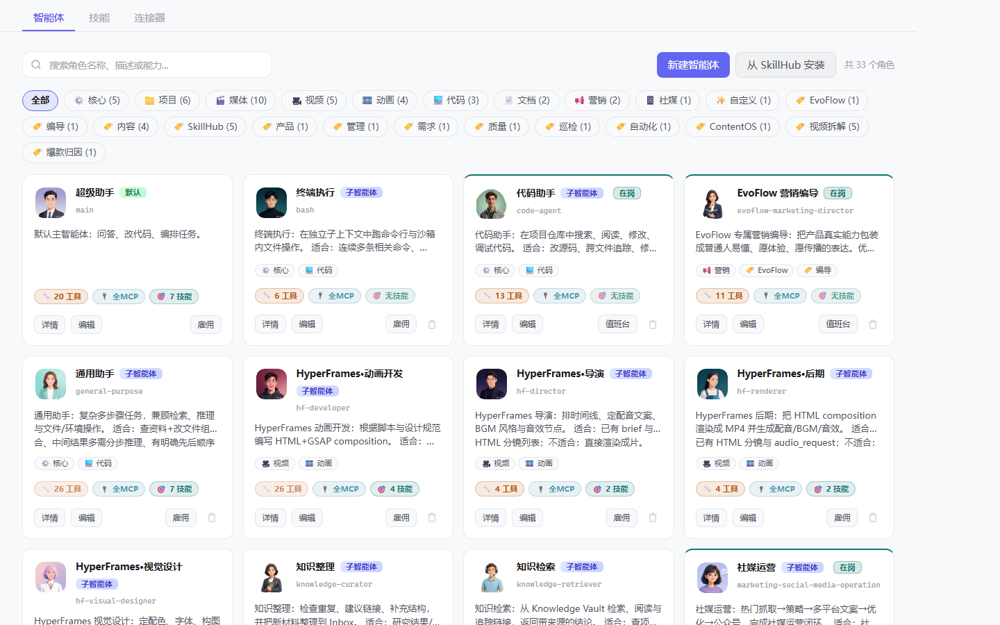
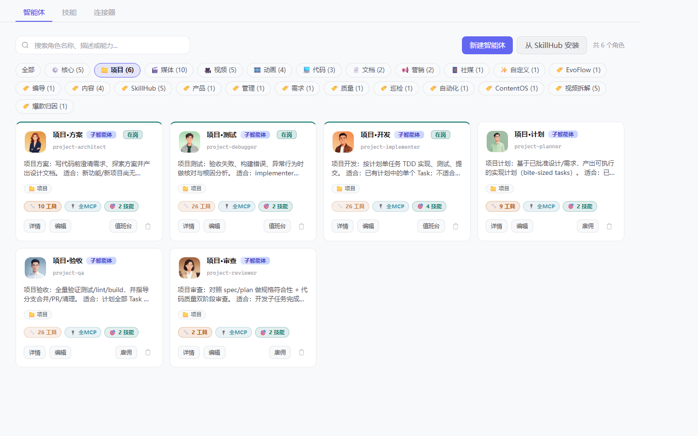
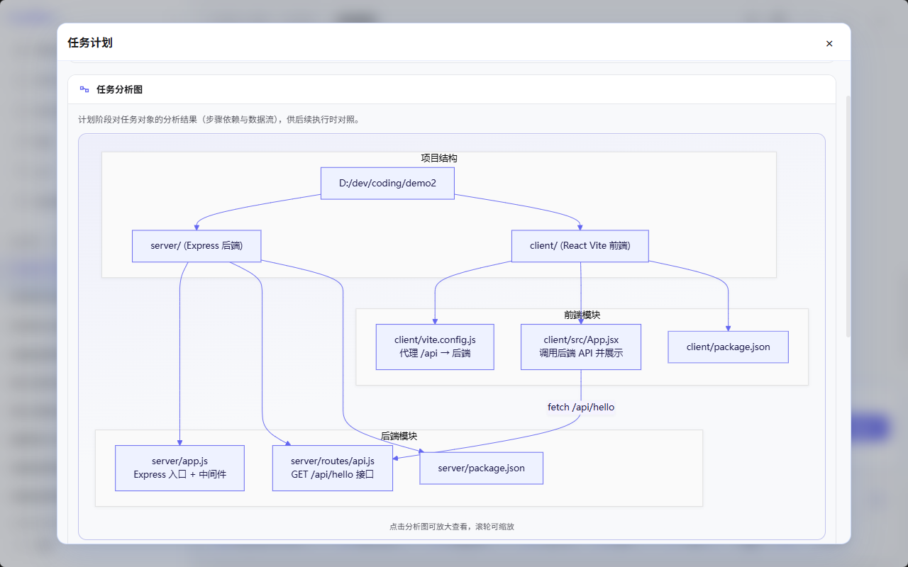
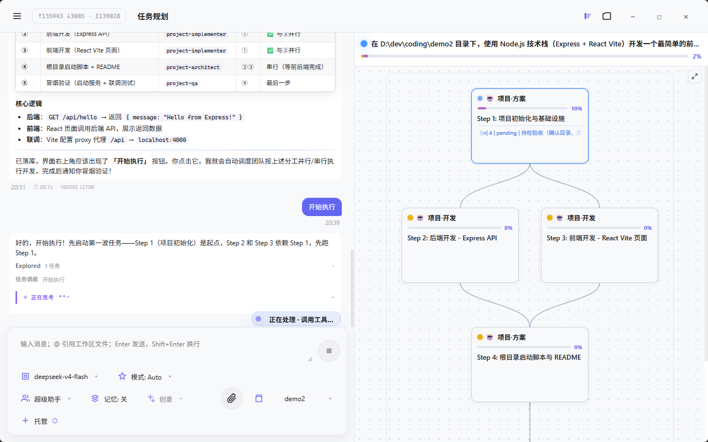

<div align="center">

# EvoFlow

**面向长任务、自主软件执行和多 Agent 协作的原生 Agent Runtime 与控制平面。**

EvoFlow 让 AI Agent 围绕真实软件任务进行规划、拆解、执行、恢复和交付，而不是停留在一次性聊天或单次代码生成。

[](https://github.com/EvovexAI/EvoFlow/releases)
[](LICENSE)
[](https://github.com/EvovexAI/EvoFlow/releases)
[](https://www.evovexai.com/docs/chat/evopanel)
[](mailto:cloud@evovexai.com)

[下载](https://github.com/EvovexAI/EvoFlow/releases) · [快速开始](#快速开始) · [文档](https://www.evovexai.com/docs/chat/evopanel) · [演示](#演示) · [授权](#授权与商业使用) · [English](README.md)

</div>

---

## EvoFlow 是什么

一句话：**EvoFlow 是面向长任务、自主软件执行和多 Agent 协作的原生 Agent Runtime 与控制平面。**

它要解决的核心问题是：单 Agent 编码工具（如 Claude Code、Cline、Codex、Aider）很强，但真实软件工作往往不是一个 prompt 能搞定的。一个多步骤任务跑到一半失败了，纯聊天窗口没法告诉你——**是哪一步坏的、已经改了哪些文件、怎么接着跑下去**。

EvoFlow 就是为这一层设计的：

- 它是一个 **Runtime**：内置规划、任务拆解、调度、代码编排、工具执行、沙箱、记忆、检查点、恢复；
- 它也是一个 **控制平面**：一个桌面端（EvoPanel），让你全程观察、干预、重试、验收每一步。

### EvoFlow 不是什么

- **不是普通 AI 聊天框。** 它有真正的运行时，会规划、拆解、执行、恢复。
- **不是 Claude Code / Cline / Codex / Aider 的套壳。** EvoFlow 默认运行自己的原生 Agent Teams；外部编码 Agent 只能作为**可选 worker** 接入（见[可选外部 Agent 适配](#可选外部-agent-适配)），核心不依赖它们。

---

## 为什么需要它

长任务的真实痛点，单 Agent 工具很难覆盖：

- **上下文漂移**——对话一长，Agent 忘了最初目标；
- **任务中断**——跑到一半断了，不知道从哪继续；
- **多步骤不可观测**——看不到每一步在干什么、卡在哪；
- **单 Agent 失败后难恢复**——一步错，整个重来；
- **工具权限不可控**——Agent 想干啥干啥，没有边界；
- **代码执行过程无法追踪**——改了什么、跑了什么命令，全是黑盒；
- **结果难以交付到团队协作工具**——跑完了还要人去复制粘贴。

EvoFlow 把规划、状态、记忆、执行边界、恢复、可观测、交付做成了一整套。每一步任务、子任务、工具调用、执行状态、失败重试、人工接管，都是可见、可控、可恢复的。

---

## 它和现有产品有什么不同

| 类别 | 代表 | 区别 |
| --- | --- | --- |
| **单 Agent 编码工具** | Claude Code、Codex、Cline、Aider | EvoFlow 不是单 Agent 编码工具，而是围绕 Agent Teams 的运行时与控制平面——管的是整个任务的规划、状态、恢复和可观测，不只是改代码那一下。 |
| **Agent 框架** | LangGraph、CrewAI、AutoGen | EvoFlow 是产品化的运行时：带桌面控制平面、网关、沙箱、记忆、IM 渠道，不只是底层 SDK。（EvoFlow 自身就基于 LangGraph 构建。） |
| **工作流自动化** | n8n、Activepieces | EvoFlow 面向的是 Agent 驱动的软件工作：代码编排、长任务、记忆、恢复、可观测执行，不是确定性节点连线。 |
| **云端 AI 工程师** | Devin 类产品 | EvoFlow 强调本地/桌面控制、Agent 可配置、运行时可扩展，你自己跑，不是一个托管的黑盒。 |

EvoFlow 不声称"取代"这些工具。单 Agent 编码工具是很好的**执行器**；EvoFlow 是围绕多个执行器的**运行时和控制平面**。

---

## 核心能力

| 能力 | 含义 |
| --- | --- |
| **原生 Agent Runtime** | 基于 LangGraph 的主 Agent（Lead Agent）+ 中间件链 + 工具系统 + 子 Agent 委派 + 记忆 + 线程隔离。EvoFlow 跑的是自己的执行循环。 |
| **Supervisor 规划** | Supervisor 澄清意图、调用 `plan()` 生成可修订计划、把目标拆成有依赖顺序的子任务图，确认后才执行有副作用的操作。 |
| **任务拆解** | 目标拆成子任务，每个有明确的输入、预期输出、验收标准，绑定 `boundTaskId` 可追溯。 |
| **代码编排** | 读/写/编辑文件（`read_file`、`write_file`、`str_replace`）、跑命令（`bash`）、列目录——都通过运行时编排，不是裸 shell。 |
| **Agent Teams** | 内置子 Agent（`general-purpose`、`bash`）+ 自定义 Agent（独立 SOUL 人设、模型、工具白名单）；每轮最多 3 个子 Agent 并发。 |
| **工具执行** | 沙箱工具、内置工具（`ask_clarification`、`view_image`、`task`）、社区工具（联网搜索、网页抓取）、任意 MCP 服务器（stdio / SSE / HTTP）。 |
| **Knowledge Vault** | 一等 Obsidian 知识库集成（混合检索 / 读笔记 / 局部图谱 / 受控写入）；与 `memory.json` 及上传文档 RAG 分离。见 [Obsidian Knowledge Vault](docs/user/guides/integrations/obsidian-knowledge-vault.md)。 |
| **沙箱** | 每线程隔离执行 + 虚拟路径翻译（`/mnt/user-data/...`）。Provider：本地文件系统、Docker/容器、k3s Provisioner（更强隔离）。 |
| **记忆与检查点** | LLM 驱动记忆提取事实（防抖 + 原子写入）；线程状态和子任务进度持久化，支持断点续跑。 |
| **恢复** | 长任务支持暂停/恢复/取消、失败重试、局部重编排——一步坏了不会丢掉整次运行。 |
| **可观测** | 每个任务、子任务、工具调用、状态变更、重试都可见。Agent Trace 页展示模型/工具/Gateway 调用日志，含 Token 用量分项（含缓存命中/写入缓存）。 |
| **技能 / MCP** | `SKILL.md` 技能包（50+ 公开技能，按白名单加载）+ 任意 MCP 服务器作为扩展。 |
| **桌面控制平面** | EvoPanel（Tauri v2 + React）：任务中心、Agent 管理、执行日志、子任务工作流/DAG 可视化、模型配置、技能与 MCP 配置、长任务会话管理。 |

---

## 架构

```text
用户 / 桌面端 / IM 渠道（微信 · 飞书 可用；Slack · Telegram 规划中）
        ↓
EvoPanel（Tauri v2 + React）         ← 桌面控制平面
        ↓ REST / SSE / WebSocket
Gateway（FastAPI · 8001）            ← 模型、记忆、技能、MCP、文件、渠道
        ↓ HTTP
LangGraph Runtime（2024）            ← 主 Agent + 中间件链
        ↓
Harness（evoflow.* 包）              ← 工具、技能、记忆、子 Agent、沙箱、Supervisor
        ↓
代码编排 / 工具执行 / 沙箱
        ↓
技能 / MCP / 终端 / 浏览器 / 文件系统 / API
        ↓
日志 / 产物 / 交付
```

**Harness / App 分离。** `evoflow.*` 是可独立发布的 Agent 框架包（工具、技能、记忆、子 Agent、Supervisor、沙箱）；`app.*` 是产品业务层（渠道、Gateway 路由）。依赖方向严格单向：App 可 import evoflow，evoflow 永不 import app。这条边界由 CI 测试强制保证，框架内核保持稳定，业务定制只在上层做。

<details>
<summary>服务拓扑与端口</summary>

| 服务 | 端口 | 技术 | 职责 |
| --- | --- | --- | --- |
| Nginx | 2026 | Nginx | 统一反向代理入口 |
| LangGraph Server | 2024 | LangGraph | Agent 运行时与工作流执行 |
| Gateway API | 8001 | FastAPI | 模型/MCP/技能/记忆/文件/渠道的 REST API |
| EvoPanel | 1420 | Tauri v2 + React | 桌面 UI |
| Provisioner | 8002 | 可选 | k3s Pod 沙箱模式 |

</details>

<details>
<summary>中间件链（执行顺序）</summary>

1. **ThreadDataMiddleware** — 每线程隔离目录（workspace、uploads、outputs）
2. **UploadsMiddleware** — 把新上传文件注入上下文
3. **SandboxMiddleware** — 为代码执行获取沙箱环境
4. **SummarizationMiddleware** — 接近 Token 上限时压缩上下文（可选）
5. **TodoListMiddleware** — Plan 模式下跟踪多步任务（可选）
6. **TitleMiddleware** — 自动生成会话标题
7. **MemoryMiddleware** — 把会话加入异步记忆提取队列
8. **ViewImageMiddleware** — 为支持视觉的模型注入图片数据
9. **PlanGuardMiddleware** — 规划阶段过滤有副作用的工具调用
10. **ClarificationMiddleware** — 拦截澄清请求并中断

</details>

设计原理详见：[docs/user/explanation/why-evoflow.md](docs/user/explanation/why-evoflow.md)

---

## 原生 Agent Teams

EvoFlow 默认运行自己的 Agent。内置子 Agent 系统以隔离上下文并发委派任务：

| Agent | 角色 |
| --- | --- |
| **Lead Agent（主 Agent）** | 运行时入口：路由对话、选工具、通过 `task()` 工具委派子任务。 |
| **Supervisor** | 澄清意图、调用 `plan()`、拆成子任务图、把每一步派给合适的 Agent。 |
| **general-purpose 子 Agent** | 全工具集——用于研究、文件操作、多工具任务。 |
| **bash 子 Agent** | 命令专家（仅在启用 shell 访问时暴露）。 |
| **自定义 Agent** | 用户定义的 Agent，独立 SOUL 人设、模型、工具白名单、工作区。 |

**预设 Agent Teams** 把自定义 Agent 按角色分组（例如一个项目团队含方案/计划/开发/审查等角色）。Teams 可配置，上表的角色布局是推荐模式，不是硬性要求。每轮最多 3 个子 Agent 并发，超时 15 分钟。

> 外部编码 Agent（Claude Code、Codex、Trae、CodeBuddy）未来也可通过 ACP 协议作为 worker 接入--见下一节。该能力**尚处实验阶段**，原生子 Agent 目前自己就能完成核心任务。

详见：[docs/user/explanation/subagent-system.md](docs/user/explanation/subagent-system.md) · [docs/user/guides/chat/preset-roles.md](docs/user/guides/chat/preset-roles.md)

---

## 可选外部 Agent 适配（实验性）

当你想复用已有的编码工作流时，可以把外部编码 Agent 作为**可选 worker** 接入。EvoFlow **不依赖**它们完成核心任务--原生子 Agent 自己就能做规划、研究、改文件、跑命令。

接入路径是 **ACP（Agent Client Protocol）层**，设计上把会话生命周期、流式输出、状态投影归一化：

| 适配器 | 状态 |
| --- | --- |
| Claude Code | 规划中（ACP 适配器） |
| Codex | 规划中（ACP 适配器） |
| Trae | 规划中（ACP 适配器） |
| CodeBuddy | 规划中（ACP） |

> **状态：实验性 / 尚未真实调用验证。** ACP 架构已完成设计，但各适配器尚未端到端验证。没配外部 Agent 时，Supervisor 用原生子 Agent--这也是当前默认且推荐的路径。

这一节是**未来兼容性说明**，不是核心卖点。默认用的是原生运行时。

---

## 快速开始

EvoFlow 目前以桌面安装包和文档形式分发，源码尚未公开发布。

### 获取桌面端

1. **下载**最新安装包：[Releases](https://github.com/EvovexAI/EvoFlow/releases)。

   | 平台 | 安装包 |
   | --- | --- |
   | Windows | `EvoFlow_<版本>_x64-setup.exe` |
   | macOS（Apple Silicon） | `EvoFlow_<版本>_aarch64.dmg` |
   | macOS（Intel） | `EvoFlow_<版本>_x64.dmg` |
   | Linux（AppImage） | `EvoPanel_<版本>_amd64.AppImage` |
   | Linux（DEB） | `EvoPanel_<版本>_amd64.deb` |

   > Windows、macOS、Linux 均有安装包发布。Windows 测试最充分，macOS 与 Linux 构建可用但测试较少。当前资产见 [Releases](https://github.com/EvovexAI/EvoFlow/releases)。

<details>
<summary>🍎 macOS 安装提示"已损坏"或"无法验证开发者"怎么办？</summary>

由于 EvoFlow 尚未进行 Apple 代码签名，macOS Gatekeeper 会拦截未签名的 App。这**不是文件真的坏了**，解决方法：

**方法一（推荐）：** 打开终端，执行以下命令清除隔离属性：

```bash
xattr -cr /Applications/EvoFlow.app
```

然后重新双击打开 EvoFlow 即可。

**方法二：** 如果方法一不行，在 **系统设置 → 隐私与安全性** 页面底部，找到 "已阻止使用 EvoFlow" 的提示，点击 **仍要打开**。

> 等我们拿到 Apple Developer 账号后会做正式签名 + 公证，届时不再需要此操作。

</details>

2. **配置模型。** 首次启动 EvoPanel 会引导你添加服务商和 API Key。

3. **开始任务。** 进聊天页选模型，直接描述需求。复杂多步任务会自动进入 **Plan 模式**——审查计划、确认，然后看 Agent Teams 执行。

4. **观察。** 在工作流面板追踪子任务，在 Agent Trace 查工具调用和 Token 用量，最后验收结果。

更多：[docs/user/getting-started/quick-start.md](docs/user/getting-started/quick-start.md) · [CONTRIBUTING.md](CONTRIBUTING.md)

---

## 示例任务

### 做一个小功能

```text
为这个项目创建一个简单的设置页面。
先分析代码库，再提一个方案。
确认后实现改动并跑测试。
```

### 修一个 Bug

```text
排查刷新后登录页报错的原因。
检查路由逻辑，提修复方案，应用改动，汇总改了哪些文件。
```

### 重构一个模块

```text
重构任务执行模块，让规划、执行、恢复之间更好地解耦。
未确认前不要改变对外行为。
```

### 长任务（无人值守）

```text
分析这个仓库，找出三个可维护性问题，做计划，
并执行第一个被批准的改进。以「目标」方式运行，我之后回来看。
```

> **目标模式（Goal）** 在独立线程跑任务，支持暂停/恢复/取消，结束后可把 Markdown 结果小结推送到 IM 渠道（如飞书、微信）。见 [docs/user/guides/chat/goal-agent.md](docs/user/guides/chat/goal-agent.md)。

---

## 截图

<p align="center">
  
</p>
<p align="center"><sub>主界面 · 快捷入口与对话栏（Ask / Agent / Plan / 目标）</sub></p>

<table>
  <tr>
    <td align="center" width="50%">
      
      <br><sub>任务中心 · 对话 / 智能体员工 / 工作流汇聚与验收</sub>
    </td>
    <td align="center" width="50%">
      
      <br><sub>应用中心 · 点进应用后的画布编排（节点 / 发布 / 调试）</sub>
    </td>
  </tr>
  <tr>
    <td align="center" width="50%">
      
      <br><sub>应用中心 · 列表（活跃 / 已发布 / 草稿）</sub>
    </td>
    <td align="center" width="50%">
      
      <br><sub>智能体员工 · 值班台、待审批与岗位名册</sub>
    </td>
  </tr>
  <tr>
    <td align="center" width="50%">
      
      <br><sub>智能体 · 角色配置与雇佣入口</sub>
    </td>
    <td align="center" width="50%">
      
      <br><sub>项目团队 · 方案 / 计划 / 开发 / 审查 / 验收</sub>
    </td>
  </tr>
  <tr>
    <td align="center" width="50%">
      
      <br><sub>计划 · 任务分析图（模块结构、调用链与数据流）</sub>
    </td>
    <td align="center" width="50%">
      
      <br><sub>Supervisor · 子任务工作流与依赖进度</sub>
    </td>
  </tr>
</table>

> 更多见 [docs/assets/screenshots/](docs/assets/screenshots/) 和 [docs/assets/plan-supervisor/](docs/assets/plan-supervisor/)。
> 用户指南：[任务中心](docs/user/guides/tasks/task-center.md) · [应用中心](docs/user/guides/configuration/app-center.md) · [智能体员工](docs/user/guides/configuration/smart-employees.md)

---

## Roadmap

EvoFlow 正在积极开发中。以下为方向性说明，不是带日期的承诺。

**短期**
- 子 Agent 内更强的原生编码执行能力
- 更好的子任务 DAG 可视化与依赖控制
- 更完善的恢复与局部重编排
- 更多技能，打磨技能生命周期

**中期**
- MCP 市场与更易用的适配器发现
- 沙箱加固（容器与 Provisioner 模式）
- 团队协作能力
- 插件 / 扩展 SDK

**长期**
- 企业级审计与权限
- 更广的 IM 与集成生态
- 更多文档、Demo 和基准场景

---

## 授权与商业使用

EvoFlow 目前以桌面安装包和文档形式分发，源码**尚未公开发布**。项目**不是** OSI 认证的开源协议，以 [Evovex AI 非商业许可证 1.0](LICENSE) 治理：源码开放后，允许个人学习、研究和非商业使用及在此范围内的修改与分发；**商业使用须书面授权**（[cloud@evovexai.com](mailto:cloud@evovexai.com)）。

随着产品、社区和商业模式的成熟，部分模块、示例、SDK、技能、适配器和文档可能会逐步开放。上游与第三方组件（含 DeerFlow，MIT 许可）适用其各自许可证——见 [NOTICE](NOTICE)。

"EvoFlow"、"EvoPanel"、"Evovex AI" 为 Evovex AI 商标，商标使用须另行授权。

---

## 贡献方式

目前欢迎：

- Bug 反馈和可复现的 Issue
- 文档改进
- 工作流示例与用例
- 技能 / MCP 适配器建议
- 集成需求与产品反馈

源码尚未公开，核心代码贡献暂有限，目前最适合的贡献方式是上面列出的几项。开发流程见 [CONTRIBUTING.md](CONTRIBUTING.md) 供参考。任何被接受的贡献以 [EvovexAI 非商业许可证](LICENSE) 授权，EvovexAI 可在另行条款下将其用于商业产品。

---

## 安全

- **不要**在 Issue 或 PR 中提交 API Key、Token、私有仓库内容或客户数据。
- 报告漏洞请发邮件至 [cloud@evovexai.com](mailto:cloud@evovexai.com)，或用 [GitHub 私密漏洞报告](https://github.com/EvovexAI/EvoFlow/security/advisories/new)，**不要**开公开 Issue。
- 响应目标：48 小时内确认、7 天内初评、30 天内修复/缓解（视严重程度）。

本地安装的安全实践（本地绑定、默认护栏、沙箱默认值、CORS）见 [SECURITY.md](SECURITY.md)。

---

## 致谢

EvoFlow 站在优秀开源工作的肩膀上：

| 项目 | 贡献 |
| --- | --- |
| [LangGraph](https://github.com/langchain-ai/langgraph) | 图式 Agent 编排——运行时基础 |
| [LangChain](https://github.com/langchain-ai/langchain) | LLM 抽象与工具生态 |
| [DeerFlow](https://github.com/bytedance/deer-flow) | 早期工程基线（MIT；部分代码保留 MIT 许可，见 [NOTICE](NOTICE)） |
| [Model Context Protocol](https://modelcontextprotocol.io) | MCP 工具扩展标准 |
| [Tauri](https://tauri.app) | EvoPanel 的跨平台桌面运行时 |

---

## 联系方式

| 渠道 | 用途 |
| --- | --- |
| [GitHub Issues](https://github.com/EvovexAI/EvoFlow/issues) | Bug 反馈、功能建议（推荐） |
| [GitHub Discussions](https://github.com/EvovexAI/EvoFlow/discussions) | 提问与讨论 |
| [cloud@evovexai.com](mailto:cloud@evovexai.com) | 商务授权与合作 |
| [evovexai.com](https://www.evovexai.com) | 产品、文档与演示 |

<p align="center">
  
</p>
<p align="center"><sub>扫码添加微信，通过后拉入交流群（讨论请脱敏，禁止广告）</sub></p>

---

<div align="center">

由 **EvovexAI** 开发 · [English](README.md)

</div>
