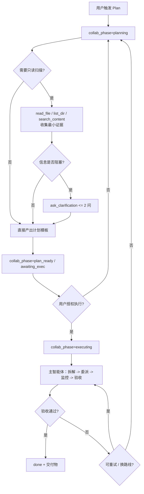
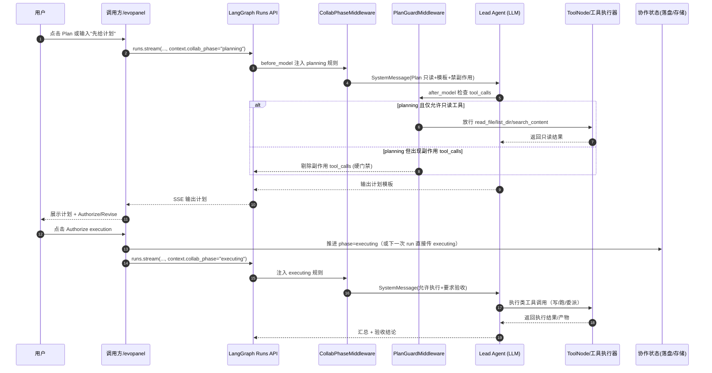

# 总体方案与架构设计：全周期 + 状态机 + 时序

## 周期状态机（collab_phase）

建议复用 `collab_phase` 承载 Cursor Plan 周期：

- `planning`：只读产计划（PlanGuard 生效）
- `plan_ready`：计划就绪，等待用户确认
- `awaiting_exec`：执行授权门禁（可选但推荐）
- `executing`：允许执行（PlanGuard 关闭）
- `paused` / `done`：暂停/完成；允许回退到 planning

## 与现有场景模式的关系（关键原则）

本方案**不拆分、不替换**当前 `scenario`（execute/web/manage/...）体系。

- `scenario`：表达任务语义与基础工具边界（你现有的动态场景与工具限制继续生效）
- `collab_phase`：表达当前协作阶段（planning / plan_ready / awaiting_exec / executing）
- `PlanGuard`：在 planning 等阶段做“二次收紧”，确保 0 副作用

即，Plan 不是一个新的业务场景，而是阶段控制层（phase）。

## 工具决策优先级（与现状对齐）

每轮模型可见/可调用工具建议按以下顺序决策：

1. 按当前 `scenario` 计算场景工具集合  
   - 单场景：使用该场景限定工具  
   - 多场景：按现有逻辑求并集（若你当前就是并集策略）
2. 按 `collab_phase` 进行二次过滤  
   - planning/plan_ready/awaiting_exec：仅保留 phase allowlist  
   - executing：不做 phase 额外收紧（回到场景边界）
3. 结果作为本轮最终允许工具

公式：

- `final_tools = scenario_tools ∩ phase_tools`

其中：
- `scenario_tools`：由现有场景系统决定
- `phase_tools`：
  - planning/plan_ready/awaiting_exec：只读 allowlist（如 read_file/list_dir/search_content）
  - executing：`ALL`（不额外收紧，仍受 scenario 与 guardrails 约束）

## 总流程（活动图）

## 端到端时序图（中文）

## 核心模块边界

- **软约束**：`CollabPhaseMiddleware`（按 phase 注入行为规则）
- **硬约束**：`PlanGuardMiddleware`（planning 等阶段强制 0 副作用）
- **执行编排**：主智能体在 executing 阶段使用 `supervisor/task` 进行子任务调度（监工强度可配置）

