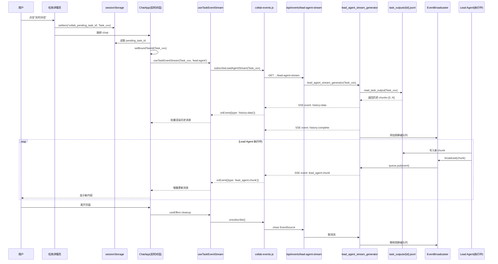

# 任务跳转实时对话数据链路分析

> 文档版本: 1.0  
> 更新日期: 2026-04-19  
> 适用范围: EvoFlow 任务系统 → ChatApp 实时对话流式数据链路

---

## 1. 整体架构概述

### 1.1 数据流向图

```
┌─────────────────────────────────────────────────────────────────────────────────┐
│                                    用户操作                                      │
│  ┌──────────────┐    点击"实时对话"    ┌──────────────┐                         │
│  │  任务详情页   │────────────────────▶│   ChatApp    │                         │
│  │ (TaskDetail) │  1. 存储pendingTaskId │  (实时对话)   │                         │
│  └──────────────┘  2. 跳转 /chat      └──────┬───────┘                         │
└─────────────────────────────────────────────────────────────────────────────────┘
                                               │
                                               ▼
┌─────────────────────────────────────────────────────────────────────────────────┐
│                              前端数据链路层                                       │
│  ┌──────────────────────────────────────────────────────────────────────────┐   │
│  │  1. ChatApp 初始化 - 读取 sessionStorage                                 │   │
│  │     • pendingSession: agent:main:task-{task_id}                         │   │
│  │     • pendingTaskId: {task_id}                                          │   │
│  │     • pendingThreadId: {thread_id}                                      │   │
│  └──────────────────────────────────────────────────────────────────────────┘   │
│                                     │                                           │
│  ┌──────────────────────────────────┼─────────────────────────────────────────┐ │
│  │  2. useTaskEventStream Hook 调用  │                                        │ │
│  │     参数: taskId={task_id}       │                                        │ │
│  │     参数: streamType='lead-agent' │                                        │ │
│  │     参数: onEvent=handleTaskEvent │                                        │ │
│  └──────────────────────────────────┼─────────────────────────────────────────┘ │
└─────────────────────────────────────┼───────────────────────────────────────────┘
                                      │ SSE 连接
                                      ▼
┌─────────────────────────────────────────────────────────────────────────────────┐
│                              后端 API 接口层                                     │
│  ┌──────────────────────────────────────────────────────────────────────────┐   │
│  │  GET /api/events/tasks/{task_id}/lead-agent-stream                       │   │
│  │                                                                          │   │
│  │  功能: 建立 SSE (Server-Sent Events) 连接                                 │   │
│  │  阶段1: 回放历史数据 (history:data / history:complete)                   │   │
│  │  阶段2: 实时数据流 (lead_agent:chunk)                                    │   │
│  └──────────────────────────────────────────────────────────────────────────┘   │
└─────────────────────────────────────────────────────────────────────────────────┘
                                      │
                    ┌─────────────────┼─────────────────┐
                    ▼                 ▼                 ▼
        ┌───────────────┐   ┌───────────────┐   ┌───────────────┐
        │  历史数据回放  │   │   实时广播    │   │   文件存储    │
        │  read_task_   │   │  EventBroad-  │   │ task_outputs/ │
        │  output()     │   │  caster       │   │ {task_id}.jsonl│
        └───────────────┘   └───────────────┘   └───────────────┘
```

---

## 2. 前端详细链路

### 2.1 跳转触发流程

```typescript
// TaskDetail 页面 - 点击"实时对话"按钮
// 文件: evopanel/src/pages/task-detail.js

function onRealtimeChatClick() {
  const pendingSessionKey = `agent:main:task-${task.task_id}`;
  const threadId = task.thread_context?.thread_id;
  
  // 1. 存储到 sessionStorage
  sessionStorage.setItem('collab_pending_session', pendingSessionKey);
  sessionStorage.setItem('collab_pending_thread', threadId);
  sessionStorage.setItem('collab_pending_task_id', task.task_id);
  
  // 2. 跳转到 ChatApp
  window.location.href = '/chat';
}
```

### 2.2 ChatApp 初始化流程

```typescript
// ChatApp.tsx - 初始化时恢复任务绑定
// offset: ~686

export default function ChatApp() {
  const [boundTaskId, setBoundTaskId] = useState<string | null>(null);
  const processedTaskIdRef = useRef<string | null>(null);

  // 初始化 - 从 sessionStorage 恢复
  useEffect(() => {
    const pending = sessionStorage.getItem('collab_pending_session');
    const pendingThread = sessionStorage.getItem('collab_pending_thread');
    const pendingTaskId = sessionStorage.getItem('collab_pending_task_id');
    
    if (pending && pendingTaskId) {
      // 关键：设置 boundTaskId，触发流式订阅
      setBoundTaskId(pendingTaskId);
      processedTaskIdRef.current = pendingTaskId;
      
      // 3秒后清理 sessionStorage
      setTimeout(() => {
        sessionStorage.removeItem('collab_pending_session');
        sessionStorage.removeItem('collab_pending_thread');
        sessionStorage.removeItem('collab_pending_task_id');
      }, 3000);
    }
  }, []);
  
  // 订阅 Lead Agent 流式事件
  const { isConnected } = useTaskEventStream(
    boundTaskId,                    // taskId
    handleTaskEvent,                // 事件处理回调
    { streamType: 'lead-agent' }    // 流类型
  );
}
```

### 2.3 useTaskEventStream Hook 详解

```typescript
// 文件: evopanel/src/react/hooks/useTaskEventStream.ts

export function useTaskEventStream(
  taskId: string | null,
  onEvent: (payload: TaskEventPayload) => void,
  options: UseTaskEventStreamOptions = {}
): UseTaskEventStreamReturn {
  const { streamType = 'task', onConnected, onError } = options;
  
  useEffect(() => {
    if (!taskId) {
      console.log('[useTaskEventStream] ⏭️ taskId为空，跳过连接');
      return;
    }

    console.log(`[useTaskEventStream] 开始建立SSE连接，taskId=${taskId}`);
    
    let unsubscribe: (() => void) | null = null;

    // 调用 collab-events.js 的订阅函数
    if (streamType === 'lead-agent') {
      unsubscribe = subscribeLeadAgentStream(taskId, onEvent);
    } else {
      unsubscribe = subscribeTaskEvents(taskId, onEvent);
    }

    return () => {
      console.log('[useTaskEventStream] 清理连接');
      unsubscribe?.();
    };
  }, [taskId, streamType, onEvent, onConnected, onError]);
  
  return { isConnected, reconnectCount };
}
```

### 2.4 底层 SSE 订阅 (collab-events.js)

```javascript
// 文件: evopanel/src/lib/collab-events.js
// 功能: 建立 EventSource 连接，处理历史回放和实时流

export function subscribeLeadAgentStream(taskId, onEvent) {
  const { apiBase } = getApiBase();
  // SSE URL 构造 (native EventSource 模式)
  const url = `${apiBase}/api/events/tasks/${taskId}/lead-agent-stream?include_history=true`;
  
  const eventSource = new EventSource(url);
  
  // 阶段1: 历史数据回放
  eventSource.addEventListener('history:data', (e) => {
    const data = JSON.parse(e.data);
    onEvent({ type: 'history:data', data: data.data });
  });
  
  eventSource.addEventListener('history:complete', () => {
    onEvent({ type: 'history:complete' });
  });
  
  // 阶段2: 实时数据流
  eventSource.addEventListener('lead_agent:chunk', (e) => {
    const data = JSON.parse(e.data);
    onEvent({ type: 'lead_agent:chunk', data });
  });
  
  return () => eventSource.close();
}
```

### 2.5 事件处理与消息渲染

```typescript
// ChatApp.tsx - handleTaskEvent 处理流数据
// offset: ~1334

const handleTaskEvent = useCallback((payload: TaskEventPayload) => {
  if (payload.type === 'history:data') {
    // 历史回放数据 - 批量添加到消息列表
    const msgs = payload.data as LLMMessage[];
    msgs.forEach(msg => addMessage(String(selectedSessionKey), msg));
  } 
  else if (payload.type === 'lead_agent:chunk') {
    // 实时流数据 - 增量更新
    const { chunk } = payload.data as LeadAgentChunk;
    
    switch (chunk.event) {
      case 'values':
        // 合并消息内容
        const content = chunk.data.messages?.[0]?.content || '';
        appendMessageContent(content);
        break;
      case 'metadata':
        // 保存 run_id 等元数据
        setActiveRunId(chunk.data.run_id);
        break;
      case 'error':
        // 错误处理
        console.error('[ChatApp] Lead Agent 错误:', chunk.data);
        break;
    }
  }
}, [selectedSessionKey, addMessage]);
```

---

## 3. 后端详细链路

### 3.1 API 路由定义

```python
# 文件: backend/app/gateway/routers/events.py

@router.get("/tasks/{task_id}/lead-agent-stream")
async def subscribe_lead_agent_stream(
    task_id: str,
    include_history: bool = Query(True, description="是否包含历史数据"),
    from_chunk: int = Query(0, description="从第几个 chunk 开始"),
):
    """Lead Agent 流式订阅接口
    
    流程:
    1. 验证任务存在
    2. 启动流生成器 (lead_agent_stream_generator)
    3. 流生成器负责: 回放历史 + 订阅实时
    """
    return StreamingResponse(
        lead_agent_stream_generator(task_id, include_history, from_chunk),
        media_type="text/event-stream",
    )
```

### 3.2 流生成器核心逻辑

```python
# 文件: backend/app/gateway/routers/events.py
# offset: ~220

async def lead_agent_stream_generator(
    main_task_id: str, 
    include_history: bool, 
    from_chunk: int
):
    """Lead Agent 流生成器 - 历史回放 + 实时订阅"""
    
    # ========== 阶段1: 发送连接确认 ==========
    yield format_sse_event("connected", {"task_id": main_task_id})
    
    # ========== 阶段2: 回放历史数据 ==========
    if include_history and from_chunk == 0:
        # 从文件读取历史输出
        history_entries = read_task_output(main_task_id, offset=0, limit=1000)
        
        for entry in history_entries:
            if entry.get("type") == "lead_agent_chunk":
                yield format_sse_event("history:data", entry)
        
        yield format_sse_event("history:complete", {})
    
    # ========== 阶段3: 订阅实时广播 ==========
    # 创建异步队列作为观察者
    queue = asyncio.Queue()
    
    async with _observer_lock:
        _observers[main_task_id].append(queue)
    
    try:
        while True:
            # 等待广播事件 (带超时)
            event = await asyncio.wait_for(queue.get(), timeout=60.0)
            yield format_sse_event("lead_agent:chunk", event)
    except asyncio.TimeoutError:
        yield format_sse_event("timeout", {"message": "No data for 60s"})
    finally:
        # 清理观察者
        async with _observer_lock:
            _observers[main_task_id].remove(queue)


def format_sse_event(event_type: str, data: dict) -> str:
    """格式化 SSE 事件"""
    return f"event: {event_type}\ndata: {json.dumps(data)}\n\n"
```

### 3.3 数据存储层

#### 3.3.1 PersistentStreamWriter (文件存储)

```python
# 文件: backend/app/gateway/streaming/persistent_writer.py

class PersistentStreamWriter:
    """持久化流写入器 - 将 lead_agent 输出写入 jsonl 文件"""
    
    def __init__(self, task_id: str):
        self.task_id = task_id
        self.file_path = self._get_file_path(task_id)
        self.file_path.parent.mkdir(parents=True, exist_ok=True)
    
    def _get_file_path(self, task_id: str) -> Path:
        """获取存储路径: {base_dir}/task_outputs/{task_id}.jsonl"""
        from evoflow.config.paths import Paths
        base_dir = Paths().base_dir
        return base_dir / "task_outputs" / f"{task_id}.jsonl"
    
    def write(self, chunk_data: dict):
        """写入一条 chunk"""
        entry = {
            "type": "lead_agent_chunk",
            "_timestamp": datetime.utcnow().isoformat(),
            "data": chunk_data,
        }
        with open(self.file_path, "a", encoding="utf-8") as f:
            f.write(json.dumps(entry, ensure_ascii=False) + "\n")
```

#### 3.3.2 read_task_output (历史读取)

```python
# 文件: backend/app/gateway/streaming/__init__.py

def read_task_output(task_id: str, offset: int = 0, limit: int = 1000) -> list[dict]:
    """读取任务的历史输出"""
    file_path = get_task_output_file_path(task_id)
    
    if not file_path or not file_path.exists():
        return []
    
    entries = []
    with open(file_path, "r", encoding="utf-8") as f:
        for i, line in enumerate(f):
            if i < offset:
                continue
            if len(entries) >= limit:
                break
            try:
                entries.append(json.loads(line))
            except json.JSONDecodeError:
                continue
    
    return entries
```

### 3.4 EventBroadcaster (实时广播)

```python
# 文件: backend/app/gateway/routers/events.py
# 全局观察者队列管理

_observers: dict[str, list[asyncio.Queue]] = defaultdict(list)
_observer_lock = asyncio.Lock()


class EventBroadcaster:
    """事件广播器 - 将 Lead Agent 流分发到所有连接"""
    
    @staticmethod
    async def broadcast_lead_agent_chunk(task_id: str, data: dict):
        """广播 Lead Agent chunk 到所有观察者"""
        event = {
            "type": "lead_agent:chunk",
            "task_id": task_id,
            "timestamp": datetime.utcnow().isoformat(),
            "data": data,
        }
        
        async with _observer_lock:
            queues = _observers.get(task_id, [])
            for queue in queues:
                await queue.put(event)
```

### 3.5 数据写入触发点

```python
# 文件: backend/app/gateway/events/task_event_handlers.py

class TaskEventHandlers:
    """任务事件处理器 - 处理 Lead Agent 流事件"""
    
    async def on_lead_agent_chunk(self, task_id: str, chunk: dict):
        """当 Lead Agent 产生 chunk 时触发"""
        
        # 1. 持久化到文件
        await self._writer.write({
            "task_id": task_id,
            "chunk": chunk,
        })
        
        # 2. 广播到实时连接
        await EventBroadcaster.broadcast_lead_agent_chunk(task_id, chunk)
```

---

## 4. 时序图

### 4.1 完整交互时序



### 4.2 首次加载 vs 跳转对比

```
┌─────────────────────────────────────┬─────────────────────────────────────┐
│           首次创建任务               │            跳转已有任务              │
├─────────────────────────────────────┼─────────────────────────────────────┤
│ 1. 用户在 ChatApp 发送消息           │ 1. 在 TaskDetail 点击"实时对话"      │
│    "创建一个任务来..."               │                                     │
├─────────────────────────────────────┼─────────────────────────────────────┤
│ 2. 后端创建 Task + Lead Agent        │ 2. 存储 pendingTaskId 到             │
│    开始执行                          │    sessionStorage                   │
├─────────────────────────────────────┼─────────────────────────────────────┤
│ 3. boundTaskId 从 API 响应设置       │ 3. ChatApp 初始化后读取             │
│    (发送消息时)                      │    sessionStorage，设置 boundTaskId  │
├─────────────────────────────────────┼─────────────────────────────────────┤
│ 4. useTaskEventStream(boundTaskId)   │ 4. useTaskEventStream(boundTaskId)   │
│    建立 SSE 连接                     │    建立 SSE 连接                     │
├─────────────────────────────────────┼─────────────────────────────────────┤
│ 5. SSE 返回: (无历史，只有实时)       │ 5. SSE 返回: 历史回放 + 实时流       │
│    • 因为任务刚创建，没有历史         │    • 回放已产生的 Lead Agent 输出    │
│    • 直接订阅实时流                  │    • 然后订阅新的实时流              │
├─────────────────────────────────────┼─────────────────────────────────────┤
│ 6. 用户看到"正在创建任务..."          │ 6. 用户看到已产生的内容 + 实时更新   │
│    和后续执行过程                    │                                     │
└─────────────────────────────────────┴─────────────────────────────────────┘
```

---

## 5. 消息格式定义

### 5.1 SSE 事件格式

```typescript
// 连接建立确认
interface ConnectedEvent {
  event: 'connected';
  data: {
    task_id: string;
    timestamp: string;
  };
}

// 历史数据 (批量)
interface HistoryDataEvent {
  event: 'history:data';
  data: {
    type: 'lead_agent_chunk';
    _timestamp: string;
    data: {
      task_id: string;
      chunk: LeadAgentChunk;
    };
  }[];
}

// 历史回放完成
interface HistoryCompleteEvent {
  event: 'history:complete';
  data: {};
}

// 实时数据流
interface LeadAgentChunkEvent {
  event: 'lead_agent:chunk';
  data: {
    type: 'lead_agent:chunk';
    task_id: string;
    thread_id: string;
    timestamp: string;
    chunk: LeadAgentChunk;
  };
}
```

### 5.2 LeadAgentChunk 详细结构

```typescript
interface LeadAgentChunk {
  // Chunk 类型
  event: 'metadata' | 'values' | 'error' | 'interrupt';
  
  // 元数据事件
  data: {
    run_id?: string;
    attempt?: number;
    thread_id?: string;
    messages?: LLMMessage[];      // values 事件
    error?: string;                // error 事件
    interrupt_reason?: string;     // interrupt 事件
  };
}

// values 事件中的消息结构
interface LLMMessage {
  role: 'assistant' | 'user' | 'system' | 'tool';
  content: string;
  tool_calls?: ToolCall[];
  tool_call_id?: string;
  name?: string;
}
```

### 5.3 文件存储格式

```jsonl
// task_outputs/Task_xxx.jsonl

{"type": "lead_agent_chunk", "_timestamp": "2026-04-19T07:40:34.251Z", "data": {"task_id": "Task_xxx", "chunk": {"event": "metadata", "data": {"run_id": "...", "attempt": 1}}}}
{"type": "lead_agent_chunk", "_timestamp": "2026-04-19T07:40:34.346Z", "data": {"task_id": "Task_xxx", "chunk": {"event": "values", "data": {"messages": [{"content": "Task \"任务调度测试\"...", "role": "assistant"}]}}}}
{"type": "lead_agent_chunk", "_timestamp": "2026-04-19T07:40:36.741Z", "data": {"task_id": "Task_xxx", "chunk": {"event": "values", "data": {"messages": [{"content": "分析任务需求...", "role": "assistant"}]}}}}
// ... 更多 chunks
```

---

## 6. 问题排查指南

### 6.1 常见故障模式

| 现象 | 可能原因 | 排查方法 |
|------|---------|---------|
| 跳转后页面空白，无流输出 | 1. boundTaskId 未被设置<br>2. useTaskEventStream 未调用 | 检查控制台是否有 `[ChatApp跳转处理]` 日志<br>检查是否有 `[useTaskEventStream] Hook被调用` |
| 只显示历史，不显示实时 | 1. SSE 连接断开<br>2. EventBroadcaster 未广播 | 检查 `stream_debug.log` 中是否有观察者数量变化 |
| 什么都不显示 | 1. 任务从未执行 Lead Agent<br>2. 存储文件不存在 | 调用诊断 API 检查文件存储状态 |
| 页面卡在"连接中" | 1. 后端服务未响应<br>2. 网络问题 | 检查后端日志，确认 `/api/events/...` 接口可达 |

### 6.2 关键日志位置

```
backend/temp/stream_debug.log          # SSE 连接和广播日志
backend/temp/logs/                     # 应用日志目录
backend/task_outputs/{task_id}.jsonl   # 任务流数据存储
```

### 6.3 诊断 API

```bash
# 查询任务流状态
curl http://localhost:1421/api/events/tasks/{task_id}/stream-diagnostics

# 返回示例:
{
  "task_id": "Task_xxx",
  "file_storage": {
    "exists": true,
    "path": ".../task_outputs/Task_xxx.jsonl",
    "total_entries": 45,
    "lead_agent_chunks": 42
  },
  "memory_broadcast": {
    "observer_count": 1,
    "task_has_observers": true
  },
  "recent_history": [...]
}
```

---

## 7. 与其他系统的对比

### 7.1 正常对话流 vs 任务流

| 特性 | 正常用户对话 | 任务 Lead Agent 流 |
|-----|------------|-------------------|
| **入口** | ChatApp 直接输入 | TaskDetail 跳转 |
| **API 端点** | `/threads/{id}/stream` | `/api/events/tasks/{id}/lead-agent-stream` |
| **数据格式** | `MessageDelta` (增量) | `LeadAgentChunk` (完整消息) |
| **历史来源** | thread.messages | task_outputs/{id}.jsonl |
| **是否回放历史** | 否（从 thread 加载） | 是（SSE 先发送 history:data） |
| **实时推送** | WebSocket / SSE | SSE |
| **使用场景** | 用户与 Agent 对话 | 观察 Lead Agent 执行任务过程 |

### 7.2 存储系统对比

```
用户对话消息
    存储: backend/{base_dir}/threads/{thread_id}/...
    读取: 通过 /threads/{id}/messages API
    写入: 每次对话完成后批量保存

Lead Agent 任务流
    存储: backend/{base_dir}/task_outputs/{task_id}.jsonl
    读取: 1. SSE 回放历史  2. 诊断 API
    写入: 实时追加写入（PersistentStreamWriter）
```

---

## 8. 附录

### 8.1 关键文件清单

| 文件路径 | 作用 |
|---------|------|
| `evopanel/src/pages/task-detail.js` | 任务页面，处理"实时对话"跳转 |
| `evopanel/src/react/ChatApp.tsx` | 实时对话主组件，管理 boundTaskId |
| `evopanel/src/react/hooks/useTaskEventStream.ts` | 任务流式订阅 Hook |
| `evopanel/src/lib/collab-events.js` | 底层 SSE 连接管理 |
| `backend/app/gateway/routers/events.py` | SSE 接口、EventBroadcaster |
| `backend/app/gateway/streaming/persistent_writer.py` | 文件存储写入器 |
| `backend/app/gateway/events/task_event_handlers.py` | 任务事件处理器 |

### 8.2 环境变量

```bash
# 数据存储根目录
EVOFLOW_HOME=/path/to/storage

# Docker 环境下的宿主机路径映射
EVOFLOW_HOST_BASE_DIR=/host/path/to/storage
```

### 8.3 相关文档

- [任务处理要求](./任务处理要求.md)
- [EvoFlow 架构设计](./architecture-analysis.md)
- [后端 API 文档](./backend/docs/)

---

*文档结束*
