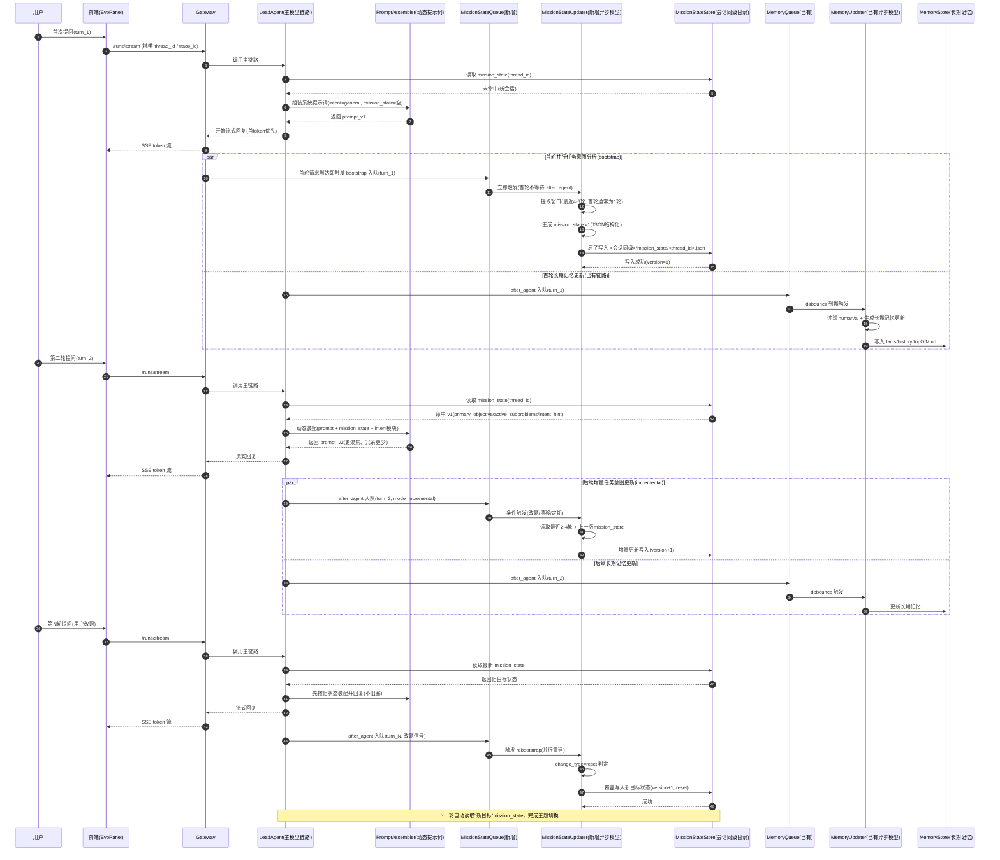
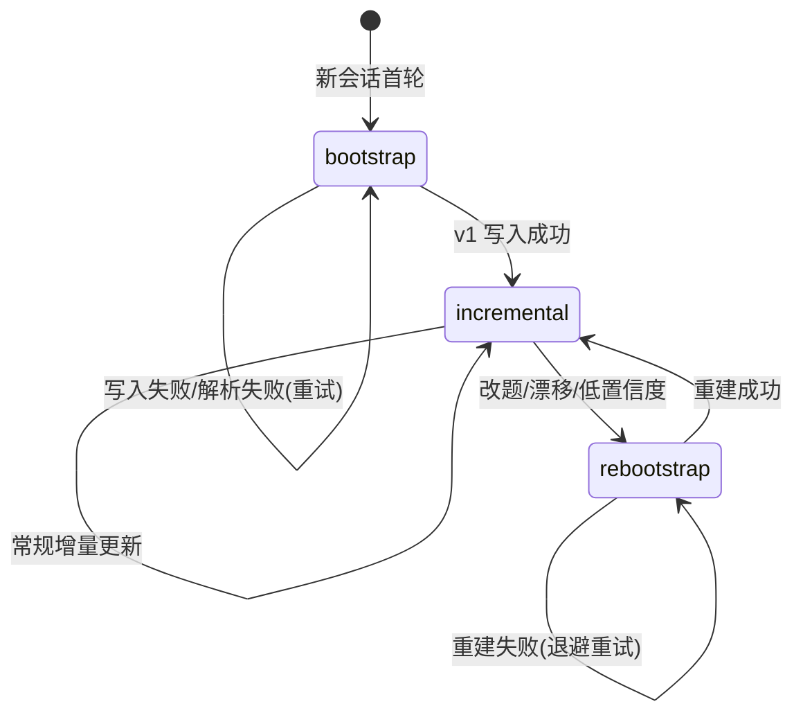

# 动态提示词与意图驱动设计方案（EvoFlow）

## 1. 背景与问题

当前 Lead Agent 的系统提示词为“大一统全量模板”，每轮都会注入完整规则。  
在工具与协作规则较多时，会带来两类问题：

- 首 token 变慢：提示词与工具 schema 共同抬高输入体积。
- 主题漂移：模型容易受无关规则干扰，偏离用户当前核心目标。

## 2. 用户需求（本次确认）

- 系统提示词应支持**按用户意图动态加载**，而不是每轮固定同一份大模板。
- 不希望通过“粗暴裁剪工具能力”来换速度。
- 希望模型在后续对话中持续理解“用户当前真正要解决的问题”，避免跑偏。

## 3. 目标

1. 在不牺牲核心能力的前提下减少每轮冗余提示词。
2. 建立“意图 → 提示词模块”的映射机制。
3. 支持注入会话目标状态（mission_state），强化主题对齐。
4. 保持可灰度、可回滚、可观测。

## 4. 设计方案

### 4.1 模块化提示词（Prompt Modules）

将系统提示词分为基础模块与意图模块：

- 基础模块（常驻）：角色、基础安全、输出要求、工作区约束。
- 意图模块（按需）：协作编排、子代理策略、引用规范、调试/规划/评审增强规则等。

### 4.2 意图路由（Intent Routing）

新增 `intent_hint`（运行时参数），支持值：

- `implement` / `debug` / `plan` / `review` / `chat` / `general`

由后端标准化到内部意图标签，再决定本轮激活哪些规则块。

### 4.3 会话目标状态注入（Mission State）

支持运行时注入 `mission_state`，用于把“主目标/子问题/约束”直接写入 system prompt：

- `primary_objective`
- `active_subproblems`
- `constraints`
- `out_of_scope`

该信息用于约束模型输出聚焦目标，降低跑题概率。

### 4.4 动态裁剪策略（仅提示词模块，不裁工具能力）

在 `EVOFLOW_DYNAMIC_PROMPT_ENABLED=true` 时，按意图做轻量裁剪：

- `chat`：移除 `collaboration_policy`、`subagent_system`
- `plan`：移除 `citation_policy`
- `review`：移除 `subagent_system`
- `subagent_enabled=false`：强制移除 `subagent_system`

说明：这是“规则模块裁剪”，不是工具能力裁剪。

## 5. 实现说明（已落地）

### 5.1 代码改动

- `backend/packages/harness/evoflow/agents/lead_agent/prompt.py`
  - 新增：
    - 意图标准化 `_normalize_intent`
    - 提示词模块区块 `_build_intent_modules_section`
    - 目标状态区块 `_build_mission_state_section`
    - XML 规则块裁剪 `_apply_dynamic_prompt_profile`
  - `apply_prompt_template(...)` 新增参数：
    - `intent_hint`
    - `mission_state`
  - 在模板中新增：
    - `{intent_modules_section}`
    - `{mission_state_section}`

- `backend/packages/harness/evoflow/agents/lead_agent/agent.py`
  - 从 `configurable` 读取：
    - `intent_hint`
    - `mission_state`
  - 透传到 `apply_prompt_template(...)`

### 5.2 运行开关

- `EVOFLOW_DYNAMIC_PROMPT_ENABLED`（默认 true）
  - true：启用动态提示词模块装配/裁剪
  - false：保持原有全量风格（除新增区块外不做裁剪）

## 6. 调用示例（运行时 configurable）

```json
{
  "configurable": {
    "intent_hint": "debug",
    "mission_state": {
      "primary_objective": "定位并修复前端 502 问题",
      "active_subproblems": [
        "确认 gateway 端口与前端代理目标一致",
        "排查旧 vite 进程残留"
      ],
      "constraints": [
        "不影响现有工具能力",
        "优先最小改动"
      ],
      "out_of_scope": [
        "重构整个网关架构"
      ]
    }
  }
}
```

## 7. 验收标准

1. 相同任务下，`model_request_payload.log` 中 system prompt 体积出现可观下降（按意图不同）。
2. `first_token_trace.log` 的 `input_to_gateway_ms` 有统计改善（建议看 p50/p95）。
3. 回复内容与 `primary_objective` 对齐率提升，跑题率降低。
4. 开关关闭后可回退到稳定行为。

## 8. 后续建议（第二阶段）

1. 前端自动生成 `intent_hint`（基于用户输入规则判定）。
2. 在后端增加“每轮意图与已加载模块”日志，便于 AB 对比。
3. 将 `mission_state` 持久化到 thread state，形成会话级目标状态机。

## 8.1 完整流程时序图（多轮，含细节处理）

下面给出“用户多轮对话 + 主模型 + 异步任务意图模型 + 异步长期记忆模型”的完整时序。



### 8.1.1 多轮流程分解（逐环节）

1. **请求进入（前端 -> 网关）**
   - 输入：`thread_id`、`trace_id`、用户消息
   - 处理：进入主模型链路，不等待任何异步任务
   - 目标：保证首 token 延迟最优

2. **主链路预处理（读取 mission_state）**
   - 命中：注入 `intent_hint + mission_state`
   - 未命中：按默认意图 `general` 执行
   - 异常：读取失败不阻塞，降级为默认提示词

3. **动态提示词装配（PromptAssembler）**
   - 输入：基础模板 + 意图模块 + mission_state
   - 裁剪：只裁规则模块，不裁工具能力
   - 输出：本轮最终 system prompt

4. **主模型流式回复**
   - 同步路径，直接回传 SSE
   - 不等待任何异步分析

5. **异步入队（并行）**
   - 首轮任务意图队列（新增）：请求到达即触发 `MissionStateQueue.bootstrap`（不等主模型结束）
   - 非首轮任务意图队列：`after_agent` 触发 `MissionStateQueue.incremental`
   - 长期记忆队列（已有）：始终 `after_agent` 触发 `MemoryQueue`
   - 两者独立防抖、独立失败处理

6. **任务意图异步更新（MissionStateUpdater）**
   - `bootstrap`：首轮并行建立 v1
   - `incremental`：后续小窗口增量更新
   - `rebootstrap`：改题/漂移时重建
   - 写入：会话同级目录，按 `thread_id` 原子落盘

7. **长期记忆异步更新（MemoryUpdater）**
   - 继续更新用户长期记忆（facts/history/topOfMind）
   - 不直接参与当轮 prompt 装配决策

8. **下一轮读取与闭环**
   - 主链路再次读取最新 mission_state
   - 自动应用新意图与子问题状态
   - 形成“多轮持续对齐”闭环

### 8.1.2 每个环节的细节处理规则

#### A. 读取窗口策略

- `bootstrap/rebootstrap`：4-6 轮（建议 5）
- `incremental`：2-4 轮（建议 3）+ 上一版 mission_state
- 仅在高不确定场景临时放大到 8 轮

#### B. 并发与一致性

- 按 `thread_id` 加锁写入 mission_state
- 同线程只保留最新 turn（防抖窗口内覆盖旧任务）
- `turn_id` 乱序回写保护：旧 turn 不得覆盖新版本

#### C. 失败与降级

- JSON 解析失败：丢弃本次更新，记录错误
- 校验失败：字段级降级（保留合法字段）
- 存储失败：本轮不注入新状态，下一轮继续尝试
- 任一异步失败不得影响主模型回复链路

#### D. 可观测性

- `mission_state_updates.log`：记录触发模式、窗口大小、置信度、写入结果
- `mission_state_injection.log`：记录每轮注入命中与降级原因
- 与 `first_token_trace.log` 结合，做前后性能/对齐率对比

## 9. 异步分析模型改造（每轮后处理闭环）

本节补充“每轮对话后异步分析”的完整链路：**分析输出结构 → 提取与存储 → 下一轮读取注入**。

### 9.1 改造目标

当前系统已有异步 memory 更新，但偏长期记忆（facts/history/topOfMind）。  
新增一个“会话目标状态（mission_state）”异步分析器，专门服务当前会话任务对齐，避免跑题。

### 9.1.1 与现有异步压缩模型的职责区分（必须分离）

为避免语义污染，明确区分两条异步链路：

1. **异步压缩/长期记忆模型（已有）**
   - 职责：更新 `facts / history / topOfMind`（长期记忆、用户画像）
   - 目标：跨会话复用，偏“稳定背景信息”
   - 当前实现：`MemoryMiddleware -> MemoryUpdateQueue -> MemoryUpdater`

2. **异步任务意图模型（新增）**
   - 职责：更新 `mission_state`（当前会话主目标、子问题、约束、范围外）
   - 目标：当前会话不跑偏，偏“短期任务状态”
   - 当前方案：`MissionStateMiddleware -> MissionStateQueue -> MissionStateUpdater`

结论：两者并行、隔离存储、隔离提示词，禁止混用同一输出结构。

### 9.2 异步分析输出结构（JSON Schema 约定）

每轮结束后，异步分析模型必须输出以下 JSON（严格结构化）：

```json
{
  "thread_id": "string",
  "turn_id": "string",
  "ts_ms": 0,
  "primary_objective": "string",
  "objective_confidence": 0.0,
  "success_criteria": ["string"],
  "constraints": ["string"],
  "active_subproblems": [
    {
      "id": "sp-001",
      "title": "string",
      "status": "pending|in_progress|blocked|done",
      "priority": 1,
      "evidence": "string",
      "suggested_tools": ["string"]
    }
  ],
  "done_subproblems": ["sp-000"],
  "out_of_scope": ["string"],
  "intent_hint": "general|implement|debug|plan|review|chat",
  "change_type": "noop|update|reset",
  "version": 1
}
```

字段说明（关键）：

- `change_type=reset`：表示用户目标已发生明显切换，下一轮应重置旧子问题。
- `objective_confidence`：低于阈值（建议 0.6）时，不覆盖主目标，只更新观察信息。
- `suggested_tools`：仅建议，不直接改变工具能力；用于后续动态激活策略参考。

### 9.3 提取逻辑（Analyzer 提示与解析）

1. 输入：本轮用户消息 + 本轮助手最终答复 + 最近 N 轮关键上下文（建议 4-6 轮）。
2. 模型输出：严格 JSON（禁止 markdown）。
3. 解析策略：
   - JSON 解析失败：整条丢弃，记录错误日志（不影响主链路）。
   - 字段校验失败：按字段降级（保留合法字段）。
   - 置信度不足：不替换 `primary_objective`，仅更新 `active_subproblems` 的状态证据。

### 9.4 存储位置与数据模型

建议新增轻量状态文件（或 thread metadata）：

- 路径：`<会话目录同级>/mission_state/<thread_id>.json`（与会话同级目录，固定此规则）
- 生产可迁移到 DB（字段与上面 schema 一致）

存储结构：

```json
{
  "thread_id": "xxx",
  "updated_at": "ISO8601",
  "version": 1,
  "state": { "...9.2 schema..." }
}
```

并发策略：

- 按 `thread_id` 加锁写入（最后写入 wins）。
- `turn_id` 小于已存档 turn 时拒绝覆盖（防止乱序回写）。

### 9.5 下一轮如何获取并注入

在下一轮 `make_lead_agent` 前读取 mission_state：

1. 通过 `thread_id` 查询最新 mission_state。
2. 若存在，则注入：
   - `configurable.intent_hint = state.intent_hint`
   - `configurable.mission_state = state`（最小必要字段）
3. `apply_prompt_template(...)` 在 system prompt 中写入 `<mission_state>` 块。

回退策略：

- mission_state 不存在/过期/损坏：按原逻辑运行（不阻塞）。
- 若 `change_type=reset`：清空旧 `active_subproblems` 再注入新状态。

### 9.6 时序（每轮闭环）

1. 主模型完成本轮回复（同步路径）。
2. `after_agent` 将本轮信息放入 `mission_state_update_queue`（异步）。
3. 后台 analyzer 生成结构化 JSON。
4. 校验通过后写入 `mission_state store`。
5. 下一轮请求到达时读取并注入 system prompt。

### 9.6.1 触发策略（首轮并行 + 后续增量）

为兼顾速度与准确性，采用三态机制：

- `bootstrap`（首轮并行分析）
- `incremental`（后续异步增量）
- `rebootstrap`（用户改题/漂移时再次并行）

#### A. 首轮（bootstrap）

用户首次提问时：

1. 主模型正常执行并回复（不阻塞）。
2. **任务意图异步模型在请求进入时并行启动**（不等待 after_agent），分析用户首问，生成 `mission_state v1`。
3. `v1` 在首轮结束后落盘，供下一轮直接注入。

目的：首轮即并行，不等待主模型完成后再分析，缩短“拿到有效 mission_state”的总时间。

#### B. 后续轮次（incremental）

默认不再每轮并行全量分析，而是：

1. 每轮 `after_agent` 入队（轻量）
2. 防抖后按条件触发增量更新（建议最近 6-10 轮 + 上一版 state）
3. 仅更新变化字段（子问题状态/约束/目标置信度）

#### C. 再并行（rebootstrap）

当检测到以下任一条件，进入 `rebootstrap`（再次并行分析）：

- 用户明确改题（如“换个方向/不要这个/改成…”）
- `objective_confidence < 阈值`（建议 0.6）
- 连续 N 轮出现目标偏移信号（建议 N=2）

### 9.6.3 状态机定义（bootstrap -> incremental -> rebootstrap）

为便于工程落地，任务意图异步模型采用三态状态机：

- `bootstrap`：首次并行分析，快速建立 `mission_state v1`
- `incremental`：常态增量更新，低开销维护状态
- `rebootstrap`：检测到改题/漂移后再次并行重建状态

状态迁移规则：

1. 初始进入会话：`bootstrap`
2. `bootstrap` 成功写入后：转 `incremental`
3. `incremental` 期间命中改题/低置信度/漂移阈值：转 `rebootstrap`
4. `rebootstrap` 成功写入后：回到 `incremental`
5. 任一状态分析失败：不阻塞主链路，保持当前状态并记录失败原因



工程约束：

- 状态机仅控制“任务意图异步模型”，不影响现有长期记忆队列。
- 状态切换信息应写入 `mission_state_updates.log`，便于回溯与 AB 分析。
- `rebootstrap` 期间主模型继续响应用户，不等待异步分析完成。

### 9.6.2 触发条件与读取窗口建议

- 首轮：必并行（bootstrap）
- 后续：默认增量（incremental）
- 再并行：按上面 rebootstrap 条件

读取窗口（小窗口优先）：

- `bootstrap/rebootstrap`：最近 4-6 轮（建议 5）
- `incremental`：最近 2-4 轮（建议 3）+ 上一版 mission_state
- 仅在“改题 + 低置信度 + 漂移”同时出现时，临时放大到 8 轮上限

### 9.7 与现有 MemoryQueue 的关系

- `MemoryQueue`：长期记忆（画像/事实）
- `MissionStateQueue`：短期任务状态（目标/子问题）

两者并行，不互相覆盖。  
建议在 prompt 中优先级：`mission_state > topOfMind > history`。

并发建议：

- 两个队列可并行执行，但分别有独立 debounce。
- `mission_state` 优先级高于 `memory`（对下一轮决策影响更直接）。

### 9.8 观测与日志

新增日志文件（开发期）：

- `temp/mission_state_updates.log`
  - 记录：thread_id、turn_id、intent_hint、change_type、objective_confidence、subproblem_count
- `temp/mission_state_injection.log`
  - 记录：下一轮注入是否成功、注入版本、fallback 原因

### 9.9 验收标准（异步分析部分）

1. 连续 10 轮对话中，mission_state 可稳定更新（成功率 > 95%）。
2. 用户目标切换时（reset 场景）下一轮可正确反映新 objective。
3. 下一轮 system prompt 可看到正确 `<mission_state>` 注入。
4. 不因异步分析失败影响主回答链路（可用性 100%）。
