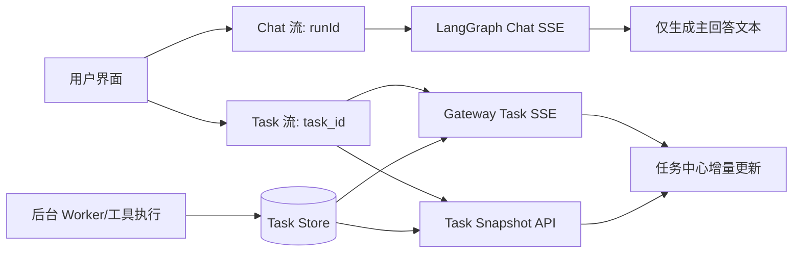

# EvoFlow 后台任务持续执行与断线续跑实施方案

> 版本：v1.1  
> 日期：2026-04-10  
> 目标：任务在后端独立持续执行，页面关闭/刷新/断流不影响执行；用户重连后可继续查看真实进度与结果。


## 1. 背景与问题定义

当前实时聊天场景中，任务执行与前端流式展示耦合较重，导致以下典型问题：

- 追加提问后，旧 run 的事件可能混入新对话，出现内容串台。
- 页面刷新后，工具显示顺序或状态异常（如“进行中”残留）。
- SSE 断开后，用户难以恢复到“同一个后台任务”的真实进度。
- 聊天主区承担了过多“任务监控”信息，影响用户阅读主回答。

本方案把“聊天回答流”和“任务执行流”完全分离：  
**聊天只关注自然语言回复，任务只按 `task_id` 单独跟踪。**


## 2. 目标与非目标

### 2.1 目标

- 后台任务生命周期独立于页面连接（Detached Execution）。
- 以 `task_id` 为唯一锚点做状态查询与断线续连。
- 前端主聊天区不再被任务事件污染。
- 任务中心可实时显示任务/子任务进度，且刷新后可恢复。

### 2.2 非目标

- 不重构 LangGraph 主编排逻辑。
- 不改变已有 `messages`/`ui_messages` 的摘要策略（摘要仍供模型使用，UI 展示完整历史）。
- 不在本期引入复杂任务编排系统（如外部队列平台迁移）。


## 3. 核心设计原则

- **执行与展示解耦**：任务执行状态以后端持久化为准，不以前端内存为准。
- **单一事实源**：任务状态以 `task_id` 快照接口 + 任务事件流为准。
- **幂等更新**：同一 `task_id` / `subtask_id` 重放事件时应“覆盖更新”，不能重复堆叠。
- **弱网可恢复**：断流后优先拉取快照，再接入增量流。
- **渐进落地**：优先最小改动，不一次性推翻既有 chat 流逻辑。


## 4. 目标架构（简化）




## 5. 后端改造清单（EvoFlow 项目定制）

## 5.1 任务状态快照接口

新增（或补齐）接口：

- `GET /api/collab/tasks/{task_id}`

建议返回结构（示例）：

```json
{
  "task_id": "t_xxx",
  "status": "pending|running|completed|failed|cancelled",
  "progress": 56,
  "title": "新闻搜索与文件写入",
  "started_at": "2026-04-10T09:00:00Z",
  "updated_at": "2026-04-10T09:03:12Z",
  "result_summary": "已完成 3 个子任务，生成 1 个文件",
  "subtasks": [
    {
      "subtask_id": "st_1",
      "title": "检索新闻源",
      "status": "completed",
      "progress": 100
    }
  ]
}
```

要求：

- `task_id` 必须可全生命周期查询（至少保留可配置 TTL）。
- 状态机只在后端推进，前端只消费，不推断。

## 5.2 任务事件流标准化

统一任务事件最小字段：

- `type`：`task.started` / `task.progress` / `subtask.updated` / `task.completed` / `task.failed`
- `task_id`
- `timestamp`
- `payload`

要求：

- 对同一实体（`task_id`、`subtask_id`）支持重复事件覆盖更新。
- 事件乱序时，以 `updated_at` 或版本号做保护，避免状态回退。

## 5.3 Detached 执行保证

检查并确保：

- 前端断开 SSE 后，后台 worker 不受影响继续执行。
- chat run 结束或中断，不应自动取消已创建任务（除显式 cancel）。
- 任务执行结果写入持久层，允许后续恢复查看。


## 6. 前端改造清单（evopanel）

## 6.1 `ws-client` 分离双流

在 `src/lib/ws-client.js` 增加任务流能力（示例接口）：

- `attachTask(taskId, handlers)`
- `detachTask(taskId)`
- `getTaskSnapshot(taskId)`

约束：

- chat 事件与 task 事件使用不同分发通道。
- `runId` 只用于 chat；`task_id` 只用于 task。

## 6.2 `ChatApp` 收敛职责

在 `src/react/ChatApp.tsx` 中：

- 主聊天区仅消费 chat 通道事件（delta/final/tool 仅限当前 run）。
- `task-stream:*` 或任务事件不进入主聊天 rows。
- 任务相关展示不在聊天区展开，仅保留“任务已创建/查看任务中心”的轻提示。

## 6.3 任务中心实时数据 Hook（建议）

新增 `src/react/hooks/useTaskProgress.ts`：

- 入参：`taskId`
- 行为：先 `getTaskSnapshot(taskId)`，再 `attachTask(taskId)` 收增量
- 断线：自动重连并先拉快照再续流
- 出参：`task`, `subtasks`, `status`, `progress`, `error`, `reconnect()`

## 6.4 页面刷新恢复（任务中心）

建议在会话上下文中持久化最近活跃 `task_id`（例如 localStorage/session store）：

- 页面重载后读取最近活跃 `task_id`
- 任务中心先拉快照恢复 UI
- 再挂增量流

## 6.5 聊天到任务中心的跳转与字段约定

聊天区在创建后台任务后，仅输出轻量结构化提示：

- `task_id`：任务唯一标识（必填）
- `project_id`：任务中心列表过滤所需（建议）
- `thread_id`：回溯会话上下文所需（建议）
- `entry`：任务中心链接（例如 `/tasks?task_id=...`）

建议消息形态：

- 文案：`任务已创建，正在后台执行。`
- 操作：`查看任务中心`（按钮/链接）
- 可选：展示短 ID（如 `task_id` 后 8 位）便于人工核对


## 7. 接口契约与状态映射

统一状态枚举（前后端一致）：

- `pending`
- `running`
- `completed`
- `failed`
- `cancelled`

UI 映射规则：

- 仅在收到 `completed|failed|cancelled` 时显示终态。
- 任何子任务未结束时，父任务不得显示 `completed`。
- 避免“未知状态默认进行中”；未知值显示“状态未知”并记录日志。


## 8. 实施步骤（建议顺序）

1. 后端补齐 `GET /api/collab/tasks/{task_id}` 快照接口。  
2. 统一任务事件字段与状态映射，补齐覆盖更新逻辑。  
3. 前端 `ws-client` 增加 `attachTask/detachTask/getTaskSnapshot`。  
4. 新增 `useTaskProgress`，任务中心改为“快照 + 增量”驱动。  
5. `ChatApp` 清理任务事件写入主聊天的路径。  
6. 增加断线重连、刷新恢复与幂等去重测试。  
7. 灰度验证后全量切换。  


## 9. 验收标准（必须全部满足）

- 页面关闭 2 分钟后重开，任务仍在后台推进，状态连续。
- 断开网络再恢复后，任务中心可自动恢复到最新状态。
- 聊天区仅显示“任务已创建”轻提示，不展开任务过程噪声。
- 主聊天区不出现“旧任务重新刷屏”“运行中占位工具泛滥”。
- 相同事件重复到达不会产生重复子任务卡片。
- 任务完成后状态稳定为 `completed`，不会回退到 `running/pending`。


## 10. 风险与回滚

主要风险：

- 事件乱序导致状态倒退。
- 快照与增量的字段不一致导致 UI 抖动。
- 兼容旧会话数据时缺少 `task_id`。

回滚策略：

- 保留旧任务展示路径开关（feature flag）。
- 出现异常时切回“仅快照轮询”模式，先保证正确性再恢复实时流。


## 11. 与当前已完成工作的衔接

当前已完成的以下能力可直接复用：

- `ui_messages` 与摘要解耦（模型摘要、用户看完整历史）。
- chat run 绑定与跨 run 事件隔离（防串台）。
- 工具段落渲染与占位工具过滤。

本方案是在此基础上继续把“任务执行流”彻底从“聊天展示流”中剥离，形成稳定的后台持续执行模型。


## 12. 后续可选增强

- 任务取消：`POST /api/collab/tasks/{task_id}/cancel`
- 任务历史页：按会话聚合多个 `task_id`
- 子任务日志查看：按 `subtask_id` 拉取详细执行日志
- 指标面板：任务平均耗时、失败率、重试率
