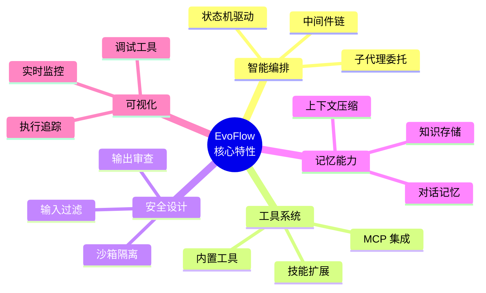
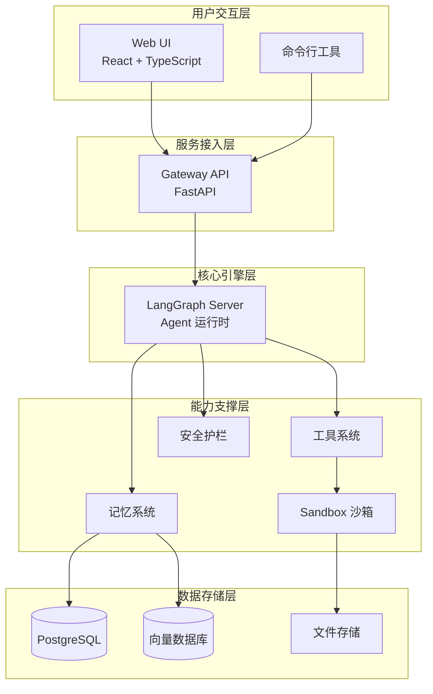
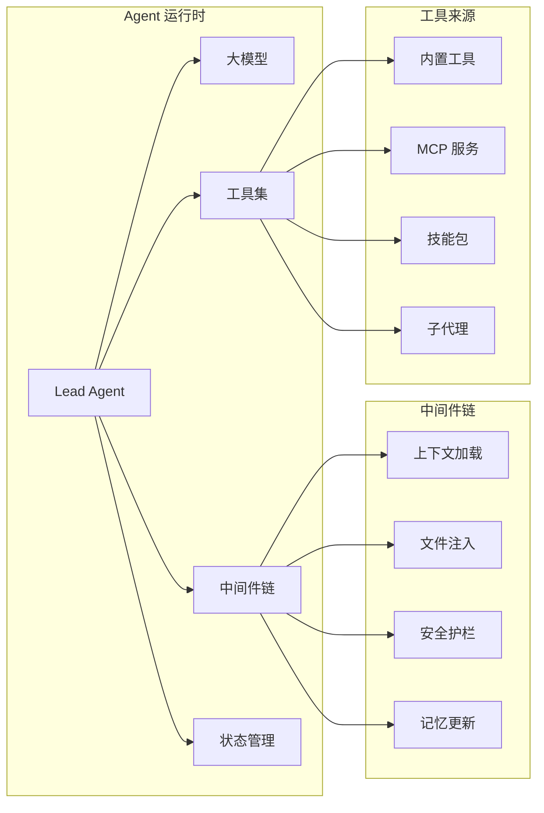
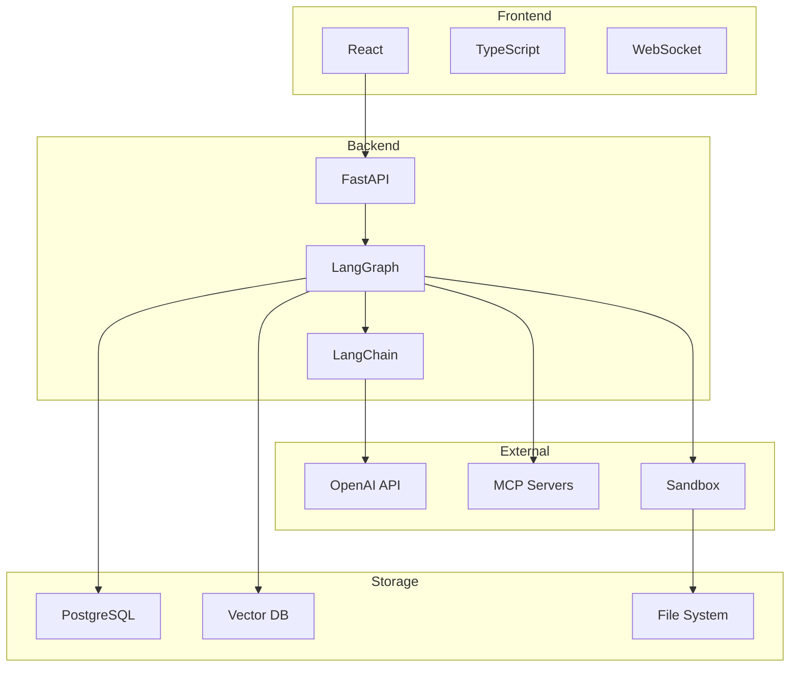

# 01-项目总览

---

## 目录

- [一、项目简介](#一项目简介)
- [二、核心特性](#二核心特性)
- [三、系统架构](#三系统架构)
- [四、技术栈](#四技术栈)
- [五、文档导航](#五文档导航)
- [六、快速开始](#六快速开始)

---

## 一、项目简介

**EvoFlow** 是一个基于 LangGraph 构建的 AI Agent 编排平台，专为复杂任务自动化设计。

### 1.1 定位与目标

```
┌─────────────────────────────────────────────────────────┐
│                      EvoFlow                           │
│              AI Agent 编排与执行平台                     │
├─────────────────────────────────────────────────────────┤
│  • 可视化 Agent 工作流设计                               │
│  • 多工具协同与沙箱安全执行                              │
│  • 可扩展的技能系统                                      │
│  • 企业级安全护栏                                        │
└─────────────────────────────────────────────────────────┘
```

### 1.2 核心能力

| 能力 | 说明 |
|------|------|
| **智能编排** | 基于 LangGraph 的状态机驱动 Agent 执行 |
| **工具生态** | 支持内置工具、MCP 服务、自定义脚本 |
| **安全执行** | 沙箱隔离 + 多层安全护栏 |
| **记忆系统** | 短期/中期/长期三级记忆架构 |
| **可视化** | Web UI 实时监控 Agent 执行状态 |

---

## 二、核心特性

### 2.1 特性全景



### 2.2 特性详解

#### 智能编排

- **状态机驱动**：基于 LangGraph 实现可靠的 Agent 状态管理
- **中间件链**：可插拔的请求/响应处理链
- **子代理委托**：复杂任务自动分解给专门 Agent

#### 工具系统

- **多源接入**：内置工具、配置文件、MCP 服务、子代理
- **动态发现**：运行时自动发现和注册工具
- **统一接口**：所有工具对 LLM 呈现一致调用方式

#### 安全设计

- **沙箱隔离**：代码执行在隔离环境中进行
- **多层护栏**：输入过滤、命令白名单、路径控制
- **审计追踪**：完整记录所有工具调用和执行结果

#### 记忆系统

- **三级记忆**：短期（会话级）、中期（线程级）、长期（用户级）
- **智能压缩**：长对话自动上下文压缩
- **向量检索**：长期记忆支持语义检索

---

## 三、系统架构

### 3.1 架构概览



### 3.2 核心组件关系



---

## 四、技术栈

### 4.1 技术选型

| 层级 | 技术 | 用途 |
|------|------|------|
| **前端** | React + TypeScript | Web UI 界面 |
| **网关** | FastAPI | API 服务与路由 |
| **Agent 引擎** | LangGraph | Agent 编排与状态管理 |
| **LLM 接口** | LangChain | 大模型统一接入 |
| **数据存储** | PostgreSQL | 结构化数据存储 |
| **向量存储** | pgvector / Chroma | 语义记忆存储 |
| **沙箱** | Docker / Local | 代码执行隔离 |
| **配置** | Pydantic | 配置验证与管理 |

### 4.2 技术架构图



---

## 五、文档导航

### 5.1 文档体系

本技术文档按主题分为以下几个部分：

| 序号 | 文档 | 内容 |
|------|------|------|
| 00 | 写作规范 | 文档编写标准与模板 |
| 01 | 项目总览 | 项目介绍与快速开始 |
| 02 | 架构分析 | 系统架构与核心组件|
| 03 | 技能系统 | 技能开发与工具集成 |
| 04 | Agent 核心机制 | Agent 生命周期与中间件 |
| 05 | 工具系统与 Sandbox | 工具开发与沙箱执行|
| 06 | 记忆系统 | 记忆类型与存储机制 |
| 07 | 上下文工程 | 上下文管理与压缩 |
| 08 | 安全护栏 | 安全策略与 Guardrails |
| 09 | MCP 系统 | MCP 协议与集成 | 
| 10 | 文件上传与制品 | 文件处理与制品管理 | 
| 11 | 子代理与任务执行 | 子代理机制与任务编排 | 
| 12 | Gateway API | API 端点与网关服务 | 
| 13 | IM 渠道集成 | 即时通讯渠道接入 | 
| 14 | 前端交互与流式渲染 | Web UI 与实时通信 | 

---

## 六、快速开始

### 6.1 环境要求

- Python 3.11+
- Node.js 18+
- PostgreSQL 14+
- Docker（可选，用于沙箱）

### 6.2 启动服务

```bash
# 1. 启动 LangGraph Server
cd backend
langgraph dev

# 2. 启动 Gateway
cd backend/app
python -m uvicorn main:app --reload --port 8001

# 3. 启动前端
cd frontend
npm run dev
```

### 6.3 访问服务

| 服务 | 地址 | 说明 |
|------|------|------|
| Web UI | http://localhost:3000 | 可视化界面 |
| Gateway API | http://localhost:8001 | API 端点 |
| LangGraph Studio | http://localhost:2024 | 调试工具 |

---

## 导航

**下一篇**：[02-EvoFlow 架构分析](02-EvoFlow%20架构分析.md)

> **文档版本**：v1.0  
> **最后更新**：2026-03-30  
> **作者**：银泰

📚 返回总览：[01-EvoFlow 技术总览.md](EvoFlow%20功能与技术总览.md)

