# 02-EvoFlow 架构分析

---

## 目录

- [一、系统概述](#一系统概述)
- [二、分层架构](#二分层架构)
- [三、核心组件](#三核心组件)
- [四、数据流转](#四数据流转)
- [五、扩展机制](#五扩展机制)
- [六、安全设计](#六安全设计)

---

## 一、系统概述

EvoFlow 采用**分层架构设计**，将系统划分为清晰的层次，每层负责特定的职责，层与层之间通过明确的接口进行通信。

### 1.1 设计原则

| 原则 | 说明 |
|------|------|
| **关注点分离** | 不同功能模块独立演进，降低耦合 |
| **可扩展性** | 通过配置和插件机制支持功能扩展 |
| **安全性** | 工具执行隔离，敏感操作受控 |
| **可观测性** | 全流程追踪，状态可查询 |

### 1.2 架构全景

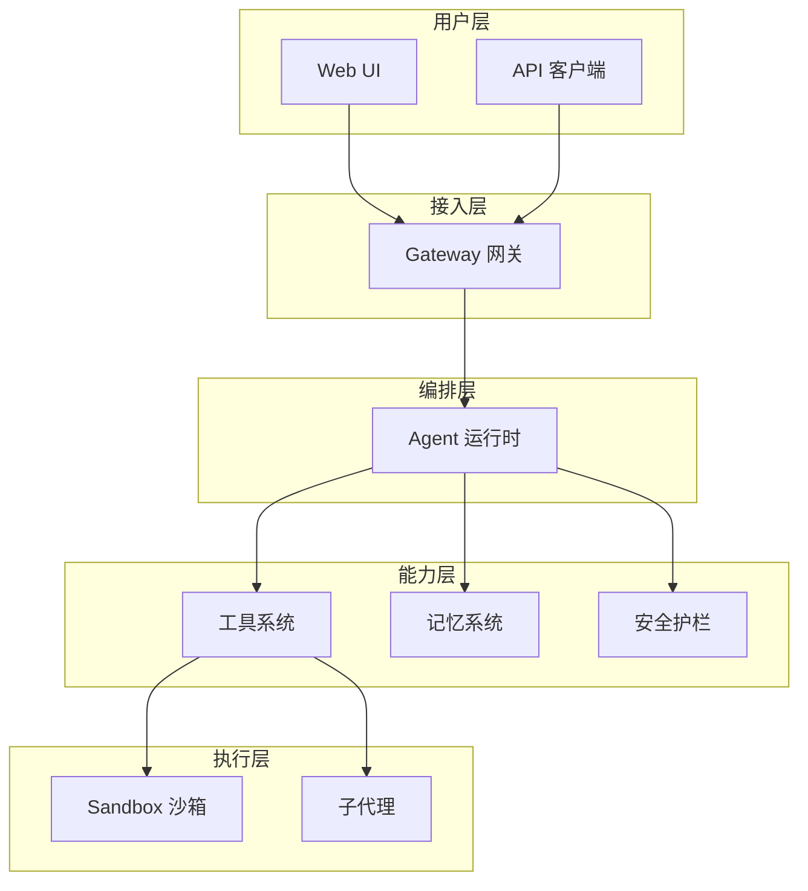

---

## 二、分层架构

### 2.1 五层架构模型

EvoFlow 采用经典的五层架构：

```
┌─────────────────────────────────────────┐
│           用户层 (Presentation)          │  ← Web UI、API
├─────────────────────────────────────────┤
│           接入层 (Gateway)               │  ← 路由、认证、限流
├─────────────────────────────────────────┤
│           编排层 (Orchestration)         │  ← Agent 运行时
├─────────────────────────────────────────┤
│           能力层 (Capabilities)          │  ← 工具、记忆、护栏
├─────────────────────────────────────────┤
│           执行层 (Execution)             │  ← 沙箱、子代理
└─────────────────────────────────────────┘
```

### 2.2 各层职责

| 层级 | 核心职责 | 关键组件 |
|------|----------|----------|
| **用户层** | 提供交互界面 | Web UI、API 端点 |
| **接入层** | 请求路由与治理 | Gateway、认证中间件 |
| **编排层** | Agent 生命周期管理 | Lead Agent、状态机 |
| **能力层** | 提供可复用能力 | 工具集、记忆存储、安全策略 |
| **执行层** | 隔离执行环境 | Sandbox、子代理进程 |

---

## 三、核心组件

### 3.1 Agent 运行时

Agent 运行时是系统的核心编排引擎，负责协调 LLM、工具和上下文。

**核心概念**：

- **Lead Agent**：主代理，负责接收用户输入并协调工具调用
- **Thread**：对话线程，维护一次完整对话的上下文状态
- **Turn**：单轮交互，包含用户输入和模型响应

**运行时流程**：

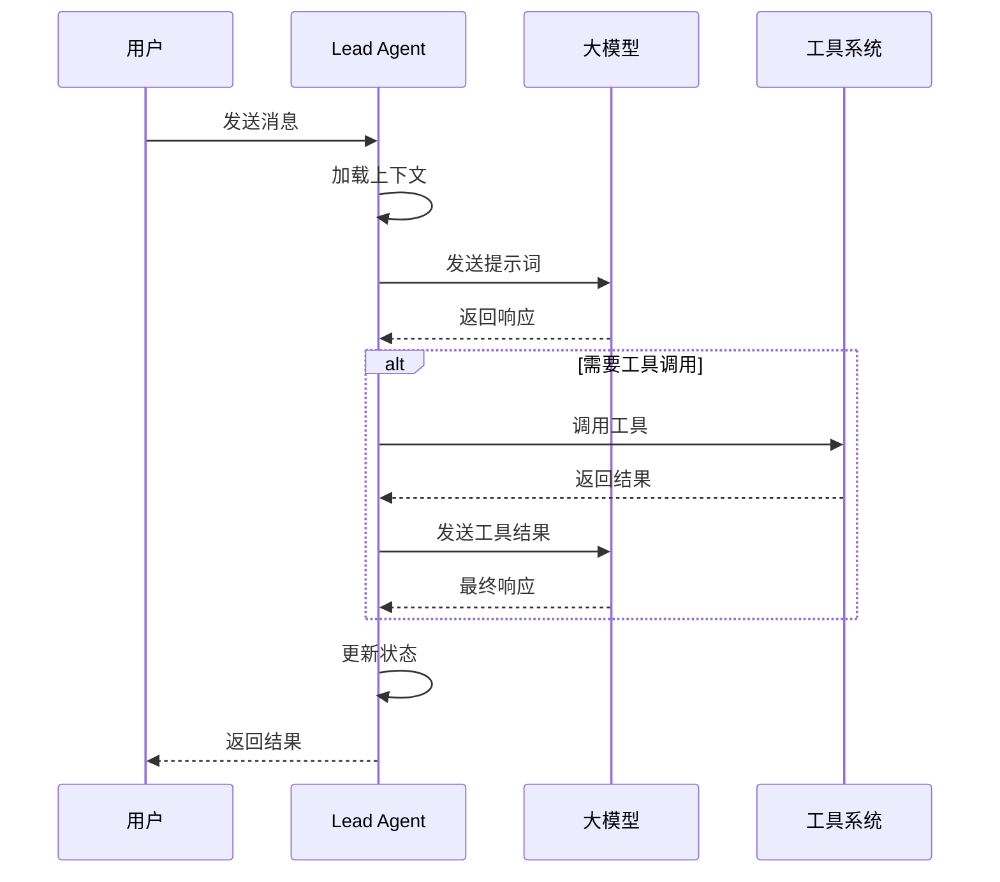

### 3.2 中间件链

中间件链是 Agent 运行时的**拦截器机制**，在请求处理的不同阶段插入逻辑。

**处理阶段**：

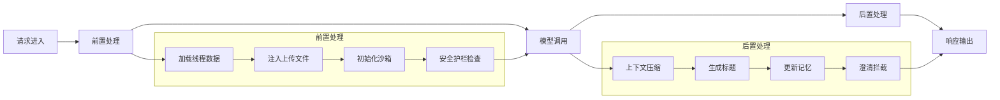

**典型中间件**：

| 中间件 | 阶段 | 作用 |
|--------|------|------|
| 线程数据加载 | 前置 | 恢复对话上下文 |
| 上传文件注入 | 前置 | 将用户上传文件加入提示词 |
| 沙箱初始化 | 前置 | 准备代码执行环境 |
| 安全护栏 | 前置 | 检查输入合规性 |
| 上下文压缩 | 后置 | 长对话时压缩历史 |
| 记忆更新 | 后置 | 提取并存储关键信息 |

### 3.3 工具系统

工具系统为 Agent 提供**可调用能力**，将外部功能封装为 LLM 可调用的接口。

**工具来源**：

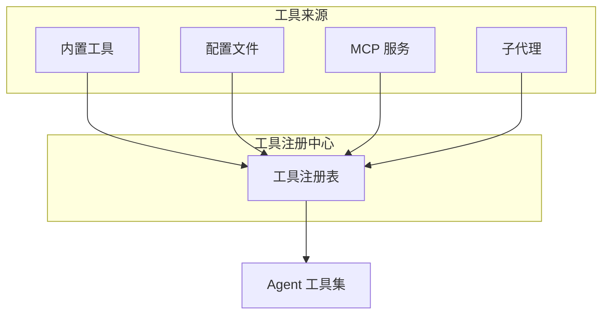

**工具类型**：

| 类型 | 说明 | 示例 |
|------|------|------|
| **内置工具** | 系统预置的基础工具 | 文件读写、网络请求 |
| **配置工具** | 通过配置文件定义的命令行工具 | Python 脚本、Shell 命令 |
| **MCP 工具** | 通过 MCP 协议接入的外部服务 | 数据库查询、API 调用 |
| **子代理** | 将复杂任务委托给专门的子 Agent | 代码审查、文档生成 |

### 3.4 记忆系统

记忆系统负责**持久化对话中的关键信息**，支持跨会话的上下文延续。

**记忆类型**：

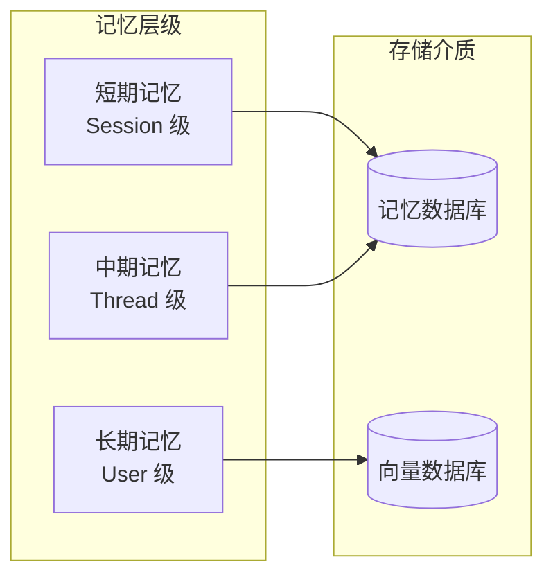

| 记忆层级 | 生命周期 | 存储内容 |
|----------|----------|----------|
| **短期记忆** | 单次会话 | 当前对话的完整历史 |
| **中期记忆** | 对话线程 | 线程级别的关键信息 |
| **长期记忆** | 用户级别 | 跨对话的用户偏好和知识 |

### 3.5 安全护栏

安全护栏是系统的**安全闸门**，在关键操作前进行合规性检查。

**检查点分布**：

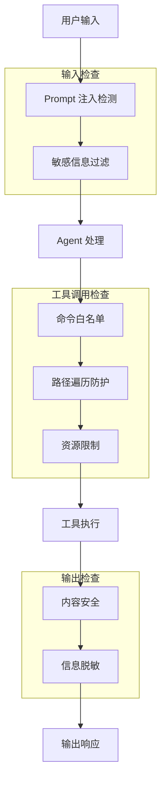

---

## 四、数据流转

### 4.1 单次请求生命周期

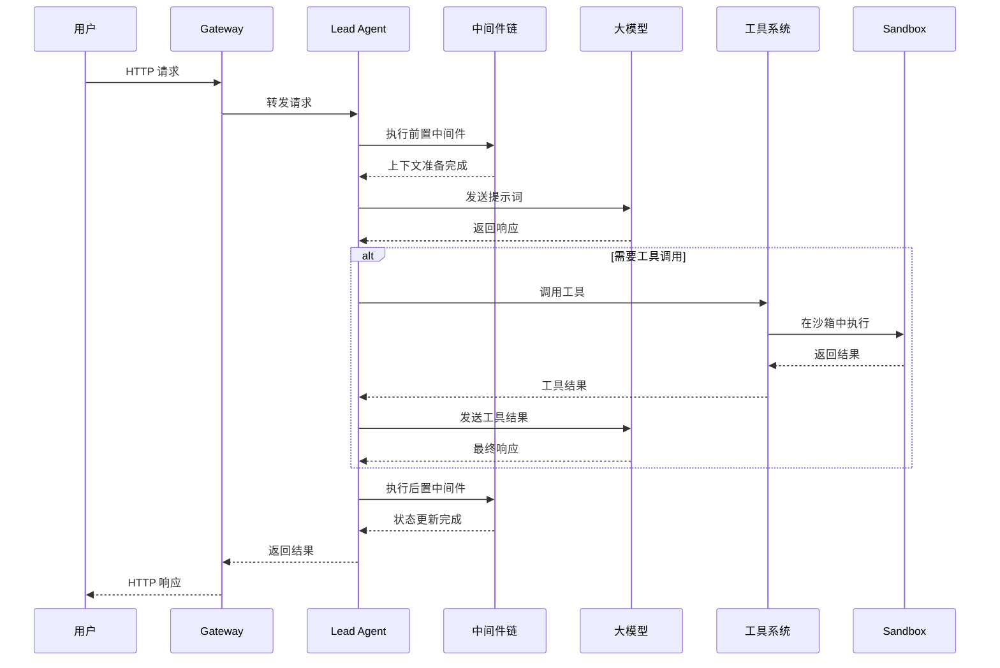

### 4.2 状态管理

系统通过**状态机**管理对话的生命周期：

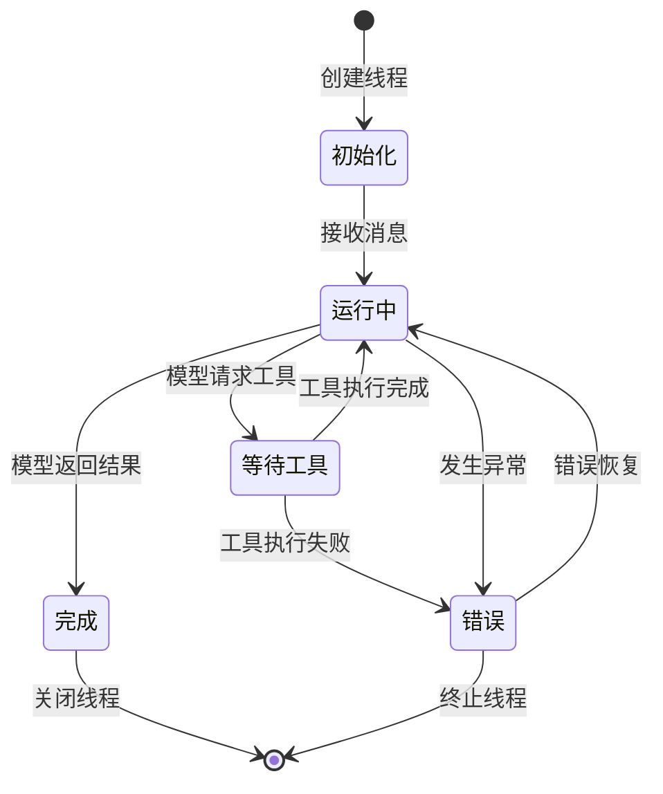

---

## 五、扩展机制

### 5.1 技能扩展

技能（Skill）是 EvoFlow 的**模块化扩展单元**，将相关工具和配置打包为可复用单元。

**技能结构**：

```
skill/
├── skill.yaml          # 技能元信息
├── tools.yaml          # 工具定义
├── prompts/            # 提示词模板
└── scripts/            # 辅助脚本
```

**加载机制**：

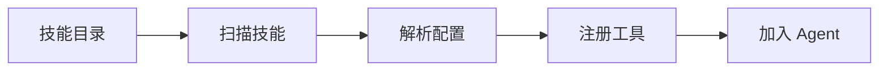

### 5.2 MCP 集成

MCP（Model Context Protocol）是**标准化的外部服务接入协议**。

**集成架构**：

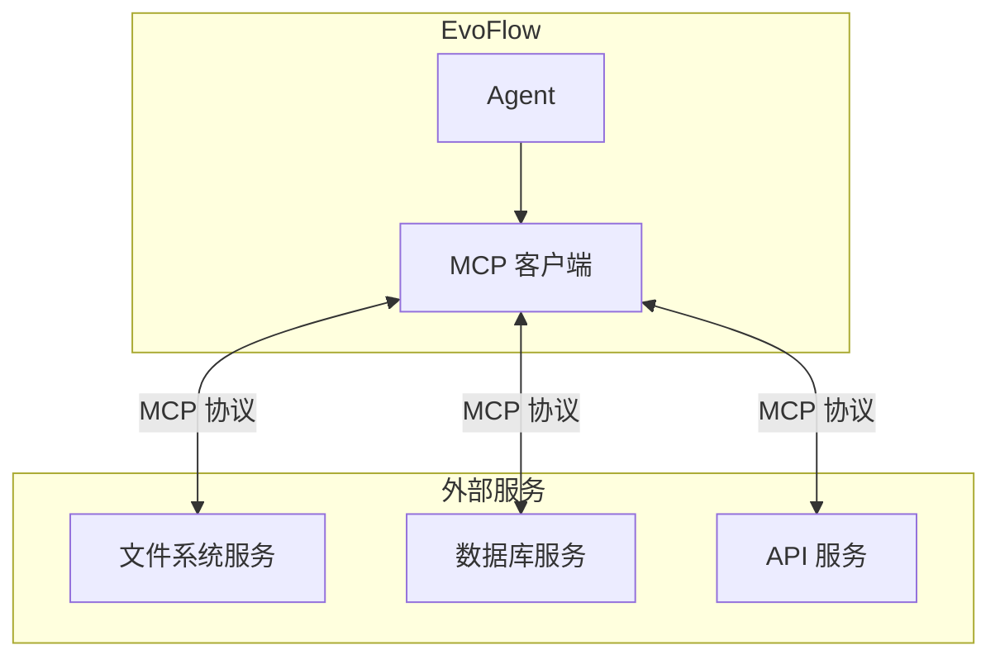

### 5.3 子代理机制

子代理（Subagent）用于**将复杂任务分解**给专门的 Agent 处理。

**调用模式**：

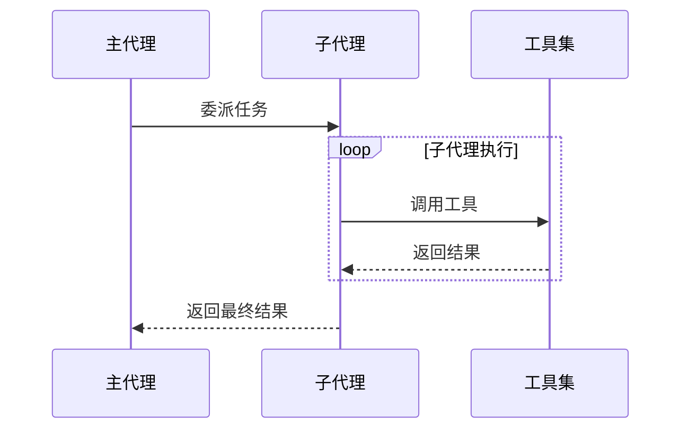

---

## 六、安全设计

### 6.1 多层防护

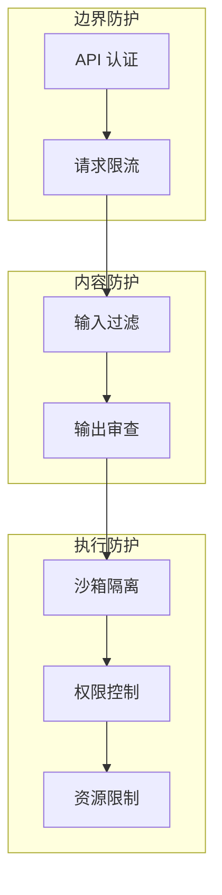

### 6.2 沙箱隔离

Sandbox 提供**代码执行的隔离环境**：

| 隔离维度 | 措施 |
|----------|------|
| **文件系统** | 虚拟路径映射，限制访问范围 |
| **网络** | 可选的网络访问控制 |
| **资源** | CPU、内存、执行时间限制 |
| **权限** | 最小权限原则 |

---

## 导航

**上一篇**：[01-项目总览](01-项目总览.md)  
**下一篇**：[03-技能系统技术文档](03-技能系统技术文档.md)

> **文档版本**：v1.0  
> **最后更新**：2026-03-30  
> **作者**：银泰

📚 返回总览：[EvoFlow技术总览](01-EvoFlow技术总览.md)
