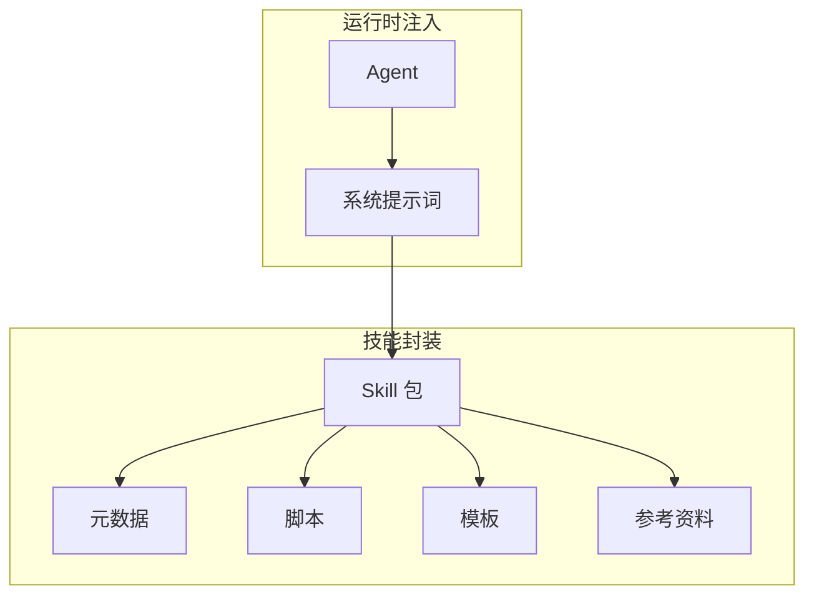
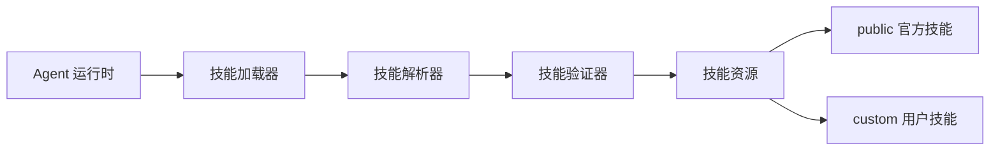
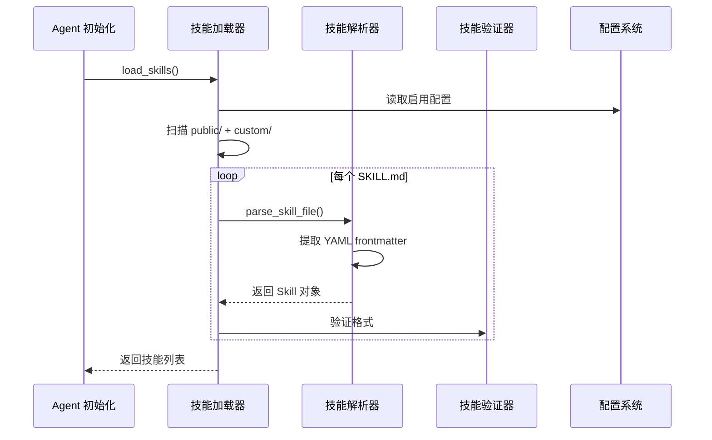
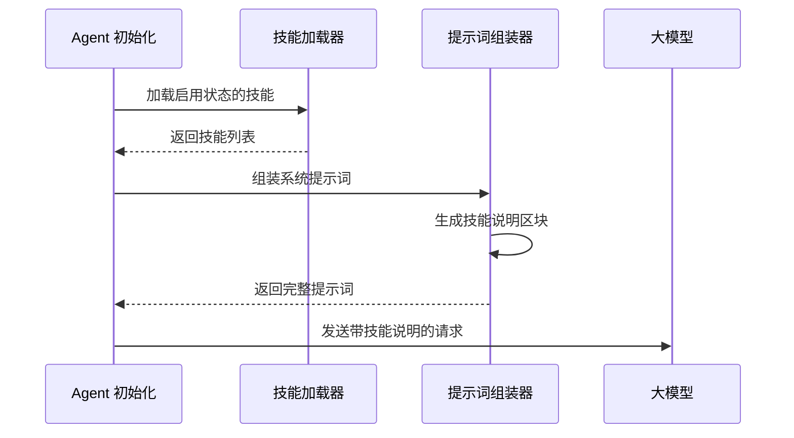

# 03-技能系统技术文档


## 目录

- [一、技能系统概述](#一技能系统概述)
- [二、技能目录结构](#二技能目录结构)
- [三、技能元数据](#三技能元数据)
- [四、技能加载机制](#四技能加载机制)
- [五、技能使用与执行](#五技能使用与执行)
- [六、技能开发指南](#六技能开发指南)
- [七、最佳实践](#七最佳实践)


## 一、技能系统概述

### 1.1 什么是技能

**技能（Skills）** 是 EvoFlow 的模块化扩展机制，将特定领域的知识、工具和流程打包为可复用单元。



### 1.2 技能 vs 工具

| 维度 | 技能（Skills） | 工具（Tools） |
|------|---------------|--------------|
| **定位** | 领域解决方案 | 原子操作 |
| **粒度** | 粗粒度 | 细粒度 |
| **组成** | 多文件资源包 | 单个函数 |
| **调用** | 提示词注入 | 函数调用 |
| **示例** | `data-analysis` | `web_search` |

### 1.3 系统架构




## 二、技能目录结构

### 2.1 全局目录组织

```
skills/
├── public/                    # 官方内置技能
│   ├── bootstrap/            # 引导技能
│   ├── chart-visualization/  # 图表生成
│   ├── data-analysis/        # 数据分析
│   ├── deep-research/        # 深度研究与洞察页生成（含 HTML 模板）
│   └── ...
│
└── custom/                    # 用户自定义技能
    ├── my-skill/
    └── ...
```

### 2.2 单个技能结构

```
my-skill/
├── SKILL.md                  # 【必需】技能元数据
├── scripts/                  # 【可选】执行脚本
├── templates/                # 【可选】模板文件
├── references/               # 【可选】参考资料
└── assets/                   # 【可选】资源文件
```

### 2.3 路径映射机制

技能路径在三个环境中存在不同形态：

| 环境 | 路径示例 | 说明 |
|------|---------|------|
| **宿主机** | `d:\skills\public\data-analysis` | 实际存储路径 |
| **相对路径** | `public/data-analysis` | 逻辑标识 |
| **容器内** | `/mnt/skills/public/data-analysis` | 沙箱挂载路径 |

**路径转换源码**（`backend/packages/harness/evoflow/skills/types.py#L24-L38`）：

将技能的宿主机路径转换为沙箱容器内的挂载路径。

| 参数 | 类型 | 默认值 | 说明 |
|------|------|--------|------|
| `container_base_path` | `str` | `/mnt/skills` | 技能在容器内的挂载根目录 |

```python
def get_container_path(self, container_base_path: str = "/mnt/skills") -> str:
    """
    Get the full path to this skill in the container.
    获取技能在容器内的完整路径

    Args:
        container_base_path: Base path where skills are mounted in the container
                             技能在容器内的挂载根目录

    Returns:
        Full container path to the skill directory
        技能目录在容器内的完整路径
        例如: /mnt/skills/public/data-analysis
    """
    category_base = f"{container_base_path}/{self.category}"
    skill_path = self.skill_path
    if skill_path:
        return f"{category_base}/{skill_path}"
    return category_base
```


## 三、技能元数据

### 3.1 SKILL.md 结构

SKILL.md 是技能的核心定义文件，采用 YAML Frontmatter + Markdown 格式：

```yaml
---
name: data-analysis
description: 提供数据分析能力，支持 CSV、Excel 等格式
author: EvoFlow Team
version: 1.0.0
license: MIT

# 数据分析技能

## 功能说明

本技能提供以下能力：
- 数据清洗与预处理
- 统计分析
- 可视化图表生成

## 使用示例

```python
import pandas as pd
df = pd.read_csv('data.csv')
print(df.describe())
```

**资源引用**

- 模板：`templates/report.md`
- 脚本：`scripts/analyze.py`
### 3.2 元数据字段

| 字段          | 必需 | 说明             |
| ------------- | ---- | ---------------- |
| `name`        | ✅    | 技能标识符，唯一 |
| `description` | ✅    | 功能描述         |
| `author`      | ❌    | 作者信息         |
| `version`     | ❌    | 版本号           |
| `license`     | ❌    | 许可证           |


## 四、技能加载机制

### 4.1 加载流程



### 4.2 核心组件源码

**1. Skill 数据类**（`backend/packages/harness/evoflow/skills/types.py#L5-L16`）

定义技能的数据结构，包含元数据、路径信息和启用状态。

| 字段 | 类型 | 说明 |
|------|------|------|
| `name` | `str` | 技能名称，唯一标识 |
| `description` | `str` | 技能功能描述 |
| `license` | `str \| None` | 许可证信息 |
| `skill_dir` | `Path` | 技能目录的绝对路径 |
| `skill_file` | `Path` | SKILL.md 文件的绝对路径 |
| `relative_path` | `Path` | 相对于类别根目录的路径 |
| `category` | `str` | 技能类别：`public` 或 `custom` |
| `enabled` | `bool` | 是否启用，默认 `False` |

```python
@dataclass
class Skill:
    """Represents a skill with its metadata and file path"""

    name: str
    description: str
    license: str | None
    skill_dir: Path
    skill_file: Path
    relative_path: Path  # Relative path from category root to skill directory
    category: str  # 'public' or 'custom'
    enabled: bool = False  # Whether this skill is enabled

    @property
    def skill_path(self) -> str:
        """Returns the relative path from the category root to this skill's directory"""
        path = self.relative_path.as_posix()
        return "" if path == "." else path
```

**2. 技能加载器**（`backend/packages/harness/evoflow/skills/loader.py#L25-L101`）

扫描 `public/` 和 `custom/` 目录，解析所有 SKILL.md 文件，加载技能元数据。

| 参数 | 类型 | 默认值 | 说明 |
|------|------|--------|------|
| `skills_path` | `Path \| None` | `None` | 技能目录路径，默认从配置读取 |
| `use_config` | `bool` | `True` | 是否从配置文件加载路径 |
| `enabled_only` | `bool` | `False` | 是否只返回启用的技能 |

```python
def load_skills(skills_path: Path | None = None, use_config: bool = True, enabled_only: bool = False) -> list[Skill]:
    """
    Load all skills from the skills directory.
    从技能目录加载所有技能

    Scans both public and custom skill directories, parsing SKILL.md files
    to extract metadata. The enabled state is determined by the skills_state_config.json file.
    扫描 public 和 custom 技能目录，解析 SKILL.md 文件提取元数据
    启用状态由 skills_state_config.json 文件决定

    Args:
        skills_path: Optional custom path to skills directory.
                     If not provided and use_config is True, uses path from config.
                     Otherwise defaults to evo-flow/skills
        use_config: Whether to load skills path from config (default: True)
        enabled_only: If True, only return enabled skills (default: False)

    Returns:
        List of Skill objects, sorted by name
        按名称排序的 Skill 对象列表
    """
    # 步骤 1: 确定技能目录路径
    if skills_path is None:
        if use_config:
            try:
                from evoflow.config import get_app_config
                config = get_app_config()
                skills_path = config.skills.get_skills_path()
            except Exception:
                # 配置读取失败时使用默认路径
                skills_path = get_skills_root_path()
        else:
            skills_path = get_skills_root_path()

    if not skills_path.exists():
        return []

    skills = []

    # 步骤 2: 扫描 public 和 custom 目录
    for category in ["public", "custom"]:
        category_path = skills_path / category
        if not category_path.exists() or not category_path.is_dir():
            continue

        # 递归遍历目录，查找 SKILL.md 文件
        for current_root, dir_names, file_names in os.walk(category_path, followlinks=True):
            # 跳过隐藏目录，保持遍历确定性
            dir_names[:] = sorted(name for name in dir_names if not name.startswith("."))
            if "SKILL.md" not in file_names:
                continue

            skill_file = Path(current_root) / "SKILL.md"
            relative_path = skill_file.parent.relative_to(category_path)

            # 解析 SKILL.md 文件
            skill = parse_skill_file(skill_file, category=category, relative_path=relative_path)
            if skill:
                skills.append(skill)

    # 步骤 3: 加载启用状态配置
    # 注意：使用 ExtensionsConfig.from_file() 而不是 get_extensions_config()
    # 确保从磁盘读取最新配置，使 Gateway API 的更改立即生效
    try:
        from evoflow.config.extensions_config import ExtensionsConfig
        extensions_config = ExtensionsConfig.from_file()
        for skill in skills:
            skill.enabled = extensions_config.is_skill_enabled(skill.name, skill.category)
    except Exception as e:
        logger.warning("Failed to load extensions config: %s", e)

    # 步骤 4: 根据参数过滤和排序
    if enabled_only:
        skills = [skill for skill in skills if skill.enabled]
    
    skills.sort(key=lambda s: s.name)
    return skills
```

**3. 技能解析器**（`backend/packages/harness/evoflow/skills/parser.py`）

解析单个 SKILL.md 文件，提取 YAML frontmatter 中的元数据。

| 参数 | 类型 | 说明 |
|------|------|------|
| `skill_file` | `Path` | SKILL.md 文件路径 |
| `category` | `str` | 技能类别：`public` 或 `custom` |
| `relative_path` | `Path \| None` | 相对于类别根目录的路径 |

```python
import logging
import re
from pathlib import Path
from .types import Skill

logger = logging.getLogger(__name__)


def parse_skill_file(skill_file: Path, category: str, relative_path: Path | None = None) -> Skill | None:
    """
    Parse a SKILL.md file and extract metadata.
    解析 SKILL.md 文件并提取元数据

    Args:
        skill_file: Path to the SKILL.md file
        category: Category of the skill ('public' or 'custom')

    Returns:
        Skill object if parsing succeeds, None otherwise
        解析成功返回 Skill 对象，失败返回 None
    """
    # 检查文件是否存在且文件名正确
    if not skill_file.exists() or skill_file.name != "SKILL.md":
        return None

    try:
        content = skill_file.read_text(encoding="utf-8")

        # 步骤 1: 提取 YAML frontmatter
        # 匹配模式: ---\nkey: value\n---
        front_matter_match = re.match(r"^---\s*\n(.*?)\n---\s*\n", content, re.DOTALL)
        if not front_matter_match:
            return None

        front_matter = front_matter_match.group(1)

        # 步骤 2: 解析 YAML frontmatter（简单键值对解析）
        metadata = {}
        for line in front_matter.split("\n"):
            line = line.strip()
            if not line:
                continue
            if ":" in line:
                key, value = line.split(":", 1)
                metadata[key.strip()] = value.strip()

        # 步骤 3: 提取必需字段
        name = metadata.get("name")
        description = metadata.get("description")

        # name 和 description 是必需字段
        if not name or not description:
            return None

        license_text = metadata.get("license")

        # 步骤 4: 创建 Skill 对象
        return Skill(
            name=name,
            description=description,
            license=license_text,
            skill_dir=skill_file.parent,
            skill_file=skill_file,
            relative_path=relative_path or Path(skill_file.parent.name),
            category=category,
            enabled=True,  # 默认为启用，实际状态由配置文件决定
        )

    except Exception as e:
        logger.error("Error parsing skill file %s: %s", skill_file, e)
        return None
```

### 4.3 启用状态管理

技能启用状态由 `skills_state_config.json` 管理：

```json
{
  "skills": {
    "data-analysis": true,
    "chart-visualization": false
  }
}
```


## 五、技能使用与执行

### 5.1 技能注入流程

启用状态的技能会被注入到 Agent 的系统提示词中，流程如下：



### 5.2 提示词注入实现

**技能提示词组装源码**（`backend/packages/harness/evoflow/agents/lead_agent/prompt.py#L383-L424`）

将启用的技能列表格式化为 XML 区块，注入到 Agent 的系统提示词中。

| 参数 | 类型 | 默认值 | 说明 |
|------|------|--------|------|
| `available_skills` | `set[str] \| None` | `None` | 允许使用的技能名称集合，为 `None` 则表示所有启用的技能 |

```python
def get_skills_prompt_section(available_skills: set[str] | None = None) -> str:
    """Generate the skills prompt section with available skills list.
    生成技能提示词区块

    Returns the <skill_system>...</skill_system> block listing all enabled skills,
    suitable for injection into any agent's system prompt.
    返回包含所有启用技能的 XML 区块，可注入到任意 Agent 的系统提示词中
    """
    skills = load_skills(enabled_only=True)

    try:
        from evoflow.config import get_app_config

        config = get_app_config()
        container_base_path = config.skills.container_path
    except Exception:
        container_base_path = "/mnt/skills"

    if not skills:
        return ""

    if available_skills is not None:
        skills = [skill for skill in skills if skill.name in available_skills]

    skill_items = "\n".join(
        f"    <skill>\n        <name>{skill.name}</name>\n        <description>{skill.description}</description>\n        <location>{skill.get_container_file_path(container_base_path)}</location>\n    </skill>" for skill in skills
    )
    skills_list = f"<available_skills>\n{skill_items}\n</available_skills>"

    return f"""<skill_system>
You have access to skills that provide optimized workflows for specific tasks. Each skill contains best practices, frameworks, and references to additional resources.

**Progressive Loading Pattern:**
1. When a user query matches a skill's use case, immediately call `read_file` on the skill's main file using the path attribute provided in the skill tag below
2. Read and understand the skill's workflow and instructions
3. The skill file contains references to external resources under the same folder
4. Load referenced resources only when needed during execution
5. Follow the skill's instructions precisely

**Skills are located at:** {container_base_path}

{skills_list}

</skill_system>"""
```

**生成的提示词示例**：

```xml
<skill_system>
You have access to skills that provide optimized workflows for specific tasks. Each skill contains best practices, frameworks, and references to additional resources.

**Progressive Loading Pattern:**
1. When a user query matches a skill's use case, immediately call `read_file` on the skill's main file using the path attribute provided in the skill tag below
2. Read and understand the skill's workflow and instructions
3. The skill file contains references to external resources under the same folder
4. Load referenced resources only when needed during execution
5. Follow the skill's instructions precisely

**Skills are located at:** /mnt/skills

<available_skills>
    <skill>
        <name>data-analysis</name>
        <description>提供数据分析能力，支持 CSV、Excel 等格式</description>
        <location>/mnt/skills/public/data-analysis/SKILL.md</location>
    </skill>
    <skill>
        <name>chart-visualization</name>
        <description>生成各类图表和可视化</description>
        <location>/mnt/skills/public/chart-visualization/SKILL.md</location>
    </skill>
</available_skills>

</skill_system>
```

### 5.3 技能资源访问

Agent 可通过以下方式使用技能资源：

| 资源类型 | 访问方式 | 示例 |
|----------|----------|------|
| **脚本** | 工具调用 | `python /mnt/skills/public/data-analysis/scripts/analyze.py` |
| **模板** | 文件读取 | 读取 `templates/report.md` |
| **参考资料** | 上下文注入 | 加载 `references/guide.md` |

### 5.4 沙箱执行

技能脚本在 Sandbox 中执行，路径自动映射：

```python
# Agent 视角的虚拟路径
skill_path = "/skills/public/data-analysis"

# 实际映射到容器内
container_path = "/mnt/skills/public/data-analysis"
```

### 5.5 与 Agent 编排的关系

> **注意**：本章仅说明技能如何被加载和注入到提示词中。
> 
> 关于 Agent 如何解析技能说明、何时调用技能资源、以及中间件如何处理技能相关请求的详细原理，请参阅 [04-Agent 编排核心](04-Agent%20编排核心.md)。


## 六、技能开发指南

### 6.1 创建新技能

**步骤 1：创建目录结构**

```bash
mkdir -p skills/custom/my-skill/{scripts,templates,references}
touch skills/custom/my-skill/SKILL.md
```

**步骤 2：编写 SKILL.md**

```yaml
---
name: my-skill
description: 我的自定义技能
author: Your Name
version: 1.0.0

# My Skill

## 功能

描述技能的功能...

## 使用

提供使用示例...
```

**步骤 3：添加脚本（可选）**

```python
# scripts/main.py
def main():
    print("Hello from my-skill!")

if __name__ == "__main__":
    main()
```

### 6.2 技能安装

**方式 1：直接复制**

将技能目录复制到 `skills/custom/` 下。

**方式 2：压缩包安装**

```python
from evoflow.skills.installer import install_skill_from_archive

result = install_skill_from_archive("my-skill.skill")
print(result["skill_name"])  # 安装的技能名称
print(result["message"])     # 安装结果消息
```

**安装器源码**（`backend/packages/harness/evoflow/skills/installer.py#L117-L136`）

从 `.skill` 压缩包（ZIP 格式）安装技能，包含安全检查（路径遍历防护、ZIP 炸弹检测等）。

| 参数 | 类型 | 默认值 | 说明 |
|------|------|--------|------|
| `zip_path` | `str \| Path` | - | `.skill` 文件路径（必需） |
| `skills_root` | `Path \| None` | `None` | 技能根目录，默认从配置读取 |

**返回值**：`dict` 包含 `success`（是否成功）、`skill_name`（技能名称）、`message`（结果消息）

```python
def install_skill_from_archive(
    zip_path: str | Path,
    *,
    skills_root: Path | None = None,
) -> dict:
    """Install a skill from a .skill archive (ZIP).
    从 .skill 压缩包安装技能

    Args:
        zip_path: Path to the .skill file.
                  .skill 文件路径
        skills_root: Override the skills root directory. If None, uses
            the default from config.
            技能根目录，为 None 时使用配置中的默认路径

    Returns:
        Dict with success, skill_name, message.
        包含 success、skill_name、message 的字典

    Raises:
        FileNotFoundError: If the file does not exist.
                           文件不存在
        ValueError: If the file is invalid (wrong extension, bad ZIP,
            invalid frontmatter, duplicate name).
            文件无效（扩展名错误、ZIP 损坏、frontmatter 无效、重名）
    """
```

### 6.3 技能调试

```python
from pathlib import Path
from evoflow.skills.loader import load_skills
from evoflow.skills.parser import parse_skill_file

# 加载所有技能
skills = load_skills()
for skill in skills:
    print(f"{skill.name}: {skill.description}")

# 解析单个技能
skill = parse_skill_file(
    skill_file=Path("skills/custom/my-skill/SKILL.md"),
    category="custom",
    relative_path=Path("my-skill")
)
```

## 七、最佳实践

### 7.1 设计原则

| 原则         | 说明                        |
| ------------ | --------------------------- |
| **单一职责** | 一个技能专注一个领域        |
| **自包含**   | 所有依赖打包在技能内        |
| **文档完整** | SKILL.md 描述清晰、示例充分 |
| **版本管理** | 使用语义化版本号            |

### 7.2 目录命名

- 使用小写字母和连字符：`data-analysis` ✅
- 避免空格和特殊字符：`data analysis` ❌
- 保持简洁：`my-skill` ✅ `my_very_long_skill_name` ❌

### 7.3 脚本规范

```python
#!/usr/bin/env python3
"""
技能脚本模板

功能：简要描述脚本功能
输入：说明输入参数
输出：说明输出格式
"""

import sys

def main():
    # 脚本逻辑
    pass

if __name__ == "__main__":
    main()
```


## 导航

**上一篇**：[02-EvoFlow 架构分析](02-EvoFlow%20架构分析.md)  
**下一篇**：[04-Agent 编排核心](04-Agent%20编排核心.md)

> **文档版本**：v2.0  
> **最后更新**：2026-03-30  
> **作者**：银泰

📚 返回总览：[EvoFlow技术总览](01-EvoFlow技术总览.md)
