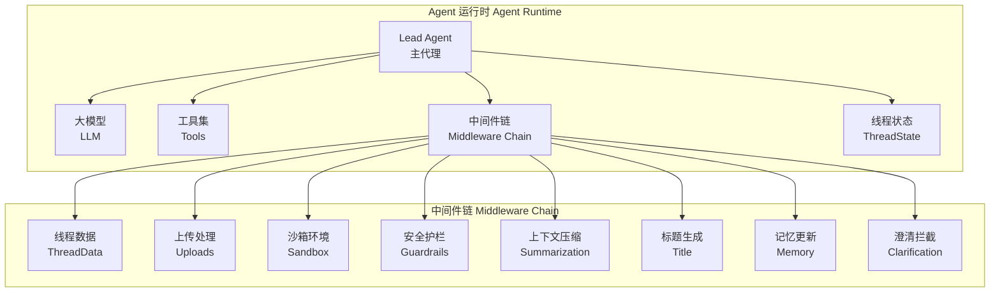
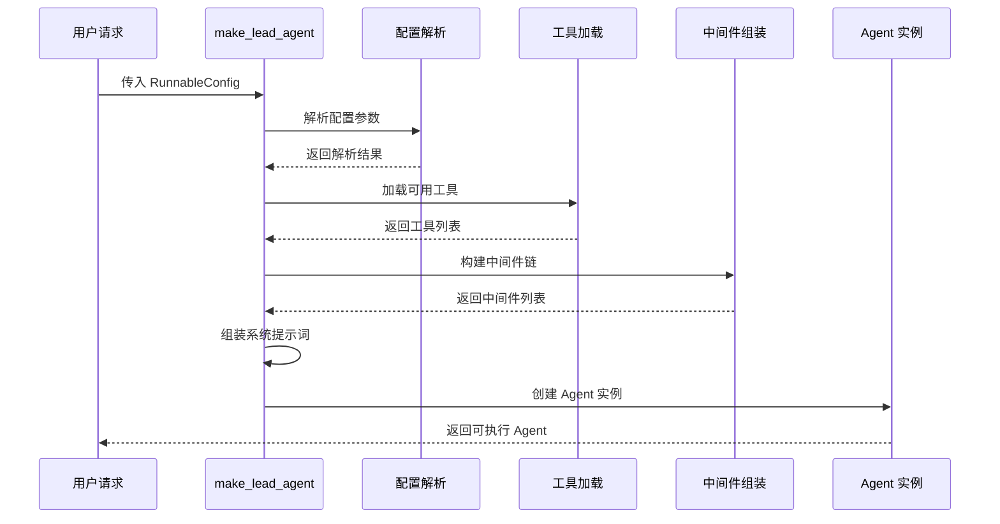
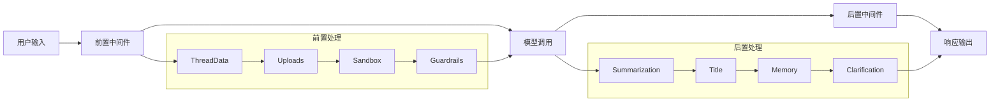
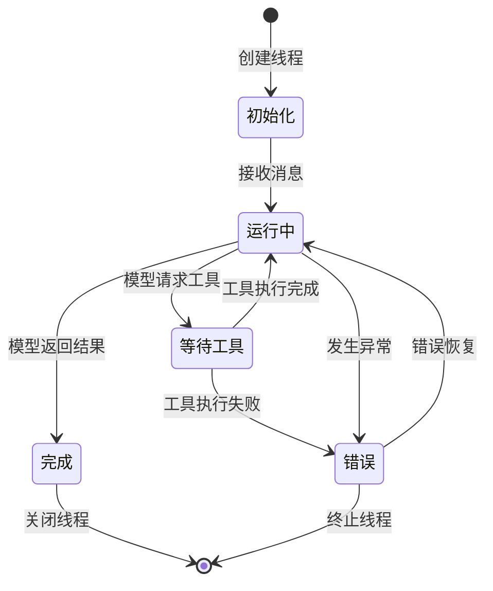
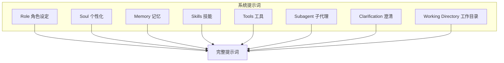
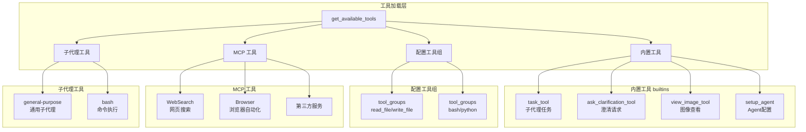
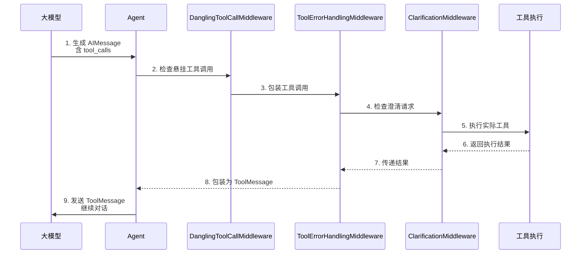
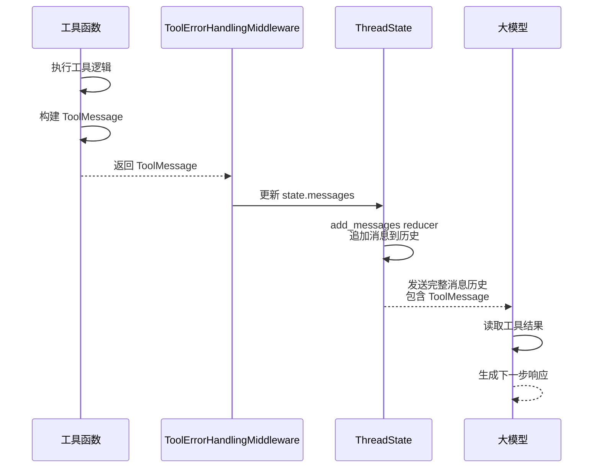
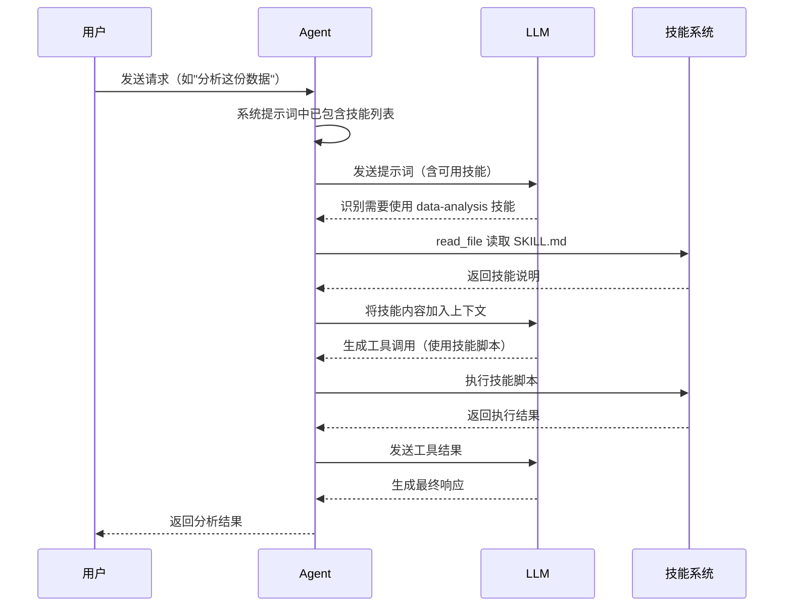

# 04-Agent 核心机制


## 目录

- [一、Agent 架构概述](#一agent-架构概述)
- [二、Agent 创建流程](#二agent-创建流程)
- [三、中间件链机制](#三中间件链机制)
- [四、状态管理](#四状态管理)
- [五、提示词组装](#五提示词组装)
- [六、工具集成](#六工具集成)


## 一、Agent 架构概述

### 1.1 Lead Agent 定位

**Lead Agent** 是 EvoFlow 的核心 Agent，负责接收用户请求并协调工具执行。



### 1.2 核心职责

| 职责 | 说明 |
|------|------|
| **请求处理** | 接收用户输入，组装上下文 |
| **模型调用** | 与 LLM 交互，获取响应 |
| **工具协调** | 解析工具调用，执行并返回结果 |
| **状态维护** | 管理对话状态和历史 |
| **中间件执行** | 按顺序执行前置/后置处理 |


## 二、Agent 创建流程

### 2.1 创建流程图



### 2.2 核心创建函数

**`make_lead_agent` 函数**（`backend/packages/harness/evoflow/agents/lead_agent/agent.py#L273-L348`）

Agent 的入口工厂函数，负责组装模型、工具、中间件链。

| 配置参数 | 类型 | 默认值 | 说明 |
|----------|------|--------|------|
| `thinking_enabled` | `bool` | `True` | 是否启用思考模式 |
| `reasoning_effort` | `str \| None` | `None` | 推理努力程度 |
| `model_name` | `str \| None` | `None` | 模型名称 |
| `is_plan_mode` | `bool` | `False` | 是否计划模式 |
| `subagent_enabled` | `bool` | `False` | 是否启用子代理 |
| `max_concurrent_subagents` | `int` | `3` | 最大并发子代理数 |
| `agent_name` | `str \| None` | `None` | Agent 名称 |
| `is_bootstrap` | `bool` | `False` | 是否为引导模式 |

```python
def make_lead_agent(config: RunnableConfig):
    """
    创建 Lead Agent 实例
    Lead Agent 是系统的核心 Agent，负责协调工具执行和状态管理
    """
    from evoflow.tools import get_available_tools
    from evoflow.tools.builtins import setup_agent

    # 步骤 1: 从配置中提取参数
    cfg = config.get("configurable", {})
    thinking_enabled = cfg.get("thinking_enabled", True)
    reasoning_effort = cfg.get("reasoning_effort", None)
    requested_model_name = cfg.get("model_name") or cfg.get("model")
    is_plan_mode = cfg.get("is_plan_mode", False)
    subagent_enabled = cfg.get("subagent_enabled", False)
    max_concurrent_subagents = cfg.get("max_concurrent_subagents", 3)
    is_bootstrap = cfg.get("is_bootstrap", False)
    agent_name = cfg.get("agent_name")

    # 步骤 2: 加载 Agent 配置并解析模型名称
    agent_config = load_agent_config(agent_name) if not is_bootstrap else None
    agent_model_name = agent_config.model if agent_config and agent_config.model else _resolve_model_name()
    
    # 优先级: 请求指定 > Agent 配置 > 全局默认
    model_name = requested_model_name or agent_model_name

    # 步骤 3: 检查模型配置
    app_config = get_app_config()
    model_config = app_config.get_model_config(model_name) if model_name else None
    if model_config is None:
        raise ValueError("No chat model could be resolved...")
    
    # 检查思考模式支持
    if thinking_enabled and not model_config.supports_thinking:
        logger.warning(f"Model '{model_name}' does not support thinking mode")
        thinking_enabled = False

    # 步骤 4: 注入运行元数据（用于 LangSmith 追踪）
    if "metadata" not in config:
        config["metadata"] = {}
    config["metadata"].update({
        "agent_name": agent_name or "default",
        "model_name": model_name or "default",
        "thinking_enabled": thinking_enabled,
        "is_plan_mode": is_plan_mode,
        "subagent_enabled": subagent_enabled,
    })

    # 步骤 5: 创建 Agent 实例
    if is_bootstrap:
        # 引导模式：最小化配置，用于初始化自定义 Agent
        return create_agent(
            model=create_chat_model(name=model_name, thinking_enabled=thinking_enabled),
            tools=get_available_tools(model_name=model_name, subagent_enabled=subagent_enabled) + [setup_agent],
            middleware=_build_middlewares(config, model_name=model_name),
            system_prompt=apply_prompt_template(subagent_enabled=subagent_enabled, max_concurrent_subagents=max_concurrent_subagents, available_skills=set(["bootstrap"])),
            state_schema=ThreadState,
        )

    # 标准 Lead Agent
    return create_agent(
        model=create_chat_model(name=model_name, thinking_enabled=thinking_enabled, reasoning_effort=reasoning_effort),
        tools=get_available_tools(model_name=model_name, groups=agent_config.tool_groups if agent_config else None, subagent_enabled=subagent_enabled),
        middleware=_build_middlewares(config, model_name=model_name, agent_name=agent_name),
        system_prompt=apply_prompt_template(subagent_enabled=subagent_enabled, max_concurrent_subagents=max_concurrent_subagents, agent_name=agent_name),
        state_schema=ThreadState,
    )
```


## 三、中间件链机制

### 3.1 中间件架构

中间件是 Agent 的**拦截器机制**，在请求处理的不同阶段插入逻辑。



### 3.2 中间件链构建

**`_build_middlewares` 函数**（`backend/packages/harness/evoflow/agents/lead_agent/agent.py#L208-L270`）

按特定顺序组装中间件链。

```python
def _build_middlewares(config: RunnableConfig, model_name: str | None, agent_name: str | None = None, custom_middlewares: list[AgentMiddleware] | None = None):
    """
    构建中间件链
    
    中间件执行顺序至关重要，每个中间件都有特定的职责和依赖关系
    """
    # 步骤 1: 加载运行时中间件（DanglingToolCall, ToolErrorHandling 等）
    middlewares = build_lead_runtime_middlewares(lazy_init=True)

    # 步骤 2: 添加上下文压缩中间件（尽早减少上下文长度）
    summarization_middleware = _create_summarization_middleware()
    if summarization_middleware is not None:
        middlewares.append(summarization_middleware)

    # 步骤 3: 添加计划模式中间件（如启用）
    is_plan_mode = config.get("configurable", {}).get("is_plan_mode", False)
    todo_list_middleware = _create_todo_list_middleware(is_plan_mode)
    if todo_list_middleware is not None:
        middlewares.append(todo_list_middleware)

    # 步骤 4: 添加 Token 使用追踪
    if get_app_config().token_usage.enabled:
        middlewares.append(TokenUsageMiddleware())

    # 步骤 5: 添加标题生成（在第一轮对话后生成标题）
    middlewares.append(TitleMiddleware())

    # 步骤 6: 添加记忆更新（在标题生成之后）
    middlewares.append(MemoryMiddleware(agent_name=agent_name))

    # 步骤 7: 添加图像查看（如模型支持视觉）
    model_config = app_config.get_model_config(model_name) if model_name else None
    if model_config is not None and model_config.supports_vision:
        middlewares.append(ViewImageMiddleware())

    # 步骤 8: 添加延迟工具过滤（如启用工具搜索）
    if app_config.tool_search.enabled:
        middlewares.append(DeferredToolFilterMiddleware())

    # 步骤 9: 添加子代理限制（如启用子代理）
    subagent_enabled = config.get("configurable", {}).get("subagent_enabled", False)
    if subagent_enabled:
        max_concurrent = config.get("configurable", {}).get("max_concurrent_subagents", 3)
        middlewares.append(SubagentLimitMiddleware(max_concurrent=max_concurrent))

    # 步骤 10: 添加循环检测
    middlewares.append(LoopDetectionMiddleware())

    # 步骤 11: 注入自定义中间件
    if custom_middlewares:
        middlewares.extend(custom_middlewares)

    # 步骤 12: 澄清中间件必须最后（拦截澄清请求）
    middlewares.append(ClarificationMiddleware())
    return middlewares
```

### 3.3 中间件执行顺序说明

| 顺序 | 中间件 | 阶段 | 职责 |
|------|--------|------|------|
| 1 | DanglingToolCallMiddleware | 前置 | 修复缺失的工具消息 |
| 2 | ToolErrorHandlingMiddleware | 前置 | 转换工具异常为消息 |
| 3 | SummarizationMiddleware | 前置 | 上下文压缩 |
| 4 | TodoMiddleware | 前置 | 计划模式管理 |
| 5 | TokenUsageMiddleware | 后置 | Token 使用追踪 |
| 6 | TitleMiddleware | 后置 | 生成对话标题 |
| 7 | MemoryMiddleware | 后置 | 更新记忆 |
| 8 | ViewImageMiddleware | 前置 | 注入图像详情 |
| 9 | DeferredToolFilterMiddleware | 前置 | 隐藏延迟工具 |
| 10 | SubagentLimitMiddleware | 后置 | 限制并发子代理 |
| 11 | LoopDetectionMiddleware | 后置 | 检测循环调用 |
| 12 | ClarificationMiddleware | 后置 | 拦截澄清请求 |


## 四、状态管理

### 4.1 ThreadState 状态机

**`ThreadState`** 是 Agent 的状态载体，维护对话的完整上下文。



### 4.2 状态流转

Agent 通过状态机管理对话生命周期：

1. **初始化** - 创建 ThreadState，加载历史消息
2. **运行中** - 接收用户输入，调用模型
3. **等待工具** - 模型请求工具调用
4. **完成** - 模型返回最终结果
5. **错误** - 处理异常情况


## 五、提示词组装

### 5.1 系统提示词结构

系统提示词由多个区块组装而成：



### 5.2 提示词组装函数

**`apply_prompt_template` 函数**（`backend/packages/harness/evoflow/agents/lead_agent/prompt.py#L480-L528`）

组装完整的系统提示词。

| 参数 | 类型 | 默认值 | 说明 |
|------|------|--------|------|
| `subagent_enabled` | `bool` | `False` | 是否启用子代理 |
| `max_concurrent_subagents` | `int` | `3` | 最大并发子代理数 |
| `agent_name` | `str \| None` | `None` | Agent 名称 |
| `available_skills` | `set[str] \| None` | `None` | 可用技能集合 |

```python
def apply_prompt_template(
    subagent_enabled: bool = False,
    max_concurrent_subagents: int = 3,
    *,
    agent_name: str | None = None,
    available_skills: set[str] | None = None
) -> str:
    """
    应用提示词模板，组装完整的系统提示词
    
    将各个区块（角色、记忆、技能、工具等）组合成最终提示词
    """
    # 步骤 1: 获取记忆上下文
    memory_context = _get_memory_context(agent_name)

    # 步骤 2: 构建子代理区块（如启用）
    subagent_section = _build_subagent_section(max_concurrent_subagents) if subagent_enabled else ""
    
    # 步骤 3: 构建技能区块
    skills_section = get_skills_prompt_section(available_skills)
    
    # 步骤 4: 构建延迟工具区块
    deferred_tools_section = get_deferred_tools_prompt_section()
    
    # 步骤 5: 构建 ACP Agent 区块
    acp_section = _build_acp_section()

    # 步骤 6: 格式化最终提示词
    prompt = SYSTEM_PROMPT_TEMPLATE.format(
        agent_name=agent_name or "EvoFlow 2.0",
        soul=get_agent_soul(agent_name),
        skills_section=skills_section,
        deferred_tools_section=deferred_tools_section,
        memory_context=memory_context,
        subagent_section=subagent_section,
        subagent_reminder=subagent_reminder,
        subagent_thinking=subagent_thinking,
        acp_section=acp_section,
    )

    return prompt + f"\n<current_date>{datetime.now().strftime('%Y-%m-%d, %A')}</current_date>"
```

### 5.3 完整提示词示例

以下是实际发送给模型的完整系统提示词（`backend/packages/harness/evoflow/agents/lead_agent/prompt.py#L162-L348`）：

```xml
<role>
You are EvoFlow 2.0, an open-source super agent.
</role>

<soul>
[SOUL.md 内容，定义 Agent 的个性和价值观]
</soul>

<memory>
[记忆上下文，包含用户偏好和历史信息]
</memory>

<thinking_style>
- Think concisely and strategically about the user's request BEFORE taking action
- Break down the task: What is clear? What is ambiguous? What is missing?
- **PRIORITY CHECK: If anything is unclear, missing, or has multiple interpretations, you MUST ask for clarification FIRST - do NOT proceed with work**
- Never write down your full final answer or report in thinking process, but only outline
- CRITICAL: After thinking, you MUST provide your actual response to the user. Thinking is for planning, the response is for delivery.
- Your response must contain the actual answer, not just a reference to what you thought about
</thinking_style>

<clarification_system>
**WORKFLOW PRIORITY: CLARIFY → PLAN → ACT**
1. **FIRST**: Analyze the request in your thinking - identify what's unclear, missing, or ambiguous
2. **SECOND**: If clarification is needed, call `ask_clarification` tool IMMEDIATELY - do NOT start working
3. **THIRD**: Only after all clarifications are resolved, proceed with planning and execution

**MANDATORY Clarification Scenarios:**
1. **Missing Information**: Required details not provided
2. **Ambiguous Requirements**: Multiple valid interpretations exist
3. **Approach Choices**: Several valid approaches exist
4. **Risky Operations**: Destructive actions need confirmation
5. **Suggestions**: You have a recommendation but want approval

**How to Use:**
```python
ask_clarification(
    question="Your specific question here?",
    clarification_type="missing_info",
    context="Why you need this information",
    options=["option1", "option2"]
)
    
</clarification_system>

<skill_system>
You have access to skills that provide optimized workflows for specific tasks.

**Progressive Loading Pattern:**

1. When a user query matches a skill's use case, immediately call `read_file` on the skill's main file
2. Read and understand the skill's workflow and instructions
3. Load referenced resources only when needed during execution

<available_skills>
    <skill>
        <name>data-analysis</name>
        <description>提供数据分析能力，支持 CSV、Excel 等格式</description>
        <location>/mnt/skills/public/data-analysis/SKILL.md</location>
    </skill>
    <skill>
        <name>chart-visualization</name>
        <description>生成各类图表和可视化</description>
        <location>/mnt/skills/public/chart-visualization/SKILL.md</location>
    </skill>
</available_skills>
</skill_system>

<subagent_system>
**SUBAGENT MODE ACTIVE - DECOMPOSE, DELEGATE, SYNTHESIZE**

You are running with subagent capabilities enabled. Your role is to be a **task orchestrator**:

1. **DECOMPOSE**: Break complex tasks into parallel sub-tasks
2. **DELEGATE**: Launch multiple subagents simultaneously using parallel `task` calls
3. **SYNTHESIZE**: Collect and integrate results into a coherent answer

**HARD CONCURRENCY LIMIT: MAXIMUM 3 `task` CALLS PER RESPONSE**

**Available Subagents:**

- **general-purpose**: For ANY non-trivial task - web research, code exploration, file operations, analysis, etc.
- **bash**: For command execution (git, build, test, deploy operations)
  </subagent_system>

<working_directory existed="true">

- User uploads: `/mnt/user-data/uploads` - Files uploaded by the user
- User workspace: `/mnt/user-data/workspace` - Working directory for temporary files
- Output files: `/mnt/user-data/outputs` - Final deliverables must be saved here

**File Management:**

- Uploaded files are automatically listed in the <uploaded_files> section
- Use `read_file` tool to read uploaded files
- All temporary work happens in `/mnt/user-data/workspace`
- Final deliverables must be copied to `/mnt/user-data/outputs`
  </working_directory>

<response_style>

- Clear and Concise: Avoid over-formatting unless requested
- Natural Tone: Use paragraphs and prose, not bullet points by default
- Action-Oriented: Focus on delivering results, not explaining processes
  </response_style>

<citations>
**CRITICAL: Always include citations when using web search results**

- Use Markdown link format `[citation:TITLE](URL)` immediately after the claim
- Collect all citations in a "Sources" section at the end of reports
  </citations>

<critical_reminders>

- **Clarification First**: ALWAYS clarify unclear/missing/ambiguous requirements BEFORE starting work
- **Skill First**: Always load the relevant skill before starting **complex** tasks
- **Progressive Loading**: Load resources incrementally as referenced in skills
- **Output Files**: Final deliverables must be in `/mnt/user-data/outputs`
- **Language Consistency**: Keep using the same language as user's
- **Always Respond**: Your thinking is internal. You MUST always provide a visible response
  </critical_reminders>

<current_date>2026-03-30, Monday</current_date>
```

## 六、工具集成

### 6.1 工具加载流程

#### 6.1.1 工具加载架构

EvoFlow 的工具系统采用**分层加载架构**，从多个来源聚合工具：



#### 6.1.2 工具加载代码详解

**`get_available_tools` 函数**（`backend/packages/harness/evoflow/tools/tools.py#L1-L100`）

```python
def get_available_tools(
    model_name: str | None = None,
    groups: list[str] | None = None,
    subagent_enabled: bool = False,
) -> list[BaseTool]:
    """获取可用工具列表
    
    从多个来源聚合工具：
    1. 内置工具（始终加载）
    2. 配置工具组（根据 groups 参数）
    3. MCP 工具（根据配置）
    4. 子代理工具（根据 subagent_enabled）
    
    Args:
        model_name: 模型名称，用于模型特定的工具过滤
        groups: 工具组列表，如 ["read", "write", "bash"]
        subagent_enabled: 是否启用子代理工具
    
    Returns:
        可用工具列表（BaseTool 实例列表）
    """
    tools: list[BaseTool] = []
    
    # 步骤 1: 加载内置工具
    tools.extend(_load_builtin_tools())
    
    # 步骤 2: 加载配置工具组
    if groups:
        tools.extend(_load_config_tool_groups(groups))
    else:
        # 默认加载所有配置的工具
        tools.extend(_load_default_tools())
    
    # 步骤 3: 加载 MCP 工具
    mcp_tools = _load_mcp_tools()
    if mcp_tools:
        tools.extend(mcp_tools)
    
    # 步骤 4: 加载子代理工具（如启用）
    if subagent_enabled:
        tools.append(task_tool)
    
    return tools
```

**内置工具加载**（`backend/packages/harness/evoflow/tools/builtins/__init__.py#L1-L14`）

```python
from .clarification_tool import ask_clarification_tool
from .setup_agent_tool import setup_agent
from .task_tool import task_tool
from .view_image_tool import view_image_tool

__all__ = [
    "setup_agent",           # Agent 配置工具
    "ask_clarification_tool", # 澄清请求工具
    "view_image_tool",       # 图像查看工具
    "task_tool",             # 子代理任务工具
]
```

#### 6.1.3 工具注册到 Agent

工具在 Agent 创建时通过 `create_agent` 函数绑定：

```python
# backend/packages/harness/evoflow/agents/lead_agent/agent.py#L342-L348
def make_lead_agent(config: RunnableConfig):
    # ... 配置解析 ...
    
    return create_agent(
        model=create_chat_model(name=model_name, thinking_enabled=thinking_enabled),
        tools=get_available_tools(
            model_name=model_name, 
            groups=agent_config.tool_groups if agent_config else None, 
            subagent_enabled=subagent_enabled
        ),
        middleware=_build_middlewares(config, model_name=model_name, agent_name=agent_name),
        system_prompt=apply_prompt_template(...),
        state_schema=ThreadState,
    )
```

### 6.2 工具 Schema 与模型绑定

#### 6.2.1 工具 Schema 结构

工具通过 **OpenAI Function Calling 格式**向模型描述自己的能力：

```json
{
    "type": "function",
    "function": {
        "name": "read_file",
        "description": "Read the contents of a file at the specified path.",
        "parameters": {
            "type": "object",
            "properties": {
                "file_path": {
                    "type": "string",
                    "description": "The path to the file to read"
                },
                "offset": {
                    "type": "integer",
                    "description": "Line number to start reading from",
                    "default": 1
                },
                "limit": {
                    "type": "integer",
                    "description": "Maximum number of lines to read",
                    "default": null
                }
            },
            "required": ["file_path"]
        }
    }
}
```

**实际发送给模型的工具列表 JSON 示例**：

```json
{
    "tools": [
        {
            "type": "function",
            "function": {
                "name": "read_file",
                "description": "Read the contents of a file at the specified path.",
                "parameters": {
                    "type": "object",
                    "properties": {
                        "file_path": {"type": "string"},
                        "offset": {"type": "integer"},
                        "limit": {"type": "integer"}
                    },
                    "required": ["file_path"]
                }
            }
        },
        {
            "type": "function",
            "function": {
                "name": "write_file",
                "description": "Write content to a file at the specified path.",
                "parameters": {
                    "type": "object",
                    "properties": {
                        "file_path": {"type": "string"},
                        "content": {"type": "string"}
                    },
                    "required": ["file_path", "content"]
                }
            }
        },
        {
            "type": "function",
            "function": {
                "name": "bash",
                "description": "Execute a bash command in the sandbox.",
                "parameters": {
                    "type": "object",
                    "properties": {
                        "command": {"type": "string"},
                        "timeout": {"type": "integer", "default": 60}
                    },
                    "required": ["command"]
                }
            }
        }
    ]
}
```

#### 6.2.2 LangChain 工具装饰器

工具使用 `@tool` 装饰器定义，自动提取 Schema：

```python
# backend/packages/harness/evoflow/tools/builtins/clarification_tool.py#L6-L56
from langchain.tools import tool
from typing import Literal

@tool("ask_clarification", parse_docstring=True, return_direct=True)
def ask_clarification_tool(
    question: str,
    clarification_type: Literal[
        "missing_info",
        "ambiguous_requirement", 
        "approach_choice",
        "risk_confirmation",
        "suggestion",
    ],
    context: str | None = None,
    options: list[str] | None = None,
) -> str:
    """Ask the user for clarification when you need more information to proceed.
    
    Use this tool when you encounter situations where you cannot proceed without user input:
    - **Missing information**: Required details not provided
    - **Ambiguous requirements**: Multiple valid interpretations exist
    - **Approach choices**: Several valid approaches exist and you need user preference
    - **Risky operations**: Destructive actions that need explicit confirmation
    - **Suggestions**: You have a recommendation but want user approval
    
    Args:
        question: The clarification question to ask the user. Be specific and clear.
        clarification_type: The type of clarification needed.
        context: Optional context explaining why clarification is needed.
        options: Optional list of choices for the user to choose from.
    """
    # 实际逻辑由 ClarificationMiddleware 拦截处理
    return "Clarification request processed by middleware"
```

**关键参数说明**：

| 参数 | 说明 |
|------|------|
| `parse_docstring=True` | 自动从 docstring 提取参数描述 |
| `return_direct=True` | 工具结果直接返回，不经过 LLM 处理 |

### 6.3 模型调用工具流程

#### 6.3.1 工具调用生命周期



#### 6.3.2 模型生成的工具调用格式

当模型决定调用工具时，生成如下结构：

**模型请求（AIMessage）**：

```json
{
    "role": "assistant",
    "content": null,
    "tool_calls": [
        {
            "id": "call_abc123xyz789",
            "type": "function",
            "function": {
                "name": "read_file",
                "arguments": "{\"file_path\": \"/mnt/user-data/uploads/data.csv\", \"limit\": 50}"
            }
        }
    ]
}
```

**多工具调用示例**：

```json
{
    "role": "assistant",
    "content": null,
    "tool_calls": [
        {
            "id": "call_abc123xyz789",
            "type": "function",
            "function": {
                "name": "read_file",
                "arguments": "{\"file_path\": \"/mnt/user-data/uploads/data.csv\"}"
            }
        },
        {
            "id": "call_def456uvw012",
            "type": "function",
            "function": {
                "name": "bash",
                "arguments": "{\"command\": \"ls -la /mnt/user-data/uploads/\"}"
            }
        }
    ]
}
```

**Python 对象表示**：

```python
# AIMessage 中的 tool_calls 字段
{
    "content": "",  # 通常为空，因为是工具调用
    "tool_calls": [
        {
            "id": "call_abc123xyz",  # 唯一调用 ID
            "type": "function",
            "function": {
                "name": "read_file",  # 工具名称
                "arguments": '{"file_path": "/mnt/user-data/uploads/data.csv"}'  # JSON 参数
            }
        }
    ]
}
```

#### 6.3.3 ToolCallRequest 结构

工具调用请求在中间件中传递：

```python
# LangGraph ToolCallRequest 结构
class ToolCallRequest:
    tool_call: dict = {
        "id": "call_abc123xyz",      # 调用 ID
        "name": "read_file",          # 工具名称
        "args": {                     # 解析后的参数
            "file_path": "/mnt/user-data/uploads/data.csv",
            "offset": 1,
            "limit": 50
        }
    }
```

### 6.4 工具执行机制

#### 6.4.1 工具执行中间件链

**`ToolErrorHandlingMiddleware`**（`backend/packages/harness/evoflow/agents/middlewares/tool_error_handling_middleware.py#L19-L66`）

```python
class ToolErrorHandlingMiddleware(AgentMiddleware[AgentState]):
    """Convert tool exceptions into error ToolMessages so the run can continue."""

    def _build_error_message(self, request: ToolCallRequest, exc: Exception) -> ToolMessage:
        """构建错误消息"""
        tool_name = str(request.tool_call.get("name") or "unknown_tool")
        tool_call_id = str(request.tool_call.get("id") or "missing_tool_call_id")
        detail = str(exc).strip() or exc.__class__.__name__
        if len(detail) > 500:
            detail = detail[:497] + "..."

        content = f"Error: Tool '{tool_name}' failed with {exc.__class__.__name__}: {detail}. Continue with available context, or choose an alternative tool."
        return ToolMessage(
            content=content,
            tool_call_id=tool_call_id,
            name=tool_name,
            status="error",  # 标记为错误状态
        )

    @override
    def wrap_tool_call(
        self,
        request: ToolCallRequest,
        handler: Callable[[ToolCallRequest], ToolMessage | Command],
    ) -> ToolMessage | Command:
        """同步工具调用包装器 - 捕获异常并转换为错误消息"""
        try:
            # 执行实际的工具调用 handler
            return handler(request)
        except GraphBubbleUp:
            # 保留 LangGraph 控制流信号（中断/暂停/恢复）
            raise
        except Exception as exc:
            # 工具执行失败，记录日志并返回错误消息
            logger.exception("Tool execution failed (sync): name=%s id=%s", 
                           request.tool_call.get("name"), 
                           request.tool_call.get("id"))
            return self._build_error_message(request, exc)

    @override
    async def awrap_tool_call(
        self,
        request: ToolCallRequest,
        handler: Callable[[ToolCallRequest], Awaitable[ToolMessage | Command]],
    ) -> ToolMessage | Command:
        """异步工具调用包装器"""
        try:
            return await handler(request)
        except GraphBubbleUp:
            raise
        except Exception as exc:
            logger.exception("Tool execution failed (async): name=%s id=%s",
                           request.tool_call.get("name"),
                           request.tool_call.get("id"))
            return self._build_error_message(request, exc)
```

#### 6.4.2 工具执行状态

工具执行有三种状态：

| 状态 | 说明 | 处理方式 |
|------|------|----------|
| **success** | 执行成功 | 正常返回 ToolMessage |
| **error** | 执行失败 | 返回错误 ToolMessage，Agent 可继续 |
| **interrupted** | 被中断 | 通过 GraphBubbleUp 传递中断信号 |

#### 6.4.3 澄清工具特殊处理

**`ClarificationMiddleware`**（`backend/packages/harness/evoflow/agents/middlewares/clarification_middleware.py#L23-L177`）

```python
class ClarificationMiddleware(AgentMiddleware[ClarificationMiddlewareState]):
    """Intercepts clarification tool calls and interrupts execution."""

    def _handle_clarification(self, request: ToolCallRequest) -> Command:
        """处理澄清请求并中断执行"""
        # 提取澄清参数
        args = request.tool_call.get("args", {})
        question = args.get("question", "")
        clarification_type = args.get("clarification_type", "missing_info")
        context = args.get("context")
        options = args.get("options", [])

        # 格式化用户友好的消息
        formatted_message = self._format_clarification_message(args)
        tool_call_id = request.tool_call.get("id", "")

        # 创建 ToolMessage
        tool_message = ToolMessage(
            content=formatted_message,
            tool_call_id=tool_call_id,
            name="ask_clarification",
        )

        # 返回 Command 中断执行并跳转到 END
        return Command(
            update={"messages": [tool_message]},
            goto=END,  # 中断执行，等待用户响应
        )

    @override
    def wrap_tool_call(
        self,
        request: ToolCallRequest,
        handler: Callable[[ToolCallRequest], ToolMessage | Command],
    ) -> ToolMessage | Command:
        """拦截 ask_clarification 工具调用"""
        # 检查是否是澄清工具调用
        if request.tool_call.get("name") != "ask_clarification":
            # 不是澄清调用，正常执行
            return handler(request)

        # 是澄清调用，拦截并中断执行
        return self._handle_clarification(request)
```

### 6.5 工具执行结果返回模型

#### 6.5.1 ToolMessage 结构

工具执行完成后，结果通过 **`ToolMessage`** 返回给模型：

**ToolMessage JSON 格式**：

```json
{
    "role": "tool",
    "tool_call_id": "call_abc123xyz789",
    "name": "read_file",
    "content": "name,age,city\nAlice,30,Beijing\nBob,25,Shanghai\nCharlie,35,Shenzhen"
}
```

**Python 对象表示**：

```python
# LangChain ToolMessage 结构
from langchain_core.messages import ToolMessage

tool_message = ToolMessage(
    content="文件内容...",      # 工具执行结果（字符串）
    tool_call_id="call_abc123", # 对应工具调用的 ID（必须匹配）
    name="read_file",           # 工具名称
    status="success",           # 执行状态：success/error
)
```

**关键字段说明**：

| 字段 | 类型 | 说明 |
|------|------|------|
| `content` | `str` | 工具执行结果内容 |
| `tool_call_id` | `str` | 必须匹配 AIMessage 中的 tool_call.id |
| `name` | `str` | 工具名称 |
| `status` | `str` | 执行状态："success" 或 "error" |

#### 6.5.2 工具结果返回流程



#### 6.5.3 工具函数返回类型

工具函数可以返回两种类型：

**1. 直接返回字符串（简单工具）**

```python
@tool("read_file")
def read_file(file_path: str) -> str:
    """读取文件内容"""
    with open(file_path, 'r') as f:
        content = f.read()
    return content  # 自动包装为 ToolMessage
```

**2. 返回 Command（需要更新状态）**

```python
from langgraph.types import Command
from langchain_core.messages import ToolMessage

@tool("example_stateful_tool")
def example_stateful_tool(
    runtime: ToolRuntime,
    items: list[str],
    tool_call_id: Annotated[str, InjectedToolCallId],
) -> Command:
    """示例：同时更新 state 与 messages"""
    # 处理业务逻辑...
    
    # 返回 Command 同时更新多个状态字段
    return Command(
        update={
            "artifacts": normalized_items,  # 更新 artifacts 列表
            "messages": [                   # 添加 ToolMessage
                ToolMessage(
                    content="Successfully updated state",
                    tool_call_id=tool_call_id,
                )
            ],
        },
    )
```

#### 6.5.4 ThreadState 消息管理

**`ThreadState`** 使用 `add_messages` reducer 自动管理消息历史：

```python
# backend/packages/harness/evoflow/agents/thread_state.py#L48-L56
from typing import Annotated, NotRequired
from langchain.agents import AgentState

class ThreadState(AgentState):
    """Agent 状态定义"""
    # AgentState 内置 messages 字段，使用 add_messages reducer
    # messages: Annotated[list[AnyMessage], add_messages]
    
    sandbox: NotRequired[SandboxState | None]
    thread_data: NotRequired[ThreadDataState | None]
    title: NotRequired[str | None]
    artifacts: Annotated[list[str], merge_artifacts]  # 自定义 reducer
    todos: NotRequired[list | None]
    uploaded_files: NotRequired[list[dict] | None]
    viewed_images: Annotated[dict[str, ViewedImageData], merge_viewed_images]
```

**`add_messages` reducer 行为**：

```python
# 伪代码说明 add_messages 工作原理
def add_messages(existing: list, new: list) -> list:
    """合并消息列表，自动去重（基于消息 ID）"""
    result = list(existing)  # 复制现有消息
    for msg in new:
        # 检查是否已存在（通过消息 ID）
        if not any(m.id == msg.id for m in result):
            result.append(msg)
    return result
```

#### 6.5.5 完整工具执行返回示例

**read_file 工具执行流程**：

**步骤 1: 模型生成工具调用请求（JSON）**

```json
{
    "role": "assistant",
    "content": null,
    "tool_calls": [
        {
            "id": "call_abc123xyz789",
            "type": "function",
            "function": {
                "name": "read_file",
                "arguments": "{\"file_path\": \"/mnt/user-data/uploads/data.csv\"}"
            }
        }
    ]
}
```

**步骤 2: 工具执行**

```python
# read_file 函数读取文件内容
file_content = "name,age\nAlice,30\nBob,25"
```

**步骤 3: 构建 ToolMessage（JSON）**

```json
{
    "role": "tool",
    "tool_call_id": "call_abc123xyz789",
    "name": "read_file",
    "content": "name,age\nAlice,30\nBob,25"
}
```

**步骤 4: 更新 ThreadState（Python）**

```python
# 通过 add_messages reducer 自动追加到消息历史
state["messages"].append(tool_message)
```

**步骤 5: 发送给模型的完整消息历史（JSON）**

```json
{
    "messages": [
        {
            "role": "system",
            "content": "你是一个数据分析助手..."
        },
        {
            "role": "user",
            "content": "请分析 /mnt/user-data/uploads/data.csv 文件"
        },
        {
            "role": "assistant",
            "content": null,
            "tool_calls": [
                {
                    "id": "call_abc123xyz789",
                    "type": "function",
                    "function": {
                        "name": "read_file",
                        "arguments": "{\"file_path\": \"/mnt/user-data/uploads/data.csv\"}"
                    }
                }
            ]
        },
        {
            "role": "tool",
            "tool_call_id": "call_abc123xyz789",
            "name": "read_file",
            "content": "name,age\nAlice,30\nBob,25"
        }
    ]
}
```

**步骤 6: 模型读取结果并生成响应（JSON）**

```json
{
    "role": "assistant",
    "content": "根据文件内容分析，这是一个包含姓名和年龄的简单数据集，共有3条记录：\n\n1. Alice，30岁\n2. Bob，25岁\n3. Charlie，35岁\n\n平均年龄为30岁。"
}
```

#### 6.5.6 工具错误处理返回

当工具执行失败时，返回错误状态的 ToolMessage：

**错误 ToolMessage JSON 示例**：

```json
{
    "role": "tool",
    "tool_call_id": "call_abc123xyz789",
    "name": "read_file",
    "content": "Error: Tool 'read_file' failed with FileNotFoundError: [Errno 2] No such file or directory: '/mnt/user-data/uploads/data.csv'. Continue with available context, or choose an alternative tool.",
    "status": "error"
}
```

**Python 实现**：

```python
# ToolErrorHandlingMiddleware._build_error_message
def _build_error_message(self, request: ToolCallRequest, exc: Exception) -> ToolMessage:
    tool_name = str(request.tool_call.get("name") or "unknown_tool")
    tool_call_id = str(request.tool_call.get("id") or "missing_tool_call_id")
    detail = str(exc).strip() or exc.__class__.__name__
    
    # 截断过长的错误信息
    if len(detail) > 500:
        detail = detail[:497] + "..."

    return ToolMessage(
        content=f"Error: Tool '{tool_name}' failed with {exc.__class__.__name__}: {detail}. "
                f"Continue with available context, or choose an alternative tool.",
        tool_call_id=tool_call_id,
        name=tool_name,
        status="error",  # 标记为错误状态
    )
```

**模型收到错误后的响应示例**：

```json
{
    "role": "assistant",
    "content": "抱歉，无法读取文件 '/mnt/user-data/uploads/data.csv'，文件不存在。请确认文件路径是否正确，或上传文件后再试。",
    "tool_calls": [
        {
            "id": "call_def456uvw012",
            "type": "function",
            "function": {
                "name": "bash",
                "arguments": "{\"command\": \"ls -la /mnt/user-data/uploads/\"}"
            }
        }
    ]
}
```

模型收到错误 ToolMessage 后，可以：
1. 使用其他工具重试（如上面示例使用 bash 列出目录）
2. 向用户报告错误
3. 使用可用上下文继续

### 6.6 工具中间状态

#### 6.6.1 悬挂工具调用修复

**`DanglingToolCallMiddleware`**（`backend/packages/harness/evoflow/agents/middlewares/dangling_tool_call_middleware.py#L28-L111`）

处理因用户中断或请求取消导致的"悬挂"工具调用：

```python
class DanglingToolCallMiddleware(AgentMiddleware[AgentState]):
    """修复消息历史中的悬挂工具调用
    
    悬挂工具调用：AIMessage 包含 tool_calls，但没有对应的 ToolMessage
    这会导致 LLM 错误，因为消息格式不完整
    """

    def _build_patched_messages(self, messages: list) -> list | None:
        """在正确位置插入占位 ToolMessage"""
        # 收集所有已存在的 ToolMessage ID
        existing_tool_msg_ids: set[str] = set()
        for msg in messages:
            if isinstance(msg, ToolMessage):
                existing_tool_msg_ids.add(msg.tool_call_id)

        # 检查是否需要修复
        needs_patch = False
        for msg in messages:
            if getattr(msg, "type", None) != "ai":
                continue
            for tc in getattr(msg, "tool_calls", None) or []:
                tc_id = tc.get("id")
                if tc_id and tc_id not in existing_tool_msg_ids:
                    needs_patch = True
                    break

        if not needs_patch:
            return None

        # 构建新消息列表，在悬挂的 AIMessage 后立即插入占位 ToolMessage
        patched: list = []
        patched_ids: set[str] = set()
        for msg in messages:
            patched.append(msg)
            if getattr(msg, "type", None) != "ai":
                continue
            for tc in getattr(msg, "tool_calls", None) or []:
                tc_id = tc.get("id")
                if tc_id and tc_id not in existing_tool_msg_ids and tc_id not in patched_ids:
                    patched.append(
                        ToolMessage(
                            content="[Tool call was interrupted and did not return a result.]",
                            tool_call_id=tc_id,
                            name=tc.get("name", "unknown"),
                            status="error",
                        )
                    )
                    patched_ids.add(tc_id)

        return patched
```

#### 6.6.2 子代理工具执行状态

**`task_tool`** 支持异步执行和状态追踪（`backend/packages/harness/evoflow/tools/builtins/task_tool.py#L22-L239`）：

```python
class SubagentStatus(Enum):
    """子代理执行状态"""
    PENDING = "pending"      # 等待执行
    RUNNING = "running"      # 执行中
    COMPLETED = "completed"  # 执行完成
    FAILED = "failed"        # 执行失败
    TIMED_OUT = "timed_out"  # 执行超时

@tool("task", parse_docstring=True)
async def task_tool(
    runtime: ToolRuntime[ContextT, ThreadState],
    description: str,
    prompt: str,
    subagent_type: str,
    tool_call_id: Annotated[str, InjectedToolCallId],
    max_turns: int | None = None,
) -> str:
    """Delegate a task to a specialized subagent."""
    
    # 创建执行器
    executor = SubagentExecutor(
        config=config,
        tools=tools,
        parent_model=parent_model,
        sandbox_state=sandbox_state,
        thread_data=thread_data,
        thread_id=thread_id,
        trace_id=trace_id,
    )
    
    # 启动后台执行
    task_id = executor.execute_async(prompt, task_id=tool_call_id)
    
    # 轮询任务状态
    poll_count = 0
    last_status = None
    last_message_count = 0
    
    while True:
        result = get_background_task_result(task_id)
        
        # 检查状态变化
        if result.status != last_status:
            logger.info(f"Task {task_id} status: {result.status.value}")
            last_status = result.status
        
        # 发送中间状态事件
        current_message_count = len(result.ai_messages)
        if current_message_count > last_message_count:
            for i in range(last_message_count, current_message_count):
                writer({
                    "type": "task_running",
                    "task_id": task_id,
                    "message": result.ai_messages[i],
                    "message_index": i + 1,
                    "total_messages": current_message_count,
                })
            last_message_count = current_message_count
        
        # 检查完成状态
        if result.status == SubagentStatus.COMPLETED:
            return f"Task Succeeded. Result: {result.result}"
        elif result.status == SubagentStatus.FAILED:
            return f"Task failed. Error: {result.error}"
        elif result.status == SubagentStatus.TIMED_OUT:
            return f"Task timed out. Error: {result.error}"
        
        # 继续等待
        await asyncio.sleep(5)
        poll_count += 1
```

### 6.7 工具与技能系统的交互

Agent 使用技能采用**渐进式加载模式**，流程如下：



**交互步骤详解**

**步骤 1：技能信息注入**

Agent 初始化时，通过 `get_skills_prompt_section()` 将所有启用技能注入系统提示词：

```xml
<skill_system>
You have access to skills that provide optimized workflows for specific tasks.

**Progressive Loading Pattern:**
1. When a user query matches a skill's use case, immediately call `read_file` 
   on the skill's main file using the path attribute provided in the skill tag below
2. Read and understand the skill's workflow and instructions
3. Load referenced resources only when needed during execution

<available_skills>
    <skill>
        <name>data-analysis</name>
        <description>提供数据分析能力</description>
        <location>/mnt/skills/public/data-analysis/SKILL.md</location>
    </skill>
</available_skills>
</skill_system>
```

**步骤 2：LLM 识别技能需求**

当用户请求匹配技能使用场景时，LLM 根据提示词中的指导，决定调用 `read_file` 工具加载技能文件。

**步骤 3：Agent 执行工具调用**

Agent 通过中间件链处理工具调用。以下是 `ToolErrorHandlingMiddleware` 的真实代码（`backend/packages/harness/evoflow/agents/middlewares/tool_error_handling_middleware.py#L37-L65`）：

```python
class ToolErrorHandlingMiddleware(AgentMiddleware[AgentState]):
    """Convert tool exceptions into error ToolMessages so the run can continue."""

    @override
    def wrap_tool_call(
        self,
        request: ToolCallRequest,
        handler: Callable[[ToolCallRequest], ToolMessage | Command],
    ) -> ToolMessage | Command:
        """同步工具调用包装器"""
        try:
            # 执行实际的工具调用
            return handler(request)
        except GraphBubbleUp:
            # 保留 LangGraph 控制流信号（中断/暂停/恢复）
            raise
        except Exception as exc:
            # 工具执行失败，构建错误消息
            logger.exception("Tool execution failed (sync): name=%s id=%s", 
                           request.tool_call.get("name"), 
                           request.tool_call.get("id"))
            return self._build_error_message(request, exc)

    @override
    async def awrap_tool_call(
        self,
        request: ToolCallRequest,
        handler: Callable[[ToolCallRequest], Awaitable[ToolMessage | Command]],
    ) -> ToolMessage | Command:
        """异步工具调用包装器"""
        try:
            # 执行实际的工具调用
            return await handler(request)
        except GraphBubbleUp:
            raise
        except Exception as exc:
            logger.exception("Tool execution failed (async): name=%s id=%s",
                           request.tool_call.get("name"),
                           request.tool_call.get("id"))
            return self._build_error_message(request, exc)
```

当 LLM 调用 `read_file` 读取技能文件时：

1. **构建 ToolCallRequest** - 包含工具名称、参数、调用 ID
2. **中间件链处理** - 依次通过 SandboxMiddleware、ToolErrorHandlingMiddleware 等
3. **执行工具** - 在沙箱环境中读取文件内容
4. **返回 ToolMessage** - 将文件内容包装为 ToolMessage 返回给 LLM

```python
# ToolMessage 结构示例
ToolMessage(
    content="# 数据分析技能\n\n本技能提供数据清洗、分析...",  # 文件内容
    tool_call_id="call_abc123",  # 对应工具调用的 ID
    name="read_file",  # 工具名称
    status="success",  # 执行状态
)
```

**步骤 4：工具执行与结果返回**

工具执行完成后，结果被包装为 `ToolMessage` 返回给模型：

```python
# 工具执行结果返回模型
from langchain_core.messages import ToolMessage

tool_message = ToolMessage(
    content="# 数据分析技能\n\n本技能提供数据清洗、分析...",  # 技能文件内容
    tool_call_id="call_abc123",  # 对应工具调用的 ID
    name="read_file",            # 工具名称
    status="success",            # 执行状态
)

# ToolMessage 被添加到 ThreadState.messages
# 通过 add_messages reducer 自动追加到消息历史
```

**步骤 5：LLM 使用技能资源**

LLM 读取 SKILL.md 后，根据其中的资源引用（脚本、模板等），生成相应的工具调用：

```python
# LLM 生成的工具调用示例
python("""
import pandas as pd
from evoflow.skills.data_analysis.scripts.analyze import analyze_csv

# 使用技能脚本分析数据
result = analyze_csv('/mnt/user-data/uploads/data.csv')
print(result)
""")
```

**步骤 6：沙箱执行**

技能脚本在 Sandbox 中执行，路径自动映射：

| 路径类型 | 示例 | 说明 |
|----------|------|------|
| 技能目录 | `/mnt/skills/public/data-analysis/` | 容器内挂载路径 |
| 用户上传 | `/mnt/user-data/uploads/` | 用户文件目录 |
| 工作空间 | `/mnt/user-data/workspace/` | 临时工作目录 |
| 输出目录 | `/mnt/user-data/outputs/` | 最终交付物目录 |

详细技能加载机制请参阅 [03-技能系统技术文档](03-技能系统技术文档.md)。


## 导航

**上一篇**：[03-技能系统技术文档](03-技能系统技术文档.md)  
**下一篇**：[05-工具系统与 Sandbox 执行安全技术文档](05-工具系统与%20Sandbox%20执行安全技术文档.md)

> **文档版本**：v1.0  
> **最后更新**：2026-03-30  
> **作者**：银泰

📚 返回总览：[EvoFlow技术总览](01-EvoFlow技术总览.md)
