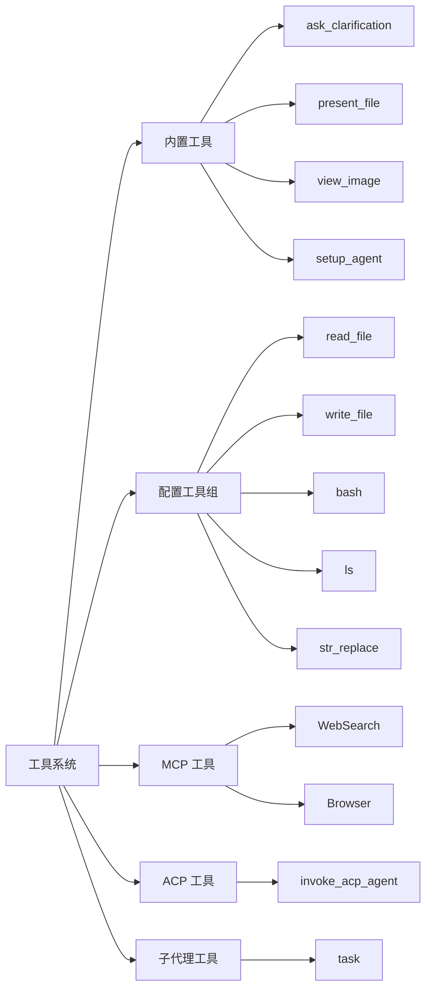
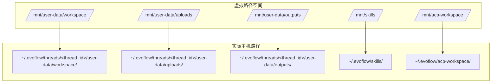
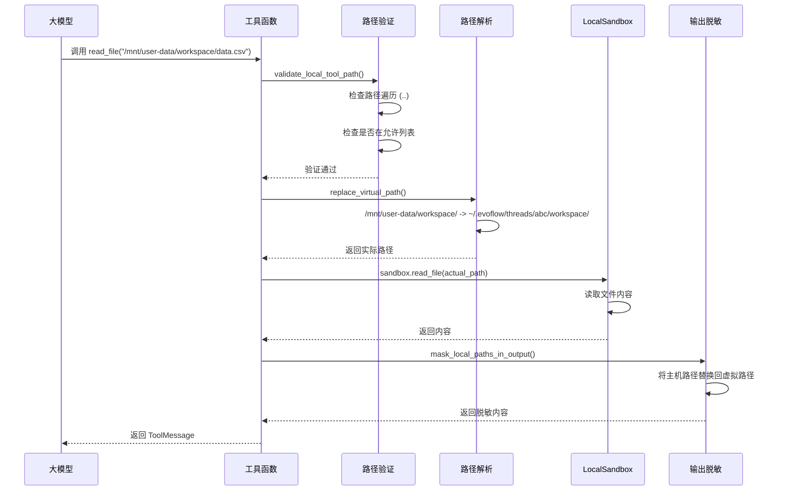

# 05-工具系统与 Sandbox 执行安全技术文档


## 一、概述


### 1.1 一句话理解


工具系统（Tools System）提供 Agent 执行原子操作的能力，Sandbox 提供隔离的执行环境，两者结合确保代码执行既强大又安全。


### 1.2 架构位置

```mermaid

flowchart TB

    subgraph "Agent 层"

        A[Lead Agent] --> B[Tools Agent]

        B --> C[Subagent]

    end

    

    subgraph "工具系统层"

        D[工具加载器] --> E[内置工具]

        D --> F[配置工具组]

        D --> G[MCP 工具]

        D --> H[ACP 工具]

    end

    

    subgraph "Sandbox 层"

        I[SandboxProvider] --> J[LocalSandbox]

        I --> K[AioSandbox]

    end

    

    subgraph "执行层"

        L[bash] --> M[命令执行]

        N[read_file] --> O[文件读取]

        P[write_file] --> Q[文件写入]

    end

    

    B --> D

    E --> I

    F --> I

    G --> I

    H --> I

    J --> L

    J --> N

    J --> P

```





## 二、核心概念


### 2.1 关键术语


| 术语 | 英文 | 说明 |

|------|------|------|

| 工具 | Tool | Agent 可调用的原子化操作能力 |

| 工具组 | Tool Group | 按功能分类的工具集合（如 read、write、bash） |

| 内置工具 | Built-in Tool | EvoFlow 核心提供的工具（如 task_tool、ask_clarification_tool） |

| 配置工具 | Config Tool | 通过配置文件加载的工具（如 bash、read_file） |

| MCP 工具 | MCP Tool | 通过 Model Context Protocol 接入的外部工具 |

| ACP 工具 | ACP Tool | Agent Communication Protocol 代理调用工具 |

| 子代理工具 | Subagent Tool | 委托任务给子代理执行的工具（如 task） |

| Sandbox | Sandbox | 隔离的执行环境，限制资源访问范围 |

| 虚拟路径 | Virtual Path | 如 `/mnt/user-data/`，映射到实际主机路径 |

| 路径遍历 | Path Traversal | 通过 `..` 等绕过目录限制的攻击方式 |


### 2.2 工具分类





## 三、工具系统实现


### 3.1 工具加载器


**源码位置**: `backend/packages/harness/evoflow/tools/tools.py#L35-L132`


**逻辑说明**: `get_available_tools()` 是工具系统的核心入口，负责从多个来源聚合工具并返回给 Agent。


```python

def get_available_tools(

    groups: list[str] | None = None,

    include_mcp: bool = True,

    model_name: str | None = None,

    subagent_enabled: bool = False,

) -> list[BaseTool]:

    """Get all available tools from config.

    

    工具加载优先级：

    1. 配置工具组（read_file, write_file, bash 等）

    2. 内置工具（ask_clarification, present_file 等）

    3. MCP 工具（WebSearch, Browser 等）

    4. ACP 工具（invoke_acp_agent）

    """

    config = get_app_config()

    

    # 1. 加载配置工具组

    tool_configs = [tool for tool in config.tools if groups is None or tool.group in groups]

    

    # 安全：LocalSandbox 模式下禁用 host bash

    if not is_host_bash_allowed(config):

        tool_configs = [tool for tool in tool_configs if not _is_host_bash_tool(tool)]

    

    loaded_tools = [resolve_variable(tool.use, BaseTool) for tool in tool_configs]

    

    # 2. 加载内置工具

    builtin_tools = BUILTIN_TOOLS.copy()

    

    # 条件添加：子代理工具

    if subagent_enabled:

        builtin_tools.extend(SUBAGENT_TOOLS)

    

    # 条件添加：图像查看工具（仅当模型支持 vision）

    if model_config is not None and model_config.supports_vision:

        builtin_tools.append(view_image_tool)

    

    # 3. 加载 MCP 工具

    mcp_tools = []

    if include_mcp:

        mcp_tools = get_cached_mcp_tools()

    

    # 4. 加载 ACP 工具

    acp_tools = []

    acp_agents = get_acp_agents()

    if acp_agents:

        acp_tools.append(build_invoke_acp_agent_tool(acp_agents))

    

    return loaded_tools + builtin_tools + mcp_tools + acp_tools

```


### 3.2 内置工具


**源码位置**: `backend/packages/harness/evoflow/tools/builtins/__init__.py`


**逻辑说明**: 内置工具是 EvoFlow 核心提供的特殊工具，不通过配置文件加载。


```python

__all__ = [

    "setup_agent",           # Agent 配置工具

    "present_file_tool",     # 文件展示工具（返回 Command）

    "ask_clarification_tool", # 澄清请求工具（被中间件拦截）

    "view_image_tool",       # 图像查看工具（vision 模型专用）

    "task_tool",             # 子代理任务工具

]

```


### 3.3 配置工具组


**源码位置**: `backend/packages/harness/evoflow/sandbox/tools.py#L792-L995`


**逻辑说明**: 配置工具是通过 `config.yaml` 配置的工具组，实际实现在 `sandbox/tools.py` 中。


```python

# 配置示例（config.yaml）

tools:

  - group: read

    use: evoflow.sandbox.tools:read_file_tool

  - group: write

    use: evoflow.sandbox.tools:write_file_tool

  - group: bash

    use: evoflow.sandbox.tools:bash_tool

```


**工具实现示例 - read_file**：


```python

@tool("read_file", parse_docstring=True)

def read_file_tool(

    runtime: ToolRuntime[ContextT, ThreadState],

    description: str,

    path: str,

    start_line: int | None = None,

    end_line: int | None = None,

) -> str:

    """Read the contents of a text file.

    

    Args:

        description: Explain why you are reading this file.

        path: The **absolute** path to the file to read.

        start_line: Optional starting line number (1-indexed).

        end_line: Optional ending line number (1-indexed).

    """

    # 1. 确保 Sandbox 已初始化

    sandbox = ensure_sandbox_initialized(runtime)

    

    # 2. 确保线程目录存在

    ensure_thread_directories_exist(runtime)

    

    # 3. 本地 Sandbox 路径处理

    if is_local_sandbox(runtime):

        thread_data = get_thread_data(runtime)

        # 验证路径权限

        validate_local_tool_path(path, thread_data, read_only=True)

        # 解析虚拟路径到实际路径

        if _is_skills_path(path):

            path = _resolve_skills_path(path)

        elif _is_acp_workspace_path(path):

            path = _resolve_acp_workspace_path(path, thread_id)

        else:

            path = _resolve_and_validate_user_data_path(path, thread_data)

    

    # 4. 执行文件读取

    content = sandbox.read_file(path)

    

    # 5. 本地 Sandbox 输出脱敏

    if is_local_sandbox(runtime):

        return mask_local_paths_in_output(content, thread_data)

    

    return content

```


## 四、Sandbox 架构与实现


### 4.1 Sandbox 与本地环境的区别


#### 4.1.1 核心区别


| 特性 | LocalSandbox（本地环境） | AioSandbox（容器沙箱） |

|------|------------------------|----------------------|

| **执行位置** | 直接在主机上执行 | 在 Docker 容器中执行 |

| **隔离性** | 无隔离，可访问主机所有文件 | 完全隔离，只能访问挂载的目录 |

| **安全性** | 低（需要依赖路径验证保护） | 高（容器边界天然隔离） |

| **性能** | 快（无容器开销） | 稍慢（有容器启动开销） |

| **适用场景** | 本地开发、可信环境 | 生产环境、多租户环境 |


#### 4.1.2 不是 Python 虚拟环境


**注意**：Sandbox **不是** Python 的 `venv` 或 `conda` 那种虚拟环境，而是**操作系统级别的执行环境隔离**：


```

Python 虚拟环境：隔离 Python 包依赖

    └── 仍在主机上运行，可访问所有文件


EvoFlow Sandbox：隔离文件系统访问

    └── 控制代码能读/写哪些目录

```


#### 4.1.3 文件持久化机制


**LocalSandbox 的文件是持久的**：


```bash

# 第一次对话

用户: 创建一个文件

Agent: write_file("/mnt/user-data/workspace/hello.txt", "Hello")


# 文件实际保存在：

# ~/.evoflow/threads/{thread_id}/user-data/workspace/hello.txt


# 第二次对话（同一个 thread）

用户: 读取刚才的文件

Agent: read_file("/mnt/user-data/workspace/hello.txt")

# 可以看到 "Hello" 内容

```


**AioSandbox（容器）的文件也是持久的**，通过挂载卷实现：


```yaml

# 容器启动时挂载

-v ~/.evoflow/threads/{thread_id}/user-data:/mnt/user-data

```


#### 4.1.4 线程隔离


**每个 thread（对话会话）有独立的文件空间**：


```

Thread A (thread_id=abc123):

  └── ~/.evoflow/threads/abc123/user-data/

      ├── workspace/

      ├── uploads/

      └── outputs/


Thread B (thread_id=def456):

  └── ~/.evoflow/threads/def456/user-data/

      ├── workspace/

      ├── uploads/

      └── outputs/EVOFLOW_ALLOW_LOCAL_HOST_READS


→ 两个对话的文件互不可见

```


### 4.3 Sandbox 抽象基类


**源码位置**: `backend/packages/harness/evoflow/sandbox/sandbox.py`


**逻辑说明**: `Sandbox` 定义了所有沙箱实现必须遵守的接口。


```python

class Sandbox(ABC):

    """Abstract base class for sandbox environments"""


    def __init__(self, id: str):

        self._id = id


    @abstractmethod

    def execute_command(self, command: str) -> str:

        """Execute bash command in sandbox."""

        pass


    @abstractmethod

    def read_file(self, path: str) -> str:

        """Read the content of a file."""

        pass


    @abstractmethod

    def list_dir(self, path: str, max_depth=2) -> list[str]:

        """List the contents of a directory."""

        pass


    @abstractmethod

    def write_file(self, path: str, content: str, append: bool = False) -> None:

        """Write content to a file."""

        pass


    @abstractmethod

    def update_file(self, path: str, content: bytes) -> None:

        """Update a file with binary content."""

        pass

```


### 4.4 SandboxProvider


**源码位置**: `backend/packages/harness/evoflow/sandbox/sandbox_provider.py`


**逻辑说明**: `SandboxProvider` 负责 Sandbox 的生命周期管理（获取、释放）。


```python

class SandboxProvider(ABC):

    """Abstract base class for sandbox providers"""


    @abstractmethod

    def acquire(self, thread_id: str | None = None) -> str:

        """Acquire a sandbox environment and return its ID."""

        pass


    @abstractmethod

    def get(self, sandbox_id: str) -> Sandbox | None:

        """Get a sandbox environment by ID."""

        pass


    @abstractmethod

    def release(self, sandbox_id: str) -> None:

        """Release a sandbox environment."""

        pass


# 全局单例获取

_default_sandbox_provider: SandboxProvider | None = None


def get_sandbox_provider(**kwargs) -> SandboxProvider:

    """Get the sandbox provider singleton."""

    global _default_sandbox_provider

    if _default_sandbox_provider is None:

        config = get_app_config()

        cls = resolve_class(config.sandbox.use, SandboxProvider)

        _default_sandbox_provider = cls(**kwargs)

    return _default_sandbox_provider

```


### 4.5 LocalSandbox 实现


**源码位置**: `backend/packages/harness/evoflow/sandbox/local/local_sandbox.py`


**逻辑说明**: `LocalSandbox` 在主机本地执行命令，通过路径映射实现虚拟化。


```python

class LocalSandbox(Sandbox):

    """本地沙箱实现 - 直接在主机上执行命令"""


    def __init__(self, id: str, path_mappings: dict[str, str] | None = None):

        super().__init__(id)

        # 路径映射：虚拟路径 -> 实际主机路径

        # 例如：{"/mnt/skills": "/home/user/.evoflow/skills"}

        self.path_mappings = path_mappings or {}


    def _resolve_path(self, path: str) -> str:

        """将虚拟路径解析为实际主机路径"""

        for container_path, local_path in sorted(

            self.path_mappings.items(), 

            key=lambda x: len(x[0]), 

            reverse=True  # 最长前缀优先

        ):

            if path_str == container_path or path_str.startswith(container_path + "/"):

                relative = path_str[len(container_path):].lstrip("/")

                return str(Path(local_path) / relative) if relative else local_path

        return path_str


    def _reverse_resolve_path(self, path: str) -> str:

        """将实际主机路径反向解析为虚拟路径（用于输出脱敏）"""

        path_str = str(Path(path).resolve())

        for container_path, local_path in sorted(

            self.path_mappings.items(),

            key=lambda x: len(x[1]),

            reverse=True

        ):

            local_path_resolved = str(Path(local_path).resolve())

            if path_str.startswith(local_path_resolved):

                relative = path_str[len(local_path_resolved):].lstrip("/")

                return f"{container_path}/{relative}" if relative else container_path

        return path_str


    def execute_command(self, command: str) -> str:

        """执行 bash 命令"""

        # 1. 解析命令中的虚拟路径

        resolved_command = self._resolve_paths_in_command(command)

        

        # 2. 获取 shell

        shell = self._get_shell()  # 优先 /bin/zsh, /bin/bash, /bin/sh

        

        # 3. 执行命令

        result = subprocess.run(

            resolved_command,

            executable=shell,

            shell=True,

            capture_output=True,

            text=True,

            timeout=600,  # 10分钟超时

        )

        

        output = result.stdout

        if result.stderr:

            output += f"\nStd Error:\n{result.stderr}"

        

        # 4. 输出脱敏：将主机路径替换回虚拟路径

        return self._reverse_resolve_paths_in_output(output)

```


### 4.6 LocalSandboxProvider


**源码位置**: `backend/packages/harness/evoflow/sandbox/local/local_sandbox_provider.py`


**逻辑说明**: `LocalSandboxProvider` 使用单例模式管理 LocalSandbox 实例。


```python

class LocalSandboxProvider(SandboxProvider):

    """本地沙箱提供者 - 单例模式"""


    def __init__(self):

        self._path_mappings = self._setup_path_mappings()


    def _setup_path_mappings(self) -> dict[str, str]:

        """设置路径映射"""

        mappings = {}

        

        # 映射技能目录

        try:

            config = get_app_config()

            skills_path = config.skills.get_skills_path()

            container_path = config.skills.container_path

            

            if skills_path.exists():

                mappings[container_path] = str(skills_path)

                # 例如：{"/mnt/skills": "/home/user/.evoflow/skills"}

        except Exception as e:

            logger.warning("Could not setup skills path mapping: %s", e)

        

        return mappings


    def acquire(self, thread_id: str | None = None) -> str:

        """获取 Sandbox ID（单例）"""

        global _singleton

        if _singleton is None:

            _singleton = LocalSandbox("local", path_mappings=self._path_mappings)

        return _singleton.id  # 始终返回 "local"


    def get(self, sandbox_id: str) -> Sandbox | None:

        """获取 Sandbox 实例"""

        if sandbox_id == "local":

            if _singleton is None:

                self.acquire()

            return _singleton

        return None


    def release(self, sandbox_id: str) -> None:

        """释放 Sandbox（LocalSandbox 无需清理）"""

        # LocalSandbox 使用单例，不释放以支持跨轮次复用

        pass

```


### 4.7 SandboxMiddleware


**源码位置**: `backend/packages/harness/evoflow/sandbox/middleware.py`


**逻辑说明**: `SandboxMiddleware` 在 Agent 生命周期中管理 Sandbox 的获取和释放。


```python

class SandboxMiddleware(AgentMiddleware[SandboxMiddlewareState]):

    """Create a sandbox environment and assign it to an agent.

    

    生命周期管理：

    - lazy_init=True（默认）：首次工具调用时获取 Sandbox

    - lazy_init=False：Agent 首次调用前获取 Sandbox

    - Sandbox 在同一线程的多轮对话中复用

    - 应用关闭时统一清理

    """


    def __init__(self, lazy_init: bool = True):

        self._lazy_init = lazy_init


    def before_agent(self, state, runtime):

        """Agent 执行前 - 非延迟模式下获取 Sandbox"""

        if self._lazy_init:

            return super().before_agent(state, runtime)

        

        if "sandbox" not in state or state["sandbox"] is None:

            thread_id = (runtime.context or {}).get("thread_id")

            if thread_id is None:

                return super().before_agent(state, runtime)

            

            sandbox_id = self._acquire_sandbox(thread_id)

            return {"sandbox": {"sandbox_id": sandbox_id}}


    def after_agent(self, state, runtime):

        """Agent 执行后 - 释放 Sandbox"""

        sandbox = state.get("sandbox")

        if sandbox is not None:

            sandbox_id = sandbox["sandbox_id"]

            get_sandbox_provider().release(sandbox_id)

```


## 五、安全机制


### 5.1 Host Bash 安全控制


**源码位置**: `backend/packages/harness/evoflow/sandbox/security.py`


**逻辑说明**: LocalSandbox 模式下，host bash 执行不是安全的沙箱边界，需要显式启用。


```python

_LOCAL_SANDBOX_PROVIDER_MARKERS = (

    "evoflow.sandbox.local:LocalSandboxProvider",

    "evoflow.sandbox.local.local_sandbox_provider:LocalSandboxProvider",

)


LOCAL_HOST_BASH_DISABLED_MESSAGE = (

    "Host bash execution is disabled for LocalSandboxProvider because it is not a secure "

    "sandbox boundary. Switch to AioSandboxProvider for isolated bash access, or set "

    "sandbox.allow_host_bash: true only in a fully trusted local environment."

)


def uses_local_sandbox_provider(config=None) -> bool:

    """检查是否使用 LocalSandboxProvider"""

    sandbox_use = getattr(config.sandbox, "use", "")

    return sandbox_use.endswith(":LocalSandboxProvider")


def is_host_bash_allowed(config=None) -> bool:

    """检查是否允许 host bash 执行"""

    if not uses_local_sandbox_provider(config):

        return True  # 非 LocalSandbox 默认允许

    

    # LocalSandbox 需要显式配置 allow_host_bash: true

    return bool(getattr(config.sandbox, "allow_host_bash", False))

```


**配置示例**：


```yaml

# config.yaml

sandbox:

  use: evoflow.sandbox.local:LocalSandboxProvider

  allow_host_bash: true  # 仅在可信本地环境启用

```


### 5.2 路径验证


**源码位置**: `backend/packages/harness/evoflow/sandbox/tools.py#L451-L500`


**逻辑说明**: 工具执行前验证路径是否允许访问。


```python

def validate_local_tool_path(path: str, thread_data: ThreadDataState | None, *, read_only: bool = False) -> None:

    """验证虚拟路径是否允许访问。

    

    允许的虚拟路径：

    - /mnt/user-data/* — 始终允许（读写）

    - /mnt/skills/* — 仅允许读

    - /mnt/acp-workspace/* — 仅允许读

    - 主机绝对路径 — 仅当 read_only=True 且 EVOFLOW_ALLOW_LOCAL_HOST_READS 启用

    

    Raises:

        SandboxRuntimeError: Thread 数据缺失

        PermissionError: 路径不允许或包含遍历攻击

    """

    if thread_data is None:

        raise SandboxRuntimeError("Thread data not available for local sandbox")


    # 1. 拒绝路径遍历攻击

    _reject_path_traversal(path)


    # 2. Skills 路径 - 只读

    if _is_skills_path(path):

        if not read_only:

            raise PermissionError(f"Write access to skills path is not allowed: {path}")

        return


    # 3. ACP workspace 路径 - 只读

    if _is_acp_workspace_path(path):

        if not read_only:

            raise PermissionError(f"Write access to ACP workspace is not allowed: {path}")

        return


    # 4. User-data 路径 - 允许

    if path.startswith(f"{VIRTUAL_PATH_PREFIX}/"):

        return


    # 5. 主机绝对路径 - 需 opt-in

    if read_only and _local_host_reads_enabled() and _is_explicit_host_filesystem_path(path):

        return


    raise PermissionError(f"Only paths under {VIRTUAL_PATH_PREFIX}/, {SKILLS_PATH}/, or {ACP_PATH}/ are allowed")

```


### 5.3 Bash 命令路径验证


**源码位置**: `backend/packages/harness/evoflow/sandbox/tools.py#L542-L596`


**逻辑说明**: 在 bash 命令中检测并验证绝对路径。


```python

_ABSOLUTE_PATH_PATTERN = re.compile(r"(?<![:\w])/(?:[^\s\"'`;&|<>()]+)")


_LOCAL_BASH_SYSTEM_PATH_PREFIXES = (

    "/bin/",

    "/usr/bin/",

    "/usr/sbin/",

    "/sbin/",

    "/opt/homebrew/bin/",

    "/dev/",

)


def validate_local_bash_command_paths(command: str, thread_data: ThreadDataState | None) -> None:

    """验证 bash 命令中的绝对路径。

    

    注意：这只是尽力而为的保护，不是安全的沙箱边界。

    """

    if thread_data is None:

        raise SandboxRuntimeError("Thread data not available for local sandbox")


    unsafe_paths: list[str] = []

    

    # 提取命令中的所有绝对路径

    for absolute_path in _ABSOLUTE_PATH_PATTERN.findall(command):

        # 允许 MCP 文件系统服务器配置的路径

        if any(absolute_path.startswith(path) for path in allowed_paths):

            continue

        

        # 允许虚拟路径

        if absolute_path == VIRTUAL_PATH_PREFIX or absolute_path.startswith(f"{VIRTUAL_PATH_PREFIX}/"):

            continue

        

        # 允许 skills 路径

        if _is_skills_path(absolute_path):

            continue

        

        # 允许 ACP workspace 路径

        if _is_acp_workspace_path(absolute_path):

            continue

        

        # 允许系统路径（如 /bin/sh, /dev/null）

        if any(absolute_path.startswith(prefix) for prefix in _LOCAL_BASH_SYSTEM_PATH_PREFIXES):

            continue

        

        # 允许 opt-in 的主机路径

        if _local_host_reads_enabled() and _is_explicit_host_filesystem_path(absolute_path):

            continue

        

        # 标记为不安全路径

        unsafe_paths.append(absolute_path)


    if unsafe_paths:

        raise PermissionError(f"Unsafe absolute paths in command: {', '.join(unsafe_paths)}")

```


### 5.4 路径遍历防护


**源码位置**: `backend/packages/harness/evoflow/sandbox/tools.py#L442-L448`


```python

def _reject_path_traversal(path: str) -> None:

    """拒绝包含 '..' 的路径，防止目录遍历攻击。"""

    normalised = path.replace("\\", "/")

    for segment in normalised.split("/"):

        if segment == "..":

            raise PermissionError("Access denied: path traversal detected")

```


## 六、路径虚拟化与映射


### 6.1 虚拟路径体系





### 6.2 路径映射实现


**源码位置**: `backend/packages/harness/evoflow/sandbox/tools.py#L307-L337`


**逻辑说明**: `replace_virtual_path()` 将虚拟路径替换为实际主机路径。


```python

def replace_virtual_path(path: str, thread_data: ThreadDataState | None) -> str:

    """将虚拟 /mnt/user-data 路径替换为实际线程数据路径。

    

    映射关系：

        /mnt/user-data/workspace/* -> thread_data['workspace_path']/*

        /mnt/user-data/uploads/* -> thread_data['uploads_path']/*

        /mnt/user-data/outputs/* -> thread_data['outputs_path']/*

    """

    if thread_data is None:

        return path


    # 构建虚拟路径到实际路径的映射

    mappings = _thread_virtual_to_actual_mappings(thread_data)

    # 例如：{

    #     "/mnt/user-data/workspace": "/home/user/.evoflow/threads/abc123/user-data/workspace",

    #     "/mnt/user-data/uploads": "/home/user/.evoflow/threads/abc123/user-data/uploads",

    # }


    # 最长前缀优先替换

    for virtual_base, actual_base in sorted(

        mappings.items(), 

        key=lambda item: len(item[0]), 

        reverse=True

    ):

        if path == virtual_base:

            return actual_base

        if path.startswith(f"{virtual_base}/"):

            rest = path[len(virtual_base):].lstrip("/")

            return _join_path_preserving_style(actual_base, rest)


    return path

```


### 6.3 输出脱敏


**源码位置**: `backend/packages/harness/evoflow/sandbox/tools.py#L370-L439`


**逻辑说明**: `mask_local_paths_in_output()` 将输出中的主机路径替换回虚拟路径。


```python

def mask_local_paths_in_output(output: str, thread_data: ThreadDataState | None) -> str:

    """使用虚拟路径掩码本地沙箱输出中的主机绝对路径。

    

    处理三类路径：

    1. Skills 路径

    2. ACP workspace 路径

    3. User-data 路径

    """

    result = output


    # 1. 掩码 skills 主机路径

    skills_host = _get_skills_host_path()

    skills_container = _get_skills_container_path()

    if skills_host:

        for base in _path_variants(skills_host):

            escaped = re.escape(base).replace(r"\\", r"[/\\]")

            pattern = re.compile(escaped + r"(?:[/\\][^\s\"';&|<>()]*)?")

            

            def replace_skills(match: re.Match) -> str:

                matched_path = match.group(0)

                if matched_path == base:

                    return skills_container

                relative = matched_path[len(base):].lstrip("/\\")

                return f"{skills_container}/{relative}"

            

            result = pattern.sub(replace_skills, result)


    # 2. 掩码 user-data 主机路径

    if thread_data is not None:

        mappings = _thread_actual_to_virtual_mappings(thread_data)

        for actual_base, virtual_base in sorted(

            mappings.items(), 

            key=lambda item: len(item[0]), 

            reverse=True

        ):

            for base in _path_variants(actual_base):

                escaped = re.escape(base).replace(r"\\", r"[/\\]")

                pattern = re.compile(escaped + r"(?:[/\\][^\s\"';&|<>()]*)?")

                

                def replace_match(match: re.Match) -> str:

                    matched_path = match.group(0)

                    if matched_path == base:

                        return virtual_base

                    relative = matched_path[len(base):].lstrip("/\\")

                    return f"{virtual_base}/{relative}"

                

                result = pattern.sub(replace_match, result)


    return result

```


### 6.4 路径映射流程





## 导航


**上一篇**：[04-Agent 核心机制](04-Agent%20核心机制.md)  

**下一篇**：[06-记忆系统技术文档](06-记忆系统技术文档.md)


> **文档版本**：v1.0  

> **最后更新**：2026-03-30  

> **作者**：银泰


📚 返回总览：[EvoFlow技术总览](01-EvoFlow技术总览.md)
