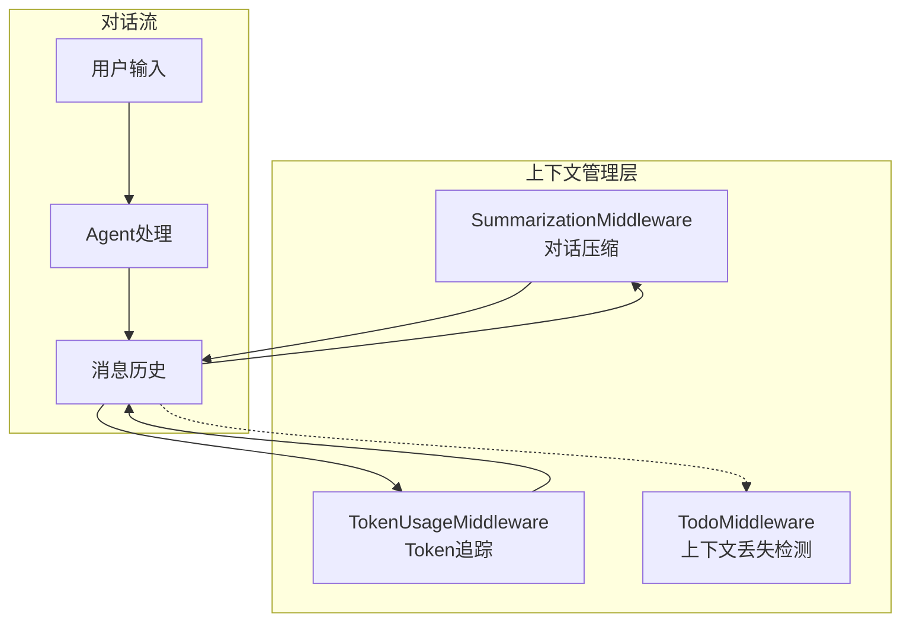
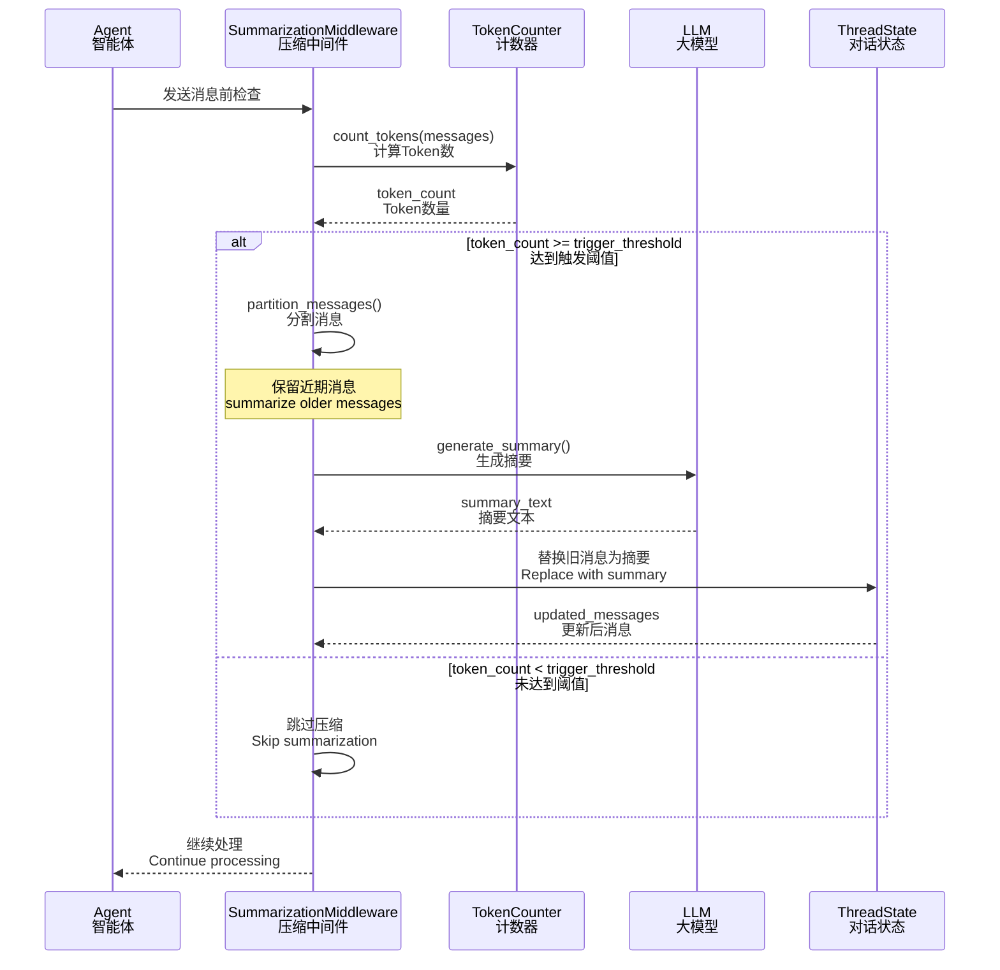
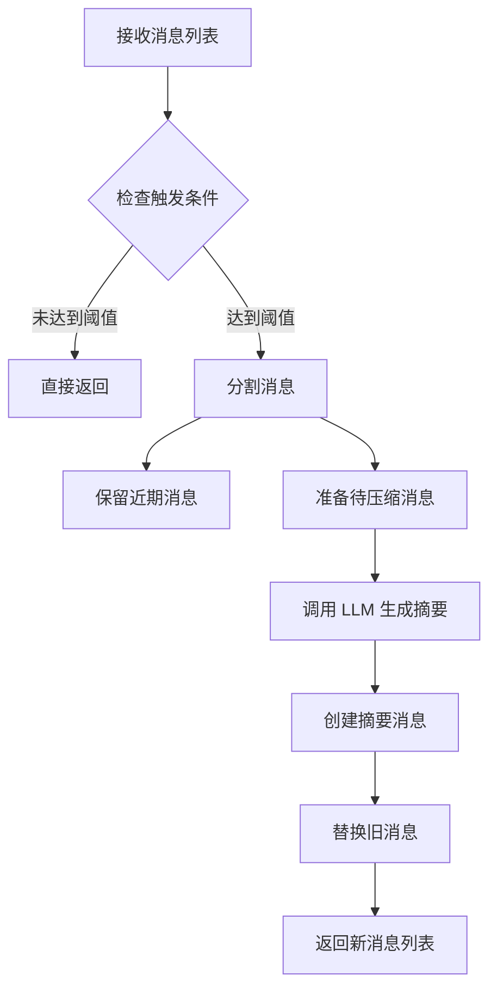

# 07-上下文工程技术文档

## 一、概述

### 1.1 一句话理解

上下文工程（Context Engineering）通过对话压缩、上下文裁剪和 Token 管理等技术，确保 EvoFlow 在长对话场景下仍能高效运行，避免超出模型上下文窗口限制。

### 1.2 架构位置



**核心组件**：
- **SummarizationMiddleware**：自动压缩长对话
- **TokenUsageMiddleware**：追踪 Token 使用情况
- **TodoMiddleware**：检测上下文丢失并提醒


## 二、核心概念

### 2.1 关键术语

| 术语 | 英文 | 说明 |
|------|------|------|
| 上下文窗口 | Context Window | 模型能处理的最大 Token 数 |
| 对话压缩 | Conversation Summarization | 将历史消息总结为摘要 |
| Token 计数 | Token Counting | 计算消息占用的 Token 数量 |
| 触发阈值 | Trigger Threshold | 启动压缩的 Token/消息数条件 |
| 保留策略 | Keep Policy | 压缩后保留多少近期消息 |
| 上下文丢失 | Context Loss | 重要消息被压缩或裁剪导致的信息缺失 |

### 2.2 上下文管理策略对比

| 策略 | 适用场景 | 优点 | 缺点 |
|------|----------|------|------|
| **对话压缩** | 长对话历史 | 保留语义信息 | 可能丢失细节 |
| **消息裁剪** | 超出窗口限制 | 简单直接 | 可能丢失关键信息 |
| **滑动窗口** | 流式对话 | 实时性好 | 早期信息丢失 |
| **分层摘要** | 超长对话 | 多级压缩 | 实现复杂 |

### 2.3 上下文压缩流程



### 2.4 消息分割策略

**压缩时的消息处理**：

```
原始消息历史（50条消息，6000 tokens）:
┌─────────────────────────────────────────────────────────┐
│ [Msg 1-30] 旧消息（4000 tokens）← 需要压缩              │
│ [Msg 31-50] 近期消息（2000 tokens）← 保留               │
└─────────────────────────────────────────────────────────┘
                           ↓ 压缩后
┌─────────────────────────────────────────────────────────┐
│ [Summary] 摘要消息（500 tokens）                         │
│ [Msg 31-50] 近期消息（2000 tokens）← 保留               │
└─────────────────────────────────────────────────────────┘
```

**保留策略（Keep Policy）**：
- **Message-based**：保留最近 N 条消息
- **Token-based**：保留最近 N 个 Token
- **Fraction-based**：保留上下文窗口的百分比


## 三、对话压缩配置

### 3.1 配置结构

**源码位置**: `backend/packages/harness/evoflow/config/summarization_config.py`

**逻辑说明**: `SummarizationConfig` 定义了对话压缩的所有配置项。

```python
ContextSizeType = Literal["fraction", "tokens", "messages"]

class ContextSize(BaseModel):
    """Context size specification for trigger or keep parameters."""

    type: ContextSizeType = Field(description="Type of context size specification")
    value: int | float = Field(description="Value for the context size specification")

    def to_tuple(self) -> tuple[ContextSizeType, int | float]:
        """Convert to tuple format expected by SummarizationMiddleware."""
        return (self.type, self.value)


class SummarizationConfig(BaseModel):
    """Configuration for automatic conversation summarization."""

    enabled: bool = Field(
        default=False,
        description="Whether to enable automatic conversation summarization",
    )
    model_name: str | None = Field(
        default=None,
        description="Model name to use for summarization (None = use a lightweight model)",
    )
    trigger: ContextSize | list[ContextSize] | None = Field(
        default=None,
        description="One or more thresholds that trigger summarization. "
                    "When any threshold is met, summarization runs.",
    )
    keep: ContextSize = Field(
        default_factory=lambda: ContextSize(type="messages", value=20),
        description="Context retention policy after summarization. "
                    "Specifies how much history to preserve.",
    )
    trim_tokens_to_summarize: int | None = Field(
        default=4000,
        description="Maximum tokens to keep when preparing messages for summarization.",
    )
    summary_prompt: str | None = Field(
        default=None,
        description="Custom prompt template for generating summaries.",
    )
```

### 3.2 配置项说明

| 配置项 | 类型 | 默认值 | 说明 |
|--------|------|--------|------|
| `enabled` | bool | `false` | 是否启用对话压缩 |
| `model_name` | str \| null | `null` | 压缩使用的模型，null 使用默认模型 |
| `trigger` | ContextSize \| list | `null` | 触发压缩的阈值（OR 逻辑） |
| `keep` | ContextSize | 20 messages | 压缩后保留的近期消息 |
| `trim_tokens_to_summarize` | int \| null | `4000` | 压缩时发送给模型的最大 Token 数 |
| `summary_prompt` | str \| null | `null` | 自定义压缩提示词 |

### 3.3 ContextSize 类型

**三种度量方式**：

```yaml
# 1. Token-based：基于 Token 数量
trigger:
  type: tokens
  value: 4000  # 4000 tokens 时触发

# 2. Message-based：基于消息数量
trigger:
  type: messages
  value: 50   # 50 条消息时触发

# 3. Fraction-based：基于上下文窗口比例
trigger:
  type: fraction
  value: 0.8  # 达到 80% 上下文窗口时触发
```

### 3.4 配置示例

**基础配置**：

```yaml
summarization:
  enabled: true
  trigger:
    type: tokens
    value: 4000
  keep:
    type: messages
    value: 20
```

**多触发条件配置**：

```yaml
summarization:
  enabled: true
  model_name: gpt-4o-mini  # 使用轻量模型节省成本
  trigger:
    - type: tokens
      value: 6000
    - type: messages
      value: 75
  keep:
    type: messages
    value: 25
  trim_tokens_to_summarize: 5000
```

**比例配置（多模型适配）**：

```yaml
summarization:
  enabled: true
  trigger:
    type: fraction
    value: 0.7  # 70% 上下文窗口时触发
  keep:
    type: fraction
    value: 0.3  # 保留 30% 的上下文
```


## 四、SummarizationMiddleware 实现

### 4.1 中间件创建

**源码位置**: `backend/packages/harness/evoflow/agents/lead_agent/agent.py#L41-L81`

**逻辑说明**: `_create_summarization_middleware()` 根据配置创建 SummarizationMiddleware 实例。

```python
def _create_summarization_middleware() -> SummarizationMiddleware | None:
    """Create and configure the summarization middleware from config."""
    config = get_summarization_config()

    if not config.enabled:
        return None

    # 准备 trigger 参数
    trigger = None
    if config.trigger is not None:
        if isinstance(config.trigger, list):
            trigger = [t.to_tuple() for t in config.trigger]
        else:
            trigger = config.trigger.to_tuple()

    # 准备 keep 参数
    keep = config.keep.to_tuple()

    # 准备 model 参数
    if config.model_name:
        model = create_chat_model(name=config.model_name, thinking_enabled=False)
    else:
        # 使用轻量模型进行压缩以节省成本
        model = create_chat_model(thinking_enabled=False)

    # 构建 kwargs
    kwargs = {
        "model": model,
        "trigger": trigger,
        "keep": keep,
    }

    if config.trim_tokens_to_summarize is not None:
        kwargs["trim_tokens_to_summarize"] = config.trim_tokens_to_summarize

    if config.summary_prompt is not None:
        kwargs["summary_prompt"] = config.summary_prompt

    return SummarizationMiddleware(**kwargs)
```

### 4.2 中间件注册位置

**源码位置**: `backend/packages/harness/evoflow/agents/lead_agent/agent.py#L198-L241`

**逻辑说明**: SummarizationMiddleware 在中间件链中的位置和顺序。

```python
def _build_middlewares(config: RunnableConfig, model_name: str | None, 
                       agent_name: str | None = None):
    """Build middleware chain based on runtime configuration.
    
    Middleware 执行顺序（重要）：
    1. ThreadDataMiddleware - 初始化线程数据
    2. SandboxMiddleware - 获取沙箱环境
    3. DanglingToolCallMiddleware - 修复缺失的工具消息
    4. SummarizationMiddleware - 上下文压缩 ← 在这里
    5. TodoMiddleware - 计划模式管理
    6. TitleMiddleware - 生成对话标题
    7. MemoryMiddleware - 记忆更新
    8. ... 其他中间件
    """
    middlewares = build_lead_runtime_middlewares(lazy_init=True)

    # 添加 SummarizationMiddleware（如果启用）
    summarization_middleware = _create_summarization_middleware()
    if summarization_middleware is not None:
        middlewares.append(summarization_middleware)

    # 添加 TodoListMiddleware（如果计划模式启用）
    is_plan_mode = config.get("configurable", {}).get("is_plan_mode", False)
    todo_list_middleware = _create_todo_list_middleware(is_plan_mode)
    if todo_list_middleware is not None:
        middlewares.append(todo_list_middleware)

    # 添加 TokenUsageMiddleware
    if get_app_config().token_usage.enabled:
        middlewares.append(TokenUsageMiddleware())

    # 添加 TitleMiddleware
    middlewares.append(TitleMiddleware())

    # 添加 MemoryMiddleware
    middlewares.append(MemoryMiddleware(agent_name=agent_name))
    
    # ... 其他中间件
    
    return middlewares
```

**为什么 SummarizationMiddleware 要放在前面？**

```
执行顺序: DanglingToolCallMiddleware → SummarizationMiddleware → TodoMiddleware → ...
                                      ↑
                                      在这里压缩可以减少后续中间件处理的 Token 数
```

1. **在 DanglingToolCallMiddleware 之后**：确保工具消息完整性
2. **在 TodoMiddleware 之前**：减少 TodoMiddleware 处理的上下文量
3. **在 TitleMiddleware 之前**：标题生成基于压缩后的上下文更高效

### 4.3 中间件执行流程

**SummarizationMiddleware 工作流程**：



**关键特性**：

| 特性 | 说明 |
|------|------|
| **AI/Tool 消息对保护** | 不会将 AI 消息和其 Tool 消息分开 |
| **摘要格式** | 以 HumanMessage 形式注入 |
| **Token 估算** | 使用字符数估算（~3.3 字符/Token） |
| **多触发条件** | OR 逻辑，任一条件满足即触发 |


## 五、Token 使用追踪

### 5.1 TokenUsageMiddleware

**源码位置**: `backend/packages/harness/evoflow/agents/middlewares/token_usage_middleware.py`

**逻辑说明**: `TokenUsageMiddleware` 追踪对话中的 Token 使用情况，用于监控和优化。

```python
class TokenUsageMiddleware(AgentMiddleware):
    """Middleware that tracks token usage for conversations."""

    def before_agent(self, state: ThreadState, runtime: Runtime) -> dict | None:
        """Track token usage before agent execution."""
        messages = state.get("messages", [])
        
        # 计算输入 Token
        input_tokens = self._count_tokens(messages)
        
        # 记录到 runtime context
        if runtime.context is not None:
            runtime.context["input_tokens"] = input_tokens
            
        return None

    def after_agent(self, state: ThreadState, runtime: Runtime) -> dict | None:
        """Track token usage after agent execution."""
        messages = state.get("messages", [])
        
        # 计算输出 Token（新增的消息）
        output_tokens = self._count_new_tokens(messages, runtime)
        
        # 记录到 runtime context
        if runtime.context is not None:
            runtime.context["output_tokens"] = output_tokens
            runtime.context["total_tokens"] = (
                runtime.context.get("input_tokens", 0) + output_tokens
            )
            
        return None

    def _count_tokens(self, messages: list) -> int:
        """Estimate token count from messages."""
        total_chars = sum(len(str(m.content)) for m in messages if hasattr(m, "content"))
        # 使用 4 字符/Token 的估算
        return total_chars // 4
```

### 5.2 Token 计数方法

**估算策略**：

| 方法 | 精度 | 适用场景 |
|------|------|----------|
| **字符估算** | 低 | 快速估算，无 tiktoken |
| **tiktoken** | 高 | 精确计数，需要依赖 |
| **模型 API** | 最高 | 实际计费 Token 数 |

**EvoFlow 默认使用字符估算**：
- 英文：~4 字符/Token
- 中文：~1.5 字符/Token
- 混合：取平均值


## 六、上下文丢失检测

### 6.1 TodoMiddleware 的上下文保护

**源码位置**: `backend/packages/harness/evoflow/agents/middlewares/todo_middleware.py`

**逻辑说明**: 当 SummarizationMiddleware 压缩对话时，可能将 `write_todos` 工具调用和对应的 ToolMessage 移出上下文窗口。TodoMiddleware 检测这种情况并注入提醒。

```python
class TodoMiddleware(AgentMiddleware):
    """Middleware that extends TodoListMiddleware with context-loss detection.
    
    When the message history is truncated (e.g., by SummarizationMiddleware), 
    the original `write_todos` tool call and its ToolMessage can be scrolled 
    out of the active context window. This middleware detects that situation 
    and injects a reminder message so the model still knows about the 
    outstanding todo list.
    """

    def before_agent(self, state: ThreadState, runtime: Runtime) -> dict | None:
        """Check for todo list context loss and inject reminder if needed."""
        messages = state.get("messages", [])
        
        # 检查是否有活跃的 todo list
        has_active_todos = self._check_active_todos(runtime)
        
        # 检查上下文中是否还有 todo 相关信息
        todo_context_present = self._check_todo_context_in_messages(messages)
        
        if has_active_todos and not todo_context_present:
            # 上下文丢失，注入提醒
            reminder_msg = self._create_todo_reminder(runtime)
            return {"messages": messages + [reminder_msg]}
            
        return None

    def _check_active_todos(self, runtime: Runtime) -> bool:
        """Check if there are active todos in the runtime state."""
        todo_state = runtime.context.get("todo_state") if runtime.context else None
        if not todo_state:
            return False
        
        todos = todo_state.get("todos", [])
        # 检查是否有未完成的 todo
        return any(t.get("status") in ["pending", "in_progress"] for t in todos)

    def _check_todo_context_in_messages(self, messages: list) -> bool:
        """Check if todo context is present in recent messages."""
        # 检查最近消息中是否有 todo 相关的内容
        recent_messages = messages[-10:]  # 检查最近 10 条
        for msg in recent_messages:
            content = str(getattr(msg, "content", ""))
            if "todo" in content.lower() or "任务" in content:
                return True
        return False

    def _create_todo_reminder(self, runtime: Runtime) -> SystemMessage:
        """Create a reminder message about active todos."""
        todo_state = runtime.context.get("todo_state", {})
        todos = todo_state.get("todos", [])
        
        reminder = "【上下文提醒】当前有以下未完成任务：\n"
        for todo in todos:
            if todo.get("status") in ["pending", "in_progress"]:
                reminder += f"- [{todo.get('status')}] {todo.get('content')}\n"
        
        return SystemMessage(content=reminder)
```

### 6.2 上下文丢失场景

**场景 1：SummarizationMiddleware 压缩导致**

```
压缩前：
[Msg 1] User: 创建任务列表
[Msg 2] AI: 调用 write_todos
[Msg 3] Tool: 任务已创建
[Msg 4-50] ... 后续对话 ...

压缩后（保留最近 10 条）：
[Summary] 摘要消息（丢失了任务创建细节）
[Msg 41-50] 近期消息

→ 模型不知道还有未完成的任务！
```

**场景 2：超长消息裁剪**

```python
# 单条消息超过限制时裁剪
if len(message.content) > MAX_MESSAGE_LENGTH:
    message.content = message.content[:MAX_MESSAGE_LENGTH] + "..."
```

### 6.3 防护策略

| 策略 | 实现 | 效果 |
|------|------|------|
| **Todo 提醒注入** | TodoMiddleware | 提醒模型未完成任务 |
| **关键消息标记** | 系统标记重要消息 | 压缩时优先保留 |
| **分层摘要** | 多级压缩 | 减少信息丢失 |
| **上下文检查点** | 定期保存完整上下文 | 支持回溯 |


## 七、最佳实践

### 7.1 压缩配置建议

**轻量级场景**（日常对话）：
```yaml
summarization:
  enabled: true
  model_name: gpt-4o-mini
  trigger:
    type: tokens
    value: 6000
  keep:
    type: messages
    value: 15
```

**开发场景**（代码生成）：
```yaml
summarization:
  enabled: true
  trigger:
    - type: tokens
      value: 8000
    - type: messages
      value: 100
  keep:
    type: messages
    value: 30  # 保留更多上下文
```

**多模型适配**：
```yaml
summarization:
  enabled: true
  trigger:
    type: fraction
    value: 0.75  # 75% 时触发，自动适配不同模型
  keep:
    type: fraction
    value: 0.25
```

### 7.2 性能优化

1. **使用轻量模型进行压缩**：节省成本
2. **合理设置 trim_tokens_to_summarize**：避免发送过多内容给压缩模型
3. **监控压缩频率**：过于频繁的压缩影响体验
4. **调整保留策略**：根据场景保留适当数量的消息


## 导航

**上一篇**：[06-记忆系统技术文档](06-记忆系统技术文档.md)  
**下一篇**：[08-安全护栏 Guardrails 技术文档](08-安全护栏%20Guardrails%20技术文档.md)

> **文档版本**：v1.0  
> **最后更新**：2026-03-30  
> **作者**：银泰

📚 返回总览：[EvoFlow技术总览](01-EvoFlow技术总览.md)
