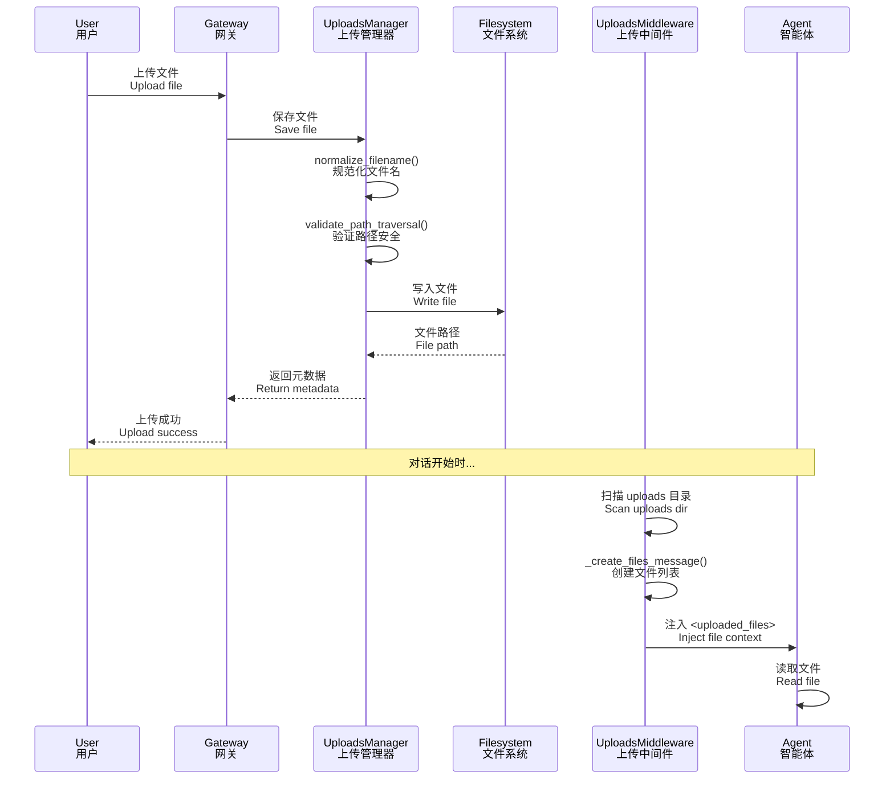

# 10-文件上传与制品体系技术文档

## 一、概述

### 1.1 一句话理解

文件上传与制品体系管理用户上传的文件，提供安全的文件存储、路径隔离、虚拟路径映射和文件元数据管理，使 Agent 能够安全地访问和处理用户上传的内容。

### 1.2 架构位置


**核心组件**：
- **UploadsManager**：文件上传管理
- **UploadsMiddleware**：向 Agent 注入文件信息
- **虚拟路径**：`/mnt/user-data/uploads/` 映射到实际存储
- **路径隔离**：每个 thread 独立的 uploads 目录

---

## 二、核心概念

### 2.1 关键术语

| 术语 | 英文 | 说明 |
|------|------|------|
| 上传目录 | Uploads Directory | 存储上传文件的物理目录 |
| 虚拟路径 | Virtual Path | `/mnt/user-data/uploads/` 虚拟路径 |
| 制品 URL | Artifact URL | 下载文件的 API 端点 |
| 路径遍历 | Path Traversal | 通过 `..` 等绕过目录限制的攻击 |
| 文件名规范化 | Filename Normalization | 清理文件名中的危险字符 |

### 2.2 路径映射关系

```
虚拟路径（Agent 看到）          实际物理路径（主机存储）
─────────────────────────────────────────────────────────────
/mnt/user-data/uploads/          ~/.evoflow/threads/{thread_id}/uploads/
/mnt/user-data/uploads/file.txt  ~/.evoflow/threads/{thread_id}/uploads/file.txt
```

### 2.3 文件上传流程



---

## 三、上传管理器

### 3.1 核心功能

**源码位置**: `backend/packages/harness/evoflow/uploads/manager.py`

**逻辑说明**: `UploadsManager` 提供纯业务逻辑的文件管理功能，无 FastAPI/HTTP 依赖，Gateway 和 Client 都可以调用。

```python
class PathTraversalError(ValueError):
    """Raised when a path escapes its allowed base directory."""


# thread_id 必须是字母数字、连字符、下划线或点
type: ignore_SAFE_THREAD_ID = re.compile(r"^[a-zA-Z0-9._-]+$")


def validate_thread_id(thread_id: str) -> None:
    """验证 thread_id 是否安全用于文件系统路径。
    
    拒绝包含不安全字符的 thread_id，防止路径遍历攻击。
    """
    if not thread_id or not _SAFE_THREAD_ID.match(thread_id):
        raise ValueError(f"Invalid thread_id: {thread_id!r}")


def get_uploads_dir(thread_id: str) -> Path:
    """返回 thread 的上传目录路径（无副作用）。"""
    validate_thread_id(thread_id)
    return get_paths().sandbox_uploads_dir(thread_id)


def ensure_uploads_dir(thread_id: str) -> Path:
    """返回 thread 的上传目录，如果不存在则创建。"""
    base = get_uploads_dir(thread_id)
    base.mkdir(parents=True, exist_ok=True)
    return base


def normalize_filename(filename: str) -> str:
    """清理文件名，提取 basename 并拒绝遍历模式。
    
    Args:
        filename: 用户输入的原始文件名（可能包含路径组件）。
    
    Returns:
        安全的文件名（仅 basename）。
    
    Raises:
        ValueError: 如果文件名为空或包含不安全字符。
    """
    if not filename:
        raise ValueError("Filename is empty")
    
    # 提取 basename，去除路径组件
    safe = Path(filename).name
    
    if not safe or safe in {".", ".."}:
        raise ValueError(f"Filename is unsafe: {filename!r}")
    
    # 拒绝反斜杠（Windows 风格路径）
    if "\\" in safe:
        raise ValueError(f"Filename contains backslash: {filename!r}")
    
    # 限制文件名长度
    if len(safe.encode("utf-8")) > 255:
        raise ValueError(f"Filename too long: {len(safe)} chars")
    
    return safe


def validate_path_traversal(path: Path, base: Path) -> None:
    """验证 path 是否在 base 目录内。
    
    Raises:
        PathTraversalError: 如果检测到路径遍历。
    """
    try:
        path.resolve().relative_to(base.resolve())
    except ValueError:
        raise PathTraversalError("Path traversal detected") from None
```

### 3.2 文件列表和删除

```python
def list_files_in_dir(directory: Path) -> dict:
    """列出目录中的文件（不包括子目录）。
    
    Returns:
        Dict with "files" list (sorted by name) and "count".
        Each file entry has ``size`` as *int* (bytes).
    """
    if not directory.is_dir():
        return {"files": [], "count": 0}

    files = []
    with os.scandir(directory) as entries:
        for entry in sorted(entries, key=lambda e: e.name):
            if not entry.is_file(follow_symlinks=False):
                continue
            st = entry.stat(follow_symlinks=False)
            files.append(
                {
                    "filename": entry.name,
                    "size": st.st_size,
                    "path": entry.path,
                    "extension": Path(entry.name).suffix,
                    "modified": st.st_mtime,
                }
            )
    return {"files": files, "count": len(files)}


def delete_file_safe(base_dir: Path, filename: str, 
                     *, convertible_extensions: set[str] | None = None) -> dict:
    """安全删除 base_dir 内的文件（带路径遍历验证）。
    
    如果提供了 convertible_extensions 且文件扩展名匹配，
    还会删除伴随的 ``.md`` 文件（如果存在）。
    
    Args:
        base_dir: 包含文件的目录。
        filename: 要删除的文件名。
        convertible_extensions: 小写扩展名集合（如 ``{".pdf", ".docx"}``），
            其伴随的 markdown 文件也应被清理。
    
    Returns:
        Dict with success and message.
    
    Raises:
        FileNotFoundError: 如果文件不存在。
        PathTraversalError: 如果检测到路径遍历。
    """
    file_path = (base_dir / filename).resolve()
    validate_path_traversal(file_path, base_dir)

    if not file_path.is_file():
        raise FileNotFoundError(f"File not found: {filename}")

    file_path.unlink()

    # 清理上传转换时生成的伴随 markdown 文件
    if convertible_extensions and file_path.suffix.lower() in convertible_extensions:
        file_path.with_suffix(".md").unlink(missing_ok=True)

    return {"success": True, "message": f"Deleted {filename}"}
```

### 3.3 文件名去重

```python
def claim_unique_filename(name: str, seen: set[str]) -> str:
    """通过添加 ``_N`` 后缀生成唯一文件名。
    
    自动将返回的文件名添加到 *seen* 集合中。
    
    Args:
        name: 候选文件名。
        seen: 已声明的文件名集合（会被修改）。
    
    Returns:
        不在 *seen* 中的文件名（已添加到 *seen*）。
    """
    if name not in seen:
        seen.add(name)
        return name
    
    # 分离文件名和扩展名
    stem, suffix = Path(name).stem, Path(name).suffix
    counter = 1
    candidate = f"{stem}_{counter}{suffix}"
    
    while candidate in seen:
        counter += 1
        candidate = f"{stem}_{counter}{suffix}"
    
    seen.add(candidate)
    return candidate
```

---

## 四、UploadsMiddleware

### 4.1 中间件职责

**源码位置**: `backend/packages/harness/evoflow/agents/middlewares/uploads_middleware.py`

**逻辑说明**: `UploadsMiddleware` 在 Agent 执行前将上传文件信息注入对话上下文。

```python
class UploadsMiddleware(AgentMiddleware[UploadsMiddlewareState]):
    """向 Agent 上下文注入上传文件信息的中间件。

    从当前消息的 additional_kwargs.files 读取文件元数据
    （由前端在上传后设置），并在最后一条 human message 前
    添加 <uploaded_files> 块，让模型知道哪些文件可用。
    """

    state_schema = UploadsMiddlewareState

    def _create_files_message(self, new_files: list[dict], 
                              historical_files: list[dict]) -> str:
        """创建格式化的上传文件列表消息。
        
        Returns:
            包含在 <uploaded_files> 标签内的格式化字符串。
        """
        lines = ["<uploaded_files>"]

        lines.append("The following files were uploaded in this message:")
        lines.append("")
        if new_files:
            for file in new_files:
                size_kb = file["size"] / 1024
                size_str = f"{size_kb:.1f} KB" if size_kb < 1024 else f"{size_kb / 1024:.1f} MB"
                lines.append(f"- {file['filename']} ({size_str})")
                lines.append(f"  Path: {file['path']}")
                lines.append("")
        else:
            lines.append("(empty)")

        if historical_files:
            lines.append("The following files were uploaded in previous messages:")
            lines.append("")
            for file in historical_files:
                size_kb = file["size"] / 1024
                size_str = f"{size_kb:.1f} KB" if size_kb < 1024 else f"{size_kb / 1024:.1f} MB"
                lines.append(f"- {file['filename']} ({size_str})")
                lines.append(f"  Path: {file['path']}")
                lines.append("")

        lines.append("You can read these files using the `read_file` tool.")
        lines.append("</uploaded_files>")

        return "\n".join(lines)
```

### 4.2 注入示例

**注入到 HumanMessage 的内容**：

```
<uploaded_files>
The following files were uploaded in this message:

- data.csv (15.3 KB)
  Path: /mnt/user-data/uploads/data.csv

- report.pdf (2.1 MB)
  Path: /mnt/user-data/uploads/report.pdf

The following files were uploaded in previous messages and are still available:

- config.yaml (1.2 KB)
  Path: /mnt/user-data/uploads/config.yaml

You can read these files using the `read_file` tool with the paths shown above.
</uploaded_files>

用户原始消息内容...
```

---

## 五、虚拟路径和制品 URL

### 5.1 路径生成

```python
def upload_artifact_url(thread_id: str, filename: str) -> str:
    """构建 thread uploads 目录中文件的制品 URL。
    
    *filename* 进行百分号编码，使空格、``#``、``?`` 等字符安全。
    """
    return f"/api/threads/{thread_id}/artifacts{VIRTUAL_PATH_PREFIX}/uploads/{quote(filename, safe='')}'


def upload_virtual_path(filename: str) -> str:
    """构建 uploads 目录中文件的虚拟路径。"""
    return f"{VIRTUAL_PATH_PREFIX}/uploads/{filename}"


def enrich_file_listing(result: dict, thread_id: str) -> dict:
    """为文件列表结果添加虚拟路径、制品 URL 和字符串化的大小。"""
    for f in result["files"]:
        filename = f["filename"]
        f["size"] = str(f["size"])
        f["virtual_path"] = upload_virtual_path(filename)
        f["artifact_url"] = upload_artifact_url(thread_id, filename)
    return result
```

---

## 导航

**上一篇**：[09-MCP 系统技术文档](09-MCP%20系统技术文档.md)  
**下一篇**：[11-子代理与任务执行技术文档](11-子代理与任务执行技术文档.md)

> **文档版本**：v1.0  
> **最后更新**：2026-03-30  
> **作者**：银泰

📚 返回总览：[EvoFlow技术总览](01-EvoFlow技术总览.md)
