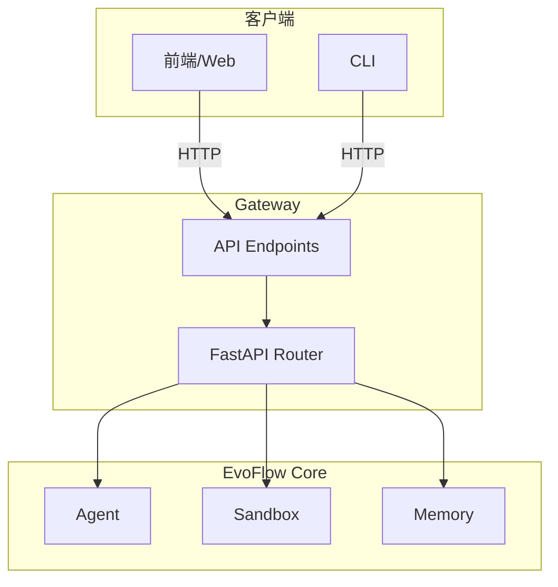

# 12-Gateway API 端点体系技术文档

## 一、概述

### 1.1 一句话理解

Gateway API 是 EvoFlow 的后端服务入口，提供 HTTP/REST 端点用于对话管理、文件上传、配置管理等核心功能，是前端与 EvoFlow 引擎之间的桥梁。

### 1.2 架构位置




## 二、核心端点

### 2.1 对话管理端点

| 端点 | 方法 | 说明 |
|------|------|------|
| `/api/threads` | POST | 创建新对话 |
| `/api/threads/{id}` | GET | 获取对话信息 |
| `/api/threads/{id}/messages` | POST | 发送消息 |
| `/api/threads/{id}/messages` | GET | 获取消息历史 |
| `/api/threads/{id}` | DELETE | 删除对话 |

### 2.2 文件上传端点

| 端点 | 方法 | 说明 |
|------|------|------|
| `/api/threads/{id}/uploads` | POST | 上传文件 |
| `/api/threads/{id}/uploads` | GET | 列出上传文件 |
| `/api/threads/{id}/uploads/{filename}` | DELETE | 删除文件 |
| `/api/threads/{id}/artifacts/{path}` | GET | 下载制品 |

### 2.3 配置管理端点

| 端点 | 方法 | 说明 |
|------|------|------|
| `/api/config` | GET | 获取配置 |
| `/api/config` | PUT | 更新配置 |
| `/api/models` | GET | 列出可用模型 |


## 三、API 实现

### 3.1 对话创建端点

**源码位置**: `backend/app/gateway/routers/threads.py`

```python
@router.post("/api/threads")
async def create_thread(
    request: CreateThreadRequest,
    background_tasks: BackgroundTasks,
) -> ThreadResponse:
    """创建新对话线程。
    
    Args:
        request: 创建请求，包含初始消息和配置
        
    Returns:
        创建的线程信息
    """
    # 生成 thread_id
    thread_id = generate_thread_id()
    
    # 初始化线程目录
    thread_data = ThreadDataState(thread_id=thread_id)
    ensure_thread_dirs(thread_id)
    
    # 创建初始状态
    initial_state = ThreadState(
        messages=[],
        thread_data=thread_data,
    )
    
    # 保存到数据库
    await db.threads.insert_one({
        "thread_id": thread_id,
        "title": None,
        "created_at": datetime.utcnow(),
        "updated_at": datetime.utcnow(),
    })
    
    return ThreadResponse(
        thread_id=thread_id,
        title=None,
        created_at=datetime.utcnow(),
    )
```

### 3.2 消息发送端点

```python
@router.post("/api/threads/{thread_id}/messages")
async def send_message(
    thread_id: str,
    request: SendMessageRequest,
    background_tasks: BackgroundTasks,
) -> StreamingResponse:
    """发送消息并获取流式响应。
    
    Args:
        thread_id: 对话线程 ID
        request: 消息请求
        
    Returns:
        SSE 流式响应
    """
    # 验证线程存在
    thread = await db.threads.find_one({"thread_id": thread_id})
    if not thread:
        raise HTTPException(status_code=404, detail="Thread not found")
    
    # 创建 Agent
    agent = make_lead_agent(
        config=RunnableConfig(configurable={
            "thread_id": thread_id,
            "model_name": request.model,
        })
    )
    
    # 流式执行
    async def event_generator():
        async for event in agent.astream({"messages": [HumanMessage(content=request.content)]}):
            yield f"data: {json.dumps(event)}\n\n"
    
    return StreamingResponse(
        event_generator(),
        media_type="text/event-stream",
    )
```

### 3.3 文件上传端点

```python
@router.post("/api/threads/{thread_id}/uploads")
async def upload_file(
    thread_id: str,
    file: UploadFile = File(...),
) -> UploadResponse:
    """上传文件到指定线程。
    
    Args:
        thread_id: 对话线程 ID
        file: 上传的文件
        
    Returns:
        上传结果，包含虚拟路径
    """
    # 验证线程
    validate_thread_id(thread_id)
    
    # 规范化文件名
    safe_filename = normalize_filename(file.filename)
    
    # 获取上传目录
    uploads_dir = ensure_uploads_dir(thread_id)
    
    # 处理文件名冲突
    existing_files = {f.name for f in uploads_dir.iterdir() if f.is_file()}
    unique_filename = claim_unique_filename(safe_filename, existing_files)
    
    # 保存文件
    file_path = uploads_dir / unique_filename
    with open(file_path, "wb") as f:
        shutil.copyfileobj(file.file, f)
    
    # 返回虚拟路径
    virtual_path = upload_virtual_path(unique_filename)
    
    return UploadResponse(
        filename=unique_filename,
        virtual_path=virtual_path,
        size=file_path.stat().st_size,
    )
```


## 四、流式响应

### 4.1 SSE 格式

```
data: {"type": "message", "role": "assistant", "content": "Hello"}

data: {"type": "tool_call", "name": "read_file", "args": {...}}

data: {"type": "tool_result", "name": "read_file", "content": "..."}

data: {"type": "message", "role": "assistant", "content": "Done"}

data: [DONE]
```

### 4.2 事件类型

| 类型 | 说明 |
|------|------|
| `message` | 文本消息 |
| `tool_call` | 工具调用开始 |
| `tool_result` | 工具执行结果 |
| `error` | 错误信息 |
| `done` | 完成标记 |


## 导航

**上一篇**：[11-子代理与任务执行技术文档](11-子代理与任务执行技术文档.md)  
**下一篇**：[13-IM 渠道集成技术文档](13-IM%20渠道集成技术文档.md)

> **文档版本**：v1.0  
> **最后更新**：2026-03-30  
> **作者**：银泰

📚 返回总览：[EvoFlow技术总览](01-EvoFlow技术总览.md)
