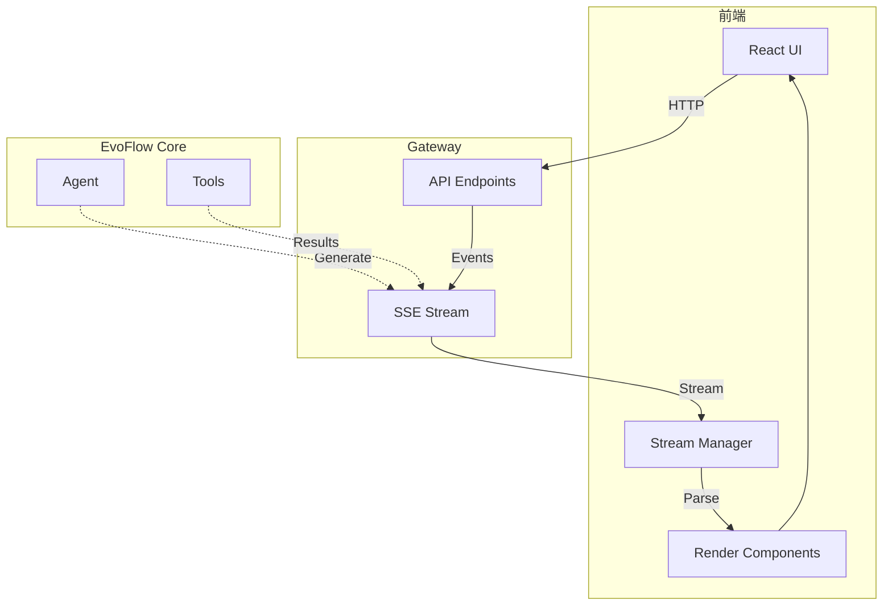

# 14-前端交互与流式渲染技术文档

## 一、概述

### 1.1 一句话理解

前端交互与流式渲染负责 EvoFlow 的用户界面展示，通过 Server-Sent Events (SSE) 实时接收 Agent 的执行过程和结果，提供流畅的对话体验和丰富的内容展示。

### 1.2 架构位置




## 二、核心概念

### 2.1 关键术语

| 术语 | 英文 | 说明 |
|------|------|------|
| SSE | Server-Sent Events | 服务器推送事件，单向流式通信 |
| 流式渲染 | Streaming Render | 边接收边展示，无需等待完整响应 |
| 事件解析 | Event Parsing | 解析 SSE 事件并更新 UI |
| 消息块 | Message Chunk | 流式传输的消息片段 |

### 2.2 渲染组件类型

| 组件 | 用途 |
|------|------|
| `TextMessage` | 文本消息展示 |
| `ToolCallCard` | 工具调用卡片 |
| `ToolResultPanel` | 工具结果面板 |
| `FilePreview` | 文件预览 |
| `ThinkingBlock` | 思考过程展示 |


## 三、流式通信

### 3.1 SSE 连接管理

```typescript
// 前端 SSE 连接管理
class StreamManager {
  private eventSource: EventSource | null = null;
  private callbacks: Map<string, Function> = new Map();

  connect(threadId: string): void {
    const url = `/api/threads/${threadId}/stream`;
    this.eventSource = new EventSource(url);

    this.eventSource.onmessage = (event) => {
      const data = JSON.parse(event.data);
      this.handleEvent(data);
    };

    this.eventSource.onerror = (error) => {
      console.error('SSE error:', error);
      this.reconnect(threadId);
    };
  }

  private handleEvent(event: StreamEvent): void {
    switch (event.type) {
      case 'message':
        this.emit('message', event);
        break;
      case 'tool_call':
        this.emit('tool_call', event);
        break;
      case 'tool_result':
        this.emit('tool_result', event);
        break;
      case 'done':
        this.emit('done', event);
        this.close();
        break;
    }
  }

  on(event: string, callback: Function): void {
    this.callbacks.set(event, callback);
  }

  private emit(event: string, data: any): void {
    const callback = this.callbacks.get(event);
    if (callback) callback(data);
  }

  close(): void {
    if (this.eventSource) {
      this.eventSource.close();
      this.eventSource = null;
    }
  }
}
```

### 3.2 事件类型定义

```typescript
interface StreamEvent {
  type: 'message' | 'tool_call' | 'tool_result' | 'error' | 'done';
  id?: string;
  timestamp: number;
}

interface MessageEvent extends StreamEvent {
  type: 'message';
  role: 'assistant';
  content: string;
  isThinking?: boolean;
}

interface ToolCallEvent extends StreamEvent {
  type: 'tool_call';
  tool_name: string;
  tool_call_id: string;
  args: Record<string, any>;
}

interface ToolResultEvent extends StreamEvent {
  type: 'tool_result';
  tool_call_id: string;
  tool_name: string;
  content: string;
  status: 'success' | 'error';
}
```


## 四、消息渲染

### 4.1 消息组件

```tsx
// 文本消息组件
const TextMessage: React.FC<{ content: string; isStreaming?: boolean }> = ({
  content,
  isStreaming,
}) => {
  return (
    <div className={`message ${isStreaming ? 'streaming' : ''}`}>
      <Markdown content={content} />
      {isStreaming && <span className="cursor">▋</span>}
    </div>
  );
};

// 工具调用卡片
const ToolCallCard: React.FC<{ tool: ToolCallEvent }> = ({ tool }) => {
  const [expanded, setExpanded] = useState(false);

  return (
    <div className="tool-call-card">
      <div className="tool-header" onClick={() => setExpanded(!expanded)}>
        <span className="tool-icon">🔧</span>
        <span className="tool-name">{tool.tool_name}</span>
        <span className="expand-icon">{expanded ? '▼' : '▶'}</span>
      </div>
      {expanded && (
        <div className="tool-args">
          <pre>{JSON.stringify(tool.args, null, 2)}</pre>
        </div>
      )}
    </div>
  );
};

// 工具结果面板
const ToolResultPanel: React.FC<{ result: ToolResultEvent }> = ({ result }) => {
  return (
    <div className={`tool-result ${result.status}`}>
      {result.status === 'success' ? (
        <pre>{result.content}</pre>
      ) : (
        <div className="error-message">{result.content}</div>
      )}
    </div>
  );
};
```

### 4.2 对话容器

```tsx
const ConversationContainer: React.FC<{ threadId: string }> = ({
  threadId,
}) => {
  const [messages, setMessages] = useState<Message[]>([]);
  const [isStreaming, setIsStreaming] = useState(false);
  const streamManager = useRef(new StreamManager());

  useEffect(() => {
    const sm = streamManager.current;

    sm.on('message', (event: MessageEvent) => {
      setMessages((prev) => [...prev, { type: 'text', content: event.content }]);
    });

    sm.on('tool_call', (event: ToolCallEvent) => {
      setMessages((prev) => [
        ...prev,
        { type: 'tool_call', tool: event },
      ]);
    });

    sm.on('tool_result', (event: ToolResultEvent) => {
      setMessages((prev) =>
        prev.map((msg) =>
          msg.type === 'tool_call' && msg.tool.tool_call_id === event.tool_call_id
            ? { ...msg, result: event }
            : msg
        )
      );
    });

    sm.on('done', () => {
      setIsStreaming(false);
    });

    sm.connect(threadId);

    return () => sm.close();
  }, [threadId]);

  return (
    <div className="conversation">
      {messages.map((msg, index) => (
        <MessageRenderer key={index} message={msg} />
      ))}
      {isStreaming && <StreamingIndicator />}
    </div>
  );
};
```


## 五、文件上传交互

### 5.1 上传组件

```tsx
const FileUpload: React.FC<{ threadId: string; onUpload: (files: File[]) => void }> = ({
  threadId,
  onUpload,
}) => {
  const [uploading, setUploading] = useState(false);
  const [progress, setProgress] = useState(0);

  const handleDrop = useCallback(
    async (files: FileList) => {
      setUploading(true);
      const uploadedFiles: File[] = [];

      for (const file of Array.from(files)) {
        const formData = new FormData();
        formData.append('file', file);

        const response = await fetch(`/api/threads/${threadId}/uploads`, {
          method: 'POST',
          body: formData,
        });

        if (response.ok) {
          uploadedFiles.push(file);
        }
      }

      onUpload(uploadedFiles);
      setUploading(false);
    },
    [threadId, onUpload]
  );

  return (
    <div
      className={`file-upload ${uploading ? 'uploading' : ''}`}
      onDrop={(e) => {
        e.preventDefault();
        handleDrop(e.dataTransfer.files);
      }}
      onDragOver={(e) => e.preventDefault()}
    >
      {uploading ? (
        <ProgressBar progress={progress} />
      ) : (
        <>
          <span>📎</span>
          <span>拖放文件或点击上传</span>
        </>
      )}
    </div>
  );
};
```


## 六、最佳实践

### 6.1 性能优化

1. **虚拟滚动**：长对话使用虚拟滚动
2. **防抖渲染**：高频事件节流处理
3. **增量更新**：只更新变化的部分

### 6.2 错误处理

```typescript
// 连接断开自动重连
private reconnect(threadId: string, attempt: number = 0): void {
  const maxAttempts = 5;
  const delay = Math.min(1000 * Math.pow(2, attempt), 30000);

  if (attempt < maxAttempts) {
    setTimeout(() => {
      console.log(`Reconnecting... attempt ${attempt + 1}`);
      this.connect(threadId);
    }, delay);
  } else {
    this.emit('error', { message: 'Max reconnection attempts reached' });
  }
}
```


## 导航

**上一篇**：[13-IM 渠道集成技术文档](13-IM%20渠道集成技术文档.md)  
**下一篇**：无

> **文档版本**：v1.0  
> **最后更新**：2026-03-30  
> **作者**：银泰

📚 返回总览：[EvoFlow技术总览](01-EvoFlow技术总览.md)
