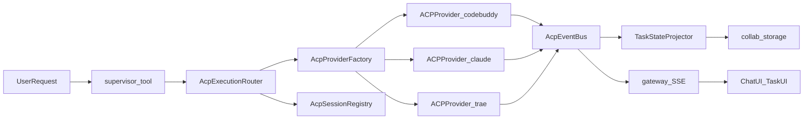
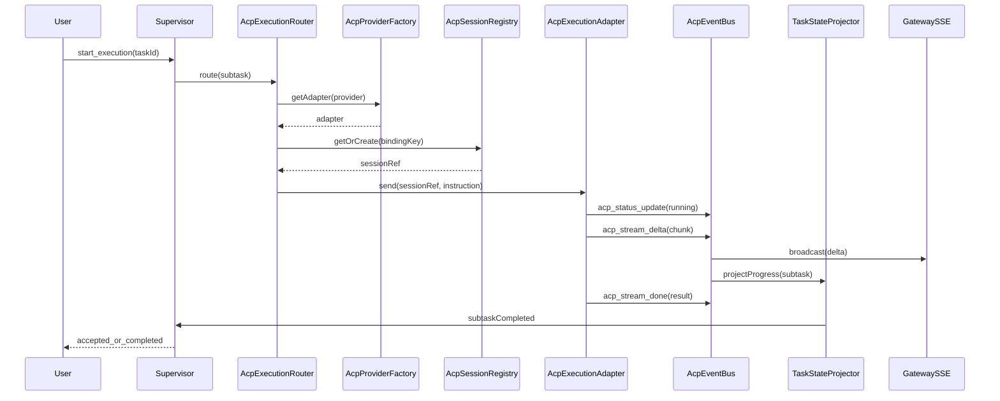
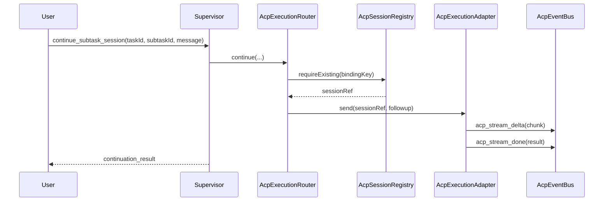
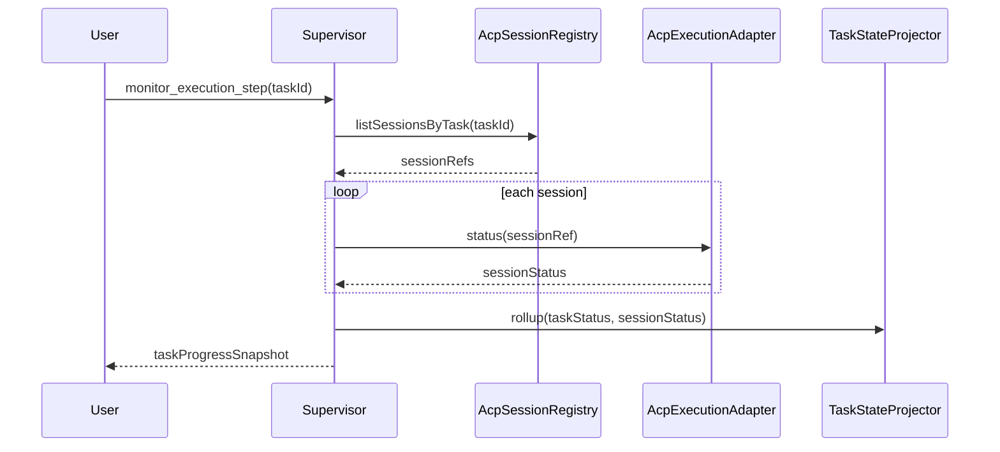
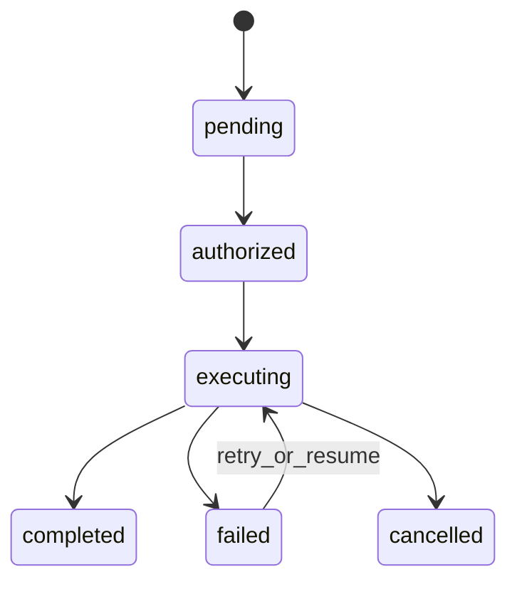
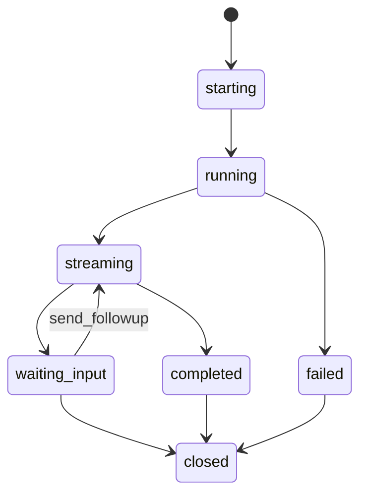

# 15-Supervisor统一外部执行器架构设计（ACP-Only）

## 一、文档定位

### 1.1 背景

本方案将 Supervisor 外部执行能力收敛为 **单一 ACP 控制面**：

- `codebuddy` 通过 ACP 接入
- `claude` 通过 ACP 适配器接入
- `trae` 通过 ACP 适配器接入

结论：Supervisor 不再维护“Trae 专线”和“Claude 专线”，统一按 **ACP Provider** 编排。

### 1.2 范围

- 本文仅做架构设计，不改实现代码。
- 重点是 `supervisor` 内的统一路由、会话复用、状态观测、流式协议。
- 保留现有对外 API 语义，内部逐步迁移到 ACP-only。

---

## 二、ACP-Only 目标架构

### 2.1 总览

### 2.2 核心原则

1. **单一执行协议**：外部执行统一走 ACP。
2. **Supervisor 单一路由**：按 `assigned_to -> acp provider` 解析，不按工具分支。
3. **会话可复用**：同 `thread_id/task_id/subtask_id/provider` 绑定复用会话。
4. **流式统一**：所有 provider 输出统一事件，前端统一消费。

---

## 三、现状与迁移目标

### 3.1 当前链路（现状）

- `supervisor/execution + task_tool` 作为主编排。
- `claude_session_tool`、`trae_tool`、`invoke_acp_agent_tool` 并存。
- ACP 已可调用，但目前偏“聚合返回”，会话级状态与持续会话能力不足。

### 3.2 目标链路（迁移后）

- Supervisor 只调用 `AcpExecutionRouter`。
- Router 只调用 `AcpProviderFactory + ApcSessionRegistry`。
- Provider 不暴露差异给 Supervisor，仅暴露统一 ACP 会话语义。

---

## 四、统一抽象定义（ACP Domain）

### 4.1 `AcpExecutionAdapter`（概念接口）

统一动作：

- `createSession(context)`
- `send(sessionRef, instruction)`
- `read(sessionRef, cursor)`
- `status(sessionRef)`
- `cancel(sessionRef)`
- `close(sessionRef)`

说明：`resume` 通过 `createSession/getOrResume` 语义内聚，避免动作冗余。

### 4.2 统一实体

#### A. 会话标识

- `supervisorSessionId`: Supervisor 域会话 ID
- `acpSessionId`: ACP 原生 session ID
- `provider`: `codebuddy | claude | trae | other`
- `bindingKey`: `thread_id + task_id + subtask_id + provider`

#### B. 执行上下文

- `agent_name`: 对应 `acp_agents.<name>`
- `workspace_strategy`: `isolated | shared`
- `stream_strategy`: `delta_first | aggregate_only`

### 4.3 ACP Provider 能力矩阵

| 能力 | codebuddy | claude(acp) | trae(acp) |
|------|-----------|-------------|-----------|
| ACP 协议可用 | 是 | 是（经 ACP 适配） | 是（经 ACP 适配） |
| 会话复用 | 目标支持 | 目标支持 | 目标支持 |
| 流式 chunk | 协议支持 | 协议支持 | 协议支持 |
| 状态查询 | 需统一投影 | 需统一投影 | 需统一投影 |

---

## 五、Supervisor 编排模型（核心）

### 5.1 统一路由策略

在 `start_execution`、`continue_subtask_session`、`monitor_execution_step` 中统一：

1. 解析 `assigned_to` 为 ACP provider 名称。
2. 调用 `AcpProviderFactory` 获取 adapter。
3. 通过 `AcpSessionRegistry` 获取或创建会话。
4. 将 ACP 事件投影为 task 状态并广播到 SSE。

### 5.2 时序图：`start_execution`

### 5.3 时序图：`continue_subtask_session`

### 5.4 时序图：`monitor_execution_step`

---

## 六、状态机设计

### 6.1 任务状态机（Supervisor）

### 6.2 ACP 会话状态机

### 6.3 状态投影规则

- 会话状态是实时执行态，任务状态是编排聚合态。
- `acp_stream_done` 不直接等于主任务完成，仍需依赖/子任务收敛判定。
- `monitor_execution_step` 返回 task 与 session 双视角。

---

## 七、统一流式事件协议（ACP）

### 7.1 事件族

- `acp_status_update`
- `acp_stream_delta`
- `acp_stream_done`
- `acp_stream_error`

### 7.2 事件负载建议

- `provider`
- `supervisorSessionId`
- `acpSessionId`
- `task_id`
- `subtask_id`
- `chunk` 或 `result`
- `timestamp`

### 7.3 兼容策略

- 迁移期保留 `task_running/task_completed/task_failed`。
- 原 `trae_stream_*`、`claude` 专有事件逐步映射为 `acp_*`，最终退场。

---

## 八、工厂与注册中心

### 8.1 `AcpProviderFactory`

职责：

- 按 provider 返回 ACP adapter。
- 统一读取 `acp_agents` 配置（命令、环境、权限策略）。
- 统一注入 `AcpEventBus`、`AcpSessionRegistry`。

### 8.2 `AcpSessionRegistry`

职责：

- 管理 `bindingKey -> supervisorSessionId -> acpSessionId`。
- 支持 `getOrCreate`、`requireExisting`、`close`。
- 支持跨请求恢复（由存储层恢复绑定关系）。

### 8.3 `AcpExecutionRouter`

职责：

- 解析 `assigned_to` 到 ACP provider。
- 统一执行策略（会话复用、流式输出、异常兜底）。
- 对 Supervisor 输出一致的执行结果结构。

---

## 九、分阶段落地路线（只描述，不实施）

### Phase A：ACP 统一规范

- 冻结 `AcpExecutionAdapter` 和 `acp_*` 事件协议。
- 明确 `assigned_to -> provider` 映射规则。

### Phase B：Supervisor 接管

- 在 Supervisor 引入 `AcpExecutionRouter` 作为唯一外部执行入口。
- 保持原有工具接口向后兼容。

### Phase C：Provider 收敛

- 将 Claude/Trae 路径迁移为 ACP provider。
- legacy 事件仅保留兼容双写。

### Phase D：清理收口

- 下线 provider 专线逻辑（非 ACP）。
- 前端默认消费 `acp_*` 事件。

---

## 十、风险与约束

1. ACP provider 的能力并非天然一致，状态语义需标准化映射。
2. 流式链路多路并行，需防重复事件和顺序漂移。
3. 会话复用必须与任务绑定一致，避免跨任务串会话。
4. 迁移期必须双写事件，避免前端一次性断层。

---

## 十一、验收标准（文档阶段）

1. Supervisor 外部执行架构明确为 ACP-only。
2. 文档包含 1 个总览流程图 + 3 个关键时序图 + 2 个状态机图。
3. 明确抽象接口、事件协议、迁移策略与风险控制。
4. 不包含代码改动说明，不引入行为变更。

---

## 十二、术语

| 术语 | 定义 |
|------|------|
| ACP Provider | 通过 ACP 协议提供执行能力的外部代理 |
| AcpExecutionAdapter | ACP 统一执行接口适配层 |
| AcpSessionRegistry | 会话绑定与复用注册中心 |
| AcpEventBus | ACP 流式与状态事件总线 |
| TaskStateProjector | 会话事件到任务状态的投影模块 |

