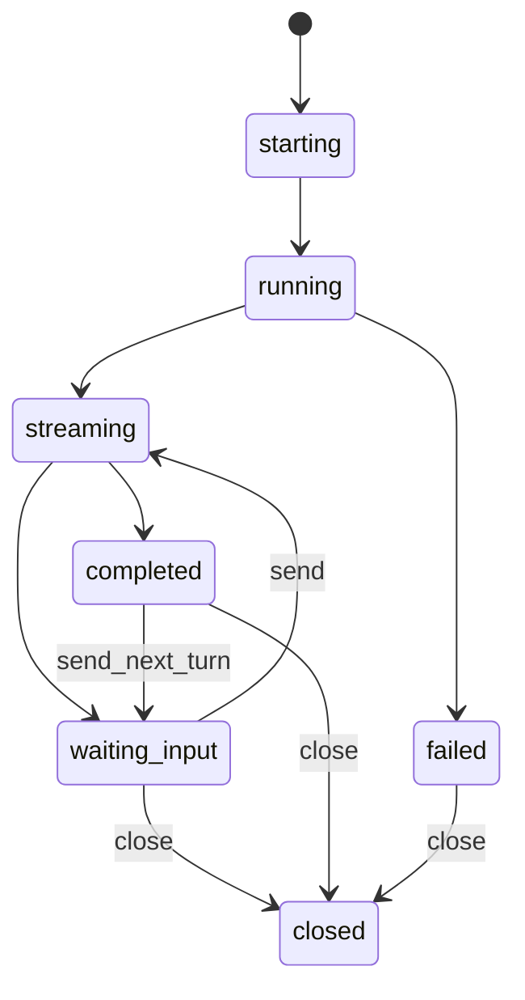
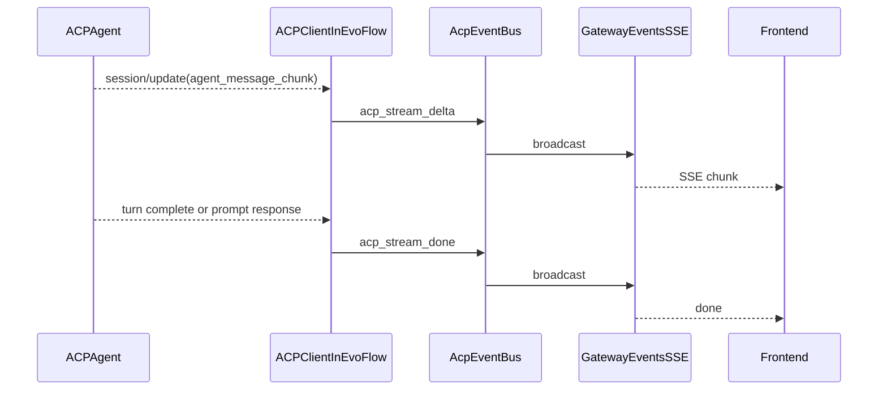
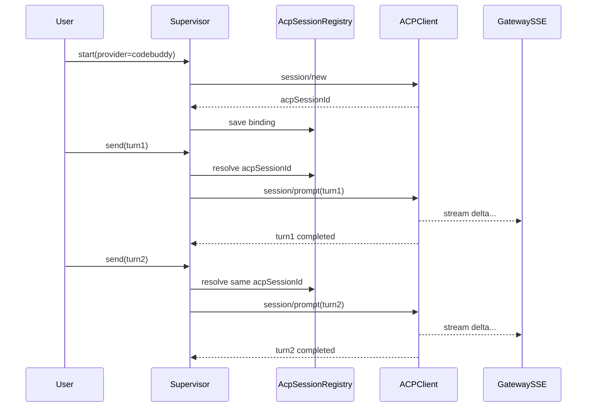

# 16-ACP同会话流式与状态查询设计

## 一、目的

本文聚焦 ACP 场景下三个核心能力的统一设计：

1. 同一个 ACP 会话中多轮对话（会话复用）
2. 面向前端实时流式返回（delta/chunk）
3. 会话与任务状态查询（可监控、可恢复）

目标是作为 `supervisor` 与 ACP-only 架构的实施补充文档，明确“能否做、怎么做、改哪些边界”。

---

## 二、协议与产品事实基线

## 2.1 ACP 协议层（官方）

根据 ACP Session Setup 文档，协议具备以下关键能力：

- `session/new`：创建新会话
- `session/load`：加载会话并回放历史（要求代理支持 load 能力）
- `session/resume`：恢复会话且不回放历史（要求代理支持 resume 能力）
- `session/prompt`：在指定 session 上发起新一轮
- `session/update`：以通知形式推送增量（文本、工具调用、模式、会话信息等）
- `session/close`：关闭会话（如果代理支持）

这意味着“同会话多轮 + 流式更新”在协议层是成立的，重点在客户端实现是否持久化会话并转发更新事件。

## 2.2 CodeBuddy ACP 层（官方）

CodeBuddy `codebuddy --acp` 已明确支持 ACP，且有以下增强：

- 会话更新与命令列表推送
- Agent Teams 状态事件（通过 `_meta`）
- 成员消息实时推送（通过标准 ACP 事件 + `_meta` 标签）

这意味着 CodeBuddy 并不阻碍“同会话复用与状态观测”；关键仍在 EvoFlow 的会话管理与事件总线。

---

## 三、EvoFlow 当前实现评估

当前实现入口：`backend/packages/harness/evoflow/tools/builtins/invoke_acp_agent_tool.py`

## 3.1 已支持

- 能启动 ACP 进程并执行 `new_session + prompt`
- 能在 `session_update()` 中收集流式文本 chunk
- 能按 thread 隔离 ACP workspace
- 能处理 permission 请求（自动批准/拒绝）

## 3.2 当前缺口

1. **会话未复用**  
   每次都执行 `new_session()`，没有保存 `session_id` 并在后续 prompt 复用。

2. **流式只“内部收集”，不“对外流出”**  
   chunk 被累计到 `client._chunks`，最终一次性返回字符串；前端看不到实时 delta。

3. **缺少会话状态查询面**  
   没有 `acp session` 维度的状态存储与查询 API，无法回答 running/waiting_input/completed。

4. **缺少会话生命周期控制动作**  
   工具接口只有 `agent + prompt`，没有 `start/send/status/close/cancel` 动作语义。

---

## 四、目标能力定义（ACP 会话控制面）

## 4.1 目标接口语义

建议新增统一 ACP 会话工具（或升级现有工具）支持动作：

- `start`: 创建 ACP 会话并绑定到 supervisor 上下文
- `send`: 在现有会话发送下一轮 prompt
- `status`: 查询会话状态与指标
- `read`: 拉取会话增量/最近输出（用于补偿）
- `close`: 正常关闭会话
- `cancel`: 中断当前运行轮次

## 4.2 会话绑定模型

```text
binding_key = thread_id + task_id + subtask_id + provider
supervisor_session_id -> acp_session_id
```

同一个 `binding_key` 的后续对话应优先走同一 `acp_session_id`。

---

## 五、数据模型与状态机

## 5.1 建议会话实体

```json
{
  "supervisorSessionId": "ssn_xxx",
  "provider": "codebuddy",
  "acpSessionId": "sess_xxx",
  "threadId": "thread_xxx",
  "taskId": "task_xxx",
  "subtaskId": "subtask_xxx",
  "status": "running",
  "turnIndex": 3,
  "startedAt": "2026-04-24T11:00:00Z",
  "lastChunkAt": "2026-04-24T11:00:04Z",
  "lastCompletedAt": null,
  "lastError": null
}
```

## 5.2 会话状态机



## 5.3 任务状态投影规则

- ACP 会话状态用于“执行过程可视化”
- Task 状态用于“编排收敛语义”
- `acp_stream_done` 不等于主任务完成，仍需依赖图收敛判定

---

## 六、流式返回设计

## 6.1 统一事件族（建议）

- `acp_status_update`
- `acp_stream_delta`
- `acp_stream_done`
- `acp_stream_error`

## 6.2 事件负载建议

```json
{
  "provider": "codebuddy",
  "supervisorSessionId": "ssn_xxx",
  "acpSessionId": "sess_xxx",
  "task_id": "task_xxx",
  "subtask_id": "subtask_xxx",
  "turn_index": 3,
  "chunk": "partial text...",
  "timestamp": "2026-04-24T11:00:03Z"
}
```

## 6.3 流式链路



说明：ACP 协议层“turn complete”语义在不同实现中细节可能不同，EvoFlow 需以“prompt 响应完成 + update 队列清空策略”做稳态收敛。

---

## 七、同会话多轮对话设计

## 7.1 设计原则

1. `start` 创建并持久化 `acpSessionId`
2. `send` 必须显式携带 `supervisorSessionId`（或通过 binding 自动解析）
3. `send` 失败时不立即丢弃会话，先转 `failed` 允许重试/恢复
4. `close` 只释放会话资源，不删除历史状态记录（便于审计）

## 7.2 多轮时序



---

## 八、状态查询设计

## 8.1 查询维度

- 按 `supervisorSessionId` 查询会话详情
- 按 `task_id` 列出全部 ACP 会话
- 按 `thread_id` 查询会话与最近活动

## 8.2 建议查询返回

```json
{
  "supervisorSessionId": "ssn_xxx",
  "provider": "codebuddy",
  "status": "streaming",
  "turnIndex": 2,
  "startedAt": "...",
  "lastChunkAt": "...",
  "lastCompletedAt": "...",
  "metrics": {
    "chunkCount": 128,
    "toolCallCount": 5,
    "inputTokens": 1000,
    "outputTokens": 700
  }
}
```

## 8.3 与 Supervisor 监控结合

- `monitor_execution_step` 返回 task 进度时附带 `sessions` 摘要
- 前端任务侧栏同时显示：
  - Task 状态（编排层）
  - ACP Session 状态（执行层）

---

## 九、与当前代码对照（落地锚点）

可直接利用的现有点：

1. `invoke_acp_agent_tool.py` 的 `_CollectingClient.session_update`（已有 chunk 捕获点）
2. `thread_id -> acp workspace`（已有隔离目录策略）
3. gateway 现有 SSE 广播链路（`events.py`）

需要新增/增强的点：

1. 会话注册中心（持久化 `supervisorSessionId <-> acpSessionId`）
2. 动作化 ACP 工具接口（`start/send/status/read/close/cancel`）
3. `session_update -> SSE` 实时转发
4. 会话状态存储与查询 API

---

## 十、风险与注意事项

1. **协议差异风险**  
   不同 ACP agent 对 `load/resume/close` 能力支持不同，需 capability 探测。

2. **流完成边界风险**  
   需要避免“prompt 已返回但晚到 chunk 未消费完”的竞态。

3. **事件重复风险**  
   与现有 task/legacy 流并行时要做事件去重和顺序控制。

4. **状态一致性风险**  
   进程重启后会话注册恢复策略需明确，否则会话“存在但不可寻址”。

---

## 十一、建议实施顺序（最小可行）

### Phase 1（最小可见）

- 在现有 `invoke_acp_agent` 上增加 `session_update -> SSE delta` 输出
- 不改动作模型，先实现实时流可见

### Phase 2（会话复用）

- 增加 `start/send/close/status` 动作接口
- 引入 `AcpSessionRegistry` 绑定与复用

### Phase 3（状态查询与监控）

- 新增 ACP 会话查询 API
- `monitor_execution_step` 集成会话状态摘要

### Phase 4（全面收敛）

- 将 Trae/Claude 统一迁移为 ACP provider
- Supervisor 仅保留 ACP 执行路径

---

## 十二、结论

从协议能力、CodeBuddy ACP 特性和 EvoFlow 当前实现看：

- “同会话多轮 + 流式返回 + 状态查询”在架构上完全可达成；
- 当前缺口主要在 EvoFlow 客户端控制面，而不是 ACP 协议本身；
- 建议按“先流式可见、再会话复用、后状态查询”的顺序迭代，风险最小。

