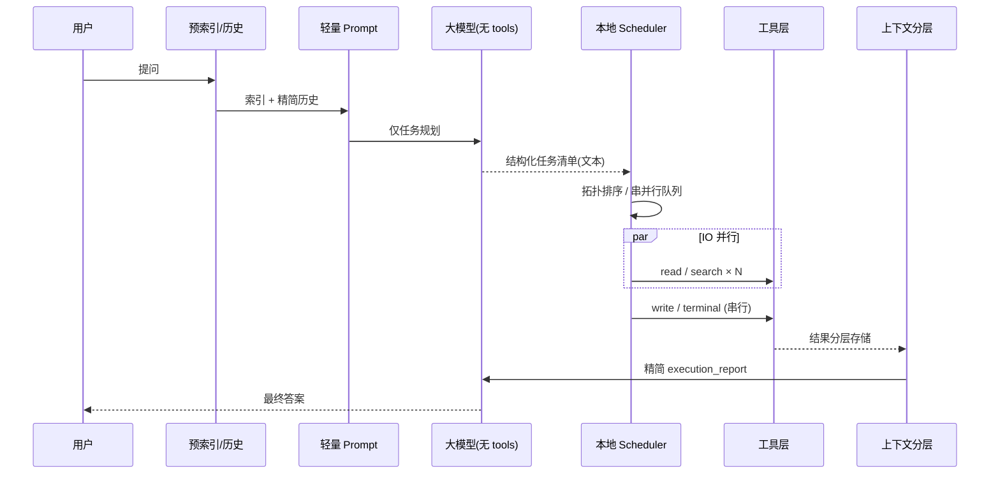
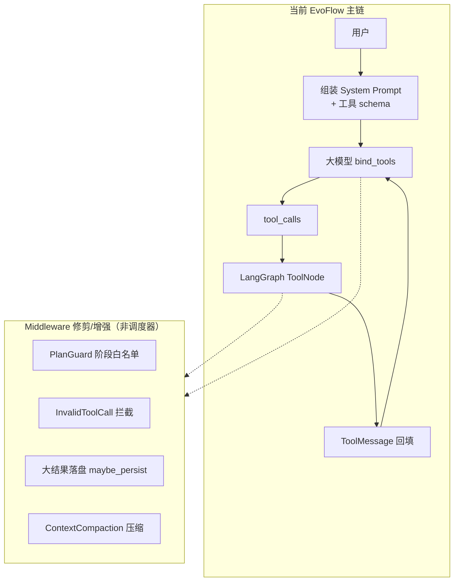
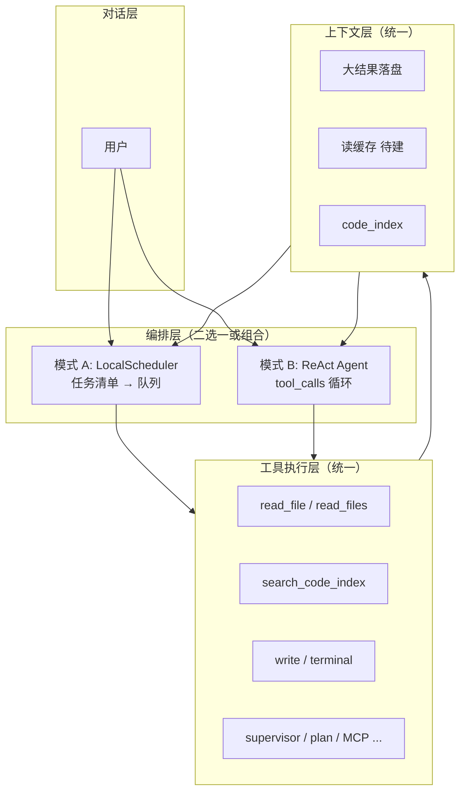
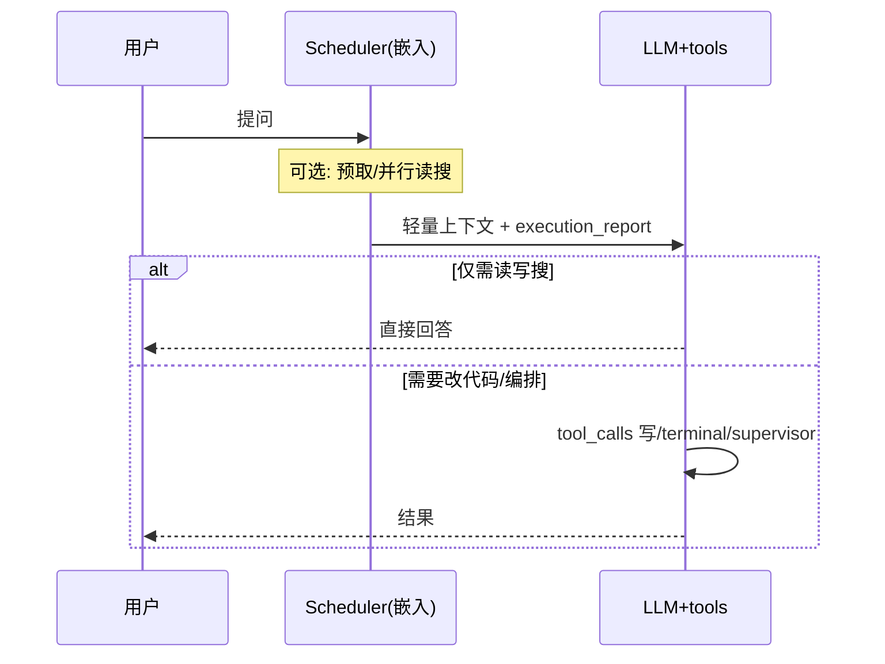
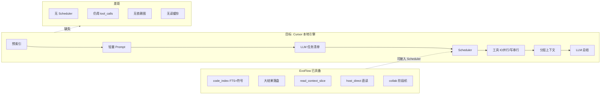
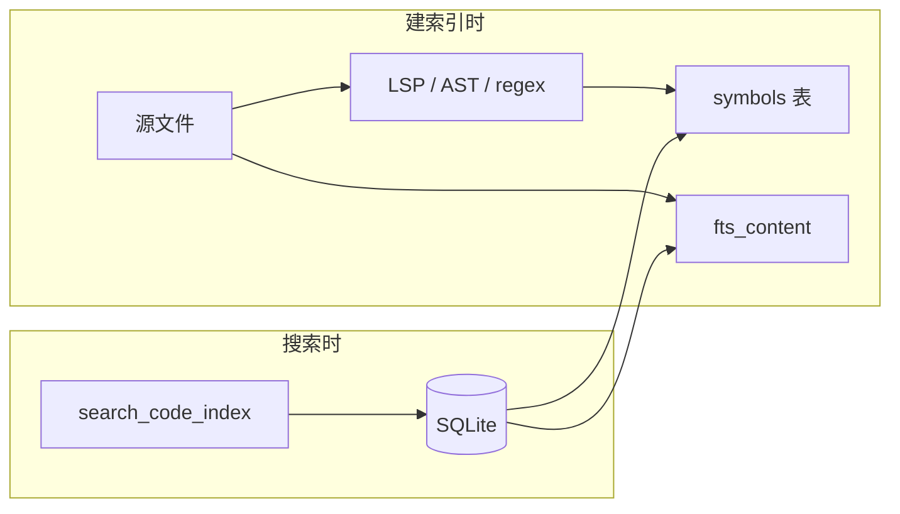
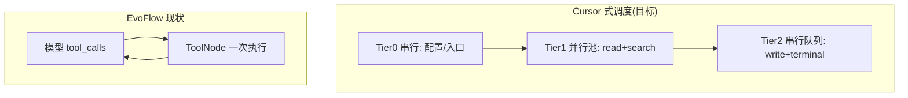
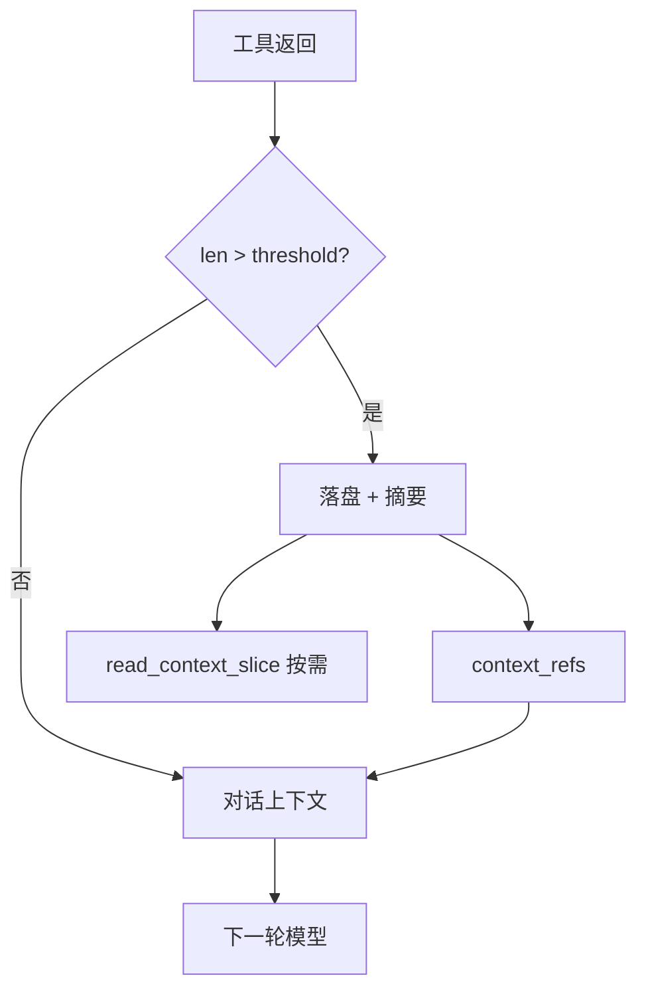
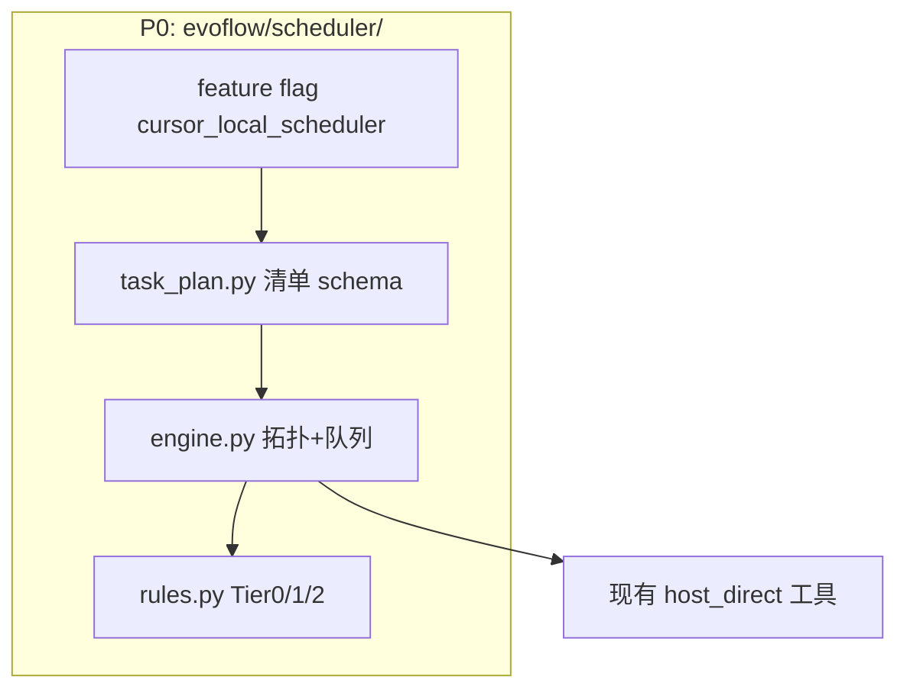

# 17 — Cursor 本地调度引擎对标：差距分析与路线图

> **文档目的**：对照「Cursor 式本地调度」目标架构，说明 EvoFlow **已实现**、**部分实现**与**未实现**的能力；明确 **Scheduler 模式与现有 tool_calls 模式并存**（非全盘替换）；并给出优先路线图（含架构图）。  
> **读者**：架构 / Harness / 工具链 / 追求「工具调用像 Cursor 一样快」的研发。  
> **状态**：2026-05 基线（基于当前 `backend/packages/harness` 与 `config.example.yaml`）。

---

## 一、目标架构（规格摘要）

### 1.1 分层

| 层级 | 职责 |
|------|------|
| **上层对话层** | 用户输入、多轮对话、最终回答呈现 |
| **本地自研调度引擎层** | 解析任务意图、拓扑排序、串行/并行队列、容错与回填 |
| **工具执行层** | `read_file`、代码搜索、写文件、终端等 |
| **大模型推理层** | 只做「想什么」与「要什么」，**不控制执行顺序** |

### 1.2 核心规则（规格要求）

1. **禁止**大模型输出标准 Function Call / `tool_calls` JSON；模型只输出**自然语言结构化任务清单**（读哪些文件、搜什么、执行什么）。
2. **本地调度引擎**全权接管：先后顺序、并发、串行、重试。
3. **调度策略**  
   - 依赖前置任务**强制串行**（配置、全局依赖等）  
   - 无依赖 **IO 类**（读文件、搜索）**批量并行**，受全局并发上限约束  
   - **修改类、命令行类**全部**串行排队**  
4. **上下文**：小结果进对话；大结果落盘 + 路径 + 摘要，按需分片读。  
5. **读文件缓存**：短时间去重，避免重复 IO。  
6. **工具容错**：失败由调度层处理/重试，**默认不回灌**大模型重新规划。

### 1.3 标准交互流（目标）



---

## 二、EvoFlow 现状架构

### 2.1 实际主链（LangGraph ReAct + 原生工具调用）

当前 Lead Agent 使用 LangChain `create_agent`：**每轮模型绑定 `tools` schema，输出 `AIMessage.tool_calls`，由 LangGraph `ToolNode` 执行**。



### 2.2 与目标架构的差异（一句话）

| 维度 | Cursor 式目标 | EvoFlow 现状 |
|------|----------------|--------------|
| 模型输出 | 任务清单文本 | **`tool_calls` JSON** |
| 执行控制 | 本地 Scheduler | **LangGraph ToolNode + Middleware** |
| 交互范式 | Plan → Schedule → Execute → Summarize | **ReAct 循环** |

> **结论**：上下文与索引已有较多 Cursor 式能力；**「本地调度引擎 + 禁止 Function Call」整层尚未建立**，因此工具体感仍接近通用 Agent，难以达到 Cursor 级「读盘飞快、写盘有序」。

---

## 三、双模式共存（推荐产品形态）

**你的理解是对的：不应「全盘替换」原有工具模式，而是两种编排并存，共用同一套工具实现。**

### 3.1 两种模式分别解决什么

| 模式 | 编排方式 | 模型输出 | 适用场景 |
|------|----------|----------|----------|
| **A. 本地调度模式**（Cursor 式） | `LocalToolScheduler` 解析任务清单，管串行/并行 | 结构化 **任务清单**（无 `tool_calls`） | 大范围读盘、并发搜索、预取上下文、首包要快 |
| **B. 工具模式**（现有 ReAct） | LangGraph `tool_calls` → ToolNode | **Function Call / tool_calls** | 精确单步修改、澄清问答、`supervisor`/`plan`、MCP、子代理、强交互分支 |

二者不是二选一的产品路线，而是 **同一工具层、两种编排入口**。

### 3.2 推荐分层（统一底座 + 双编排）



**要点**：

- **统一走「工具实现」这一口子**：`read_file`、`search_code_index` 等只实现一次；调度器与 ReAct 都调用同一套函数（或同一 `ToolExecutor` 适配层）。
- **不统一走「编排」这一口子**：Plan 协作、子代理、`ask_clarification` 等仍适合模式 B；代码库探索、批量取证适合模式 A。

### 3.3 组合策略（比「只留一种」更接近 Cursor）

即使在模式 B 的对话里，也可以 **嵌入模式 A 的能力**，而不必整会话切换：

| 组合 | 行为 |
|------|------|
| **Prefetch 包** | 用户发问后、首轮 LLM 前：调度器按索引 **并行预读** Top-N 文件，结果写入 `execution_report` 再进 Prompt |
| **Scheduler 批处理一轮** | 模型输出任务清单 → 调度器跑完读/搜 → 第二轮模型带 tool 只负责写/改 |
| **纯 ReAct** | 小改动、单文件、明确「调用某工具」时保持现有 `tool_calls` |



### 3.4 配置与默认策略（建议）

```yaml
# 建议未来 config（示意）
agent_orchestration:
  default: react                    # react | local_scheduler | hybrid
  hybrid:
    prefetch_on_chat: true          # 模式 B 下仍跑并行预取
    scheduler_for_read_search_only: true  # 读/搜走调度器，写/跑命令仍 tool_calls
  local_scheduler:
    max_io_concurrency: 8
  react:
    enabled: true                   # 始终保留
```

| 策略 | 说明 |
|------|------|
| **默认** | 保持 `react`，避免破坏现有 Plan / Supervisor / 全工具生态 |
| **代码工作台场景** | EvoPanel 绑定工作区后可切 `hybrid` 或 `local_scheduler`（偏快） |
| **长期** | 不是「全部迁到 scheduler」，而是 **hybrid 成为主路径**，ReAct 负责「决策与副作用」 |

### 3.5 回答「后续都统一走调度口子吗？」

| 层级 | 是否统一 | 说明 |
|------|----------|------|
| 工具实现（read/search/write） | **是** | 一套 host_direct / builtins |
| 编排（谁决定顺序、是否并发） | **否，双轨** | Scheduler vs ReAct，按场景选或 hybrid |
| 上下文（落盘/压缩/refs） | **是** | 两种模式共用 |
| 协作阶段（plan/verify/reflect） | **偏 B** | 阶段机与 `tool_calls` 深度耦合，短期不强行迁入 A |

---

## 四、架构对照总图



---

## 五、分项完成度矩阵

### 5.1 项目预索引

| 子项 | 状态 | EvoFlow 实现 | 差距 |
|------|------|--------------|------|
| tree-sitter 全项目 AST | **部分** | 可选 `tree-sitter-languages`（JS/TS）；Python `ast`；LSP `documentSymbol` | 无统一 tree-sitter 管线 |
| 文件依赖图谱 | **未做** | — | `code_index` 无 import/依赖边 |
| 函数引用关系 | **未做** | `symbols` 表仅 (path, name, line) | 无 cross-file references |
| 目录结构索引 | **有** | `list_dir` + FTS 路径 | — |
| 本地持久化 | **有** | `$EVOFLOW_DATA_DIR/code_index/<hash>.db` | — |
| 增量 / 监听 | **有** | watcher、`index-file`、写文件 hook | — |

**助手检索入口**：工具 `search_code_index`（查已建库，非实时 AST）。  
**配置**：`config.yaml` → `code_index`；`javalang` / `tree-sitter-languages` 随 harness 默认依赖安装；LSP 需 `pyright-langserver` 等。



---

### 5.2 意图解析（禁止 Function Call）

| 子项 | 状态 | 说明 |
|------|------|------|
| 固定格式任务清单 | **未做** | 无 `<task_plan>` / YAML 等强制 schema |
| 解析 NL → 内部 TaskOp | **未做** | — |
| 禁止 `tool_calls` | **未做** | Lead Agent 仍 `bind_tools` |

现有最接近能力：**Plan / Supervisor 协作阶段**（`planning` → `executing` → `verifying` → `reflecting`），属于**项目编排**，不是**每轮工具的任务清单**。

---

### 5.3 本地调度核心规则（速度关键）

| 规则 | 状态 | EvoFlow 现状 |
|------|------|--------------|
| ① 依赖前置、配置类串行 | **未做** | 无拓扑排序；无「先读 package.json / pyproject」策略 |
| ② 无依赖 IO 批量并行 | **弱** | 同一条 `tool_calls` 可能由 LangGraph 并行；**无**显式读/搜线程池；**无** `read_files([])` 批量 API |
| ③ 写/终端强制串行队列 | **未做** | 读/写可在同轮混合执行 |
| ④ 全局最大 IO 并发 | **仅局部** | `SubagentLimitMiddleware` 只限制 `task` 子代理数量 |



**体感慢的主要原因**：多轮 LLM round-trip；无「一轮打满只读 IO」；无读缓存；索引未驱动 prefetch。

---

### 5.4 上下文管理（Cursor 灵魂逻辑）

| 子项 | 状态 | 模块 / 配置 |
|------|------|-------------|
| 小结果直接进对话 | **有** | `tool_results.threshold_chars` 以下 inline |
| 大结果落盘 + 摘要 + 路径 | **有** | `large_result_store.maybe_persist` |
| 按需分片读 | **有** | `read_context_slice` |
| 压缩后 refs 保留 | **有** | `ContextReferenceMiddleware`、`context_refs` LRU |
| 长对话压缩 | **有** | `ContextCompactionMiddleware`（`summarization.enabled`） |
| 对话锚点 | **有** | `<turn_context>`、`session_intent` |
| 工具时间线检索 | **有** | `search_tool_trace`；`GET /api/threads/{id}/tool-timeline` |



> 此项与 Cursor **对齐度最高**，近期已持续补强。

---

### 4.5 本地文件读取缓存

| 子项 | 状态 | 模块 |
|------|------|------|
| path + mtime LRU / TTL | **有** | `evoflow/context/file_read_cache.py` |
| `read_file_hd` | **有缓存** | `read_logic.py`；写盘经 `notify_tool_result` invalidate |
| `read_files` 批量读 | **有** | `host_direct/read_files.py` |

---

### 4.6 工具容错

| 子项 | 状态 | 模块 |
|------|------|------|
| 异常 → ToolMessage，对话可继续 | **有** | `ToolErrorHandlingMiddleware` |
| invalid JSON tool call 拦截 | **有** | `InvalidToolCallMiddleware` |
| 本地自动重试 / 降级（不回模型） | **基本未做** | 仍依赖模型读错误再决策 |
| 工具调用时间线 | **有** | observability SQLite + `search_tool_trace` |

---

### 4.7 已实现但不在 Cursor 规格清单内的能力

| 能力 | 说明 |
|------|------|
| **Collab 阶段机** | `planning` / `executing` / `verifying` / `reflecting` / `done`；`PlanGuardMiddleware` 工具白名单 |
| **host_direct** | 直读本地盘，无沙箱开销（读文件快的前提） |
| **Deferred tools** | `tool_search` 延迟加载工具 schema，省 context |
| **DCD 提示块** | `CONTEXT_DISCOVERY_BLOCK` 引导 `search_code_index`、落盘路径 |

---

## 五、完成度总表

| 规格章节 | 完成度 | 说明 |
|----------|--------|------|
| 分层：调度引擎取代 FC | **~35%** | hybrid 默认：prefetch + ReAct；`local_scheduler` 可选 `<task_plan>` |
| （1）预索引 | **~45%** | FTS+符号+LSP；无依赖图/引用图 |
| （2）意图解析 | **~25%** | `<task_plan>` JSON（local_scheduler）；hybrid 无强制清单 |
| （3）调度规则 | **~50%** | `evoflow/scheduler/` Tier0/1/2；写/终端串行 |
| （4）上下文管理 | **~85%** | 落盘/分片/压缩/refs 齐全 |
| （5）读缓存 | **~80%** | LRU+TTL；写后 invalidate |
| （6）本地容错闭环 | **~40%** | 读重试、搜 FTS 降级（scheduler/retry.py） |
| 标准交互流 | **~45%** | hybrid：Prefetch→Model→tool_calls；非纯 Planner 无 tools |

---

## 六、代码与配置索引（现状）

|  Concern | 路径 |
|----------|------|
| Lead Agent 入口 | `evoflow/agents/lead_agent/agent.py` |
| 工具绑定 | `create_agent` + `evoflow/tools/tools.py` |
| 代码索引 | `evoflow/code_index/` |
| 大结果落盘 | `evoflow/tools/large_result_store.py` |
| 上下文压缩 | `evoflow/agents/context_compaction_core.py` |
| Plan 阶段门禁 | `evoflow/agents/middlewares/plan_guard_middleware.py` |
| Collab 阶段 | `evoflow/collab/models.py`（含 `reflecting`） |
| 工具时间线 | `evoflow/context/tool_timeline.py` |
| 编排模式 / 读缓存 | `evoflow/config/agent_orchestration_config.py` |
| 本地调度引擎 | `evoflow/scheduler/`（`engine.py`、`task_plan.py`、`rules.py`） |
| Hybrid 预取 | `evoflow/agents/middlewares/prefetch_scheduler_middleware.py` |
| local_scheduler 执行 | `evoflow/agents/middlewares/scheduler_orchestration_middleware.py` |
| 示例配置 | 仓库根 `config.example.yaml`（`agent_orchestration`、`code_index`、`tool_results`） |

---

## 八、路线图（建议优先级）

### P0 — 架构切换（不做则永远不像 Cursor）



| 项 | 内容 |
|----|------|
| P0.1 | 新建 `evoflow/scheduler/`：`TaskPlan`、`TaskOp`、`LocalToolScheduler` |
| P0.2 | Planner 轮：`tools=[]`，强制 `<task_plan>` JSON/YAML 输出 |
| P0.3 | Executor 轮：仅喂 `execution_report`，不再 `bind_tools` |
| P0.4 | 硬规则：Tier0 串行配置 → Tier1 并行 read/search → Tier2 串行 write/terminal |
| P0.5 | `config.yaml`：`cursor_local_scheduler.enabled` 开关 |

### P1 — 速度体感（可先于 P0 局部落地）

| 项 | 内容 | 预期收益 |
|----|------|----------|
| P1.1 | `read_file` LRU（path + mtime，TTL 30–120s） | 重复读同文件接近 0 成本 |
| P1.2 | `read_files(paths[])` 批量 API + 内部 `asyncio` 池 | 减少 round-trip |
| P1.3 | Planner 前 **prefetch**：用户问题 + `search_code_index` → 并行预读 Top-N | 首包延迟显著下降 |
| P1.4 | `scheduler.max_io_concurrency`（默认 8） | 防止 IO 过载 |

### P2 — 索引深度

| 项 | 内容 |
|----|------|
| P2.1 | 统一 tree-sitter AST 管线 |
| P2.2 | import 依赖图 + symbol references（SQLite 新表） |
| P2.3 | 任务清单「查符号 X」→ scheduler 直查图，少一轮模型 |

### P3 — 容错闭环

| 项 | 内容 |
|----|------|
| P3.1 | 读失败 → 索引/路径纠错重试 |
| P3.2 | 搜无结果 → FTS 降级 |
| P3.3 | 默认写入 `execution_report`，不强制回模型 |

---

## 九、若坚持「严格 Cursor」的验收标准

1. 关闭 Lead Agent 的 `bind_tools`，日志中无 `tool_calls`（Planner 轮）。  
2. 单次用户提问中，**读/搜**在调度器内可观测到 **N>1 并行**（trace 时间戳重叠）。  
3. **写/终端**在 trace 中 **严格串行**、无交叉。  
4. 同一文件 60s 内读两次，第二次 **不触发**磁盘读（命中缓存）。  
5. 工具输出 > 阈值时，对话内仅 **路径+摘要**，`read_context_slice` 可还原全文。  
6. 故意错误路径读失败，scheduler **自动重试/降级**，Planner 轮数不增加。

---

## 十、相关文档

| 文档 | 关系 |
|------|------|
| [07-上下文工程技术文档](./07-上下文工程技术文档.md) | 压缩、落盘、refs 细节 |
| [05-工具系统与 Sandbox 执行安全技术文档](./05-工具系统与 Sandbox%20执行安全技术文档.md) | 工具与执行层 |
| [04-Agent 核心机制](./04-Agent%20核心机制.md) | Lead Agent / Middleware |
| [architecture.md](../../reference/architecture.md) | 服务与仓库总览 |
| [config-reference.md](../../reference/config-reference.md) | `code_index`、`tool_results` 等配置项 |

---

## 十一、修订记录

| 日期 | 说明 |
|------|------|
| 2026-05-18 | 初版：Cursor 对标差距、架构图、完成度矩阵、P0–P3 路线图 |
| 2026-05-18 | 增补 §三：双模式共存（Scheduler vs ReAct）、hybrid 与统一工具层 |
