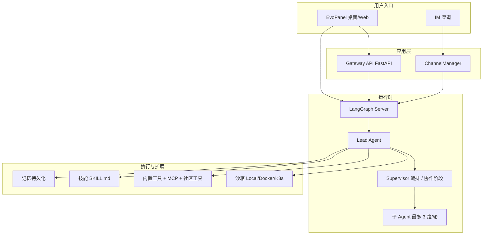

# EvoFlow 产品说明书

> **文档版本**：与 EvoPanel v0.2.3 对应  
> **出品方**：Evovex AI  
> **更新日期**：2026 年 5 月  
> **配套文档**：[使用说明](./使用说明.md) · [操作指南目录](./guides/README.md)

---

## 1. 产品概述

### 1.1 一句话定义

**EvoFlow** 是 Evovex AI 旗下的**超级 Agent 编排框架**：采用 **Supervisor 超级智能体全局主控模式**，用户给出目标后，系统基于 LangGraph 自主规划、调用工具、委派子 Agent、在隔离沙箱中执行，执行过程可观测、可干预，直至交付可验收的结果。

### 1.2 品牌说明

**Evovex**（*EvoVex, AI Evolve Beyond Complexity*）——迭代进化，重塑 AI 新范式。产品以可编排、可观测、可恢复的 Agent 运行时，让复杂任务从「一问一答」升级为「目标驱动、全程闭环」。

> 当前以**发行版与文档**便于体验为主；完整源码开放节奏见 [GitHub 仓库说明](https://github.com/EvovexAI/EvoFlow)。

### 1.3 与传统对话式 Agent 的差异

| 维度 | 传统对话 Agent | EvoFlow |
|------|----------------|---------|
| 任务长度 | 易因上下文漂移中断 | 任务状态持久化；托管/任务中心支持暂停恢复；编排任务可重试与局部调整 |
| 调度方式 | 用户逐步追问 | 复杂任务由 Supervisor 澄清 → 规划 → 子任务拆解 → 分发（任务中心/协作流程） |
| 执行环境 | 多在对话层模拟 | 独立沙箱（本地 / Docker / 可选 K8s）中真实读写与命令执行 |
| 无人值守 | 需人工盯守 | 托管后台多轮执行、定时 Cron、结果推送 IM |
| 能力扩展 | 固定工具集 | 55+ 内置公开技能 + MCP；按场景渐进暴露工具以控制 Token |
| 触达方式 | 单一 Web 聊天 | EvoPanel 桌面/Web + 飞书/微信/Telegram/Slack 等 IM |

---

## 2. 目标人群与产品定位

EvoFlow 面向**希望用 Agent 真正把事情做完、而不是只聊几句**的用户——任务往往跨多步、多工具、多轮执行，需要可规划、可观测、可恢复。下列为产品重点服务的人群画像（同一人可能兼具多种身份）。

| 目标人群 | 典型身份 | 核心诉求 | EvoFlow 如何匹配 |
|----------|----------|----------|------------------|
| **研发与构建者** | 独立开发者、全栈/后端工程师、技术负责人 | 从需求到可运行成果；少盯屏、少反复粘贴上下文 | 沙箱读写与命令执行、Claude Code 编码协同、Plan/子 Agent 分工、工作区场景 |
| **知识工作者** | 研究员、分析师、咨询顾问、学生与终身学习者 | 检索—归纳—成稿链路长，怕中断、怕幻觉堆砌 | 联网与工作区场景、长任务编排、记忆沉淀、结构化输出与技能（如深度研究、文档处理） |
| **内容与创意从业者** | 文案、运营、自媒体、短视频/多媒体创作者 | 从创意到成片/成稿，环节多、工具杂 | 创意媒体场景、55+ 技能与可选生图/生视频模型（火山方舟、通义万相等，需在 EvoPanel 配置） |
| **业务与运营人员** | 运营、销售支持、项目经理、行政与综合岗 | 日报周报、巡检、竞品与数据整理；习惯在 IM 里办事 | 自然语言下达任务、定时/托管无人值守、飞书等 IM 内完成对话与结果回推 |
| **团队赋能者** | 小团队 Founder、部门数字化接口人、IT/平台兼职负责人 | 让同事「开箱即用」Agent，又可控、可分工 | 预设角色（SOUL/工具白名单）、多渠道接入、任务中心可观测；可选工作项目隔离（见 [工作空间指南](./guides/workspace.md)） |

### 2.1 我们优先解决谁的问题

- **主战场**：个人与小团队（约 1～30 人），尚无专职 AI 平台团队，但需要**长任务自动化 + 多 Agent 编排 + 桌面/IM 双入口**。
- **次要延伸**：已在飞书/企业 IM 上协作的业务团队——希望**不打开独立客户端**也能下达、跟踪、接收结果。
- **暂不主打**：仅需单次问答、无工具链需求的轻量聊天场景（通用对话产品已足够）；需要重度定制企业级权限与审计的大型组织（需商用授权与专项集成）。

### 2.2 典型使用情境（按人群）

**研发与构建者** — 重构一个模块、排查线上问题、按规格实现功能：先规划再执行，必要时委派子 Agent 或进入 Claude Code；在沙箱中改文件、跑命令直至可验收。

**知识工作者** — 竞品扫描、行业研究、长报告撰写：多源检索与整理，跨会话保留结论与偏好，避免每次从零描述背景。

**内容与创意从业者** — 系列选题、脚本、配图/短片制作：在创意媒体场景下按技能流程分步产出，而非一次性生成敷衍草稿。

**业务与运营人员** — 「每天 9 点汇总昨日数据发到群」「每小时检查站点是否可用」：用定时或托管在后台跑，人在 IM 或面板查看结果即可。

**团队赋能者** — 为「写代码的同事」「写方案的同事」各配一套 Agent 人设与工具权限，统一接入飞书，用任务中心查看复杂任务拆到哪一步。

### 2.3 非目标人群（边界说明）

- 只想要「聊天机器人」、不需要执行与交付物的用户。
- 无法提供 LLM API Key（或企业模型网关）、也无法接受本地/沙箱执行环境的用户。
- 要求完全离线、零数据出域且不提供私有化部署方案的场景（需另行评估商用与部署）。

---

## 3. 核心价值（八大支柱）

以下与 [README](../README.md) 功能总览中的「八大支柱」一致：

### 3.1 长任务与可恢复编排

跨会话任务监督、排队与重试；必要时局部重编排，保障任务从规划到验收的闭环；托管与任务中心支持暂停/恢复/终止。

### 3.2 超级总控智能体（Supervisor）

在意图澄清后完成方案规划，拆解为**有向无环子任务依赖图**；基于子 Agent 能力画像分发任务；子任务上下文传递；全局进度调控、异常纠错与局部重编排。主要用于**任务中心**及协作/规划类流程，而非每一次普通闲聊。

### 3.3 Claude Code 多会话协同

通过 `/claude` 进入 Claude Code 专属图（`claude_code_chat`）；也可在编排流程中承接编码专项。支持续接历史会话（`/claude [会话ID]`），多会话分工（需环境安装相应 ACP 适配器，见 `config.example.yaml` 中 `acp_agents` 说明）。

### 3.4 托管智能体与长期任务托管

独立沙箱后台运行，最长支持 **7×24 小时**（10080 分钟）；实时查看状态与日志；暂停/恢复/终止；结果可追溯；支持**模型提议托管方案 → 用户确认后执行**；结束后可向飞书等 IM 推送 Markdown 小结。

### 3.5 场景与工作阶段

EvoPanel 提供多种**顶栏场景**（日常对话、任务规划、工作区、网络搜索、智能体管理、创意媒体等），按任务切换工具集与行为；复杂任务遵循「先规划、再确认、后执行」，配合 PlanGuard 等在规划阶段限制副作用操作。

### 3.6 工具渐进暴露 · 技能 / MCP

核心能力先行，扩展按需挂载；内置 **55+** 公开 `SKILL.md` 技能（含 `superpowers-*` 开发流程技能）；支持 MCP（stdio / SSE / HTTP）接入外部工具。

### 3.7 记忆 · 任务状态 · 主线快照

会话与任务状态、协作阶段（如 `planning` / `plan_ready` / `executing`）持久化；子问题进度回注主线；Plan 闸口与护栏减少长对话漂移；记忆含 workContext、facts 等结构化字段。

### 3.8 智能体进化

Agent 配置（模型、工具白名单、MCP/技能）与技能生命周期协同治理；配置变更支持热重载，无需重启整套服务。

**补充能力（非独立支柱，常与上述组合使用）：**

- **飞书 / IM 全链路**：在 IM 侧完成对话、托管、定时、斜杠指令；飞书支持流式卡片更新（其他已接入渠道以文本/卡片为主）。
- **自然语言操作**：托管、定时任务可在对话中用自然语言或 `/hosted`、`/automation` 创建。

---

## 4. 功能架构

> 完整自托管部署时，Nginx（端口 2026）统一反向代理 LangGraph（2024）、Gateway（8001）与 EvoPanel 前端（1420）。桌面发行版由 EvoPanel 内置/拉起本地 Gateway（常见端口 8012）与 LangGraph。

### 4.1 模块说明

| 模块 | 说明 |
|------|------|
| **EvoPanel** | Tauri v2 桌面 / Web 界面（React + Vite）：对话、任务中心、模型、预设角色、技能、MCP、IM、定时任务 |
| **ChannelManager** | IM 入站消息消费，转发至 LangGraph Server 执行 Agent |
| **Gateway API** | FastAPI：模型、MCP、技能、记忆、上传、任务、渠道、自动化调度等 REST 管理面 |
| **LangGraph Server** | Agent 运行时与工作流；默认图 `lead_agent` |
| **Lead Agent** | 唯一运行时入口图，承载 SOUL、模型、工具、记忆与中间件链 |
| **Supervisor 编排** | 任务中心与协作流程中的总控逻辑（拆解、分发、汇总），非独立进程 |
| **子 Agent** | 内置 `general-purpose`、`bash`（具备 Shell 时）；**每轮最多 3 个**并行，默认超时 **15 分钟**（可配置） |
| **沙箱** | 隔离执行；虚拟路径含 `/mnt/user-data/{workspace,uploads,outputs}`、`/mnt/skills/` 等 |
| **技能** | 仓库 `skills/public/` 下 **55** 个公开技能目录；支持 `.skill` 归档与自定义目录 |
| **MCP** | Model Context Protocol，扩展外部工具 |
| **记忆** | 默认存储于 `backend/.evo-flow/memory.json`（路径随部署而变） |
| **IM 渠道（已接入后端）** | **飞书**、**微信（iLink）**、**Telegram**、**Slack**；EvoPanel 渠道页另提供钉钉、Discord、QQ 机器人等配置入口（接入程度以当前版本为准） |

---

## 5. 主要功能一览

| 功能域 | 能力概要 |
|--------|----------|
| **实时对话** | 流式输出、Markdown 渲染、多模态（图片/文件）、工具调用可视化 |
| **顶栏场景** | 日常对话、任务规划、工作区、网络搜索、智能体管理、Trae、优化智能体、创意媒体等 |
| **会话模式** | 闪速 / Auto / 思考 / Pro / Ultra（控制思考深度与推理力度） |
| **能力组合（API/文档层）** | Chat · Plan · Execute · Infinite：对应 `thinking_enabled`、`is_plan_mode`、`subagent_enabled` 等组合（见 [EvoPanel 指南](./guides/evopanel-guide.md)） |
| **Plan / 协作编排** | 阶段：`planning` → `plan_ready` → `awaiting_exec` → `executing`；规划期 PlanGuard 限制副作用工具 |
| **任务中心** | 新建复杂任务 → Supervisor 拆子任务 → 并行/串行执行 → 批量管理与实时对话跳转 |
| **托管任务** | 后台多轮执行；按轮次/最长时间停止；运行中可聊天干预；可选 IM 推送 |
| **定时任务** | 每小时/每天/每周/一次性/自定义 Cron；可选飞书推送与记忆复用 |
| **Agent 管理** | SOUL/IDENTITY、按角色分配模型与工具/MCP/技能白名单 |
| **技能与 MCP** | 浏览/安装技能、MCP 市场或手动添加服务 |
| **记忆** | 全局与各 Agent 独立记忆；支持导入导出 |
| **Claude Code** | `/claude` 进入编码图，`/lead` 切回主 Agent |
| **IM 集成** | 飞书功能最全（含流式卡片）；斜杠指令在已接入渠道通用 |
| **安全审批** | 副作用工具可逐次或会话级批准；通用设置可配置默认自动批准 |

---

## 6. 对话与编排能力（概念层）

### 6.1 场景与会话模式（勿混淆）

| 类型 | 说明 | 示例 |
|------|------|------|
| **顶栏场景** | 切换工具画像与系统提示侧重 | 日常对话、任务规划、工作区、创意媒体 |
| **会话模式** | Composer 药丸：控制思考/推理 | 闪速、Auto、思考、Pro、Ultra |
| **能力组合** | 后端运行时开关组合 | Chat / Plan / Execute / Infinite |

复杂多步任务可：选用 **任务规划** 场景或触发 Plan 协作阶段；需子 Agent 时启用 Execute/Infinite 类组合或 **Ultra/Pro** 等会话模式。

### 6.2 Plan / 协作阶段

复杂需求进入协作流程后：AI 拆解步骤与预期结果 → 用户确认或修改 → **开始执行** 后分步落地；侧栏可见 **规划中 / 待授权开始执行 / 执行中 / 校验中** 等阶段标签。

### 6.3 任务中心协作

适用于竞品分析、系统开发等多步骤大任务：在 **任务中心** 创建任务 → Supervisor 规划子任务 → 分配 Agent → 有依赖则串行、无依赖则并行 → 汇总交付。任务卡片状态包括：待开始、规划中、执行中、已暂停、已完成、失败、已取消。

### 6.4 工具可视化与审批

工具调用（终端、读文件、搜索、子 Agent、提交计划等）在对话流中实时展示；涉及删改文件、执行命令等副作用时，可按策略弹出 **批准并执行 / 拒绝 / 全部授权**。

---

## 7. 扩展生态

| 类型 | 说明 |
|------|------|
| **内置公开技能** | 仓库内 **55** 个 `skills/public/*/SKILL.md`，覆盖文档处理、开发、研究、媒体等 |
| **superpowers-*** | 源自 Superpowers（MIT）的开发流程技能，与长任务规格/计划/子代理纪律配套 |
| **自定义技能** | `.skill` 归档安装、`skills/custom/` 本地目录 |
| **MCP** | EvoPanel 市场或手动配置 stdio/SSE/HTTP 服务 |
| **社区工具** | Tavily、Jina、Firecrawl、DuckDuckGo 等（需在 `config.yaml` / 环境变量配置 API Key） |
| **创意媒体** | 火山方舟、通义万相、火山 TTS、可灵、阿里云字幕等（**设置 → 模型** 中「视频/创意模型」配置） |
| **Claude Code** | 经 LangGraph `claude_code_chat` 图；生产环境需配置 `acp_agents` 适配器 |

---

## 8. 安全与隔离

### 8.1 沙箱模式对比

| 模式 | 隔离级别 | 典型场景 |
|------|----------|----------|
| **Local** | 路径隔离；默认 **不启用** `bash` 工具 | 个人桌面快速体验 |
| **Docker（AioSandbox）** | 容器隔离；可执行 Shell | 团队/生产推荐 |
| **Kubernetes** | Pod 隔离 | 大规模部署（可选 Provisioner，端口 8002） |

### 8.2 其他安全机制

- **PlanGuard**：在 `planning`、`plan_ready`、`awaiting_exec` 阶段拦截副作用工具
- **工具审批**：`ToolApprovalMiddleware`；EvoPanel **通用** 设置可默认自动批准副作用类工具
- **线程隔离**：每个 LangGraph `thread_id` 独立 workspace/uploads/outputs 目录
- **工作项目**（可选）：不同项目的会话、记忆、任务配置相互隔离

### 8.3 许可证

本项目以 [Evovex AI 非商业许可证 1.0](../LICENSE) 发布：**允许学习与非商业使用；商业使用须书面授权**（[cloud@evovexai.com](mailto:cloud@evovexai.com)）。上游与第三方组件见 [NOTICE](../NOTICE)。

---

## 9. 系统要求与获取方式

### 9.1 终端用户（推荐）

| 项目 | 要求 |
|------|------|
| 操作系统 | Windows 10+、macOS 11+、主流 Linux 发行版（以 [Releases](https://github.com/EvovexAI/EvoFlow/releases) 提供的构建为准） |
| 网络 | 可访问所选 LLM 服务商 API；IM 渠道需能访问对应平台 |
| 密钥 | 至少一个模型提供商 API Key |

**获取渠道：**

| 内容 | 入口 |
|------|------|
| 桌面安装包 | [GitHub Releases](https://github.com/EvovexAI/EvoFlow/releases) |
| 官网与文档 | https://www.evovexai.com |
| 在线教程 | [桌面端使用指南](https://www.evovexai.com/docs/chat/evopanel) |

### 9.2 服务器 Web 版（简述）

Linux 可执行一键脚本部署 EvoPanel Web 版（开发服务默认 **1420**，生产由反向代理暴露）；详见 [evopanel README](../evopanel/README.md)。

### 9.3 开发者自托管（简述）

需 **Python 3.12+**、**Node.js 22+**、**uv** 等；`make config && make install && make dev` 启动后统一入口一般为 `http://localhost:2026`（Nginx 反代 LangGraph 2024 + Gateway 8001 + 前端）。详见 [安装指南](./getting-started/installation.md)。

---

## 10. 界面预览

  

主界面 · 流式对话与工具过程可视化

| 场景 | 截图 |
|------|------|
| Agent 角色管理 | `assets/screenshots/agents.png` |
| 定时任务 | `assets/screenshots/scheduled-tasks-1.png`、`scheduled-tasks-2.png` |
| 托管任务 | `assets/screenshots/hosted-1.png`、`hosted-2.png` |
| 浏览器自动化 | `assets/screenshots/browser.png` |

完整截图目录：[docs/assets/screenshots/](assets/screenshots/)

---

## 11. 支持与服务

| 渠道 | 说明 |
|------|------|
| [GitHub Issues](https://github.com/EvovexAI/EvoFlow/issues) | Bug 反馈、功能建议 |
| [cloud@evovexai.com](mailto:cloud@evovexai.com) | 商务与合作咨询 |
| 微信交流群 | 见 [README](../README.md) 中二维码 |

---

## 12. 附录

### 12.1 核心术语

| 术语 | 含义 |
|------|------|
| **Agent / 角色 / 预设角色** | 具备 SOUL、模型、工具与记忆的智能体实例 |
| **Supervisor** | 任务中心与协作流程中的总控编排逻辑 |
| **托管（Hosted）** | 后台多轮自动执行的任务，最长 7×24 小时 |
| **Thread** | LangGraph 会话线程；上传与工作区按 `thread_id` 隔离 |
| **Sandbox** | Agent 命令与文件操作的隔离执行环境 |
| **Skill** | `SKILL.md` 格式的结构化能力模块 |
| **MCP** | Model Context Protocol，外部工具协议 |
| **Gateway** | FastAPI 管理面（模型、技能、记忆、渠道、任务等） |
| **EvoPanel** | EvoFlow 官方桌面 / Web 管理界面 |
| **场景（Scenario）** | 顶栏切换的任务画像（如工作区、任务规划） |
| **会话模式（session_mode）** | 闪速/Auto/思考/Pro/Ultra 等推理档位 |

完整术语表：[glossary.md](./meta/glossary.md)

### 12.2 相关文档索引

| 文档 | 路径 |
|------|------|
| 使用说明（操作手册） | [使用说明.md](./使用说明.md) |
| 5 分钟快速上手 | [quick-start.md](./getting-started/quick-start.md) |
| 操作指南目录 | [guides/README.md](./guides/README.md) |
| 技术架构 | [architecture.md](./reference/architecture.md) |
| 后端组件说明 | [backend/README.md](../backend/README.md) |
| 常见问题 | [faq.md](./faq.md) |

---

*Evovex AI · EvoFlow — 让复杂任务自动闭环到验收。*
