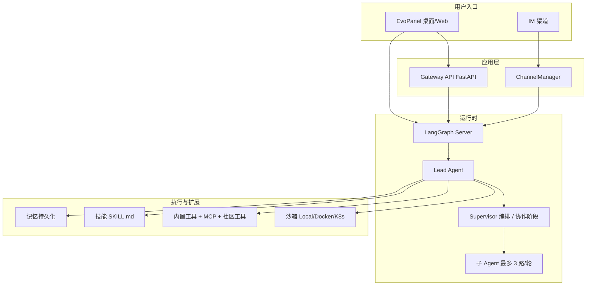

# EvoFlow 项目介绍

> EvoFlow 是 **EvovexAI** 旗下的**超级 Agent 编排框架**——采用 Supervisor 总控模式：用户给出目标后，系统基于 LangGraph 自主规划、调用工具、委派子 Agent、在隔离沙箱中执行，过程可观测、可干预，直至交付可验收的结果。
>
> **Evovex** 迭代进化 重塑 AI 新范式。英文：*EvoVex, AI Evolve Beyond Complexity*。
>
> 当前以**发行版与文档**便于体验为主；完整源码开放节奏见 [GitHub 仓库说明](https://github.com/EvovexAI/EvoFlow)。

## 1. 一句话定义

EvoFlow 是基于 LangGraph 构建的 AI Agent 运行时。你给它一个目标，它会自主规划、调用工具、委派子 Agent、读写文件、执行命令——直到任务完成。

## 2. 与传统对话式 Agent 的差异

| 维度 | 传统对话 Agent | EvoFlow |
|------|----------------|---------|
| 任务长度 | 易因上下文漂移中断 | 任务状态持久化；托管/任务中心支持暂停恢复；编排任务可重试与局部调整 |
| 调度方式 | 用户逐步追问 | 复杂任务由 Supervisor 澄清 → 规划 → 子任务拆解 → 分发 |
| 执行环境 | 多在对话层模拟 | 独立沙箱（本地 / Docker / 可选 K8s）中真实读写与命令执行 |
| 无人值守 | 需人工盯守 | 托管后台多轮执行、定时 Cron、结果推送 IM |
| 能力扩展 | 固定工具集 | 50+ 个内置公开技能 + MCP；按场景渐进暴露工具以控制 Token |
| 触达方式 | 单一 Web 聊天 | EvoPanel 桌面/Web + 飞书/微信/Telegram/Slack 等 IM |

## 3. 目标人群

EvoFlow 面向**希望用 Agent 真正把事情做完、而不是只聊几句**的用户——任务往往跨多步、多工具、多轮执行，需要可规划、可观测、可恢复。

| 目标人群 | 典型身份 | 核心诉求 | EvoFlow 如何匹配 |
|----------|----------|----------|------------------|
| **研发与构建者** | 独立开发者、全栈/后端工程师、技术负责人 | 从需求到可运行成果；少盯屏、少反复粘贴上下文 | 沙箱读写与命令执行、Claude Code 编码协同、Plan/子 Agent 分工、工作区场景 |
| **知识工作者** | 研究员、分析师、咨询顾问、学生与终身学习者 | 检索—归纳—成稿链路长，怕中断、怕幻觉堆砌 | 联网与工作区场景、长任务编排、记忆沉淀、结构化输出与技能（如深度研究、文档处理） |
| **内容与创意从业者** | 文案、运营、自媒体、短视频/多媒体创作者 | 从创意到成片/成稿，环节多、工具杂 | 创意媒体场景、50+ 个技能与可选生图/生视频模型 |
| **业务与运营人员** | 运营、销售支持、项目经理、行政与综合岗 | 日报周报、巡检、竞品与数据整理；习惯在 IM 里办事 | 自然语言下达任务、定时/托管无人值守、飞书等 IM 内完成对话与结果回推 |
| **团队赋能者** | 小团队 Founder、部门数字化接口人、IT/平台兼职负责人 | 让同事「开箱即用」Agent，又可控、可分工 | 预设角色（SOUL/工具白名单）、多渠道接入、任务中心可观测 |

**主战场**：个人与小团队（约 1～30 人），尚无专职 AI 平台团队，但需要**长任务自动化 + 多 Agent 编排 + 桌面/IM 双入口**。

**暂不主打**：仅需单次问答的轻量聊天场景；需要重度定制企业级权限与审计的大型组织（需商用授权与专项集成）。

## 4. 核心价值（八大支柱）

### 4.1 长任务与可恢复编排

跨会话任务监督、排队与重试；必要时局部重编排，保障任务从规划到验收的闭环；托管与任务中心支持暂停/恢复/终止。

### 4.2 超级总控智能体（Supervisor）

意图澄清后完成方案规划，拆解为**有向无环子任务依赖图**；基于子 Agent 能力画像分发任务；子任务上下文传递；全局进度调控、异常纠错与局部重编排。主要用于**任务中心**及协作/规划类流程。

### 4.3 Claude Code 多会话协同

通过 `/claude` 进入 Claude Code 专属图（`claude_code_chat`）；也可在编排流程中承接编码专项。支持续接历史会话（`/claude [会话ID]`），多会话分工（需环境安装相应 ACP 适配器，见 `config.example.yaml` 中 `acp_agents` 说明）。

### 4.4 托管智能体与长期任务托管

独立沙箱后台运行，最长支持 **7×24 小时**（10080 分钟）；实时查看状态与日志；暂停/恢复/终止；结果可追溯；支持**模型提议托管方案 → 用户确认后执行**；结束后可向飞书等 IM 推送 Markdown 小结。

### 4.5 场景与工作阶段

EvoPanel 提供多种**顶栏场景**（日常对话、任务规划、工作区、网络搜索、智能体管理、创意媒体等），按任务切换工具集与行为；复杂任务遵循「先规划、再确认、后执行」，配合 PlanGuard 等在规划阶段限制副作用操作。

### 4.6 工具渐进暴露 · 技能 / MCP

核心能力先行，扩展按需挂载；内置 **50+** 个公开 `SKILL.md` 技能（含 `superpowers-*` 开发流程技能）；支持 MCP（stdio / SSE / HTTP）接入外部工具。

### 4.7 记忆 · 任务状态 · 主线快照

会话与任务状态、协作阶段（如 `planning` / `plan_ready` / `executing`）持久化；子问题进度回注主线；Plan 闸口与护栏减少长对话漂移；记忆含 workContext、facts 等结构化字段。

### 4.8 智能体进化

Agent 配置（模型、工具白名单、MCP/技能）与技能生命周期协同治理；配置变更支持热重载，无需重启整套服务。

**补充能力（常与上述组合使用）：**

- **飞书 / IM 全链路**：在 IM 侧完成对话、托管、定时、斜杠指令；飞书支持流式卡片更新（其他已接入渠道以文本/卡片为主）。
- **自然语言操作**：托管、自动化可在对话中用自然语言或 `/hosted`、`/automation` 创建。

## 5. 核心概念

### Agent

每个 Agent 拥有：

- **SOUL**（灵魂）：决定它的性格、角色和行为方式
- **模型**：驱动它思考的 LLM
- **工具**：它能执行的操作（搜索、编码、文件读写等）
- **记忆**：跨会话积累的知识和偏好

### 技能（Skills）

技能是结构化的能力模块（`SKILL.md` 格式），让 Agent 能做特定类型的工作。EvoFlow 内置 50+ 个公开技能，覆盖内容创作、媒体处理、开发工具等领域。另有一组 **`superpowers-*` 开发流程技能**（源自 Superpowers，MIT），与长任务规格/计划/子代理执行纪律配套；结构化产出路径约定见 `evoflow/artifacts/README.md`。

### 沙箱（Sandbox）

每个任务在隔离的执行环境中运行，拥有独立的文件系统视图。支持本地、Docker、Kubernetes 三种模式。

### 子 Agent（Subagents）

复杂任务会被拆解，主 Agent 委派多个子 Agent 并行执行，最后综合结果。每轮最多 3 个并行，默认超时 15 分钟（可配置）。

### 记忆系统（Memory）

Agent 会记住你的偏好、工作风格和积累的知识，跨会话持续学习。默认存储于 `backend/.evo-flow/memory.json`（路径随部署而变）。

## 6. 架构一览

> 完整自托管部署时，Nginx（端口 2026）统一反向代理 LangGraph（2024）、Gateway（8001）与 EvoPanel 前端（1420）。桌面发行版由 EvoPanel 内置/拉起本地 Gateway（常见端口 8012）与 LangGraph。

### 模块说明

| 模块 | 说明 |
|------|------|
| **EvoPanel** | Tauri v2 桌面 / Web 界面（React + Vite）：对话、任务中心、模型、预设角色、技能、MCP、IM、自动化 |
| **ChannelManager** | IM 入站消息消费，转发至 LangGraph Server 执行 Agent |
| **Gateway API** | FastAPI：模型、MCP、技能、记忆、上传、任务、渠道、自动化调度等 REST 管理面 |
| **LangGraph Server** | Agent 运行时与工作流；默认图 `lead_agent` |
| **Lead Agent** | 唯一运行时入口图，承载 SOUL、模型、工具、记忆与中间件链 |
| **Supervisor 编排** | 任务中心与协作流程中的总控逻辑（拆解、分发、汇总），非独立进程 |
| **子 Agent** | 内置 `general-purpose`、`bash`（具备 Shell 时）；每轮最多 3 个并行，默认超时 15 分钟（可配置） |
| **沙箱** | 隔离执行；虚拟路径含 `/mnt/user-data/{workspace,uploads,outputs}`、`/mnt/skills/` 等 |
| **技能** | 仓库 `skills/public/` 下 50+ 个公开技能目录；支持 `.skill` 归档与自定义目录 |
| **MCP** | Model Context Protocol，扩展外部工具 |
| **记忆** | 默认存储于 `backend/.evo-flow/memory.json`（路径随部署而变） |
| **IM 渠道** | 飞书、微信（iLink）、Telegram、Slack；EvoPanel 渠道页另提供钉钉、Discord、QQ 机器人等配置入口 |

## 7. 安全与隔离

### 沙箱模式对比

| 模式 | 隔离级别 | 典型场景 |
|------|----------|----------|
| **Local** | 路径隔离；默认 **不启用** `bash` 工具 | 个人桌面快速体验 |
| **Docker（AioSandbox）** | 容器隔离；可执行 Shell | 团队/生产推荐 |
| **Kubernetes** | Pod 隔离 | 大规模部署（可选 Provisioner，端口 8002） |

### 其他安全机制

- **PlanGuard**：在 `planning`、`plan_ready`、`awaiting_exec` 阶段拦截副作用工具
- **工具审批**：`ToolApprovalMiddleware`；EvoPanel **通用** 设置可默认自动批准副作用类工具
- **线程隔离**：每个 LangGraph `thread_id` 独立 workspace/uploads/outputs 目录
- **工作项目**（可选）：不同项目的会话、记忆、任务配置相互隔离

### 许可证

本项目以 [EvovexAI 非商业许可证 1.0](https://github.com/EvovexAI/EvoFlow/blob/main/LICENSE) 发布：**允许学习与非商业使用；商业使用须书面授权**（[cloud@evovexai.com](mailto:cloud@evovexai.com)）。上游与第三方组件见仓库 NOTICE 文件。

## 8. 系统要求

### 终端用户（推荐）

| 项目 | 要求 |
|------|------|
| 操作系统 | Windows 10+、macOS 11+、主流 Linux 发行版 |
| 网络 | 可访问所选 LLM 服务商 API；IM 渠道需能访问对应平台 |
| 密钥 | 至少一个模型提供商 API Key |

获取桌面安装包：[GitHub Releases](https://github.com/EvovexAI/EvoFlow/releases)。

### 开发者自托管

需 **Python 3.12+**、**Node.js 22+**、**uv** 等；`make config && make install && make dev` 启动后统一入口一般为 `http://localhost:2026`（Nginx 反代 LangGraph 2024 + Gateway 8001 + 前端）。

## 9. 下一步

- [下载与安装包说明](downloads.md) — 获取适配你系统的发行版
- [开发者安装指南](installation.md) — 在本地完成自托管部署
- [5 分钟快速上手](quick-start.md) — 完成第一个对话
- [完成你的第一个任务](first-task.md) — 体验 Agent 自主完成一项工作
- [操作指南目录](../guides/README.md) — 深入各功能的细节
- [架构参考](../reference/architecture.md) — 系统组件与运行时设计

## 10. 支持

| 渠道 | 说明 |
|------|------|
| [GitHub Issues](https://github.com/EvovexAI/EvoFlow/issues) | Bug 反馈、功能建议 |
| [cloud@evovexai.com](mailto:cloud@evovexai.com) | 商务与合作咨询 |

---

*EvovexAI · EvoFlow — 让复杂任务自动闭环到验收。*

