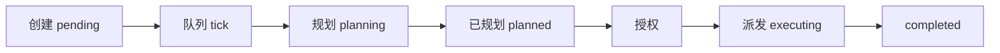

# 任务中心操作指南

---
## 概述

任务中心是**复杂多任务协作的核心功能**，适用于需要多步骤、多智能体协作完成的大型任务。AI 会自动将复杂任务拆解为多个子任务，协调不同的智能体并行/串行执行，全程监控进度，最终汇总完成整个大任务。

默认创建的任务为**无人值守模式**（`run_mode=unattended`）：Gateway 后台队列会自动完成「规划 → 授权 → 派发 → 执行」，无需在 UI 上反复点「开始执行」。

---
## 一、任务中心入口

点击左侧菜单栏的「任务中心」进入。

**默认视图是监控面板**，展示各状态任务数量与当前活跃任务快捷入口；点击状态卡片或「查看全部」进入任务列表。点击任务卡片进入详情页。

---
## 二、监控面板与任务列表

### 1. 监控面板

- 按状态分组统计（待开始、规划中、执行中、已暂停、已完成、失败等）
- 展示当前活跃任务（规划中 / 执行中 / 等待派发等）
- **暂停全部运行中**：调用 `POST /api/tasks/batch/stop`，撤销执行授权并取消正在运行的 worker
- 队列状态提示：显示后台任务队列是否启用、是否在轮询

监控面板每 15 秒自动刷新；也可手动进入列表页刷新。

### 2. 新建任务

点击「新建任务」，填写：

- **任务名称**：简短描述任务目标
- **任务描述**：详细说明要求、输出格式等，越详细 AI 拆解越准确

创建后任务写入 `pending`，由后台队列在下一个 tick（默认 15 秒） pickup 并进入规划。创建成功后可进入详情页查看进度。

### 3. 任务状态说明

| 状态 | 说明 |
|------|------|
| 待开始 | 任务已创建，等待队列 pickup |
| 规划中 | Lead Agent 正在分析并生成 plan |
| 已规划 | plan 已绑定，等待授权/派发 |
| 执行中 | 子任务在并行/串行运行 |
| 等待派发 | 已授权，派发子任务 wave 中 |
| 已暂停 | 手动暂停；恢复后会重新进入无人值守流水线 |
| 已完成 | 所有子任务成功结束 |
| 失败 | 执行或派发失败（可配置自动重试） |
| 已取消 | 手动取消 |

API 可能对「规划中但已有 plan」的任务在响应中展示为「已规划」，与列表筛选逻辑一致。

### 4. 单个任务操作

- **查看详情**：子任务进度、计划、工作流面板
- **暂停 / 继续**：对规划中、已规划、执行中、等待派发等活跃状态可用；暂停会撤销授权并停止 worker
- **删除**：删除任务及子任务（不可恢复）

无人值守任务**不需要**手动点「开始执行」；该按钮主要用于手动模式或重新入队。

### 5. 批量操作

「批量选择管理」模式下可批量启动、暂停、删除。批量暂停与监控面板的「暂停全部」使用同一后端语义（`_pause_task_row`），会撤销授权并取消 worker。

### 6. 搜索与筛选

列表页支持按关键词搜索；API `?status=` 支持状态别名（如 `executing` 匹配 `running`、`waiting_dispatch`）。

---
## 三、任务详情页面

详情页包含：顶部状态与暂停/继续、React 工作流面板（子任务 DAG）、任务计划展开区。

- Shell 层约 10 秒刷新标题/状态；工作流面板在活跃状态下约 5 秒刷新
- **暂停** 与列表页相同；**继续** 会对无人值守任务 re-enter pipeline（re-authorize + dispatch）

---
## 四、无人值守执行流程

1. **创建**：`POST /api/tasks`，`run_mode=unattended`（默认）
2. **队列**：`task_queue_runner` 按 `EVOFLOW_TASK_QUEUE_INTERVAL_SECONDS`（默认 15s）tick
3. **规划**：Lead Agent 调用 plan 工具绑定 goal/steps
4. **授权与派发**：系统自动 `authorize` + `dispatch`，子任务按 DAG 执行
5. **收束**：全部子任务 terminal 后主任务 rollup 为 `completed`，不会重复派发

---
## 五、环境变量（Gateway）

| 变量 | 默认 | 说明 |
|------|------|------|
| `EVOFLOW_TASK_QUEUE_ENABLED` | `1` | `0` 关闭队列，任务会停在 pending |
| `EVOFLOW_TASK_QUEUE_INTERVAL_SECONDS` | `15` | 队列 tick 间隔 |
| `EVOFLOW_TASK_QUEUE_MAX_CONCURRENT` | `3` | 同时活跃的无人值守任务上限（含规划与执行） |
| `EVOFLOW_TASK_QUEUE_RETRY_MAX` | `3` | failed 任务自动重试次数 |
| `EVOFLOW_LANGGRAPH_URL` | 见 `.env.example` | LangGraph API 地址，错误会导致 thread 创建失败 |

修改后需重启 Gateway。

---
## 六、暂停与恢复语义

**暂停**（`POST /api/tasks/{id}/stop` 或 batch/stop）：

- 主任务 `status=paused`
- 撤销 `execution_authorized`
- 取消 plan/execute background worker
- 取消活跃子任务

**继续**（`POST /api/tasks/{id}/resume`）：

- 无人值守：恢复为 `planned`（有 plan）或 `pending`（无 plan），并调用 `advance_unattended_task` 重新授权/派发
- 手动模式：恢复为 `executing` 并发送 resume 事件

---
## 七、高级功能

### 人工干预

执行过程中可在主对话或详情工作流中查看进度；暂停后可修改子任务或计划再继续。

### 跨会话关联

任务绑定 LangGraph `thread_id`；可从详情或历史跳转到对应聊天会话。

### 任务模板

常用任务可保存为模板，下次快速创建（若已启用）。

---
## 相关 API

- `GET /api/tasks` — 列表（status 过滤与响应 normalized status 一致）
- `POST /api/tasks/batch/stop` — 批量暂停
- `POST /api/tasks/batch` — `action=start|pause|resume|cancel`（与单任务语义统一）
- `GET /api/tasks/queue/status` — 队列运行状态
- `GET /api/tasks/{id}/observability` — 任务级可观测指标（模型调用次数、Token、工具调用、主模型等，数据来自 `evoflow_observability.db`）

更多见 Gateway OpenAPI 文档。
