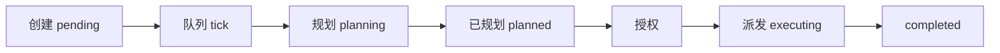

# 任务中心操作指南

任务中心是 EvoFlow 用来**跑复杂多步骤、多智能体协作任务**的总控台。你只需要描述目标，系统会自动拆解成子任务图、协调不同角色并行/串行执行、监控进度，并把最终结果汇总回来。

默认所有任务为**无人值守模式**——后台队列自动完成「规划 → 授权 → 派发 → 执行」四步流水线，**不需要你在 UI 上反复点"开始执行"**。

---

## 一、何时用任务中心

任务中心、Plan 模式、托管智能体三者最容易混，先用一张表把它们分开：

| 你想做的事 | 推荐路径 | 为什么 |
|----------|---------|--------|
| **单会话多步骤**的工程任务（写代码、写文档、做调研） | **Plan 模式** | 在聊天里直接拆步、确认、执行，过程可见 |
| **跨多个智能体协作**的大工程（拆给后端/前端/测试三种角色） | **任务中心** | 子任务图、并行派发、DAG 监控 |
| **长时间无人值守**地推进一个开放目标 | **托管智能体** | 7×24 自驱多轮，到边界自动停 |
| 到点重复触发的脚本（每日报表、每周巡检） | **定时任务** | cron / RRULE 定时调度 |

任务中心的核心场景特征：**"一次性、复杂、需要多角色"**——例如"做一份完整的竞品分析报告（含调研、写作、配图、排版）"、"重构 X 模块（含改造方案、改代码、补测试、写文档）"。

---

## 二、入口与首页

点击左侧菜单「任务中心」进入。

**默认视图是监控面板**——一眼看全局：

- 顶部按状态分组的卡片：待开始、规划中、执行中、已暂停、已完成、失败……每张卡片显示数量，点击进入对应筛选的列表
- 中间是**当前活跃任务**快捷入口（规划中 / 执行中 / 等待派发的任务）
- 右上角「**暂停全部运行中**」按钮：一键撤销所有运行中任务的执行授权并取消 worker（应急止损用）
- 队列状态提示：显示后台队列是否启用、是否在轮询

监控面板每 15 秒自动刷新；点击任意状态卡或「查看全部」进入列表页。

---

## 三、创建任务

### 方式一：界面按钮（推荐）

1. 点击「新建任务」
2. 填写：
   - **任务名称**：简短目标，如「重构用户模块的鉴权层」
   - **任务描述**：详细说要做什么、产出什么、有什么约束——**越详细，AI 拆解越准**
3. 提交后任务进入 `pending`，后台队列下一个 tick（默认 15 秒）会 pickup 它并开始规划

### 方式二：对话直接触发

不想离开聊天页时，直接说：

```
帮我创建一个任务，目标是把 backend/app/channels/ 下飞书渠道的消息格式化逻辑
重构成独立模块，并补一份单元测试。
```

主智能体识别后调用任务创建 API，与 GUI 创建等价。

### 描述任务的几个小技巧

- **写清产出物**："最终交付 X 份文档 + Y 份代码改动" 比 "完成 X" 更准
- **划红线**："不要动 Z 模块" 这种约束 AI 会写进子任务说明
- **指定角色**：如果你想让某个项目团队来做，明确说"使用 project-software-delivery 团队"

---

## 四、任务状态

任务创建后会在以下状态间流转：

| 状态 | 含义 | 用户可做的事 |
|------|------|-------------|
| **待开始 pending** | 已创建，等队列接手 | 等 / 删除 |
| **规划中 planning** | Lead Agent 在分析需求生成 plan | 暂停 / 删除 |
| **已规划 planned** | plan 已绑定，准备执行 | 暂停 / 删除 |
| **执行中 running** | 子任务在并行 / 串行运行 | 暂停 / 查看详情 |
| **等待派发 waiting_dispatch** | 已授权，子任务派发中 | 暂停 |
| **已暂停 paused** | 手动暂停，授权已撤 | 继续 / 删除 |
| **已完成 completed** | 全部子任务成功 | 查看结果 |
| **失败 failed** | 执行 / 派发失败（可自动重试） | 查看错误、删除 |
| **已取消 cancelled** | 手动取消 | 删除 |

> 列表筛选时，`?status=executing` 会同时匹配 `running`、`waiting_dispatch` 两种实际状态，文档与 API 行为一致。
---

## 五、任务详情页

点任意任务卡片进入详情页，三块布局：

### 1. 顶部状态栏

- 任务标题、当前状态徽标、进度百分比
- **暂停 / 继续**按钮（按当前状态自动切换）
- **跳转到聊天会话**：任务都绑定了 LangGraph `thread_id`，点这里去到对应聊天线程，看主智能体当时的对话与思考

### 2. 工作流面板（React 渲染，约 5 秒刷新）

可视化展示子任务 DAG：

- 每个节点是一个子任务，显示状态徽标、负责的智能体角色、当前活动
- 节点之间的连线代表依赖关系（哪个先做、哪些可并行）
- 点击节点展开**子任务详情**：派发参数、产物、错误日志
- **任务可观测性卡片**：模型调用次数、Token 累计、工具调用频次、主要使用的模型——数据从 `evoflow_observability.db` 实时聚合

### 3. 任务计划展开区

展示 plan 工具生成的完整规划文本：goal、steps、依赖与验收标准。如果你想确认 AI 拆得对不对，从这里看。

---

## 六、运行时管理

### 暂停 & 继续

**暂停**：

- 主任务转为 `paused`
- 撤销 `execution_authorized` 标记
- 取消 plan/execute background worker
- 取消所有活跃子任务

**继续**：

- 无人值守任务自动 re-enter 流水线（re-authorize + dispatch）
- 手动模式任务转为 `executing` 并发送 resume 事件

暂停期间任务**保留所有上下文**，子任务的中间产物也都还在；继续后从最近一次安全断点接着做。

### 人工干预

发现 AI 拆得不对、或某个子任务跑歪了：

1. **暂停**当前任务
2. 在详情页**直接编辑 plan**（如果该任务允许），或在主对话里追加新的指令
3. **继续**——系统会基于最新 plan 重新派发

也可以暂停后在子任务节点上单独**改派 / 重试**（详见 [Supervisor 模式案例](../../cases/supervisor-mode.md)）。

### 批量操作

列表页右上角「批量选择管理」开启多选模式后，可以：

- 批量启动（pending → 入队）
- 批量暂停（与监控面板的"暂停全部"使用同一后端语义）
- 批量删除

> 批量暂停适合发版前止损、或临时回收算力资源时用。

### 删除

删除会**同时移除主任务与所有子任务记录**，不可恢复。建议留下"已完成"任务一段时间用于复盘。

---

## 七、跨会话与协作

### 跨会话关联

每个任务对应一个独立 LangGraph 会话线程：

- 从任务详情可一键跳转到聊天页面，看 Lead Agent 当时怎么拆的、怎么协调子任务的
- 反过来，在聊天里 @ 到某个任务也能跳回任务详情
- 任务在哪个**项目**下创建，就属于哪个项目的隔离作用域（记忆、配置都独立）

### 子任务的"协作问询"

子任务在执行过程中如果发现需要其他子任务的产物，可以通过 `collab-peer` 机制**直接互问**——这是 EvoFlow 比传统 DAG 调度更灵活的地方。详见 [Plan 模式](../chat/plan-mode.md)。

### 任务模板

> ⚠️ **路线图预留**：常用任务保存为模板、下次快速复用的能力**当前未在 GUI 中启用**，仅在后端预留接口。如果你有强需求，可手动复用历史任务的"任务描述"作为新任务的输入。

---

## 八、常见问题

**Q：任务一直停在"待开始"，不进入规划？**
检查 Gateway 是否启动、`EVOFLOW_TASK_QUEUE_ENABLED` 是否为 `1`、并发数 `EVOFLOW_TASK_QUEUE_MAX_CONCURRENT` 是否已被其他任务占满。

**Q：任务失败后会自动重试吗？**
默认会，最多 `EVOFLOW_TASK_QUEUE_RETRY_MAX`（默认 3）次。超出后停在 `failed` 等待人工处理。

**Q：能不能跨实例迁移任务？**
任务数据与 plan 都在 Gateway 数据目录下，可整体备份；但 LangGraph 线程绑定的运行时状态不跨实例迁移，建议在原实例完成后再迁移。

**Q：删错任务能恢复吗？**
不能。建议从 `~/.evoflow/` 整目录做定期备份。

---

## 附录 A：Gateway 环境变量

| 变量 | 默认 | 说明 |
|------|------|------|
| `EVOFLOW_TASK_QUEUE_ENABLED` | `1` | `0` 关闭队列，新建任务会停在 `pending` |
| `EVOFLOW_TASK_QUEUE_INTERVAL_SECONDS` | `15` | 队列 tick 间隔 |
| `EVOFLOW_TASK_QUEUE_MAX_CONCURRENT` | `3` | 同时活跃的无人值守任务上限（含规划与执行） |
| `EVOFLOW_TASK_QUEUE_RETRY_MAX` | `3` | failed 任务自动重试次数 |
| `EVOFLOW_LANGGRAPH_URL` | 见 `.env.example` | LangGraph API 地址，错误会导致 thread 创建失败 |

修改后需**重启 Gateway**生效。

---

## 附录 B：无人值守流水线



1. **创建**：`POST /api/tasks`，`run_mode=unattended`（默认）
2. **队列**：`task_queue_runner` 按 `EVOFLOW_TASK_QUEUE_INTERVAL_SECONDS`（默认 15s）tick
3. **规划**：Lead Agent 调用 plan 工具绑定 goal/steps
4. **授权与派发**：系统自动 `authorize` + `dispatch`，子任务按 DAG 执行
5. **收束**：全部子任务 terminal 后主任务 rollup 为 `completed`。不会重复派发。
