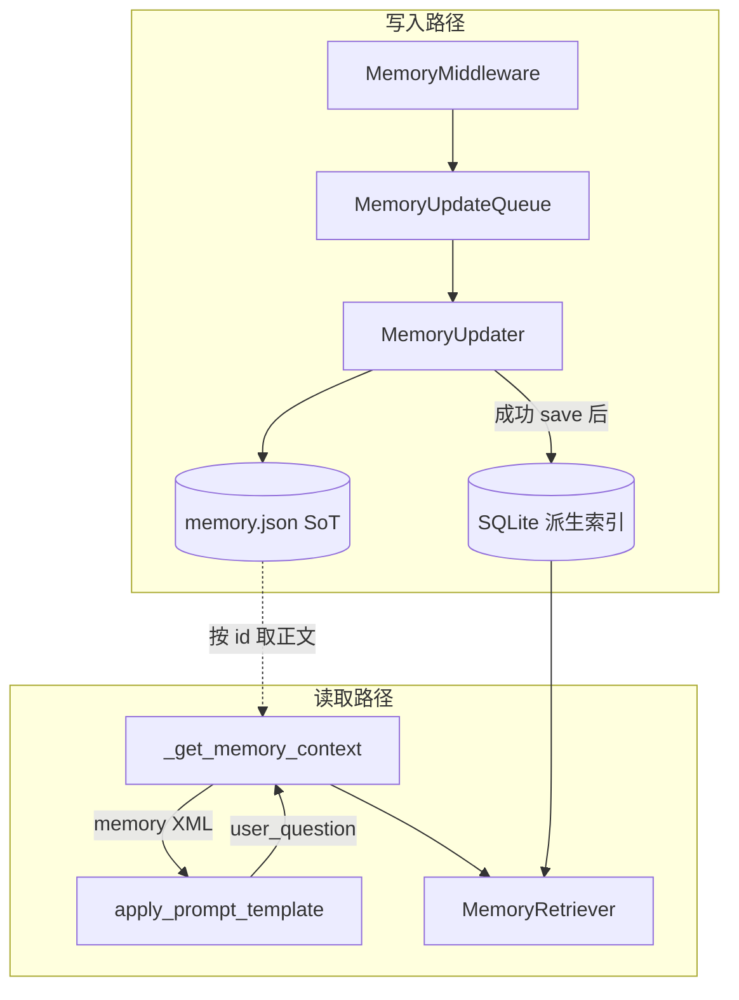

# 记忆检索索引与混合召回 — 需求与详细设计

| 属性 | 说明 |
|------|------|
| 状态 | 草案（待开发） |
| 适用范围 | EvoFlow 内置长期记忆（`memory.json` 管线） |
| 关联文档 | [06-memory-system](../technical/06-memory-system.md)（现状行为以该文档与源码为准） |
| 代码基线 | `backend/packages/harness/evoflow/agents/memory/`、`agents/lead_agent/prompt.py`、`agents/middlewares/memory_middleware.py` |

本文档合并 **需求说明** 与 **详细设计**，供后续实现与评审使用；实现时以本文为验收参照，若与源码冲突以本文档版本号与变更记录为准更新本文。

---

## 1. 背景与问题

### 1.1 现状简述

内置记忆采用「整包 JSON + LLM 周期性合并更新」模式：事实（facts）持久化在 `memory.json`，注入系统提示时由 `format_memory_for_injection` 按 **置信度（confidence）** 排序后，在 **token 预算** 内截取，**与本轮用户自然语言问题是否相关无关**。

同时，`apply_prompt_template` 已能拿到 `user_question`，但 **`_get_memory_context` 未接收该参数**，导致无法做 **query-aware** 的检索排序。

### 1.2 要解决的问题

1. 在 facts 数量增长后，仍希望注入的片段 **更贴近当前用户问句**（语义 + 词面）。
2. 预留 **向量检索** 能力，便于后续接入 **火山** 等已具备 embedding 能力的链路（如 coding plan 侧模型），与 chat 模型解耦。
3. 使用 **SQLite** 作为检索索引载体（与现有「主存 JSON 文件」分工），支持 **关键词（FTS）与向量混合**，融合后取 **综合得分最高** 的一批记忆进入提示词。
4. 默认行为可 **完全回退** 至当前逻辑，避免未配置向量时影响线上。

---

## 2. 目标与非目标

### 2.1 目标（必须达成）

| ID | 目标 |
|----|------|
| G1 | 支持基于 **本轮用户问题** 的 facts 检索排序（至少 FTS / 词法相关）。 |
| G2 | 引入 **派生索引**（SQLite），与 `memory.json` 权威数据同步；索引 **可全量重建**。 |
| G3 | 架构上预留 **Embedding 后端** 接口；未配置或失败时 **自动降级** 为仅词法/静态路径。 |
| G4 | 支持 **混合检索**（词法分数 + 向量相似度 → 融合排序），再经 token 预算截断后注入。 |
| G5 | 记忆更新成功写入 SoT 后，索引 **增量更新**；删除/清空事实时索引 **同步删除**。 |

### 2.2 非目标（本期不做或可选）

| ID | 非目标 |
|----|--------|
| NG1 | **不**将主存整体从 `memory.json` 迁移为纯 SQLite（避免大范围破坏 Gateway/UI/导出契约）；主存仍为 SoT。 |
| NG2 | **不**替代 `memory.external_*` Hermes 类外部记忆插件；二者可并存，本文仅描述内置索引层。 |
| NG3 | **不**在本期对 `user`/`history` 大块摘要做向量分片检索（可作为二期扩展，见 §14）。 |
| NG4 | **不**保证与第三方 TencentDB-Agent-Memory 等产品 API 兼容（若需对齐，另起集成文档）。 |

---

## 3. 术语

| 术语 | 含义 |
|------|------|
| SoT（Source of Truth） | `memory.json` 中结构化内容，尤以 `facts[]` 为检索对象一期范围。 |
| 派生索引 | SQLite 中 FTS / 向量表；丢失后可由 SoT 重建。 |
| query-aware 注入 | 使用本轮 `user_question`（及可选预计算向量）参与候选 facts 排序。 |
| 混合检索 | 多路打分融合（如 RRF 或加权）。 |
| Embedding 后端 | 负责 `text[] → vector[]` 的可替换实现（含火山、OpenAI 兼容、本地等）。 |

---

## 4. 功能需求（FR）

### 4.1 配置与模式

| FR-ID | 描述 | 优先级 |
|-------|------|--------|
| FR-01 | 增加 `retrieval_mode`：`static`（与现网一致）\|`fts` \| `vector` \| `hybrid`；默认 `static`。 | P0 |
| FR-02 | `static`：注入逻辑与当前 `format_memory_for_injection` 行为一致（按 confidence + token）。 | P0 |
| FR-03 | `fts`：用 SQLite FTS5 对 facts 的 `content`（及可选 `category`）建索引；用 `user_question` 检索 Top-K，再与 SoT 合并展示；**无命中时**回退若干高 confidence facts（可配置条数）。 | P0 |
| FR-04 | `vector`：对每条 fact 存 `embedding` blob（维度与模型一致）；查询时对 `user_question` 调 Embedding 后端算 query 向量，按相似度 Top-K；无向量或维度不匹配时降级 `fts` 或 `static` 并打日志。 | P1 |
| FR-05 | `hybrid`：同时对同一 query 跑 FTS 与向量两路，按 §8.3 融合得分排序，取 Top-K。 | P1 |
| FR-06 | 配置项：`index_enabled`（总开关）、`sqlite_index_path`（可选覆盖默认路径）、`retrieval_top_k`、`fts_fallback_top_n`、`embedding_model_ref`（指向 `models` 或独立段）、`hybrid_rrf_k` 或加权参数。 | P0 |

### 4.2 数据与生命周期

| FR-ID | 描述 | 优先级 |
|-------|------|--------|
| FR-10 | `MemoryUpdater` 在 **成功 `save`** 后，对变更的 facts **增量 upsert/delete** 到索引。 | P0 |
| FR-11 | `delete_memory_fact` / `clear_memory_data` 同步更新索引。 | P0 |
| FR-12 | 提供 **全量重建索引** 能力：读 SoT 全部 facts 写入 SQLite（CLI 子命令或 Gateway 管理接口二选一或都要，实现阶段定稿）。 | P1 |
| FR-13 | 索引文件按 **agent 维度** 或 **单库多列 `agent_key`** 隔离，与现有 global / per-agent `memory.json` 一致。 | P0 |

### 4.3 注入链路

| FR-ID | 描述 | 优先级 |
|-------|------|--------|
| FR-20 | `apply_prompt_template` → `_get_memory_context` **传入** `user_question`（及可选 `query_embedding`，见 §9）。 | P0 |
| FR-21 | `chat_compact` / `full` 两种 `injection_profile` 下，检索策略一致；仅 **facts 区块** 使用检索结果；`user`/`history` 区块规则保持现有产品定义（除非二期扩展）。 | P0 |
| FR-22 | 最终注入仍受 `max_injection_tokens` / `chat_compact_max_tokens` 约束。 | P0 |

---

## 5. 非功能需求（NFR）

| NFR-ID | 描述 |
|--------|------|
| NFR-01 | **默认零回归**：`retrieval_mode=static` 或未开启 `index_enabled` 时，与当前版本行为一致（单测对比快照或黄金用例）。 |
| NFR-02 | **性能**：单次检索在本地 SQLite 上 P95 延迟目标 < 50ms（不含网络 embedding）；含火山 HTTP embedding 的延迟单独监控，须 **超时降级**。 |
| NFR-03 | **可靠性**：embedding 失败、维度不一致、索引库损坏 → 降级路径明确，**不阻塞**对话主路径。 |
| NFR-04 | **可观测**：结构化日志字段包含 `retrieval_mode`、`hit_count`、`degraded_to`、`latency_ms`。 |
| NFR-05 | **并发**：与现有 `MemoryUpdateQueue` 线程模型兼容；索引写操作须避免长时间锁表阻塞读（实现可用 WAL、短事务）。 |

---

## 6. 总体架构

### 6.1 设计原则

1. **SoT 与索引分离**：`memory.json` 负责权威内容与 UI/导出；SQLite 仅为 **派生加速结构**。  
2. **检索可替换**：词法、向量、融合策略封装在 **Retriever** 内，注入层只消费「已排序的 fact id 列表 + 原文」。  
3. **Embedding 可插拔**：业务代码只依赖 **Protocol / ABC**，火山等供应商以独立模块注册。  
4. **渐进交付**：先 FTS + 注入链改造，再向量与混合，最后运维工具与压测。

### 6.2 逻辑架构图



---

## 7. 数据模型（SQLite）

以下为逻辑模型，实现时可微调类型与命名，但须在文档附录登记 **实际 DDL 版本**。

### 7.1 表：`memory_facts_index`

| 列 | 类型 | 说明 |
|----|------|------|
| `fact_id` | TEXT PK | 与 SoT `facts[].id` 一致 |
| `agent_key` | TEXT | `global` 或 agent 名 |
| `content` | TEXT | 冗余全文，便于 FTS 与重建 |
| `category` | TEXT | 可选，参与 FTS `content` 拼接或独立列 |
| `confidence` | REAL | 冗余，供融合与 fallback |
| `updated_at` | TEXT ISO8601 | 与 SoT 同步时间 |
| `embedding` | BLOB NULL | float32 顺序存储；NULL 表示未灌向量 |
| `embedding_model` | TEXT NULL | 模型标识，用于变更后失效重灌 |
| `embedding_dim` | INTEGER NULL | 维度校验 |

### 7.2 FTS5 虚拟表

- 方案 A：`content` 列参与 FTS5，与主表 **content 同步触发器或应用层双写**。  
- 方案 B：使用 `fts5v2` / `external content=` 指向主表（若运行时 SQLite 版本支持）。  

实现阶段在 **技术评审** 选定一种并写入迁移脚本注释。

### 7.3 可选：`schema_meta`

| 列 | 说明 |
|----|------|
| `key` | 如 `index_version` |
| `value` | 版本号字符串 |

用于检测索引版本与代码不兼容时触发 **自动重建或拒绝启动（可配置）**。

---

## 8. 模块与接口设计

### 8.1 建议包路径

`evoflow.agents.memory_retrieval`（或 `evoflow.agents.memory.index`，实现时二选一，避免目录碎片化）

子模块建议：

| 模块 | 职责 |
|------|------|
| `sqlite_store.py` | 连接管理、DDL、迁移、WAL |
| `index_writer.py` | upsert / delete / rebuild |
| `retriever.py` | `search(agent_key, query, mode) -> list[ScoredFactId]` |
| `fusion.py` | RRF 或加权融合 |
| `embedding_backend.py` | Protocol + `NullBackend` + 预留 `VolcanoEmbeddingBackend` |
| `types.py` | `ScoredFactId`、`RetrievalMode` 等数据类 |

### 8.2 `EmbeddingBackend`（接口草案）

```python
# 逻辑接口，非最终实现
class EmbeddingBackend(Protocol):
    def name(self) -> str: ...
    def dimensions(self) -> int: ...
    def embed(self, texts: list[str]) -> list[list[float]]: ...
    def is_configured(self) -> bool: ...
```

- `NullBackend`：`is_configured() -> False`。  
- 超时、非 2xx、维度不一致 → 上层捕获并 **降级**，记 `degraded_to`。

### 8.3 融合算法（`hybrid`）

**默认推荐：RRF（Reciprocal Rank Fusion）**

对 FTS 排名列表 \(R_{lex}\) 与向量排名列表 \(R_{vec}\)，分数：

\[
\text{score}(d) = \sum_{r \in \{lex, vec\}} \frac{1}{k + \text{rank}_r(d)}
\]

- `k` 为配置项 `hybrid_rrf_k`（常用 60，实现可调）。  
- 仅出现在一路中的文档仍可获得非零分。

**备选：加权融合**（配置 `w_lex`, `w_vec` 且两路分数需归一化到 [0,1]），实现复杂度略高，可作为二期。

### 8.4 注入链改造（调用关系）

1. `apply_prompt_template(..., user_question=...)`  
2. `_get_memory_context(agent_name, injection_profile=..., user_question=..., query_embedding=optional)`  
3. 内部：  
   - `memory_data = get_memory_storage().load(agent_name)`  
   - 若 `retrieval_mode != static` 且 `index_enabled`：  
     - `candidate_ids = retriever.search(agent_key, user_question, mode, top_k)`  
     - 将 `facts` **重排**：命中序优先，其余按原 confidence 填充至 token 上限（策略可配置：`fill_rest_by_confidence`）。  
   - 否则：调用现有 `format_memory_for_injection(memory_data, ...)` **不变**。  

**可选优化**：若上游（如火山 coding plan）已提供 `query_embedding`，则 `vector`/`hybrid` 跳过对 query 的重复 embedding 调用，直接 ANN；接口在 `_get_memory_context` 增加可选参数或在 `Runtime.context` 约定键名（实现时二选一并文档化）。

---

## 9. 写入同步策略

| 事件 | 索引动作 |
|------|----------|
| `MemoryUpdater` 成功 `save` | 解析 diff 困难时可 **全量 facts 列表比对 id 集**：新增/更新 upsert，删除 remove |
| `delete_memory_fact` | 按 `fact_id` delete |
| `clear_memory_data` | `TRUNCATE` 或删库文件对该 agent |
| 进程启动 / 配置变更 | 可选校验 `schema_meta`；不匹配则异步 rebuild |

**异步 embedding**：新 fact 可先写入 FTS 行，`embedding` 列 NULL；后台任务补全后更新；检索时无向量则该条在向量路不参与 RRF 或仅走 lex 路。

---

## 10. 配置项草案（并入 `MemoryConfig` / `config.yaml`）

以下为草案字段名，落地时与 `config-reference` 同步更新。

```yaml
memory:
  # 现有字段保持不变 …
  retrieval_mode: static          # static | fts | vector | hybrid
  index_enabled: false
  sqlite_index_path: ""           # 空则默认 {base_dir}/.evoflow/memory_index.sqlite
  retrieval_top_k: 20
  fts_fallback_facts: 5           # FTS 无命中时补充的高 confidence 条数
  hybrid_rrf_k: 60
  embedding:
    backend: null                 # null | openai_compatible | volcano | ...
    model_ref: ""                 # 引用 models 名称或独立 endpoint
    timeout_ms: 8000
```

---

## 11. 与火山 / Coding Plan 的对接预留

1. **独立 Embedding 配置**：与对话 `model_name` 解耦，避免把 chat 模型误当 embedding。  
2. **`VolcanoEmbeddingBackend`**（名称待定）：实现 `EmbeddingBackend`，内部 HTTP/SDK 由集成方填充。  
3. **预计算 query 向量**：若 coding plan 管线已生成，经 `Runtime.context` 或显式参数传入，**Retriever** 优先使用，减少延迟与费用。  
4. **命名空间（可选扩展）**：若未来 coding 计划产生「代码块向量」与「用户 fact」并存，使用 `namespace` 列或分表，检索时 **默认只查 `namespace=user_memory`**，避免混检。

---

## 12. 迁移与回滚

| 步骤 | 说明 |
|------|------|
| 初次上线 | `index_enabled=false`，发版无行为变化；运维执行一次 rebuild 后再开 `fts`。 |
| 回滚 | `retrieval_mode=static` 或 `index_enabled=false`；SoT 未变，零数据丢失。 |
| 重建 | 遍历 SoT 全部 `facts`，写入 SQLite；清空 FTS 与向量列后重灌。 |

---

## 13. 测试与验收

| 用例类型 | 内容 |
|----------|------|
| 单元 | FTS 分词/排名、RRF 融合、降级路径、维度不匹配 |
| 集成 | `MemoryUpdater` save 后索引行数一致；delete/clear 后索引一致 |
| 回归 | `static` 与旧版注入字符串 **字节级或规范化后**一致（允许 whitespace 策略事先约定） |
| 性能 | 1w / 10w facts 量级本地 P95（不含外网 embedding） |

---

## 14. 分期实施建议（与里程碑）

| 阶段 | 内容 | 产出 |
|------|------|------|
| P0 | 配置骨架 + `retrieval_mode=static` 默认；**无代码路径变化** | 配置解析 + 文档 |
| P1 | SQLite DDL + IndexWriter + `fts` + 注入链传入 `user_question` | query-aware 词法检索 |
| P2 | embedding blob + `VolcanoEmbeddingBackend` 占位实现 + `vector` | 单向量检索 |
| P3 | `hybrid` + RRF + 超时降级 + 观测日志 | 混合检索闭环 |
| P4 | rebuild CLI/API + 压测 + `config-reference` 更新 | 可运维 |

**二期（可选）**：对 `history`/`user` 摘要切块建索引；会话级检索继续与 `session_search` 等机制区分职责。

---

## 15. 风险与开放问题

| 风险 | 缓解 |
|------|------|
| SQLite 锁竞争 | WAL、短事务、embedding 异步化 |
| 中文分词 FTS 质量 | 选用 `unicode61` tokenizer 或自定义分词插件（视 SQLite 编译选项） |
| token 预算与「相关但冗长」事实 | Top-K 后再按 line token 截断；可引入 **MMR** 多样性（二期） |
| 开放问题 | `user_question` 为空或非用户轮次时，是否回退 `latest_human_preview`（与 `DynamicSystemPromptMiddleware` 行为对齐）——实现前在 PR 中定论 |

---

## 16. 修订记录

| 版本 | 日期 | 说明 |
|------|------|------|
| 0.1 | 2026-05-15 | 初稿：需求 + 设计合并 |

---

## 附录 A：与现有文档关系

- **现状行为、中间件与队列**：仍以 [06-memory-system](../technical/06-memory-system.md) 为准。  
- **外部 Hermes 类记忆插件**：不改变其契约；本文索引层作用于 **内置 `memory.json` facts**。

## 附录 B：`user_question` 传递链（实现核对清单）

1. `dynamic_system_prompt_middleware.py`：`user_question` 已从 context 解析。  
2. `apply_prompt_template(..., user_question=...)`：已有参数。  
3. `_get_memory_context(...)`：**需扩展签名**。  
4. `format_memory_for_injection`：可拆出 `format_facts_with_order(facts, ordered_ids, ...)` 或在新模块组装 facts 区块。

（实现完成后将本附录替换为「实际函数签名」链接或简短说明。）
