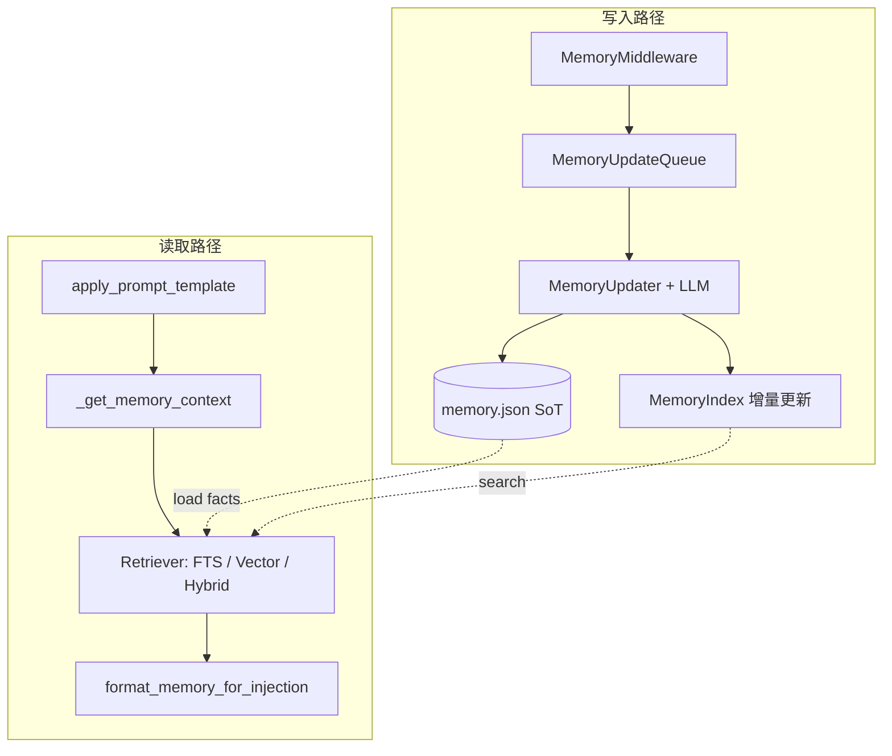

# 记忆检索：SQLite 索引、关键词与向量混合召回 — 需求与详细设计

| 属性 | 说明 |
|------|------|
| 状态 | 草案（待开发） |
| 适用范围 | EvoFlow 内置长期记忆（`memory.json` 管线） |
| 关联文档 | [06-memory-system](../technical/06-memory-system.md)、[external-memory-plugins.md](./external-memory-plugins.md)（若存在） |
| 非目标 | 本文不替代外部 Hermes 类 `MemoryProvider`；不规定火山 Coding Plan 内部实现，仅规定 **Embedding 能力对接面** |

---

## 第一部分：需求说明

### 1.1 背景与问题

当前内置记忆（见技术文档 § 写入/注入链路）具备：

- 由 LLM 周期性合并写入的 **结构化 JSON**（`user` / `history` / `facts[]`）；
- 注入时 **`facts` 按置信度排序后按 token 预算截取**，**与本轮用户自然语言问题是否相关无关**。

在长事实列表、跨主题会话场景下，会导致：

- 注入的事实 **偏离当前意图**，占用有限 `max_injection_tokens`；
- 后续若接入 **语义向量**（如火山方舟 / Coding Plan 侧已有向量模型），缺少 **统一检索层** 与 **可重建索引**，难以渐进上线。

### 1.2 目标（业务）

1. **查询感知（Query-aware）**：系统提示中的「Facts」区块应 **优先包含与本轮用户输入语义或词面相关的记忆条目**，在预算内最大化有用信息密度。
2. **关键词检索**：不依赖向量模型时，仍能通过 **SQLite 全文检索（FTS5）** 等能力完成 **词面/分词** 相关召回。
3. **向量检索（可选）**：配置可用嵌入模型后，对 **事实文本** 建向量索引；检索时对 **用户问句** 算向量，按相似度参与排序。
4. **混合检索**：同时利用 **词面分数** 与 **向量相似度**，经 **可配置的融合策略**（如 RRF 或加权）得到最终排序，再取 **综合分最高** 的若干条记忆注入。
5. **兼容与降级**：默认行为与线上一致；未配置向量、索引损坏、嵌入超时时 **自动降级** 为仅 FTS 或现有静态排序，不得阻断对话。
6. **与外部记忆插件共存**：不改变 `memory.external_provider` 语义；内置检索仅作用于 **`memory.json` 派生索引**。

### 1.3 非功能需求

| 类别 | 要求 |
|------|------|
| 一致性 | `memory.json` 为 **单一事实来源（SoT）**；索引为派生数据，须可在运维动作下 **全量重建** |
| 性能 | 单次检索在默认参数下 **P95 延迟** 可接受（建议目标 &lt; 200ms 本地 SQLite，不含网络嵌入；含网络嵌入单独配置超时） |
| 可观测 | 检索模式、命中条数、是否降级、嵌入失败原因可写入 **debug 日志**（可选结构化审计事件） |
| 安全 | 索引库路径落在已有 `Paths.base_dir` 体系内；禁止将索引文件解析为可执行内容 |
| 测试 | 提供 **纯本地单测**：FTS、RRF 融合、降级路径、删除/清空记忆后索引一致 |

### 1.4 约束

- **第一期不强制**将主存从 `FileMemoryStorage` 迁出为纯 SQLite；以降低对 Gateway / UI / 导出路径的波及。
- **嵌入模型与对话模型解耦**：嵌入不可用不得影响主对话模型调用。
- **中文与英文**：FTS 分词策略须明确（SQLite `unicode61` / 外部分词器二选一，文档级约定即可）。

### 1.5 验收标准（建议）

1. `retrieval_mode=static`（默认）：与当前版本相比，**注入文本在相同输入下等价或仅空白差异**（回归基线）。
2. `retrieval_mode=fts`：给定固定 `memory.json` 与问句，Facts 区块 **包含 FTS Top-K 中的条目**（K 可配置），且总长度不超过 `max_injection_tokens`。
3. `retrieval_mode=hybrid`（已配置嵌入）：问句与同义改写下，**目标 fact_id 命中率** 不低于基线用例集约定阈值（由测试夹具维护）。
4. `clear_memory_data` / `delete_memory_fact` 后，索引中 **无残留** 对应行（或标记为已删除且检索不可见）。
5. 提供 **reindex** 入口（CLI 或 Gateway 管理接口二选一，文档中定稿）：全量扫描 SoT 后索引行数与 facts 条数一致。

---

## 第二部分：详细设计

### 2.1 总体架构

在现有「SoT JSON + LLM 更新 + 注入格式化」之上，增加 **派生检索索引层**：

**关键点**：`user_question` 必须从 `apply_prompt_template` **贯穿** 至检索层（当前实现未传入 `_get_memory_context`，属本需求必改点）。

### 2.2 模块与职责划分（建议包名）

| 模块 | 职责 |
|------|------|
| `evoflow.agents.memory.index`（新建） | SQLite 连接、表结构、迁移版本、FTS 维护、向量列读写 |
| `evoflow.agents.memory.retrieval`（新建） | `retrieve_facts(query, agent_name, mode) -> list[ScoredFactRef]`；融合策略；降级 |
| `evoflow.agents.memory.embedding_backend`（新建） | 协议：`embed(texts) -> list[Vector]`；实现：`Null`、`HttpOpenAICompatible`、`VolcArk`（占位） |
| 现有 `prompt.py` | `format_memory_for_injection` 增加可选参数：`user_question`、`retrieved_fact_ids` 或已排序 `facts` 子列表 |
| 现有 `lead_agent/prompt.py` | `_get_memory_context(..., user_question=...)`；调用检索层后再格式化 |
| 现有 `updater.py` | `save` 成功后调用索引 **upsert/delete**；失败 **不打断** 主流程 |
| `memory_config.py` | 新增配置项（见 §2.6） |

### 2.3 数据模型（SQLite）

**库文件位置（建议）**：`{Paths.base_dir}/.evoflow/memory_index.sqlite`（单库多表）或按 agent 分文件 `memory_index/{agent_key}.sqlite`（二选一，推荐 **单库 + `agent_key` 列** 便于全局管理）。

#### 2.3.1 表：`memory_facts_index`

| 列 | 类型 | 说明 |
|----|------|------|
| `agent_key` | TEXT | `""` 表示全局，否则为 agent 名 |
| `fact_id` | TEXT PRIMARY KEY | 与 `memory.json` 中 `facts[].id` 一致 |
| `content` | TEXT | 与 SoT 同步，用于 FTS 外部内容表或生成 doc |
| `category` | TEXT | 冗余，便于过滤 |
| `confidence` | REAL | 冗余，用于融合与 fallback |
| `source` | TEXT | 冗余 |
| `updated_at` | TEXT ISO8601 | 与 SoT 同步或本地更新时间 |
| `embedding` | BLOB NULL | float32 little-endian 顺序存储；NULL 表示未灌向量 |
| `embedding_model` | TEXT NULL | 模型标识，用于版本迁移 |
| `embedding_dim` | INTEGER NULL | 维度 |
| `vec_state` | TEXT | 建议枚举：`ok` / `pending` / `error` |

#### 2.3.2 FTS5

- 使用 **外部内容表（external content）** 或 **独立 FTS 表 + 触发器** 与 `content` 同步；保证 **DELETE/UPDATE** 与 SoT 一致。
- `MATCH` 查询返回 `bm25` 或内置排序分数，归一化到 `[0,1]` 或与向量分数可比尺度。

#### 2.3.3 向量相似度

- **小规模**（如 facts &lt; 5k）：可在 Python 中载入候选向量做点积/余弦（注意内存）。
- **大规模**：引入 **sqlite-vec** 扩展或分库；作为 **Phase 2+** 可选实现，本设计预留 `embedding` BLOB 与 `embedding_dim` 即可。

### 2.4 检索流程

**输入**：`user_question`（可能为空）、`agent_name`、`retrieval_mode`、各 TopK 与 token 预算。

**步骤**：

1. **空问句**：不走 FTS/向量，**回退** 为与现网一致的「按 confidence + token 预算」逻辑。
2. **FTS**：`MATCH(user_question)` 取 Top `K_lex`。
3. **向量**（若 `mode` 含 vector 且嵌入可用）：对 `user_question` 嵌入得 `q`；对候选集（可先 FTS 扩召回 ∪ 高 confidence 保底集）算相似度，取 Top `K_vec`。
4. **融合**：
   - **RRF**：`score = Σ 1/(k + rank_i)`，k 默认 60；
   - 或 **加权**：`score = w_lex * norm_lex + w_vec * norm_vec`。
5. **重排与截断**：按融合分降序；依次加入 `format_memory_for_injection` 直到 **`max_injection_tokens`**（及 `chat_compact` 规则）耗尽。
6. **Fallback**：若 FTS 无命中且向量不可用，则 **至少合并** 若干条 **全局高 confidence** facts（与当前行为对齐），避免「零记忆」。

### 2.5 写入与索引一致性

- **触发点**：`MemoryUpdater.update_memory` 在 **`get_memory_storage().save` 返回 True** 之后，对比新旧 `facts` 集合（按 `id`），执行 **upsert / delete**。
- **首次启用**：后台或显式 **`rebuild_memory_index`**：扫描 SoT 全量写入索引。
- **版本升级**：`embedding_model` 或 `embedding_dim` 变更时，将受影响行 `vec_state=pending`，由后台任务重灌。

### 2.6 配置项（建议草案，实现时以 Pydantic 与 `config.yaml` 为准）

在 `MemoryConfig`（或独立 `MemoryRetrievalConfig` 嵌套）中增加：

| 配置键 | 类型 | 默认值 | 说明 |
|--------|------|--------|------|
| `retrieval_mode` | string | `static` | `static` / `fts` / `vector` / `hybrid` |
| `retrieval_index_enabled` | bool | false | 为 true 时维护索引；false 时不写 SQLite |
| `retrieval_sqlite_path` | string | `""` | 空则使用默认 `{base_dir}/.evoflow/memory_index.sqlite` |
| `retrieval_topk_lex` | int | 30 | FTS 候选上限 |
| `retrieval_topk_vec` | int | 30 | 向量候选上限 |
| `retrieval_fusion` | string | `rrf` | `rrf` / `weighted` |
| `retrieval_rrf_k` | int | 60 | RRF 参数 |
| `retrieval_lex_weight` | float | 0.5 | weighted 模式用 |
| `retrieval_vec_weight` | float | 0.5 | weighted 模式用 |
| `retrieval_fallback_high_confidence_n` | int | 5 | 检索弱命中时保底条数 |
| `embedding_backend` | string | `none` | `none` / `http_openai` / `volc_ark`（占位名，实现时对齐内部规范） |
| `embedding_model_ref` | string | `""` | 指向 `models[]` 中一条或独立 endpoint |
| `embedding_timeout_ms` | int | 10000 | 超时降级 |
| `embedding_batch_size` | int | 32 | 批灌库 |

**默认**：`retrieval_index_enabled=false` 且 `retrieval_mode=static`，保证 **零行为变更**。

### 2.7 与火山 / Coding Plan 的对接面（预留）

1. **统一通过 `EmbeddingBackend`** 调用火山方舟等；禁止在业务模块散落 HTTP 细节。
2. **可选优化**：若上游已在 Runtime 中计算 **query embedding**（例如 Coding Plan 复用），检索接口支持 **`prefetched_query_embedding: Optional[list[float]]`**，非空则 **跳过** 对问句的重复嵌入。
3. **命名空间**：若未来存在「代码块向量」与「用户事实向量」两类索引，使用 **不同表或 `namespace` 列**，检索时 **不得默认混检**，除非显式配置 `unified_search`。

### 2.8 风险与缓解

| 风险 | 缓解 |
|------|------|
| SoT 与索引漂移 | 成功 save 再更新；提供 rebuild；启动时可选校验计数 |
| FTS 与中文分词弱 | 明确 tokenizer 策略；hybrid 后向量补强 |
| 嵌入 API 不稳定 | 超时 + 降级 + `vec_state=error` 可观测 |
| 单库过大 | 分 agent 文件或归档旧 facts（后续迭代） |

### 2.9 测试计划（概要）

- **单元测试**：RRF 分数、空问句、无索引文件自动创建、删除 fact 后检索不可见。
- **集成测试**：小 fixture `memory.json` + 预置 SQLite，验证 `_get_memory_context` 在传入 `user_question` 时 facts 顺序变化符合预期。
- **回归**：`static` 模式与旧版输出对比（golden 或关键字段抽取）。

### 2.10 实施分期（与开发排期对齐）

| 阶段 | 内容 | 交付 |
|------|------|------|
| Phase 0 | 配置骨架 + 空实现 + 日志 | 默认行为不变 |
| Phase 1 | SQLite FTS + `user_question` 注入链 + 增量索引 + rebuild | `fts` 模式可用 |
| Phase 2 | BLOB 向量 + 异步灌库 + `vector`/`hybrid` | 本地嵌入可跑 |
| Phase 3 | `VolcArk` / 内部网关嵌入实现 | 火山侧接入 |
| Phase 4 | 观测、Gateway 管理接口、性能调优 | 生产可运维 |

---

## 第三部分：文档维护

- **实现完成后**：在 [06-memory-system](../technical/06-memory-system.md) 增加一节「检索索引与混合召回」，链接本文；本文状态改为「已实现」并附 **实际配置键名** 与 **表结构版本号**。
- **若设计变更**：更新本文「修订记录」表格（日期、作者、变更摘要）。

### 修订记录

| 日期 | 变更摘要 |
|------|----------|
| 2026-05-15 | 初稿：合并需求与详细设计 |
