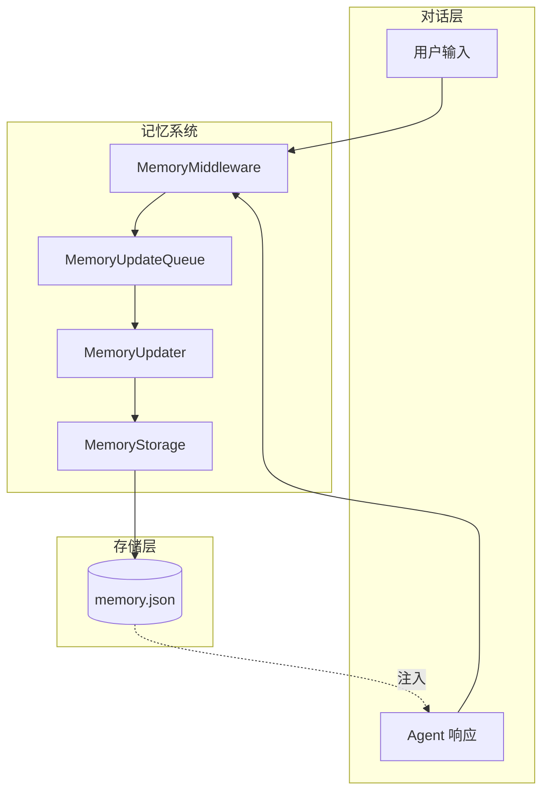
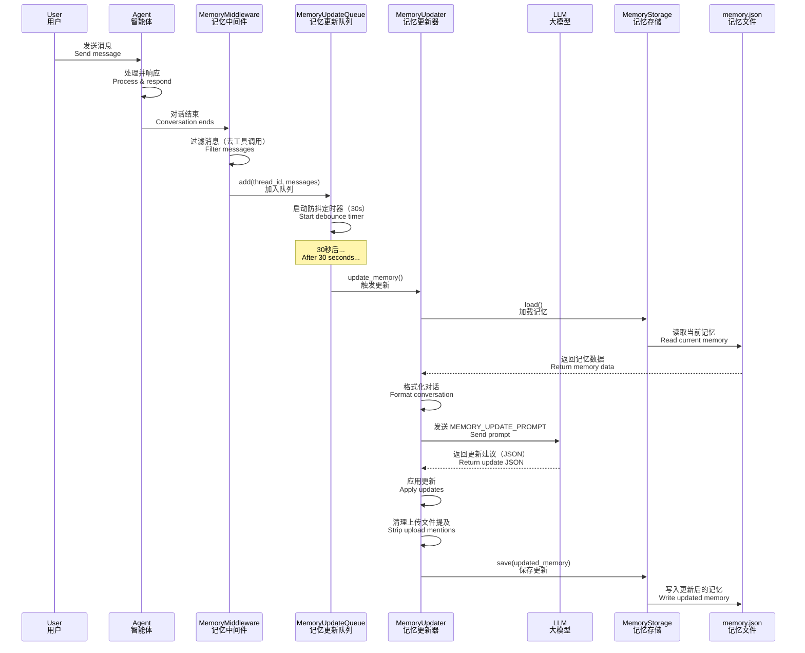
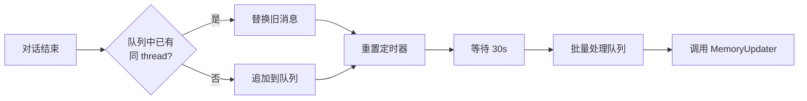
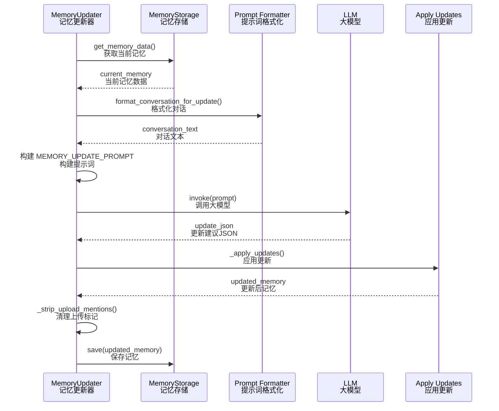
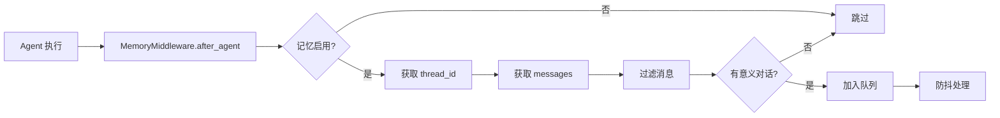

# 06-记忆系统技术文档

## 一、概述

### 1.1 一句话理解

记忆系统（Memory System）让 EvoFlow 能够跨对话会话持久化存储用户信息，通过 LLM 自动提取和总结对话中的关键事实，并在后续对话中注入系统提示词，实现个性化响应。

### 1.2 架构位置



**核心流程**：
1. 对话结束后，`MemoryMiddleware` 将对话加入更新队列
2. `MemoryUpdateQueue` 使用防抖机制批量处理
3. `MemoryUpdater` 调用 LLM 提取关键信息
4. `MemoryStorage` 持久化到 `memory.json`
5. 新对话开始时，记忆内容注入系统提示词

---

## 二、核心概念

### 2.1 关键术语

| 术语 | 英文 | 说明 |
|------|------|------|
| 记忆 | Memory | 跨对话持久化的用户信息和上下文 |
| 记忆更新 | Memory Update | 从对话中提取信息并更新记忆的过程 |
| 记忆注入 | Memory Injection | 将记忆内容插入系统提示词 |
| 防抖 | Debounce | 延迟处理以避免频繁更新 |
| 事实 | Fact | 提取的具体信息点，带置信度 |
| 记忆存储 | MemoryStorage | 持久化存储抽象接口 |

### 2.2 记忆数据结构

**源码位置**: `backend/packages/harness/evoflow/agents/memory/storage.py#L18-L34`

**逻辑说明**: `create_empty_memory()` 定义了记忆数据的完整结构，包含用户上下文、历史记录和事实列表。

```python
def create_empty_memory() -> dict[str, Any]:
    """Create an empty memory structure."""
    return {
        "version": "1.0",
        "lastUpdated": datetime.utcnow().isoformat() + "Z",
        "user": {
            "workContext": {"summary": "", "updatedAt": ""},
            "personalContext": {"summary": "", "updatedAt": ""},
            "topOfMind": {"summary": "", "updatedAt": ""},
        },
        "history": {
            "recentMonths": {"summary": "", "updatedAt": ""},
            "earlierContext": {"summary": "", "updatedAt": ""},
            "longTermBackground": {"summary": "", "updatedAt": ""},
        },
        "facts": [],
    }
```

**结构说明**：

| 字段 | 类型 | 说明 |
|------|------|------|
| `version` | string | 记忆数据版本 |
| `lastUpdated` | string | 最后更新时间（ISO 8601） |
| `user` | object | 用户上下文（当前状态） |
| `user.workContext` | object | 工作背景：职业、公司、技术栈 |
| `user.personalContext` | object | 个人背景：语言、偏好 |
| `user.topOfMind` | object | 当前关注：正在进行的事项 |
| `history` | object | 历史记录（时间维度） |
| `history.recentMonths` | object | 近 1-3 个月活动 |
| `history.earlierContext` | object | 3-12 个月历史 |
| `history.longTermBackground` | object | 长期背景 |
| `facts` | array | 具体事实列表 |

### 2.3 事实（Fact）结构

**单个事实的数据结构**：

```json
{
    "id": "fact_a1b2c3d4",
    "content": "用户偏好使用 Python 进行数据分析",
    "category": "preference",
    "confidence": 0.95,
    "createdAt": "2026-03-30T10:00:00Z",
    "source": "thread_abc123"
}
```

**字段说明**：

| 字段 | 类型 | 说明 |
|------|------|------|
| `id` | string | 唯一标识符（fact_ + 8位随机） |
| `content` | string | 事实内容 |
| `category` | string | 类别：preference/knowledge/context/behavior/goal |
| `confidence` | float | 置信度（0.0-1.0） |
| `createdAt` | string | 创建时间 |
| `source` | string | 来源对话 ID |

**事实类别**：

| 类别 | 说明 | 示例 |
|------|------|------|
| `preference` | 用户偏好 | 喜欢暗色主题、偏好中文 |
| `knowledge` | 专业知识 | 精通 Python、熟悉 K8s |
| `context` | 背景信息 | 在腾讯工作、负责后端 |
| `behavior` | 行为模式 | 习惯先写测试、喜欢详细注释 |
| `goal` | 目标意图 | 学习 Rust、优化性能 |

### 2.4 记忆更新流程



### 2.5 记忆类型对比

| 记忆类型 | 存储位置 | 更新方式 | 作用范围 |
|----------|----------|----------|----------|
| **短期记忆** | `ThreadState.messages` | 自动追加 | 当前对话 |
| **长期记忆** | `memory.json` | LLM 提取 + 防抖更新 | 跨对话 |
| **技能记忆** | `SKILL.md` | 手动编辑 | 特定技能 |

**关键区别**：

1. **短期记忆** - 当前对话的完整消息历史（包括工具调用）
   ```python
   # ThreadState 中的 messages
   messages = [
       SystemMessage(content="系统提示..."),
       HumanMessage(content="你好"),
       AIMessage(content="你好！有什么可以帮你？"),
       # ... 多轮对话
   ]
   ```

2. **长期记忆** - 跨对话的摘要信息，自动提取
   - 不是原始对话，是 LLM 提取的结构化摘要
   - 带时间戳，支持时间维度（recentMonths/earlierContext）

3. **记忆更新是自动的，非工具调用**
   - 对话结束后自动触发
   - 模型**不能**主动调用工具更新记忆
   - 模型**被动接收**注入的记忆

### 2.6 记忆注入示例

**系统提示词中的记忆注入**：

```
You are a helpful assistant.

<memory>
User Context:
- Work: 后端开发工程师，负责微服务架构设计
- Personal: 中文母语，偏好简洁的技术文档
- Current Focus: 正在学习 Rust，关注云原生技术

History:
- Recent: 过去一个月主要在做 EvoFlow 的记忆系统开发

Facts:
- [preference | 0.95] 偏好使用 Python 进行数据分析
- [knowledge | 0.90] 精通 Kubernetes 和 Docker
</memory>

User: 帮我写一个 Docker 配置
```

**说明**：
- 记忆自动注入系统提示词
- 模型基于记忆生成个性化响应
- 无需模型主动"查询"记忆

---

## 三、配置与存储

### 3.1 记忆配置

**源码位置**: `backend/packages/harness/evoflow/config/memory_config.py`

**逻辑说明**: `MemoryConfig` 定义了记忆系统的所有配置项，使用 Pydantic 进行验证。

```python
class MemoryConfig(BaseModel):
    """Configuration for global memory mechanism."""

    enabled: bool = Field(default=True, description="Whether to enable memory mechanism")
    
    storage_path: str = Field(
        default="",
        description="Path to store memory data. If empty, defaults to `{base_dir}/memory.json`"
    )
    
    storage_class: str = Field(
        default="evoflow.agents.memory.storage.FileMemoryStorage",
        description="The class path for memory storage provider"
    )
    
    debounce_seconds: int = Field(
        default=30, ge=1, le=300,
        description="Seconds to wait before processing queued updates (debounce)"
    )
    
    model_name: str | None = Field(
        default=None,
        description="Model name to use for memory updates (None = use default model)"
    )
    
    max_facts: int = Field(
        default=100, ge=10, le=500,
        description="Maximum number of facts to store"
    )
    
    fact_confidence_threshold: float = Field(
        default=0.7, ge=0.0, le=1.0,
        description="Minimum confidence threshold for storing facts"
    )
    
    injection_enabled: bool = Field(
        default=True,
        description="Whether to inject memory into system prompt"
    )
    
    max_injection_tokens: int = Field(
        default=2000, ge=100, le=8000,
        description="Maximum tokens to use for memory injection"
    )
```

**配置项说明**：

| 配置项 | 默认值 | 说明 |
|--------|--------|------|
| `enabled` | `true` | 是否启用记忆系统 |
| `storage_path` | `""` | 记忆文件存储路径，空则使用默认路径 |
| `storage_class` | `FileMemoryStorage` | 存储提供类 |
| `debounce_seconds` | `30` | 防抖等待时间（1-300秒） |
| `model_name` | `null` | 用于记忆更新的模型，null 使用默认模型 |
| `max_facts` | `100` | 最大存储事实数量（10-500） |
| `fact_confidence_threshold` | `0.7` | 事实置信度阈值（0.0-1.0） |
| `injection_enabled` | `true` | 是否将记忆注入系统提示词 |
| `max_injection_tokens` | `2000` | 记忆注入最大 Token 数（100-8000） |

### 3.2 存储抽象层

**源码位置**: `backend/packages/harness/evoflow/agents/memory/storage.py#L37-L54`

**逻辑说明**: `MemoryStorage` 是存储层的抽象基类，支持不同的存储后端。

```python
class MemoryStorage(abc.ABC):
    """Abstract base class for memory storage providers."""

    @abc.abstractmethod
    def load(self, agent_name: str | None = None) -> dict[str, Any]:
        """Load memory data for the given agent."""
        pass

    @abc.abstractmethod
    def reload(self, agent_name: str | None = None) -> dict[str, Any]:
        """Force reload memory data for the given agent."""
        pass

    @abc.abstractmethod
    def save(self, memory_data: dict[str, Any], agent_name: str | None = None) -> bool:
        """Save memory data for the given agent."""
        pass
```

**设计说明**：
- 支持全局记忆（`agent_name=None`）和 per-agent 记忆
- `reload()` 强制刷新缓存，用于外部修改后的同步
- `save()` 返回布尔值表示成功/失败

### 3.3 文件存储实现

**源码位置**: `backend/packages/harness/evoflow/agents/memory/storage.py#L56-L159`

**逻辑说明**: `FileMemoryStorage` 是基于文件系统的存储实现，使用 JSON 格式，支持缓存和原子写入。

```python
class FileMemoryStorage(MemoryStorage):
    """File-based memory storage provider."""

    def __init__(self):
        self._memory_cache: dict[str | None, tuple[dict[str, Any], float | None]] = {}

    def _get_memory_file_path(self, agent_name: str | None = None) -> Path:
        """Get the path to the memory file."""
        if agent_name is not None:
            self._validate_agent_name(agent_name)
            return get_paths().agent_memory_file(agent_name)

        config = get_memory_config()
        if config.storage_path:
            p = Path(config.storage_path)
            return p if p.is_absolute() else get_paths().base_dir / p
        return get_paths().memory_file

    def load(self, agent_name: str | None = None) -> dict[str, Any]:
        """Load memory data (cached with file modification time check)."""
        file_path = self._get_memory_file_path(agent_name)

        try:
            current_mtime = file_path.stat().st_mtime if file_path.exists() else None
        except OSError:
            current_mtime = None

        cached = self._memory_cache.get(agent_name)

        # 缓存未命中或文件已修改，重新加载
        if cached is None or cached[1] != current_mtime:
            memory_data = self._load_memory_from_file(agent_name)
            self._memory_cache[agent_name] = (memory_data, current_mtime)
            return memory_data

        return cached[0]

    def save(self, memory_data: dict[str, Any], agent_name: str | None = None) -> bool:
        """Save memory data to file and update cache."""
        file_path = self._get_memory_file_path(agent_name)

        try:
            file_path.parent.mkdir(parents=True, exist_ok=True)
            memory_data["lastUpdated"] = datetime.utcnow().isoformat() + "Z"

            # 原子写入：先写临时文件，再重命名
            temp_path = file_path.with_suffix(".tmp")
            with open(temp_path, "w", encoding="utf-8") as f:
                json.dump(memory_data, f, indent=2, ensure_ascii=False)

            temp_path.replace(file_path)

            # 更新缓存
            try:
                mtime = file_path.stat().st_mtime
            except OSError:
                mtime = None
            self._memory_cache[agent_name] = (memory_data, mtime)
            return True
        except OSError as e:
            logger.error("Failed to save memory file: %s", e)
            return False
```

**关键特性**：

| 特性 | 实现方式 | 说明 |
|------|----------|------|
| 缓存机制 | mtime 比较 | 避免重复读取未修改的文件 |
| 原子写入 | 临时文件 + rename | 防止写入中断导致数据损坏 |
| per-agent 存储 | 按 agent_name 分离文件 | 不同 Agent 有独立记忆 |
| 路径验证 | AGENT_NAME_PATTERN | 防止路径遍历攻击 |

**存储路径规则**：

```
全局记忆: ~/.evoflow/memory.json
Agent 记忆: ~/.evoflow/agents/{agent_name}/memory.json
自定义路径: {storage_path} (绝对或相对 base_dir)
```

---

## 四、记忆更新队列

### 4.1 防抖队列设计

**源码位置**: `backend/packages/harness/evoflow/agents/memory/queue.py`

**逻辑说明**: `MemoryUpdateQueue` 实现了带防抖机制的记忆更新队列，避免频繁调用 LLM 进行记忆更新。



**核心设计**：
- **防抖（Debounce）**：延迟 30 秒处理，合并多次更新
- **去重**：同一线程的新消息替换旧消息，只保留最新
- **批量处理**：一次处理队列中所有待更新对话
- **线程安全**：使用锁保护队列操作

### 4.2 队列实现

**源码位置**: `backend/packages/harness/evoflow/agents/memory/queue.py#L25-L168`

```python
@dataclass
class ConversationContext:
    """Context for a conversation to be processed for memory update."""
    thread_id: str
    messages: list[Any]
    timestamp: datetime = field(default_factory=datetime.utcnow)
    agent_name: str | None = None


class MemoryUpdateQueue:
    """Queue for memory updates with debounce mechanism."""

    def __init__(self):
        self._queue: list[ConversationContext] = []
        self._lock = threading.Lock()
        self._timer: threading.Timer | None = None
        self._processing = False

    def add(self, thread_id: str, messages: list[Any], agent_name: str | None = None) -> None:
        """Add a conversation to the update queue."""
        config = get_memory_config()
        if not config.enabled:
            return

        context = ConversationContext(
            thread_id=thread_id,
            messages=messages,
            agent_name=agent_name,
        )

        with self._lock:
            # 同一线程已存在则替换（保留最新）
            self._queue = [c for c in self._queue if c.thread_id != thread_id]
            self._queue.append(context)
            self._reset_timer()

    def _reset_timer(self) -> None:
        """Reset the debounce timer."""
        config = get_memory_config()

        # 取消已有定时器
        if self._timer is not None:
            self._timer.cancel()

        # 启动新定时器
        self._timer = threading.Timer(
            config.debounce_seconds,
            self._process_queue,
        )
        self._timer.daemon = True
        self._timer.start()

    def _process_queue(self) -> None:
        """Process all queued conversation contexts."""
        from evoflow.agents.memory.updater import MemoryUpdater

        with self._lock:
            if self._processing:
                self._reset_timer()  # 正在处理，重新调度
                return

            if not self._queue:
                return

            self._processing = True
            contexts_to_process = self._queue.copy()
            self._queue.clear()
            self._timer = None

        # 处理队列中的每个对话
        updater = MemoryUpdater()
        for context in contexts_to_process:
            try:
                success = updater.update_memory(
                    messages=context.messages,
                    thread_id=context.thread_id,
                    agent_name=context.agent_name,
                )
                if success:
                    logger.info("Memory updated for thread %s", context.thread_id)
            except Exception as e:
                logger.error("Error updating memory for thread %s: %s", context.thread_id, e)

            # 避免速率限制，间隔 0.5 秒
            if len(contexts_to_process) > 1:
                time.sleep(0.5)

        with self._lock:
            self._processing = False
```

**队列方法**：

| 方法 | 说明 |
|------|------|
| `add()` | 添加对话到队列，触发防抖定时器 |
| `flush()` | 强制立即处理队列 |
| `clear()` | 清空队列不处理 |
| `pending_count` | 获取待处理数量 |
| `is_processing` | 检查是否正在处理 |

---

## 五、记忆更新器

### 5.1 更新器架构

**源码位置**: `backend/packages/harness/evoflow/agents/memory/updater.py`

**逻辑说明**: `MemoryUpdater` 负责调用 LLM 分析对话并生成记忆更新。



### 5.2 核心更新流程

**源码位置**: `backend/packages/harness/evoflow/agents/memory/updater.py#L166-L230`

```python
class MemoryUpdater:
    """Updates memory using LLM based on conversation context."""

    def __init__(self, model_name: str | None = None):
        self._model_name = model_name

    def _get_model(self):
        """Get the model for memory updates."""
        config = get_memory_config()
        model_name = self._model_name or config.model_name
        return create_chat_model(name=model_name, thinking_enabled=False)

    def update_memory(self, messages: list[Any], thread_id: str | None = None, 
                      agent_name: str | None = None) -> bool:
        """Update memory based on conversation messages."""
        config = get_memory_config()
        if not config.enabled:
            return False

        if not messages:
            return False

        try:
            # 1. 获取当前记忆
            current_memory = get_memory_data(agent_name)

            # 2. 格式化对话
            conversation_text = format_conversation_for_update(messages)
            if not conversation_text.strip():
                return False

            # 3. 构建提示词
            prompt = MEMORY_UPDATE_PROMPT.format(
                current_memory=json.dumps(current_memory, indent=2),
                conversation=conversation_text,
            )

            # 4. 调用 LLM
            model = self._get_model()
            response = model.invoke(prompt)
            response_text = _extract_text(response.content).strip()

            # 5. 解析响应（去除 markdown 代码块）
            if response_text.startswith("```"):
                lines = response_text.split("\n")
                response_text = "\n".join(lines[1:-1] if lines[-1] == "```" else lines[1:])

            update_data = json.loads(response_text)

            # 6. 应用更新
            updated_memory = self._apply_updates(current_memory, update_data, thread_id)

            # 7. 清理上传文件提及
            updated_memory = _strip_upload_mentions_from_memory(updated_memory)

            # 8. 保存
            return get_memory_storage().save(updated_memory, agent_name)

        except json.JSONDecodeError as e:
            logger.warning("Failed to parse LLM response for memory update: %s", e)
            return False
        except Exception as e:
            logger.exception("Memory update failed: %s", e)
            return False
```

### 5.3 应用更新逻辑

**源码位置**: `backend/packages/harness/evoflow/agents/memory/updater.py#L232-L309`

```python
def _apply_updates(
    self,
    current_memory: dict[str, Any],
    update_data: dict[str, Any],
    thread_id: str | None = None,
) -> dict[str, Any]:
    """Apply LLM-generated updates to memory."""
    config = get_memory_config()
    now = datetime.utcnow().isoformat() + "Z"

    # 更新 user 各段落
    user_updates = update_data.get("user", {})
    for section in ["workContext", "personalContext", "topOfMind"]:
        section_data = user_updates.get(section, {})
        if section_data.get("shouldUpdate") and section_data.get("summary"):
            current_memory["user"][section] = {
                "summary": section_data["summary"],
                "updatedAt": now,
            }

    # 更新 history 各段落
    history_updates = update_data.get("history", {})
    for section in ["recentMonths", "earlierContext", "longTermBackground"]:
        section_data = history_updates.get(section, {})
        if section_data.get("shouldUpdate") and section_data.get("summary"):
            current_memory["history"][section] = {
                "summary": section_data["summary"],
                "updatedAt": now,
            }

    # 删除指定 facts
    facts_to_remove = set(update_data.get("factsToRemove", []))
    if facts_to_remove:
        current_memory["facts"] = [
            f for f in current_memory.get("facts", []) 
            if f.get("id") not in facts_to_remove
        ]

    # 添加新 facts
    existing_fact_keys = {fact_key for fact_key in 
        (_fact_content_key(fact.get("content")) for fact in current_memory.get("facts", [])) 
        if fact_key is not None}
    
    new_facts = update_data.get("newFacts", [])
    for fact in new_facts:
        confidence = fact.get("confidence", 0.5)
        if confidence >= config.fact_confidence_threshold:
            content = fact.get("content", "").strip()
            fact_key = _fact_content_key(content)
            
            # 去重：相同内容不重复添加
            if fact_key is not None and fact_key in existing_fact_keys:
                continue

            fact_entry = {
                "id": f"fact_{uuid.uuid4().hex[:8]}",
                "content": content,
                "category": fact.get("category", "context"),
                "confidence": confidence,
                "createdAt": now,
                "source": thread_id or "unknown",
            }
            current_memory["facts"].append(fact_entry)
            if fact_key is not None:
                existing_fact_keys.add(fact_key)

    # 限制 facts 数量，按置信度保留
    if len(current_memory["facts"]) > config.max_facts:
        current_memory["facts"] = sorted(
            current_memory["facts"],
            key=lambda f: f.get("confidence", 0),
            reverse=True,
        )[: config.max_facts]

    return current_memory
```

**更新规则**：

| 操作 | 条件 | 说明 |
|------|------|------|
| 更新段落 | `shouldUpdate=true` 且有内容 | 更新对应段落 summary 和 updatedAt |
| 删除事实 | `factsToRemove` 列表 | 按 ID 删除指定事实 |
| 添加事实 | 置信度 ≥ 阈值 且 内容不重复 | 生成新 ID，记录来源 |
| 事实去重 | 内容相同视为重复 | 避免重复记录 |
| 数量限制 | 超过 max_facts | 按置信度排序，保留高置信度 |

---

## 六、提示词模板

### 6.1 记忆更新提示词

**源码位置**: `backend/packages/harness/evoflow/agents/memory/prompt.py#L15-L117`

**逻辑说明**: `MEMORY_UPDATE_PROMPT` 指导 LLM 如何分析对话并生成记忆更新。

```python
MEMORY_UPDATE_PROMPT = """You are a memory management system. Your task is to analyze a conversation and update the user's memory profile.

Current Memory State:
<current_memory>
{current_memory}
</current_memory>

New Conversation to Process:
<conversation>
{conversation}
</conversation>

Instructions:
1. Analyze the conversation for important information about the user
2. Extract relevant facts, preferences, and context with specific details (numbers, names, technologies)
3. Update the memory sections as needed following the detailed length guidelines below

Memory Section Guidelines:

**User Context** (Current state - concise summaries):
- workContext: Professional role, company, key projects, main technologies (2-3 sentences)
- personalContext: Languages, communication preferences, key interests (1-2 sentences)
- topOfMind: Multiple ongoing focus areas and priorities (3-5 sentences, detailed paragraph)

**History** (Temporal context - rich paragraphs):
- recentMonths: Detailed summary of recent activities (4-6 sentences or 1-2 paragraphs)
- earlierContext: Important historical patterns (3-5 sentences or 1 paragraph)
- longTermBackground: Persistent background and foundational context (2-4 sentences)

**Facts Extraction**:
- Extract specific, quantifiable details (e.g., "16k+ GitHub stars", "200+ datasets")
- Include proper nouns (company names, project names, technology names)
- Categories: preference | knowledge | context | behavior | goal
- Confidence levels: 0.9-1.0 (explicit), 0.7-0.8 (implied), 0.5-0.6 (inferred)

Output Format (JSON):
{
  "user": {
    "workContext": { "summary": "...", "shouldUpdate": true/false },
    "personalContext": { "summary": "...", "shouldUpdate": true/false },
    "topOfMind": { "summary": "...", "shouldUpdate": true/false }
  },
  "history": {
    "recentMonths": { "summary": "...", "shouldUpdate": true/false },
    "earlierContext": { "summary": "...", "shouldUpdate": true/false },
    "longTermBackground": { "summary": "...", "shouldUpdate": true/false }
  },
  "newFacts": [
    { "content": "...", "category": "preference|knowledge|context|behavior|goal", "confidence": 0.0-1.0 }
  ],
  "factsToRemove": ["fact_id_1", "fact_id_2"]
}

Important Rules:
- Only set shouldUpdate=true if there's meaningful new information
- Follow length guidelines: workContext/personalContext are concise (1-3 sentences), topOfMind and history sections are detailed (paragraphs)
- Include specific metrics, version numbers, and proper nouns in facts
- Only add facts that are clearly stated (0.9+) or strongly implied (0.7+)
- Remove facts that are contradicted by new information
- IMPORTANT: Do NOT record file upload events in memory. Uploaded files are session-specific.

Return ONLY valid JSON, no explanation or markdown."""
```

### 6.2 记忆注入格式化

**源码位置**: `backend/packages/harness/evoflow/agents/memory/prompt.py#L186-L294`

**逻辑说明**: `format_memory_for_injection()` 将记忆数据格式化为系统提示词可注入的文本。

```python
def format_memory_for_injection(memory_data: dict[str, Any], max_tokens: int = 2000) -> str:
    """Format memory data for injection into system prompt."""
    if not memory_data:
        return ""

    sections = []

    # 格式化 user 上下文
    user_data = memory_data.get("user", {})
    if user_data:
        user_sections = []

        work_ctx = user_data.get("workContext", {})
        if work_ctx.get("summary"):
            user_sections.append(f"Work: {work_ctx['summary']}")

        personal_ctx = user_data.get("personalContext", {})
        if personal_ctx.get("summary"):
            user_sections.append(f"Personal: {personal_ctx['summary']}")

        top_of_mind = user_data.get("topOfMind", {})
        if top_of_mind.get("summary"):
            user_sections.append(f"Current Focus: {top_of_mind['summary']}")

        if user_sections:
            sections.append("User Context:\n" + "\n".join(f"- {s}" for s in user_sections))

    # 格式化 history
    history_data = memory_data.get("history", {})
    if history_data:
        history_sections = []

        recent = history_data.get("recentMonths", {})
        if recent.get("summary"):
            history_sections.append(f"Recent: {recent['summary']}")

        earlier = history_data.get("earlierContext", {})
        if earlier.get("summary"):
            history_sections.append(f"Earlier: {earlier['summary']}")

        if history_sections:
            sections.append("History:\n" + "\n".join(f"- {s}" for s in history_sections))

    # 格式化 facts（按置信度排序，Token 预算内尽可能多）
    facts_data = memory_data.get("facts", [])
    if isinstance(facts_data, list) and facts_data:
        ranked_facts = sorted(
            (f for f in facts_data if isinstance(f, dict) and isinstance(f.get("content"), str) and f.get("content").strip()),
            key=lambda fact: _coerce_confidence(fact.get("confidence"), default=0.0),
            reverse=True,
        )

        # 计算 Token 使用量
        base_text = "\n\n".join(sections)
        base_tokens = _count_tokens(base_text) if base_text else 0
        facts_header = "Facts:\n"
        separator_tokens = _count_tokens("\n\n" + facts_header) if base_text else _count_tokens(facts_header)
        running_tokens = base_tokens + separator_tokens

        fact_lines: list[str] = []
        for fact in ranked_facts:
            content_value = fact.get("content")
            if not isinstance(content_value, str):
                continue
            content = content_value.strip()
            if not content:
                continue
            category = str(fact.get("category", "context")).strip() or "context"
            confidence = _coerce_confidence(fact.get("confidence"), default=0.0)
            line = f"- [{category} | {confidence:.2f}] {content}"

            line_text = ("\n" + line) if fact_lines else line
            line_tokens = _count_tokens(line_text)

            if running_tokens + line_tokens <= max_tokens:
                fact_lines.append(line)
                running_tokens += line_tokens
            else:
                break

        if fact_lines:
            sections.append("Facts:\n" + "\n".join(fact_lines))

    if not sections:
        return ""

    result = "\n\n".join(sections)

    # Token 超限则截断
    token_count = _count_tokens(result)
    if token_count > max_tokens:
        char_per_token = len(result) / token_count
        target_chars = int(max_tokens * char_per_token * 0.95)
        result = result[:target_chars] + "\n..."

    return result
```

**格式化输出示例**：

```
User Context:
- Work: 后端开发工程师，负责微服务架构设计，主要使用 Python 和 Go
- Personal: 中文母语，偏好简洁的技术文档
- Current Focus: 正在学习 Rust，关注云原生技术，优化系统性能

History:
- Recent: 过去一个月主要在做 EvoFlow 的记忆系统开发，研究了 LangGraph 的持久化机制
- Earlier: 之前有 3 年后端开发经验，参与过多个大型分布式项目

Facts:
- [preference | 0.95] 偏好使用 Python 进行数据分析
- [knowledge | 0.90] 精通 Kubernetes 和 Docker
- [context | 0.85] 在腾讯工作，负责云产品后端
- [behavior | 0.80] 习惯先写测试再写实现
```

### 6.3 对话格式化

**源码位置**: `backend/packages/harness/evoflow/agents/memory/prompt.py#L297-L341`

```python
def format_conversation_for_update(messages: list[Any]) -> str:
    """Format conversation messages for memory update prompt."""
    lines = []
    for msg in messages:
        role = getattr(msg, "type", "unknown")
        content = getattr(msg, "content", str(msg))

        # 处理多模态内容（列表格式）
        if isinstance(content, list):
            text_parts = []
            for p in content:
                if isinstance(p, str):
                    text_parts.append(p)
                elif isinstance(p, dict):
                    text_val = p.get("text")
                    if isinstance(text_val, str):
                        text_parts.append(text_val)
            content = " ".join(text_parts) if text_parts else str(content)

        # 去除上传文件标签
        if role == "human":
            content = re.sub(r"<uploaded_files>[\s\S]*?</uploaded_files>\n*", "", str(content)).strip()
            if not content:
                continue

        # 截断超长消息
        if len(str(content)) > 1000:
            content = str(content)[:1000] + "..."

        if role == "human":
            lines.append(f"User: {content}")
        elif role == "ai":
            lines.append(f"Assistant: {content}")

    return "\n\n".join(lines)
```

---

## 七、记忆中间件

### 7.1 中间件职责

**源码位置**: `backend/packages/harness/evoflow/agents/middlewares/memory_middleware.py`

**逻辑说明**: `MemoryMiddleware` 在 Agent 执行完成后，将对话加入记忆更新队列。



### 7.2 消息过滤逻辑

**源码位置**: `backend/packages/harness/evoflow/agents/middlewares/memory_middleware.py#L24-L87`

```python
def _filter_messages_for_memory(messages: list[Any]) -> list[Any]:
    """Filter messages to keep only user inputs and final assistant responses.
    
    This filters out:
    - Tool messages (intermediate tool call results)
    - AI messages with tool_calls (intermediate steps, not final responses)
    - The <uploaded_files> block injected by UploadsMiddleware
    
    Only keeps:
    - Human messages (with the ephemeral upload block removed)
    - AI messages without tool_calls (final assistant responses)
    """
    _UPLOAD_BLOCK_RE = re.compile(r"<uploaded_files>[\s\S]*?</uploaded_files>\n*", re.IGNORECASE)

    filtered = []
    skip_next_ai = False
    for msg in messages:
        msg_type = getattr(msg, "type", None)

        if msg_type == "human":
            content = getattr(msg, "content", "")
            if isinstance(content, list):
                content = " ".join(p.get("text", "") for p in content if isinstance(p, dict))
            content_str = str(content)
            if "<uploaded_files>" in content_str:
                # 去除上传文件标签，保留用户真实问题
                stripped = _UPLOAD_BLOCK_RE.sub("", content_str).strip()
                if not stripped:
                    # 整个消息都是上传标记，跳过
                    skip_next_ai = True
                    continue
                # 重建消息（清洁版本）
                from copy import copy
                clean_msg = copy(msg)
                clean_msg.content = stripped
                filtered.append(clean_msg)
                skip_next_ai = False
            else:
                filtered.append(msg)
                skip_next_ai = False
                
        elif msg_type == "ai":
            tool_calls = getattr(msg, "tool_calls", None)
            if not tool_calls:
                if skip_next_ai:
                    skip_next_ai = False
                    continue
                filtered.append(msg)
        # 跳过 tool messages 和带 tool_calls 的 AI messages

    return filtered
```

**过滤规则**：

| 消息类型 | 处理方式 | 说明 |
|----------|----------|------|
| Human | 保留（去除上传标签） | 用户输入是核心 |
| AI（无 tool_calls） | 保留 | 最终回复 |
| AI（有 tool_calls） | 过滤 | 中间步骤 |
| Tool | 过滤 | 工具执行结果 |
| 纯上传消息 | 过滤 + 跳过对应 AI | 无实质内容 |

### 7.3 中间件实现

**源码位置**: `backend/packages/harness/evoflow/agents/middlewares/memory_middleware.py#L90-L156`

```python
class MemoryMiddleware(AgentMiddleware[MemoryMiddlewareState]):
    """Middleware that queues conversation for memory update after agent execution."""

    state_schema = MemoryMiddlewareState

    def __init__(self, agent_name: str | None = None):
        """Initialize the MemoryMiddleware.
        
        Args:
            agent_name: If provided, memory is stored per-agent. If None, uses global memory.
        """
        super().__init__()
        self._agent_name = agent_name

    @override
    def after_agent(self, state: MemoryMiddlewareState, runtime: Runtime) -> dict | None:
        """Queue conversation for memory update after agent completes."""
        config = get_memory_config()
        if not config.enabled:
            return None

        # 获取 thread_id
        thread_id = runtime.context.get("thread_id") if runtime.context else None
        if thread_id is None:
            config_data = get_config()
            thread_id = config_data.get("configurable", {}).get("thread_id")
        if not thread_id:
            logger.debug("No thread_id in context, skipping memory update")
            return None

        # 获取消息
        messages = state.get("messages", [])
        if not messages:
            logger.debug("No messages in state, skipping memory update")
            return None

        # 过滤消息
        filtered_messages = _filter_messages_for_memory(messages)

        # 检查是否有意义（至少一轮对话）
        user_messages = [m for m in filtered_messages if getattr(m, "type", None) == "human"]
        assistant_messages = [m for m in filtered_messages if getattr(m, "type", None) == "ai"]

        if not user_messages or not assistant_messages:
            return None

        # 加入队列
        queue = get_memory_queue()
        queue.add(thread_id=thread_id, messages=filtered_messages, agent_name=self._agent_name)

        return None
```

### 7.4 中间件注册位置

**源码位置**: `backend/packages/harness/evoflow/agents/lead_agent/agent.py#L239-L240`

```python
def _build_middlewares(config: RunnableConfig, model_name: str | None, agent_name: str | None = None):
    """Build middleware chain based on runtime configuration."""
    middlewares = build_lead_runtime_middlewares(lazy_init=True)
    
    # ... 其他中间件 ...
    
    # Add TitleMiddleware
    middlewares.append(TitleMiddleware())

    # Add MemoryMiddleware (after TitleMiddleware)
    middlewares.append(MemoryMiddleware(agent_name=agent_name))
    
    # ... 其他中间件 ...
    
    return middlewares
```

**中间件顺序说明**：
- `MemoryMiddleware` 在 `TitleMiddleware` 之后
- 确保对话标题已生成后再更新记忆
- 在 `ClarificationMiddleware` 之前，确保能捕获完整对话

---

## 八、记忆管理 API

### 8.1 公共 API 函数

**源码位置**: `backend/packages/harness/evoflow/agents/memory/updater.py#L31-L63`

```python
def get_memory_data(agent_name: str | None = None) -> dict[str, Any]:
    """Get the current memory data via storage provider."""
    return get_memory_storage().load(agent_name)


def reload_memory_data(agent_name: str | None = None) -> dict[str, Any]:
    """Reload memory data via storage provider."""
    return get_memory_storage().reload(agent_name)


def clear_memory_data(agent_name: str | None = None) -> dict[str, Any]:
    """Clear all stored memory data and persist an empty structure."""
    cleared_memory = _create_empty_memory()
    if not _save_memory_to_file(cleared_memory, agent_name):
        raise OSError("Failed to save cleared memory data")
    return cleared_memory


def delete_memory_fact(fact_id: str, agent_name: str | None = None) -> dict[str, Any]:
    """Delete a fact by its id and persist the updated memory data."""
    memory_data = get_memory_data(agent_name)
    facts = memory_data.get("facts", [])
    updated_facts = [fact for fact in facts if fact.get("id") != fact_id]
    if len(updated_facts) == len(facts):
        raise KeyError(fact_id)

    updated_memory = dict(memory_data)
    updated_memory["facts"] = updated_facts

    if not _save_memory_to_file(updated_memory, agent_name):
        raise OSError(f"Failed to save memory data after deleting fact '{fact_id}'")

    return updated_memory


def update_memory_from_conversation(messages: list[Any], thread_id: str | None = None, 
                                    agent_name: str | None = None) -> bool:
    """Convenience function to update memory from a conversation."""
    updater = MemoryUpdater()
    return updater.update_memory(messages, thread_id, agent_name)
```

### 8.2 API 使用示例

```python
from evoflow.agents.memory import (
    get_memory_data,
    reload_memory_data,
    clear_memory_data,
    delete_memory_fact,
    update_memory_from_conversation,
)

# 获取当前记忆
data = get_memory_data()
print(data["user"]["workContext"]["summary"])

# 获取特定 Agent 的记忆
data = get_memory_data(agent_name="coder")

# 强制刷新（外部修改后）
data = reload_memory_data()

# 清空记忆
clear_memory_data()

# 删除特定事实
delete_memory_fact("fact_a1b2c3d4")

# 手动触发记忆更新（从消息列表）
from langchain_core.messages import HumanMessage, AIMessage
messages = [
    HumanMessage(content="我叫张三，是一名后端工程师"),
    AIMessage(content="你好张三，很高兴认识你！"),
]
update_memory_from_conversation(messages, thread_id="thread_123")
```

---

## 导航

**上一篇**：[05-工具系统与 Sandbox 执行安全技术文档](05-工具系统与%20Sandbox%20执行安全技术文档.md)  
**下一篇**：[07-配置系统技术文档](07-配置系统技术文档.md)

> **文档版本**：v1.0  
> **最后更新**：2026-03-30  
> **作者**：银泰

📚 返回总览：[EvoFlow技术总览](01-EvoFlow技术总览.md)
