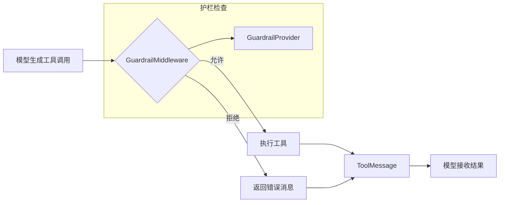
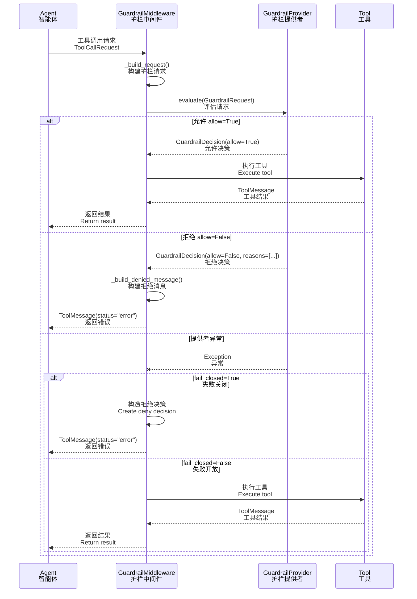

# 08-安全护栏 Guardrails 技术文档

## 一、概述

### 1.1 一句话理解

安全护栏（Guardrails）是 EvoFlow 的工具调用前置授权机制，在工具执行前进行策略检查，允许或拒绝特定工具调用，实现细粒度的安全控制。

### 1.2 架构位置



**核心流程**：
1. 模型生成工具调用请求
2. `GuardrailMiddleware` 拦截调用
3. `GuardrailProvider` 评估是否允许
4. 允许则执行工具，拒绝则返回错误消息
5. 模型根据结果继续处理


## 二、核心概念

### 2.1 关键术语

| 术语 | 英文 | 说明 |
|------|------|------|
| 护栏 | Guardrail | 工具调用前的安全检查机制 |
| 护栏提供者 | GuardrailProvider | 实现授权策略的组件 |
| 护栏请求 | GuardrailRequest | 传递给提供者的检查请求 |
| 护栏决策 | GuardrailDecision | 提供者的允许/拒绝决策 |
| 失败关闭 | Fail Closed | 提供者出错时拒绝调用 |
| 失败开放 | Fail Open | 提供者出错时允许调用 |

### 2.2 数据模型

**源码位置**: `backend/packages/harness/evoflow/guardrails/provider.py`

**逻辑说明**: 定义了护栏系统的核心数据结构。

```python
@dataclass
class GuardrailRequest:
    """Context passed to the provider for each tool call."""

    tool_name: str           # 工具名称
    tool_input: dict         # 工具参数
    agent_id: str | None     # Agent ID
    thread_id: str | None    # 对话线程 ID
    is_subagent: bool        # 是否是子代理调用
    timestamp: str           # 时间戳


@dataclass
class GuardrailReason:
    """Structured reason for an allow/deny decision."""

    code: str                # 原因代码
    message: str             # 原因描述


@dataclass
class GuardrailDecision:
    """Provider's allow/deny verdict."""

    allow: bool                      # 是否允许
    reasons: list[GuardrailReason]   # 原因列表
    policy_id: str | None            # 策略 ID
    metadata: dict                   # 元数据


@runtime_checkable
class GuardrailProvider(Protocol):
    """Contract for pluggable tool-call authorization."""

    name: str

    def evaluate(self, request: GuardrailRequest) -> GuardrailDecision:
        """Evaluate whether a tool call should proceed."""
        ...

    async def aevaluate(self, request: GuardrailRequest) -> GuardrailDecision:
        """Async variant."""
        ...
```

### 2.3 决策流程




## 三、护栏配置

### 3.1 配置结构

**源码位置**: `backend/packages/harness/evoflow/config/guardrails_config.py`

**逻辑说明**: `GuardrailsConfig` 定义了护栏系统的配置项。

```python
class GuardrailProviderConfig(BaseModel):
    """Configuration for a guardrail provider."""

    use: str = Field(
        description="Class path (e.g. 'evoflow.guardrails.builtin:AllowlistProvider')"
    )
    config: dict = Field(
        default_factory=dict, 
        description="Provider-specific settings passed as kwargs"
    )


class GuardrailsConfig(BaseModel):
    """Configuration for pre-tool-call authorization.

    When enabled, every tool call passes through the configured provider
    before execution. The provider receives tool name, arguments, and the
    agent's passport reference, and returns an allow/deny decision.
    """

    enabled: bool = Field(
        default=False, 
        description="Enable guardrail middleware"
    )
    fail_closed: bool = Field(
        default=True, 
        description="Block tool calls if provider errors"
    )
    passport: str | None = Field(
        default=None, 
        description="OAP passport path or hosted agent ID"
    )
    provider: GuardrailProviderConfig | None = Field(
        default=None, 
        description="Guardrail provider configuration"
    )
```

### 3.2 配置项说明

| 配置项 | 类型 | 默认值 | 说明 |
|--------|------|--------|------|
| `enabled` | bool | `false` | 是否启用护栏中间件 |
| `fail_closed` | bool | `true` | 提供者出错时是否拒绝调用 |
| `passport` | str \| null | `null` | OAP passport 路径或目标 Agent ID |
| `provider.use` | str | - | 提供者类路径 |
| `provider.config` | dict | `{}` | 提供者特定配置 |

### 3.3 配置示例

**基础配置（使用内置 AllowlistProvider）**：

```yaml
guardrails:
  enabled: true
  fail_closed: true
  provider:
    use: "evoflow.guardrails.builtin:AllowlistProvider"
    config:
      allowed_tools:
        - "read_file"
        - "write_file"
        - "bash"
      denied_tools:
        - "task"  # 禁止子代理任务
```

**生产环境配置（失败关闭）**：

```yaml
guardrails:
  enabled: true
  fail_closed: true  # 出错时拒绝，更安全
  passport: "/path/to/agent.passport"
  provider:
    use: "mycompany.guardrails:OAPProvider"
    config:
      endpoint: "https://oap.mycompany.com"
      timeout: 30
```

**开发环境配置（失败开放）**：

```yaml
guardrails:
  enabled: true
  fail_closed: false  # 出错时允许，便于调试
  provider:
    use: "evoflow.guardrails.builtin:AllowlistProvider"
    config:
      allowed_tools: []  # 空列表表示允许所有
```


## 四、GuardrailMiddleware 实现

### 4.1 中间件核心逻辑

**源码位置**: `backend/packages/harness/evoflow/guardrails/middleware.py`

**逻辑说明**: `GuardrailMiddleware` 在工具调用执行前进行授权检查。

```python
class GuardrailMiddleware(AgentMiddleware[AgentState]):
    """Evaluate tool calls against a GuardrailProvider before execution.

    Denied calls return an error ToolMessage so the agent can adapt.
    If the provider raises, behavior depends on fail_closed:
      - True (default): block the call
      - False: allow it through with a warning
    """

    def __init__(self, provider: GuardrailProvider, *, 
                 fail_closed: bool = True, passport: str | None = None):
        self.provider = provider
        self.fail_closed = fail_closed
        self.passport = passport

    def _build_request(self, request: ToolCallRequest) -> GuardrailRequest:
        """构建护栏请求对象"""
        return GuardrailRequest(
            tool_name=str(request.tool_call.get("name", "")),
            tool_input=request.tool_call.get("args", {}),
            agent_id=self.passport,
            timestamp=datetime.now(UTC).isoformat(),
        )

    def _build_denied_message(self, request: ToolCallRequest, 
                              decision: GuardrailDecision) -> ToolMessage:
        """构建拒绝消息"""
        tool_name = str(request.tool_call.get("name", "unknown_tool"))
        tool_call_id = str(request.tool_call.get("id", "missing_id"))
        reason_text = decision.reasons[0].message if decision.reasons else "blocked by guardrail policy"
        reason_code = decision.reasons[0].code if decision.reasons else "oap.denied"
        
        return ToolMessage(
            content=f"Guardrail denied: tool '{tool_name}' was blocked ({reason_code}). "
                    f"Reason: {reason_text}. Choose an alternative approach.",
            tool_call_id=tool_call_id,
            name=tool_name,
            status="error",  # 标记为错误状态
        )

    @override
    def wrap_tool_call(
        self,
        request: ToolCallRequest,
        handler: Callable[[ToolCallRequest], ToolMessage | Command],
    ) -> ToolMessage | Command:
        """同步工具调用包装器"""
        gr = self._build_request(request)
        try:
            decision = self.provider.evaluate(gr)
        except GraphBubbleUp:
            # 保留 LangGraph 控制流信号（中断/暂停/恢复）
            raise
        except Exception:
            logger.exception("Guardrail provider error (sync)")
            if self.fail_closed:
                # 失败关闭：构造拒绝决策
                decision = GuardrailDecision(
                    allow=False, 
                    reasons=[GuardrailReason(
                        code="oap.evaluator_error", 
                        message="guardrail provider error (fail-closed)"
                    )]
                )
            else:
                # 失败开放：允许调用通过
                return handler(request)
        
        if not decision.allow:
            logger.warning("Guardrail denied: tool=%s policy=%s code=%s", 
                          gr.tool_name, decision.policy_id, 
                          decision.reasons[0].code if decision.reasons else "unknown")
            return self._build_denied_message(request, decision)
        
        return handler(request)

    @override
    async def awrap_tool_call(
        self,
        request: ToolCallRequest,
        handler: Callable[[ToolCallRequest], Awaitable[ToolMessage | Command]],
    ) -> ToolMessage | Command:
        """异步工具调用包装器"""
        gr = self._build_request(request)
        try:
            decision = await self.provider.aevaluate(gr)
        except GraphBubbleUp:
            raise
        except Exception:
            logger.exception("Guardrail provider error (async)")
            if self.fail_closed:
                decision = GuardrailDecision(
                    allow=False, 
                    reasons=[GuardrailReason(
                        code="oap.evaluator_error", 
                        message="guardrail provider error (fail-closed)"
                    )]
                )
            else:
                return await handler(request)
        
        if not decision.allow:
            logger.warning("Guardrail denied: tool=%s", gr.tool_name)
            return self._build_denied_message(request, decision)
        
        return await handler(request)
```

### 4.2 关键设计

| 特性 | 实现 | 说明 |
|------|------|------|
| **同步/异步支持** | `wrap_tool_call` / `awrap_tool_call` | 兼容两种调用模式 |
| **控制流保护** | `GraphBubbleUp` 异常透传 | 保留 LangGraph 中断信号 |
| **失败模式** | `fail_closed` 参数 | 出错时拒绝或允许 |
| **错误反馈** | `status="error"` | 模型可感知被拒绝 |


## 五、内置提供者

### 5.1 AllowlistProvider

**源码位置**: `backend/packages/harness/evoflow/guardrails/builtin.py`

**逻辑说明**: 简单的白名单/黑名单提供者，无需外部依赖。

```python
class AllowlistProvider:
    """Simple allowlist/denylist provider. No external dependencies."""

    name = "allowlist"

    def __init__(self, *, 
                 allowed_tools: list[str] | None = None, 
                 denied_tools: list[str] | None = None):
        """
        Args:
            allowed_tools: 白名单，None 表示允许所有
            denied_tools: 黑名单，优先于白名单检查
        """
        self._allowed = set(allowed_tools) if allowed_tools else None
        self._denied = set(denied_tools) if denied_tools else set()

    def evaluate(self, request: GuardrailRequest) -> GuardrailDecision:
        """评估工具调用请求"""
        # 1. 检查黑名单（优先级最高）
        if request.tool_name in self._denied:
            return GuardrailDecision(
                allow=False, 
                reasons=[GuardrailReason(
                    code="oap.tool_not_allowed", 
                    message=f"tool '{request.tool_name}' is denied"
                )]
            )
        
        # 2. 检查白名单
        if self._allowed is not None and request.tool_name not in self._allowed:
            return GuardrailDecision(
                allow=False, 
                reasons=[GuardrailReason(
                    code="oap.tool_not_allowed", 
                    message=f"tool '{request.tool_name}' not in allowlist"
                )]
            )
        
        # 3. 允许通过
        return GuardrailDecision(
            allow=True, 
            reasons=[GuardrailReason(code="oap.allowed")]
        )

    async def aevaluate(self, request: GuardrailRequest) -> GuardrailDecision:
        """异步评估（直接调用同步版本）"""
        return self.evaluate(request)
```

### 5.2 使用示例

**白名单模式**（只允许指定工具）：

```yaml
guardrails:
  enabled: true
  provider:
    use: "evoflow.guardrails.builtin:AllowlistProvider"
    config:
      allowed_tools:
        - "read_file"
        - "write_file"
        - "bash"
```

**黑名单模式**（只禁止指定工具）：

```yaml
guardrails:
  enabled: true
  provider:
    use: "evoflow.guardrails.builtin:AllowlistProvider"
    config:
      denied_tools:
        - "task"        # 禁止子代理
        - "web_search"  # 禁止网络搜索
```

**混合模式**（白名单 + 黑名单）：

```yaml
guardrails:
  enabled: true
  provider:
    use: "evoflow.guardrails.builtin:AllowlistProvider"
    config:
      allowed_tools:
        - "read_file"
        - "write_file"
        - "bash"
        - "task"
      denied_tools:
        - "bash"  # 即使白名单有 bash，也被黑名单拒绝
```

### 5.3 自定义提供者

实现自定义护栏提供者：

```python
from evoflow.guardrails.provider import (
    GuardrailProvider, GuardrailRequest, GuardrailDecision, GuardrailReason
)

class MyCustomProvider:
    """自定义护栏提供者示例"""
    
    name = "my_custom"
    
    def __init__(self, api_key: str, endpoint: str):
        self.api_key = api_key
        self.endpoint = endpoint
    
    def evaluate(self, request: GuardrailRequest) -> GuardrailDecision:
        # 自定义评估逻辑
        if self._is_sensitive_operation(request):
            return GuardrailDecision(
                allow=False,
                reasons=[GuardrailReason(
                    code="custom.sensitive",
                    message="Sensitive operation detected"
                )]
            )
        return GuardrailDecision(allow=True)
    
    async def aevaluate(self, request: GuardrailRequest) -> GuardrailDecision:
        # 异步评估逻辑
        return self.evaluate(request)
```

配置使用：

```yaml
guardrails:
  enabled: true
  provider:
    use: "my_module:MyCustomProvider"
    config:
      api_key: "${MY_API_KEY}"
      endpoint: "https://guardrails.example.com"
```


## 六、最佳实践

### 6.1 安全建议

| 场景 | 建议配置 | 说明 |
|------|----------|------|
| 生产环境 | `fail_closed: true` | 出错时拒绝，更安全 |
| 高敏感场景 | 白名单模式 | 只允许已知安全工具 |
| 开发环境 | `fail_closed: false` | 便于调试问题 |
| 多租户 | 自定义提供者 | 集成企业授权系统 |

### 6.2 常见问题

**Q: 护栏和工具权限有什么区别？**

A: 
- **工具权限**：控制工具是否可用（静态配置）
- **护栏**：在调用时动态检查（可以基于参数、用户、时间等）

**Q: 被拒绝后模型会怎么处理？**

A: 模型会收到错误消息，可以：
1. 选择其他工具重试
2. 向用户解释无法执行
3. 请求更多信息


## 导航

**上一篇**：[07-上下文工程技术文档](07-上下文工程技术文档.md)  
**下一篇**：[09-MCP 系统技术文档](09-MCP%20系统技术文档.md)

> **文档版本**：v1.0  
> **最后更新**：2026-03-30  
> **作者**：银泰

📚 返回总览：[EvoFlow技术总览](01-EvoFlow技术总览.md)
