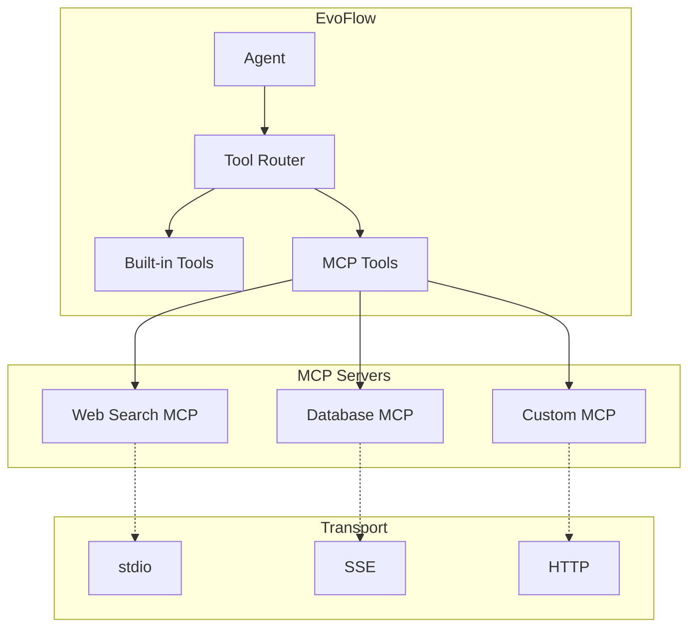
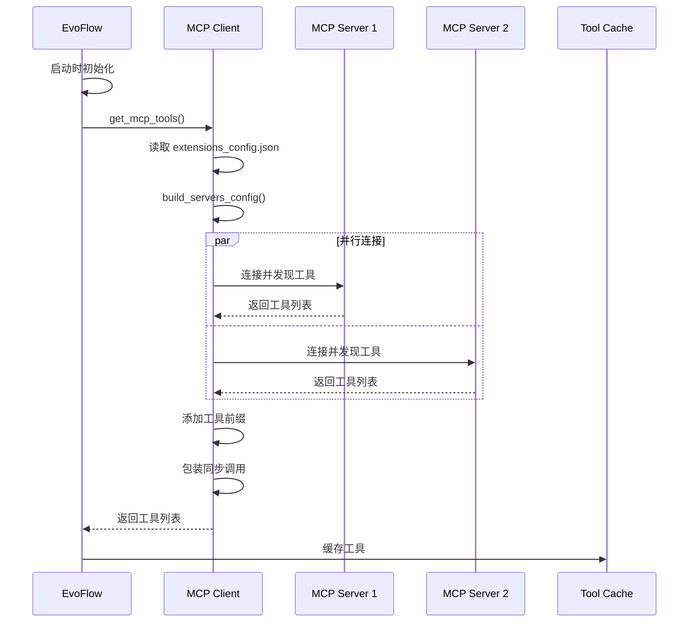
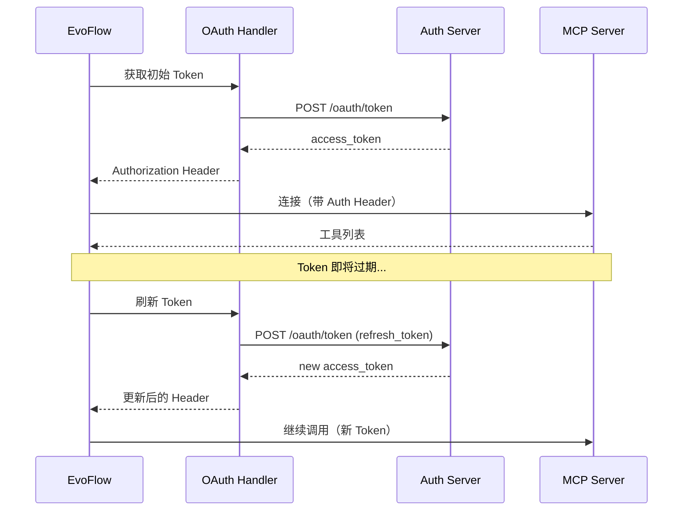

# 09-MCP 系统技术文档

## 一、概述

### 1.1 一句话理解

MCP（Model Context Protocol）系统让 EvoFlow 能够接入外部工具服务器，通过标准化协议动态加载和使用第三方工具，扩展 Agent 的能力边界。

### 1.2 架构位置



**核心组件**：
- **MultiServerMCPClient**：连接多个 MCP 服务器
- **McpServerConfig**：服务器配置管理
- **Tool Interceptors**：OAuth 等拦截器
- **Sync Wrapper**：异步工具同步化

---

## 二、核心概念

### 2.1 关键术语

| 术语 | 英文 | 说明 |
|------|------|------|
| MCP | Model Context Protocol | 模型上下文协议，Anthropic 提出的工具标准 |
| MCP Server | MCP Server | 提供工具服务的外部服务器 |
| MCP Client | MCP Client | 连接和使用 MCP 服务器的客户端 |
| Transport | Transport | 通信方式：stdio/SSE/HTTP |
| Tool Interceptor | Tool Interceptor | 工具调用拦截器（如 OAuth） |
| 工具前缀 | Tool Name Prefix | 区分不同服务器的工具命名空间 |

### 2.2 传输协议对比

| 协议 | 适用场景 | 优点 | 缺点 |
|------|----------|------|------|
| **stdio** | 本地进程 | 简单、安全 | 仅限本机 |
| **SSE** | 远程服务 | 实时推送 | 需要长连接 |
| **HTTP** | REST API | 通用、易部署 | 无实时推送 |

### 2.3 MCP 工具加载流程



---

## 三、MCP 配置

### 3.1 配置结构

**源码位置**: `backend/packages/harness/evoflow/config/extensions_config.py`

**逻辑说明**: `ExtensionsConfig` 统一管理 MCP 服务器和技能配置。

```python
class McpOAuthConfig(BaseModel):
    """OAuth configuration for an MCP server (HTTP/SSE transports)."""

    enabled: bool = Field(default=True, description="Whether OAuth is enabled")
    token_url: str = Field(description="OAuth token endpoint URL")
    grant_type: Literal["client_credentials", "refresh_token"] = Field(
        default="client_credentials",
        description="OAuth grant type",
    )
    client_id: str | None = Field(default=None, description="OAuth client ID")
    client_secret: str | None = Field(default=None, description="OAuth client secret")
    scope: str | None = Field(default=None, description="OAuth scope")
    refresh_skew_seconds: int = Field(default=60, description="Refresh token before expiry")


class McpServerConfig(BaseModel):
    """Configuration for a single MCP server."""

    enabled: bool = Field(default=True, description="Whether this MCP server is enabled")
    type: str = Field(default="stdio", description="Transport type: 'stdio', 'sse', or 'http'")
    command: str | None = Field(default=None, description="Command to execute (for stdio type)")
    args: list[str] = Field(default_factory=list, description="Arguments for the command")
    env: dict[str, str] = Field(default_factory=dict, description="Environment variables")
    url: str | None = Field(default=None, description="URL (for sse or http type)")
    headers: dict[str, str] = Field(default_factory=dict, description="HTTP headers")
    oauth: McpOAuthConfig | None = Field(default=None, description="OAuth configuration")
    description: str = Field(default="", description="Human-readable description")


class ExtensionsConfig(BaseModel):
    """Unified configuration for MCP servers and skills."""

    mcp_servers: dict[str, McpServerConfig] = Field(
        default_factory=dict,
        description="Map of MCP server name to configuration",
        alias="mcpServers",
    )
    skills: dict[str, SkillStateConfig] = Field(
        default_factory=dict,
        description="Map of skill name to state configuration",
    )
```

### 3.2 配置文件示例

**extensions_config.json**：

```json
{
  "mcpServers": {
    "web_search": {
      "enabled": true,
      "type": "stdio",
      "command": "python",
      "args": ["-m", "mcp_server_web_search"],
      "env": {
        "SEARCH_API_KEY": "$SEARCH_API_KEY"
      },
      "description": "Web search MCP server"
    },
    "database": {
      "enabled": true,
      "type": "http",
      "url": "https://mcp-db.example.com",
      "headers": {
        "X-API-Key": "$DB_API_KEY"
      },
      "oauth": {
        "enabled": true,
        "token_url": "https://auth.example.com/oauth/token",
        "grant_type": "client_credentials",
        "client_id": "$OAUTH_CLIENT_ID",
        "client_secret": "$OAUTH_CLIENT_SECRET",
        "scope": "read write"
      }
    }
  },
  "skills": {
    "code_review": {
      "enabled": true
    }
  }
}
```

### 3.3 配置加载优先级

**源码位置**: `backend/packages/harness/evoflow/config/extensions_config.py#L70-L117`

```python
@classmethod
def resolve_config_path(cls, config_path: str | None = None) -> Path | None:
    """Resolve the extensions config file path.

    Priority:
    1. If provided `config_path` argument, use it.
    2. If provided `DEER_FLOW_EXTENSIONS_CONFIG_PATH` environment variable, use it.
    3. Otherwise, check for `extensions_config.json` in the current directory, 
       then in the parent directory.
    4. For backward compatibility, also check for `mcp_config.json`.
    5. If not found, return None (extensions are optional).
    """
    if config_path:
        path = Path(config_path)
        if not path.exists():
            raise FileNotFoundError(f"Extensions config file not found at {path}")
        return path
    elif os.getenv("DEER_FLOW_EXTENSIONS_CONFIG_PATH"):
        path = Path(os.getenv("DEER_FLOW_EXTENSIONS_CONFIG_PATH"))
        if not path.exists():
            raise FileNotFoundError(f"Extensions config file not found at {path}")
        return path
    else:
        # Check current directory
        path = Path(os.getcwd()) / "extensions_config.json"
        if path.exists():
            return path

        # Check parent directory
        path = Path(os.getcwd()).parent / "extensions_config.json"
        if path.exists():
            return path

        # Backward compatibility: check for mcp_config.json
        path = Path(os.getcwd()) / "mcp_config.json"
        if path.exists():
            return path

        # Extensions are optional
        return None
```

---

## 四、MCP 客户端实现

### 4.1 服务器参数构建

**源码位置**: `backend/packages/harness/evoflow/mcp/client.py`

**逻辑说明**: `build_server_params()` 根据配置构建 MCP 服务器连接参数。

```python
def build_server_params(server_name: str, config: McpServerConfig) -> dict[str, Any]:
    """Build server parameters for MultiServerMCPClient.

    Args:
        server_name: Name of the MCP server.
        config: Configuration for the MCP server.

    Returns:
        Dictionary of server parameters for langchain-mcp-adapters.
    """
    transport_type = config.type or "stdio"
    params: dict[str, Any] = {"transport": transport_type}

    if transport_type == "stdio":
        # stdio 模式：通过命令启动本地进程
        if not config.command:
            raise ValueError(f"MCP server '{server_name}' with stdio transport requires 'command' field")
        params["command"] = config.command
        params["args"] = config.args
        # 添加环境变量
        if config.env:
            params["env"] = config.env
            
    elif transport_type in ("sse", "http"):
        # SSE/HTTP 模式：连接远程服务
        if not config.url:
            raise ValueError(f"MCP server '{server_name}' with {transport_type} transport requires 'url' field")
        params["url"] = config.url
        # 添加请求头
        if config.headers:
            params["headers"] = config.headers
    else:
        raise ValueError(f"MCP server '{server_name}' has unsupported transport type: {transport_type}")

    return params


def build_servers_config(extensions_config: ExtensionsConfig) -> dict[str, dict[str, Any]]:
    """Build servers configuration for MultiServerMCPClient.

    Args:
        extensions_config: Extensions configuration containing all MCP servers.

    Returns:
        Dictionary mapping server names to their parameters.
    """
    enabled_servers = extensions_config.get_enabled_mcp_servers()

    if not enabled_servers:
        logger.info("No enabled MCP servers found")
        return {}

    servers_config = {}
    for server_name, server_config in enabled_servers.items():
        try:
            servers_config[server_name] = build_server_params(server_name, server_config)
            logger.info(f"Configured MCP server: {server_name}")
        except Exception as e:
            logger.error(f"Failed to configure MCP server '{server_name}': {e}")

    return servers_config
```

### 4.2 工具加载实现

**源码位置**: `backend/packages/harness/evoflow/mcp/tools.py`

**逻辑说明**: `get_mcp_tools()` 异步加载所有启用的 MCP 服务器工具。

```python
# 全局线程池，用于在异步环境中执行同步工具调用
_SYNC_TOOL_EXECUTOR = concurrent.futures.ThreadPoolExecutor(
    max_workers=10, 
    thread_name_prefix="mcp-sync-tool"
)

# 注册关闭钩子
atexit.register(lambda: _SYNC_TOOL_EXECUTOR.shutdown(wait=False))


def _make_sync_tool_wrapper(coro: Callable[..., Any], tool_name: str) -> Callable[..., Any]:
    """Build a synchronous wrapper for an asynchronous tool coroutine.

    EvoFlow 的客户端流是同步的，但 MCP 工具是异步的，
    需要包装为同步接口。
    """
    def sync_wrapper(*args: Any, **kwargs: Any) -> Any:
        try:
            loop = asyncio.get_running_loop()
        except RuntimeError:
            loop = None

        try:
            if loop is not None and loop.is_running():
                # 使用线程池避免嵌套事件循环问题
                future = _SYNC_TOOL_EXECUTOR.submit(asyncio.run, coro(*args, **kwargs))
                return future.result()
            else:
                return asyncio.run(coro(*args, **kwargs))
        except Exception as e:
            logger.error(f"Error invoking MCP tool '{tool_name}': {e}", exc_info=True)
            raise

    return sync_wrapper


async def get_mcp_tools() -> list[BaseTool]:
    """Get all tools from enabled MCP servers.

    Returns:
        List of LangChain tools from all enabled MCP servers.
    """
    try:
        from langchain_mcp_adapters.client import MultiServerMCPClient
    except ImportError:
        logger.warning("langchain-mcp-adapters not installed. "
                      "Install it to enable MCP tools: pip install langchain-mcp-adapters")
        return []

    # 始终从磁盘读取最新配置（支持 Gateway API 动态更新）
    extensions_config = ExtensionsConfig.from_file()
    servers_config = build_servers_config(extensions_config)

    if not servers_config:
        logger.info("No enabled MCP servers configured")
        return []

    try:
        # 注入 OAuth 认证头
        initial_oauth_headers = await get_initial_oauth_headers(extensions_config)
        for server_name, auth_header in initial_oauth_headers.items():
            if server_name not in servers_config:
                continue
            if servers_config[server_name].get("transport") in ("sse", "http"):
                existing_headers = dict(servers_config[server_name].get("headers", {}))
                existing_headers["Authorization"] = auth_header
                servers_config[server_name]["headers"] = existing_headers

        # 构建工具拦截器（用于 OAuth Token 刷新）
        tool_interceptors = []
        oauth_interceptor = build_oauth_tool_interceptor(extensions_config)
        if oauth_interceptor is not None:
            tool_interceptors.append(oauth_interceptor)

        # 创建多服务器 MCP 客户端
        client = MultiServerMCPClient(
            servers_config, 
            tool_interceptors=tool_interceptors, 
            tool_name_prefix=True  # 添加服务器名前缀避免冲突
        )

        # 获取所有工具
        tools = await client.get_tools()
        logger.info(f"Successfully loaded {len(tools)} tool(s) from MCP servers")

        # 将异步工具包装为同步接口
        for tool in tools:
            if getattr(tool, "func", None) is None and getattr(tool, "coroutine", None) is not None:
                tool.func = _make_sync_tool_wrapper(tool.coroutine, tool.name)

        return tools

    except Exception as e:
        logger.error(f"Failed to load MCP tools: {e}", exc_info=True)
        return []
```

---

## 五、OAuth 认证

### 5.1 OAuth 流程

**MCP 系统的 OAuth 支持**：



### 5.2 支持的授权类型

| 授权类型 | 说明 | 适用场景 |
|----------|------|----------|
| `client_credentials` | 客户端凭证模式 | 服务器间通信 |
| `refresh_token` | 刷新令牌模式 | 需要用户授权的场景 |

### 5.3 OAuth 配置示例

```json
{
  "mcpServers": {
    "secure_api": {
      "enabled": true,
      "type": "http",
      "url": "https://api.example.com/mcp",
      "oauth": {
        "enabled": true,
        "token_url": "https://auth.example.com/oauth/token",
        "grant_type": "client_credentials",
        "client_id": "$OAUTH_CLIENT_ID",
        "client_secret": "$OAUTH_CLIENT_SECRET",
        "scope": "read write",
        "refresh_skew_seconds": 60
      }
    }
  }
}
```

---

## 六、工具命名空间

### 6.1 工具名称前缀

**避免工具名称冲突**：

```python
# 启用 tool_name_prefix=True 后
client = MultiServerMCPClient(
    servers_config, 
    tool_interceptors=tool_interceptors, 
    tool_name_prefix=True  # 添加服务器名前缀
)

# 工具名称示例：
# - web_search__search_google    (来自 web_search 服务器)
# - database__query_sql          (来自 database 服务器)
# - builtin__read_file           (EvoFlow 内置工具)
```

### 6.2 工具加载顺序

**EvoFlow 工具加载优先级**：

1. **内置工具**（builtins）- 最高优先级
2. **配置工具**（config tools）
3. **MCP 工具** - 动态加载
4. **技能工具**（skills）

---

## 七、最佳实践

### 7.1 配置建议

**生产环境**：
```json
{
  "mcpServers": {
    "production_api": {
      "enabled": true,
      "type": "http",
      "url": "https://mcp.production.com",
      "headers": {
        "X-API-Key": "$PROD_API_KEY"
      },
      "oauth": {
        "enabled": true,
        "grant_type": "client_credentials",
        "refresh_skew_seconds": 120
      }
    }
  }
}
```

**本地开发**：
```json
{
  "mcpServers": {
    "local_dev": {
      "enabled": true,
      "type": "stdio",
      "command": "python",
      "args": ["-m", "mcp_server_dev"],
      "env": {
        "DEBUG": "true"
      }
    }
  }
}
```

### 7.2 故障排查

| 问题 | 可能原因 | 解决方案 |
|------|----------|----------|
| MCP 工具未加载 | 服务器未启用 | 检查 `enabled: true` |
| 连接失败 | 网络/URL 错误 | 验证 URL 和防火墙 |
| OAuth 失败 | 凭证错误 | 检查 client_id/secret |
| 工具调用超时 | 服务器响应慢 | 增加超时配置 |

---

## 导航

**上一篇**：[08-安全护栏 Guardrails 技术文档](08-安全护栏%20Guardrails%20技术文档.md)  
**下一篇**：[10-文件上传与制品体系技术文档](10-文件上传与制品体系技术文档.md)

> **文档版本**：v1.0  
> **最后更新**：2026-03-30  
> **作者**：银泰

📚 返回总览：[EvoFlow技术总览](01-EvoFlow技术总览.md)
