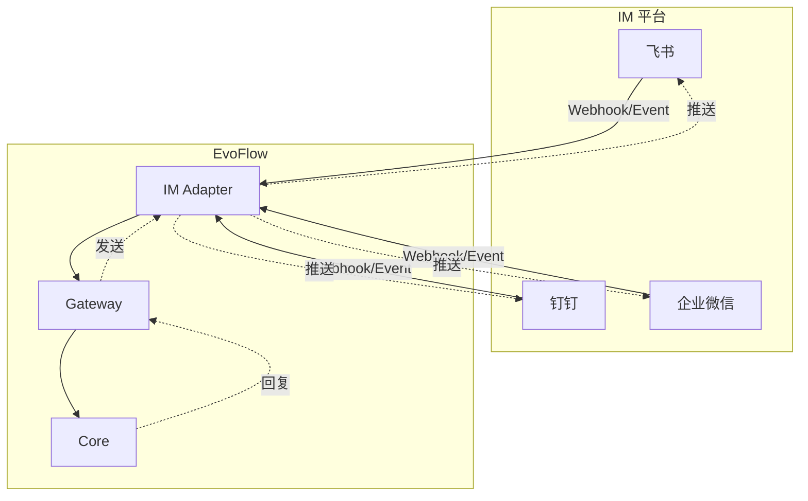

# 13-IM 渠道集成技术文档

## 一、概述

### 1.1 一句话理解

IM 渠道集成让 EvoFlow 能够接入即时通讯平台（如飞书、钉钉、企业微信），用户可以在熟悉的聊天工具中直接与 AI Agent 对话，无需切换应用。

### 1.2 架构位置



---

## 二、核心概念

### 2.1 关键术语

| 术语 | 英文 | 说明 |
|------|------|------|
| IM | Instant Messaging | 即时通讯 |
| Webhook | Webhook | 平台推送事件的 HTTP 回调 |
| Bot | Bot | 机器人账号 |
| Event | Event | 平台事件（消息、加群等） |
| Adapter | Adapter | 平台适配器 |

### 2.2 集成模式

| 模式 | 说明 | 适用平台 |
|------|------|----------|
| **Webhook** | 平台主动推送事件 | 飞书、钉钉 |
| **长连接** | 维持 WebSocket 连接 | 企业微信 |
| **轮询** | 定期拉取消息 | 通用 |

---

## 三、飞书集成

### 3.1 飞书适配器

```python
class FeishuAdapter:
    """飞书平台适配器。"""

    def __init__(self, app_id: str, app_secret: str):
        self.app_id = app_id
        self.app_secret = app_secret
        self.client = FeishuClient(app_id, app_secret)

    async def handle_event(self, event: dict) -> None:
        """处理飞书事件。"""
        event_type = event.get("header", {}).get("event_type")
        
        if event_type == "im.message.receive_v1":
            await self._handle_message(event)
        elif event_type == "im.chat.member.bot.added_v1":
            await self._handle_bot_added(event)

    async def _handle_message(self, event: dict) -> None:
        """处理消息事件。"""
        message = event.get("event", {}).get("message", {})
        sender = event.get("event", {}).get("sender", {})
        
        # 提取消息内容
        content = json.loads(message.get("content", "{}"))
        text = content.get("text", "")
        
        # 映射到 EvoFlow 线程
        thread_id = self._get_or_create_thread(
            chat_id=message.get("chat_id"),
            sender_id=sender.get("sender_id", {}).get("union_id"),
        )
        
        # 调用 EvoFlow
        response = await self._call_evoflow(thread_id, text)
        
        # 回复飞书
        await self.client.send_message(
            chat_id=message.get("chat_id"),
            msg_type="text",
            content={"text": response},
        )

    async def send_message(self, chat_id: str, content: str) -> None:
        """发送消息到飞书。"""
        await self.client.im.message.create(
            receive_id=chat_id,
            msg_type="text",
            content=json.dumps({"text": content}),
        )
```

### 3.2 Webhook 端点

```python
@router.post("/webhook/feishu")
async def feishu_webhook(
    request: Request,
    background_tasks: BackgroundTasks,
) -> dict:
    """接收飞书事件推送。
    
    Args:
        request: 飞书事件请求
        
    Returns:
        响应挑战或成功状态
    """
    body = await request.json()
    
    # URL 验证（配置 Webhook 时使用）
    if body.get("type") == "url_verification":
        return {"challenge": body.get("challenge")}
    
    # 验证签名
    signature = request.headers.get("X-Lark-Signature")
    if not verify_signature(body, signature):
        raise HTTPException(status_code=401, detail="Invalid signature")
    
    # 异步处理事件
    background_tasks.add_task(feishu_adapter.handle_event, body)
    
    return {"status": "ok"}
```

---

## 四、钉钉集成

### 4.1 钉钉适配器

```python
class DingtalkAdapter:
    """钉钉平台适配器。"""

    def __init__(self, app_key: str, app_secret: str):
        self.app_key = app_key
        self.app_secret = app_secret
        self.client = DingtalkClient(app_key, app_secret)

    async def handle_callback(self, callback: dict) -> str:
        """处理钉钉回调。"""
        msg_type = callback.get("msgtype")
        
        if msg_type == "text":
            return await self._handle_text_message(callback)
        elif msg_type == "file":
            return await self._handle_file_message(callback)
        
        return "Unsupported message type"

    async def _handle_text_message(self, callback: dict) -> str:
        """处理文本消息。"""
        sender_staff_id = callback.get("senderStaffId")
        conversation_id = callback.get("conversationId")
        text = callback.get("text", {}).get("content", "")
        
        # 映射到 EvoFlow 线程
        thread_id = self._get_or_create_thread(
            conversation_id=conversation_id,
            sender_id=sender_staff_id,
        )
        
        # 调用 EvoFlow
        response = await self._call_evoflow(thread_id, text)
        
        return response
```

---

## 五、通用适配器接口

```python
class IMAdapter(ABC):
    """IM 平台适配器基类。"""

    @abstractmethod
    async def handle_event(self, event: dict) -> None:
        """处理平台事件。"""
        pass

    @abstractmethod
    async def send_message(self, chat_id: str, content: str) -> None:
        """发送消息。"""
        pass

    @abstractmethod
    def _get_or_create_thread(self, **kwargs) -> str:
        """获取或创建 EvoFlow 线程。"""
        pass

    async def _call_evoflow(self, thread_id: str, message: str) -> str:
        """调用 EvoFlow Agent。"""
        agent = make_lead_agent(
            config=RunnableConfig(configurable={
                "thread_id": thread_id,
            })
        )
        
        result = await agent.ainvoke({
            "messages": [HumanMessage(content=message)]
        })
        
        # 提取最后一条 AI 消息
        messages = result.get("messages", [])
        for msg in reversed(messages):
            if msg.type == "ai":
                return msg.content
        
        return "No response"
```

---

## 六、配置示例

### 6.1 飞书配置

```yaml
im:
  feishu:
    enabled: true
    app_id: "cli_xxxxxxxxxx"
    app_secret: "${FEISHU_APP_SECRET}"
    encrypt_key: "${FEISHU_ENCRYPT_KEY}"
    webhook_path: "/webhook/feishu"
```

### 6.2 钉钉配置

```yaml
im:
  dingtalk:
    enabled: true
    app_key: "dingxxxxxxxxxx"
    app_secret: "${DINGTALK_APP_SECRET}"
    webhook_path: "/webhook/dingtalk"
```

---

## 导航

**上一篇**：[12-Gateway API 端点体系技术文档](12-Gateway%20API%20端点体系技术文档.md)  
**下一篇**：[14-前端交互与流式渲染技术文档](14-前端交互与流式渲染技术文档.md)

> **文档版本**：v1.0  
> **最后更新**：2026-03-30  
> **作者**：银泰

📚 返回总览：[EvoFlow技术总览](01-EvoFlow技术总览.md)
