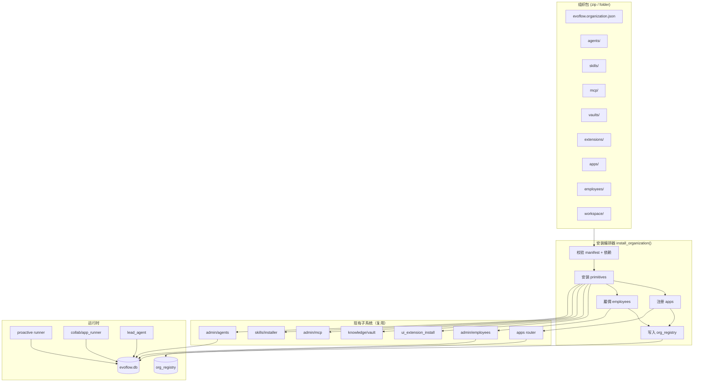

# 组织包（Organization Pack）技术设计 v1

> **文档类型**：技术设计（TDD）  
> **状态**：草案 v0.1（待评审）  
> **需求**：[组织包需求与目标](../internal/requirements/organization-pack-requirements.md)  
> **Schema**：[organization-pack.schema.json](./organization-pack.schema.json)  
> **取代**：无（新能力）  
> **关联**：[UI 扩展标准 v1](./ui-extension-standard-v1.md) · [应用设计方案 v2](./app-design.md) · [contentos-extension-suites](./contentos-extension-suites.md)

---

## 0. 一句话定义

**组织包 = 顶层可插拔 manifest + 安装编排器**：`evoflow.organization.json` 声明能力原子（Agent/Skill/MCP/Vault/Extension）与协作编排（组织树/工作流/工作区），安装时调用现有 primitive 安装器，写入 `org_registry` 供卸载与升级追踪。

---

## 1. 设计原则

| # | 原则 | 说明 |
|---|------|------|
| P1 | **编排不重写** | 不新建 Agent/MCP/Vault 存储，只编排现有 API |
| P2 | **原子可独立** | Primitives 可脱离组织包单独安装/升级 |
| P3 | **组织可拆卸** | 通过 `org_registry` 记录安装产物，支持逆序卸载 |
| P4 | **两种协作视图** | `team`（组织树）与 `pipelines`（DAG）共享 Agent 定义 |
| P5 | **失败可回滚** | 安装中途失败时 rollback 已写入项 |
| P6 | **与扩展标准对齐** | 路径占位符、zip/文件夹安装方式与 UI 扩展一致 |

---

## 2. 概念模型

### 2.1 四层插拔结构

```
L4  组织包 (Organization Pack)     evoflow.organization.json
      │
      ├── L3  协作编排 (Orchestration)
      │         ├── team.employees[]      → ProactiveRole + reports_to
      │         ├── pipelines.apps[]      → App (workflow DAG)
      │         └── workspace             → 组织工作区边界
      │
      ├── L2  场景实例 (Binding)
      │         ├── 员工岗位合同          → agent_code + schedule + vault_ids
      │         └── 工作流步骤            → assigned_agent + depends_on
      │
      └── L1  能力原子 (Primitives)
                ├── agents[]    → AgentConfig + SOUL.md
                ├── skills[]    → SKILL.md 目录
                ├── mcp[]       → McpServerConfig
                ├── vaults[]    → KnowledgeVaultConfig + 数据快照
                └── extensions[]→ evoflow.extension.json
```

### 2.2 名词表

| 词 | 英文 | 含义 |
|----|------|------|
| **组织包** | Organization Pack | 含 `evoflow.organization.json` 的目录或 zip |
| **组织** | Organization | 安装后的逻辑单元，有唯一 `organization_id` |
| **能力原子** | Primitive | Agent / Skill / MCP / Vault / Extension 中最小可插拔单元 |
| **协作编排** | Orchestration | 组织树、工作流、工作区等工作方式定义 |
| **组织注册表** | org_registry | 记录某组织安装了哪些 artifact，供卸载/升级 |
| **团队视图** | Team view | 智能体员工 + `reports_to` 组织树 |
| **流水线视图** | Pipeline view | 应用中心工作流 + `depends_on` DAG |

### 2.3 与现有概念的关系

| 现有概念 | 在组织包中的角色 |
|----------|------------------|
| `AgentConfig` | primitives.agents 物化目标 |
| `ProactiveRole` | team.employees 物化目标 |
| `App` (workflow) | pipelines.apps 物化目标 |
| `evoflow.extension.json` | primitives.extensions 成员 |
| `evoflow.suite.json` | 可视为仅含 extensions 的特例（`kind: pipeline` 子集） |
| Expert Pack | 可视为仅含 skill+agent 的特例 |

---

## 3. 架构总览



---

## 4. Manifest 规范

### 4.1 文件位置

组织包根目录固定文件名：**`evoflow.organization.json`**

完整 Schema 见 [organization-pack.schema.json](./organization-pack.schema.json)。

### 4.2 最小示例（团队型）

```json
{
  "schema": 1,
  "kind": "team",
  "id": "content-ops-team",
  "name": "内容运营团队",
  "version": "1.0.0",
  "description": "选题、拆解、发布的智能体团队",

  "workspace": {
    "template": "./workspace",
    "name": "内容运营工作区"
  },

  "primitives": {
    "agents": [
      { "from": "./agents/content-director.yaml" }
    ],
    "skills": [
      { "path": "./skills/newmedia-operations" }
    ],
    "extensions": [
      { "ref": "./extensions/contentos-decompose" }
    ]
  },

  "team": {
    "employees": [
      {
        "from": "./employees/content-director.json"
      }
    ]
  }
}
```

### 4.3 完整示例（full 型）

```json
{
  "schema": 1,
  "kind": "full",
  "id": "content-ops-org",
  "name": "内容运营部",
  "version": "1.0.0",
  "description": "团队 + 流水线 + 工具全家桶",

  "dependencies": {
    "platform": ">=0.8.0",
    "node": ">=20"
  },

  "install": {
    "id_prefix": "",
    "conflict_policy": "fail",
    "merge_policy": "skip_existing"
  },

  "workspace": {
    "template": "./workspace",
    "name": "内容运营工作区",
    "create_if_missing": true
  },

  "primitives": {
    "agents": [
      { "from": "./agents/content-director.yaml" },
      { "from": "./agents/topic-researcher.yaml" },
      { "from": "./agents/video-editor.yaml" }
    ],
    "skills": [
      { "path": "./skills/newmedia-operations" },
      { "path": "./skills/content-hunter" }
    ],
    "mcp": [
      {
        "from": "./mcp/github.json",
        "resolve_vars": { "PLUGIN_ROOT": "${ORG_ROOT}/extensions/contentos-decompose/standalone" }
      }
    ],
    "vaults": [
      {
        "id": "ops-knowledge",
        "name": "运营知识库",
        "import": "./vaults/ops-knowledge",
        "read_only": false
      }
    ],
    "extensions": [
      { "ref": "./extensions/contentos-decompose" },
      { "ref": "./extensions/contentos-trending" }
    ]
  },

  "team": {
    "employees": [
      { "from": "./employees/content-director.json" },
      { "from": "./employees/topic-researcher.json" },
      { "from": "./employees/video-editor.json" }
    ]
  },

  "pipelines": {
    "apps": [
      { "from": "./apps/daily-content-pipeline.json" }
    ]
  },

  "metadata": {
    "author": "EvoFlow",
    "license": "MIT",
    "tags": ["content", "douyin", "operations"],
    "homepage": "https://evoflow.ai/packs/content-ops-org"
  }
}
```

### 4.4 字段说明

#### 顶层

| 字段 | 类型 | 必填 | 说明 |
|------|------|------|------|
| `schema` | `1` | ✓ | Schema 版本 |
| `kind` | `team` \| `pipeline` \| `full` | ✓ | 组织包形态 |
| `id` | string | ✓ | 稳定 id，kebab-case |
| `name` | string | ✓ | 显示名 |
| `version` | semver | ✓ | 包版本 |
| `description` | string | | 简介 |
| `dependencies` | object | | 平台/运行时依赖 |
| `install` | object | | 安装策略 |
| `workspace` | object | | 组织工作区 |
| `primitives` | object | ✓ | 能力原子 |
| `team` | object | kind≠pipeline 时 | 员工组织树 |
| `pipelines` | object | kind≠team 时 | 工作流应用 |
| `metadata` | object | | 作者、许可、标签 |

#### `install` 策略

| 字段 | 默认 | 说明 |
|------|------|------|
| `id_prefix` | `""` | 安装时为 agent_code / vault id 加前缀，避免冲突 |
| `conflict_policy` | `fail` | `fail` \| `skip` \| `replace` |
| `merge_policy` | `skip_existing` | 升级时：`skip_existing` \| `overwrite` \| `skip_user_modified` |

#### `workspace`

| 字段 | 说明 |
|------|------|
| `template` | 包内工作区模板目录，安装时复制到用户路径 |
| `name` | 显示名 |
| `path` | 可选固定路径；缺省时安装向导让用户选择 |
| `create_if_missing` | 目录不存在时自动创建 |

路径占位符：

| 占位符 | 解析为 |
|--------|--------|
| `${ORG_ROOT}` | 组织包解压/安装根目录 |
| `${ORG_WORKSPACE}` | 本次安装展开的工作区路径 |
| `${EVOFLOW_HOME}` | `~/.evoflow` |
| `${PLUGIN_ROOT}` | 某 extension 的 install_path |

### 4.5 Agent 定义文件（YAML）

路径：`agents/<code>.yaml`

```yaml
agent_code: content-director
agent_name: 内容总监
description: 负责选题方向与内容策略
agent_type: custom

system_prompt_file: ./SOUL.md   # 相对 agents/ 目录
# 或直接内联:
# system_prompt: |

tools:
  - knowledge
  - web_search
tool_groups:
  - workspace
mcp_servers:
  - contentos-decompose
skills:
  - newmedia-operations

tags:
  - content
  - management
```

### 4.6 员工定义文件（JSON）

路径：`employees/<code>.json`

```json
{
  "agent_code": "content-director",
  "role_name": "内容总监",
  "position_code": "content-director",
  "department": "内容部",
  "reports_to": "",
  "config": {
    "workspace_path": "${ORG_WORKSPACE}",
    "knowledge_vault_ids": ["ops-knowledge"],
    "skills": ["newmedia-operations"],
    "autonomy_level": "approval_for_risky",
    "schedule": "FREQ=DAILY;BYHOUR=9;BYMINUTE=0",
    "budget_daily_usd": 2.0
  }
}
```

`reports_to` 为空字符串表示组织根节点。安装时校验：引用的 `agent_code` 必须在 `primitives.agents` 或已存在 registry 中。

### 4.7 工作流定义文件（JSON）

路径：`apps/<id>.json`，格式与现有 `CreateAppRequest` 对齐：

```json
{
  "name": "日更内容流水线",
  "description": "选题 → 拆解 → 脚本",
  "icon": "📝",
  "category": "content",
  "execution_mode": "workflow",
  "parameters": [
    { "name": "topic", "label": "今日选题", "type": "string", "required": true }
  ],
  "steps": [
    {
      "ref": "research",
      "name": "选题研究",
      "assigned_agent": "topic-researcher",
      "goal": "围绕 {{topic}} 做竞品与热点分析",
      "depends_on": []
    },
    {
      "ref": "decompose",
      "name": "视频拆解",
      "assigned_agent": "video-editor",
      "goal": "拆解 3 条对标视频结构",
      "depends_on": ["research"]
    }
  ],
  "tags": ["content-ops-org"]
}
```

### 4.8 MCP 模板

复用扩展侧 `mcp.template.json` 格式；组织包可在 `primitives.mcp[]` 中声明：

```json
{
  "from": "./mcp/contentos-decompose.json",
  "resolve_vars": {
    "PLUGIN_ROOT": "${ORG_ROOT}/extensions/contentos-decompose/standalone"
  }
}
```

安装编排器解析变量后写入 `evoflow_mcp_servers`。

---

## 5. 目录结构规范

### 5.1 推荐布局

```
content-ops-org/
├── evoflow.organization.json       # 必须
├── README.md                       # 建议：安装说明、依赖
│
├── workspace/                      # 工作区模板
│   ├── inbox/
│   ├── reports/
│   └── .gitkeep
│
├── agents/
│   ├── content-director.yaml
│   ├── content-director.SOUL.md
│   ├── topic-researcher.yaml
│   └── topic-researcher.SOUL.md
│
├── employees/
│   ├── content-director.json
│   ├── topic-researcher.json
│   └── video-editor.json
│
├── apps/
│   └── daily-content-pipeline.json
│
├── skills/
│   └── newmedia-operations/
│       └── SKILL.md
│
├── mcp/
│   └── github.json
│
├── vaults/
│   └── ops-knowledge/              # Obsidian 格式快照
│       └── 运营 SOP/
│
└── extensions/
    └── contentos-decompose/        # 完整 extension 目录
        ├── evoflow.extension.json
        └── standalone/
            ├── mcp.template.json
            └── server.mjs
```

### 5.2 分发格式

| 格式 | 说明 |
|------|------|
| 文件夹 | 开发态、`service.link` 联调 |
| `.zip` | 分发态，根目录含 `evoflow.organization.json` |
| 远程 URL | Phase 2：Panel 下载后同 zip 流程 |

---

## 6. 组织注册表（org_registry）

### 6.1 存储

SQLite 表 `evoflow_org_registry`（新表，v1 migration）：

```sql
CREATE TABLE IF NOT EXISTS evoflow_org_registry (
    id              TEXT PRIMARY KEY,          -- 安装实例 id: org_<pack_id>_<timestamp>
    pack_id         TEXT NOT NULL,             -- manifest id
    pack_version    TEXT NOT NULL,
    kind            TEXT NOT NULL,             -- team | pipeline | full
    workspace_path  TEXT,                      -- NULL 表示未绑定工作区
    installed_at    TEXT NOT NULL,
    status          TEXT NOT NULL DEFAULT 'active',  -- active | uninstalled
    manifest_json   TEXT                       -- 安装时 manifest 快照（用于升级 diff）
    -- 注：不加 UNIQUE(pack_id, workspace_path)。
    --   SQLite 中 NULL != NULL，两条 workspace_path=NULL 的行不会冲突。
    --   冲突检测在应用层 preflight_conflicts() 中完成，支持更灵活的策略。
);

CREATE TABLE IF NOT EXISTS evoflow_org_artifacts (
    id              INTEGER PRIMARY KEY AUTOINCREMENT,
    org_instance_id TEXT NOT NULL REFERENCES evoflow_org_registry(id),
    artifact_type   TEXT NOT NULL,             -- agent | skill | mcp | vault | extension | employee | app
    artifact_id     TEXT NOT NULL,             -- agent_code / skill name / mcp id / vault id / extension id / ...
    created_at      TEXT NOT NULL,
    UNIQUE(org_instance_id, artifact_type, artifact_id)
);
```

### 6.2 用途

- **卸载**：按 `org_instance_id` 查 artifacts，逆序调用各 lane 删除 API
- **升级**：比对 `pack_version` 与 `manifest_json` 快照
- **冲突检测**：安装前查 `artifact_id` 是否已被其他 org 或用户占用

---

## 7. 安装编排器

### 7.1 入口

| 入口 | 实现位置（建议） |
|------|------------------|
| Gateway API | `POST /api/organizations/install` |
| CLI | `evoflow org install <path>` |
| EvoPanel | Tauri `organization_install_folder` / `organization_install_zip` |

### 7.2 安装流程

```
install_organization(source_path, options) -> InstallResult

1. resolve_source(path)
   - 文件夹 / zip 解压到 staging

2. load_and_validate_manifest()
   - JSON Schema 校验
   - kind 与 team/pipelines 字段一致性
   - dependencies 检查（platform version, node）

3. preflight_conflicts()
   - agent_code / vault id / extension id 冲突
   - 按 install.conflict_policy 处理

4. begin_transaction()  # 逻辑事务，失败则 rollback

5. setup_workspace()
   - 复制 workspace.template → 用户路径
   - 解析 ${ORG_WORKSPACE}

6. install_primitives()
   # 顺序约束：skills/mcp/vaults 先装（无跨依赖）→ extensions（可能带自己的 MCP）→ agents（引用 mcp_servers）
   # 注意：agents 的 mcp_servers 白名单在 install_primitives 全部完成后才能校验，
   #       因此 agent YAML 里的 mcp_servers 字段在安装阶段只做"引用合法性"延迟校验。
   a. skills: install_skill_from_archive / copy folder
   b. mcp: resolve mcp.template / json → save_mcp_server（primitives.mcp[] 显式声明的）
   c. vaults: import_vault_snapshot → register vault
   d. extensions: ui_extension_install_folder
      → post_install: 扫描 extension 自带 mcp.template.json → 注册 MCP（§7.4）
      # 此步完成后，所有 MCP 均已注册，agents 可安全引用
   e. agents: parse yaml → save_agent_config + SOUL
      → validate mcp_servers 引用均已存在于 registry

7. install_team()  # kind != pipeline
   - parse employees/*.json
   - resolve ${ORG_WORKSPACE} in config
   - employees.hire() for each
   - validate reports_to DAG (no cycle)

8. install_pipelines()  # kind != team
   - parse apps/*.json
   - create_app() via app_repositories
   - tag with organization pack id

9. write_org_registry()
   - insert org_registry + artifacts

10. commit_transaction()
    - return InstallResult { org_instance_id, artifacts, warnings }
```

### 7.3 回滚策略

安装器维护 `installed_stack: list[Artifact]`，安装每成功一步即压栈；任一步失败则**逆序弹栈**执行 rollback：

**安装压栈顺序**（从先到后）：
`skills` → `mcp (explicit)` → `vaults` → `extensions` → `mcp (from extension)` → `agents` → `employees` → `apps`

**rollback 弹栈顺序**（严格逆序）：
`apps` → `employees` → `agents` → `mcp (from extension)` → `extensions` → `vaults` → `mcp (explicit)` → `skills`

| artifact_type | rollback 动作 | 注意 |
|---------------|---------------|------|
| app | `delete_app` | 仅删本包创建的 |
| employee | `archive_employee` | 保留历史任务记录 |
| agent | `delete_agent_config` | 跳过 builtin agent；跳过安装前已存在的 |
| mcp (ext) | `remove_mcp_server` | 仅删本包注册的 extension-sourced MCP |
| extension | `ui_extension_uninstall` | 需 Tauri 侧执行（见 §7.5） |
| vault | `delete_vault_registration` | 默认保留磁盘数据（`keep_vault_data=true`）|
| mcp (explicit) | `remove_mcp_server` | 跳过安装前已存在的 |
| skill | `disable_skill` + 删 custom 目录 | 跳过安装前已存在的 |

### 7.4 Extension → MCP 自动注册（P0）

扩展安装完成后，编排器扫描：

1. `<extension_install_path>/standalone/mcp.template.json`
2. 或 extension manifest 的 `runtime.mcpServer` 字段

解析 `${PLUGIN_ROOT}` → 写入 `evoflow_mcp_servers` → 记录到 `org_artifacts`（type=`mcp_from_ext`）。

此逻辑填补 [ui-extension-standard-v1](./ui-extension-standard-v1.md) 中「install extension → auto-register MCP」的 TODO。

### 7.5 跨进程协调：Tauri ↔ Gateway（重要）

Extension 安装由 **Tauri Rust 命令**（`ui_extension_install_folder`）完成，目标是 `~/.evoflow/ui-extensions/`；
MCP 注册写入的是 **Gateway SQLite**（`evoflow_mcp_servers`）。

**协调方案（Phase 1）**：

```
EvoPanel（Tauri）
  │
  ├─ 1. Tauri cmd: ui_extension_install_folder(ext_path)
  │       → 返回 install_path
  │
  └─ 2. JS: POST /api/organizations/install
             body: { source: org_path, workspace_path }
             （编排器在 Gateway 侧统一执行所有步骤，
               含调 Tauri cmd 装扩展 + 写 MCP SQLite）

Gateway install_organization()
  ├─ 调 Tauri IPC → ui_extension_install_folder
  │   ← install_path
  ├─ 扫 mcp.template.json → resolve vars
  └─ 直接写 evoflow_mcp_servers (SQLite, Gateway 进程直连)
```

**关键约束**：
- 编排器跑在 **Gateway** 进程，可直接写 Gateway SQLite。
- 扩展安装需通过 **Tauri IPC** 调用（`invoke('ui_extension_install_folder', ...)`），Gateway 通过已有的 Tauri ↔ Gateway 通信通道执行。
- 若 Gateway 以纯 HTTP 服务形式部署（无 Tauri），扩展安装步骤 skip + warning；MCP/Agent/Vault 仍正常安装。

### 7.6 Vault 快照分发边界

Vault 快照（`vaults/` 目录）可能含用户私有知识：

| 场景 | 行为 |
|------|------|
| 本地安装（zip/文件夹） | 允许，用户自己打包自己的 Vault |
| 导出（`evoflow org export`） | 默认**不包含** vault 数据；需 `--include-vaults` 显式开启 |
| 组织市场公开分发 | Phase 3 才支持；需包作者声明「vault 内容不含私有数据」 |

---

## 8. 卸载编排器

```
uninstall_organization(org_instance_id, options) -> UninstallResult

options:
  keep_primitives: bool = false   # true = 只卸编排，保留 Agent/Skill 等
  keep_workspace: bool = true    # 保留工作区文件
  keep_vault_data: bool = true

1. load org_registry + artifacts
2. 逆序卸载：
   employees → apps → extensions → agents → vaults → mcp → skills
3. mark org_registry.status = 'uninstalled'
4. 可选：删除 workspace（keep_workspace=false）
```

---

## 9. API 设计

### 9.1 Gateway REST

前缀：`/api/organizations`

| 方法 | 路径 | 说明 |
|------|------|------|
| `POST` | `/install` | body: `{ source: "path\|zip_url", workspace_path?, options? }` |
| `POST` | `/uninstall` | body: `{ org_instance_id, options? }` |
| `GET` | `/` | 列出已装组织 |
| `GET` | `/{org_instance_id}` | 详情 + artifacts |
| `POST` | `/preflight` | 预检：冲突、依赖，不实际安装 |
| `POST` | `/export` | Phase 2：从现有配置导出组织包 |

### 9.2 响应示例

```json
{
  "org_instance_id": "org_content-ops-org_20260805120000",
  "pack_id": "content-ops-org",
  "pack_version": "1.0.0",
  "kind": "full",
  "workspace_path": "D:/work/content-ops",
  "artifacts": {
    "agents": ["content-director", "topic-researcher"],
    "employees": ["content-director", "topic-researcher"],
    "apps": ["app_daily_content_pipeline"],
    "extensions": ["contentos-decompose"],
    "vaults": ["ops-knowledge"]
  },
  "warnings": []
}
```

### 9.3 CLI

```bash
# 安装
evoflow org install ./packs/content-ops-org
evoflow org install ./packs/content-ops-org.zip --workspace ~/work/content-ops

# 预检
evoflow org preflight ./packs/content-ops-org

# 列表 / 卸载
evoflow org list
evoflow org uninstall org_content-ops-org_20260805120000

# 导出（Phase 2）
evoflow org export --workspace ~/work/content-ops --output ./my-org-pack
```

---

## 10. EvoPanel UI

### 10.1 入口

| 位置 | 行为 |
|------|------|
| 设置 → 组织 | 已装组织列表、安装/卸载 |
| 侧栏「组织」分组（Phase 2） | 快捷进入组织工作区 |
| 智能体员工页 | 显示员工所属组织包 badge |
| 应用中心 | 工作流卡片显示来源组织 |

### 10.2 安装向导（MVP）

```
步骤 1：选择来源（本地文件夹 / zip）
步骤 2：预检报告（依赖、冲突、将安装的 artifacts 清单）
步骤 3：选择工作区路径（若 manifest 未固定）
步骤 4：确认安装
步骤 5：结果页（成功项 / 警告 / 「去员工页」「去应用中心」链接）
```

### 10.3 卸载确认

- 列出将删除的 artifacts
- 勾选：保留工作区 / 保留知识库数据 / 保留 Agent 定义

---

## 11. 运行时协作

### 11.1 团队视图（已有）

安装后行为与现有一致，不修改 proactive runner：

- `reports_to` → 组织树 → 交工仅直属下级
- `workspace_path` → 组织边界（`proactive/org.py`）
- `knowledge_vault_ids` → 值班 prompt 注入

组织包仅负责**初始配置**，不改变运行时语义。

### 11.2 流水线视图（已有）

- `App.steps[].assigned_agent` → 解析为已装 Agent
- `depends_on` → DAG 波次执行（`collab/app_runner`）
- 任务中心来源标记：`source=workflow`，可带 `org_pack_id` 元数据（Phase 2）

### 11.3 扩展与 Agent 的连接

安装后：

1. Extension 侧车由 Tauri 管理（已有）
2. MCP 由编排器注册（新增）
3. Agent `mcp_servers` 白名单引用 MCP id（manifest 预置）

---

## 12. 与现有套件的关系

| 概念 | 关系 |
|------|------|
| `evoflow.suite.json` | 等价于 `kind: pipeline` 且仅含 `primitives.extensions` 的特例；suite 可继续独立存在，也可被组织包引用 |
| Expert Pack | 等价于仅含 `agents` + `skills` 的最小组织包 |
| 岗位模板（smart-employee） | Phase 2 升级为组织包子集导出 |

**迁移建议**：不废弃 suite / expert pack，组织包作为超集；文档注明「装完整部门用 organization，只装 UI 插件用 suite」。

---

## 13. 官方示例包：content-ops-org

### 13.1 目标

作为 MVP 验收包，覆盖 `kind: full` 全链路。

### 13.2 内容清单

| 类型 | 成员 |
|------|------|
| Agents | content-director, topic-researcher, video-editor |
| Employees | 3 人，reports_to 树：director ← researcher, editor |
| Apps | daily-content-pipeline（2 步 DAG） |
| Extensions | contentos-decompose, contentos-trending |
| Vault | ops-knowledge（内置运营 SOP 快照） |
| Skills | newmedia-operations |

### 13.3 验收脚本

```bash
evoflow org preflight ./packs/content-ops-org
evoflow org install ./packs/content-ops-org --workspace /tmp/content-ops-test
# 1. 员工页 3 人在岗
# 2. 应用中心 1 个工作流
# 3. 扩展侧栏 2 个扩展
# 4. content-director 点开始工作 → 首轮值班成功
# 5. 工作流填参运行 → 至少 1 步完成
evoflow org uninstall org_content-ops-org_* --keep-workspace
```

---

## 14. 安全与权限

| 项 | 策略 |
|----|------|
| 本地包安装 | 用户显式选择路径，同扩展权限模型 |
| 远程 URL | Phase 2；需 HTTPS；首装确认 |
| MCP 命令执行 | 沿用现有 MCP 审批策略 |
| 工作区路径 | 禁止写入系统目录；校验路径合法性 |
| 卸载 | 需确认；删除 MCP/扩展前检查无其他 org 引用 |

---

## 15. 测试策略

| 层级 | 内容 |
|------|------|
| 单元 | manifest 解析、占位符替换、冲突检测、reports_to 环检测 |
| 集成 | 完整安装 → 运行 → 卸载；rollback 中途失败 |
| E2E | EvoPanel 安装向导；员工值班；工作流执行 |
| .fixture | `backend/tests/fixtures/org-packs/minimal-team/` 最小包 |

---

## 16. 实现任务拆分（Phase 1）

| 序号 | 任务 | 模块 | 估时 |
|------|------|------|------|
| T1 | JSON Schema + manifest loader | `evoflow/organizations/` | 1d |
| T2 | org_registry 表 + repository | `persistence/` | 0.5d |
| T3 | install_organization 编排器 | `evoflow/organizations/installer.py` | 3d |
| T4 | Extension → MCP 自动注册 | `organizations/mcp_resolver.py` | 1d |
| T5 | uninstall_organization（后端逻辑 + CLI） | `organizations/installer.py` | 1d |
| T6 | Gateway `/api/organizations/*` | `routers/organizations.py` | 1d |
| T7 | CLI `evoflow org` | `cli/commands/org.py` | 0.5d |
| T8 | EvoPanel 安装 UI | `pages/organizations.js` | 2d |
| T9 | 官方包 content-ops-org | `packs/content-ops-org/` | 2d |
| T10 | 集成测试 | `tests/test_organization_pack.py` | 1d |

**合计约 13 人日（MVP）**

> Phase 1 **不含**：卸载 UI 弹窗、增量升级合并、组织市场、导出（均 Phase 2）。

---

## 17. 开放问题

见需求文档 [§8](../internal/requirements/organization-pack-requirements.md#8-开放问题待评审)。

---

## 18. 文档索引

| 文档 | 路径 |
|------|------|
| 需求与目标 | [organization-pack-requirements.md](../internal/requirements/organization-pack-requirements.md) |
| JSON Schema | [organization-pack.schema.json](./organization-pack.schema.json) |
| UI 扩展标准 | [ui-extension-standard-v1.md](./ui-extension-standard-v1.md) |
| 应用设计 | [app-design.md](./app-design.md) |
| 扩展套件 | [contentos-extension-suites.md](./contentos-extension-suites.md) |

---

**变更记录**

| 日期 | 版本 | 说明 |
|------|------|------|
| 2026-08-05 | v0.1 | 初稿：架构、manifest、安装/卸载、API、示例包 |
| 2026-08-05 | v0.2 | 推敲补丁：安装顺序修正（extensions 先于 agents）、rollback 压栈/弹栈对齐、org_registry UNIQUE 约束改为应用层检测、Tauri↔Gateway 跨进程协调说明、Vault 分发边界、Phase 对齐 |
