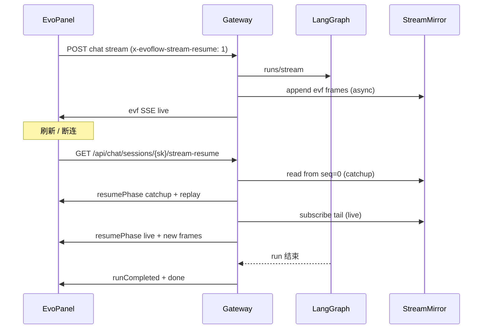

# EvoFlow · 对话流响应恢复（Stream Resume）设计方案

> 版本：v1.0 · 2026-06-12  
> 对标：[FastGPT V4.14.11 Stream Resume](../../docs/references/fastgpt-v4.14.11-stream-resume.md)  
> 状态：**设计稿**（待按 P0→P4 落地）

---

## 1. 背景：为什么要改

EvoFlow 当前「刷新后续挂」逻辑分散在多处，语义混用，导致：

| 现象 | 根因 |
|------|------|
| 刷新后 UI 空白或重复文本 | attach 走 LangGraph `values` 轮询 + baseline 去重，**不是**完整 SSE 回放 |
| 侧栏长期 `running`（幽灵 running） | SQLite `run_status` 与 LangGraph 真值不一致，靠 reconcile 补救 |
| Gateway 重启后已输出丢失 | 无 append-only 事件缓冲；`live_run` 只有 **最后一段 partial_text** |
| ChatApp / ws-client / session-reattach 耦合 | 无统一 `useStreamResume`，visibility、reattach、attach 各写一套 |

**本方案目标**：用 FastGPT 已验证的 **「SSE 镜像 + 专用 Resume API」** 替换 attach 续流作为主恢复路径；LangGraph attach 降级为兜底。

---

## 2. 一句话定义（与 FastGPT 对齐）

**Stream Resume = 服务端继续跑 LangGraph run，Gateway 把已发出的 `evf` SSE 帧 append-only 存起来；前端断连后走 Resume API 先 catchup 回放，再 live tail 追新。**

**不是**：

- LangGraph checkpoint 从中断节点重调度
- 把 thread state / 工具结果序列化进 mirror
- 用 `live_run.partial_text` 代替完整 UI 事件流

**与现有文档关系**：

| 文档 | 关系 |
|------|------|
| [后台任务持续执行与断线续跑](../internal/requirements/后台任务持续执行与断线续跑实施方案.md) | **任务流（task_id）** 仍按该方案；本设计只管 **Chat 主回答流（session_key + run_id）** |
| [14-前端交互与流式渲染](../internal/technical/14-前端交互与流式渲染技术文档.md) | Resume 复用现有 `evf` 事件合并逻辑，不另造渲染协议 |

---

## 3. 现状审计（源码锚点）

### 3.1 已有、可保留

| 组件 | 路径 | 作用 |
|------|------|------|
| 运行态 SQLite | `evoflow/persistence/session_run_state.py` | `run_status` / `current_run_id`（≈ FastGPT `chatGenerateStatus`） |
| Stale 修正 | `app/gateway/run_status_reconcile.py` | 启动时对 LangGraph 真值 reconcile |
| Runtime 决策 | `GET .../runtime-status` | `chat_sessions.py` 聚合 attach 建议 |
| 轻量快照 | `evoflow_chat_live_runs` + `live_run_snapshot.py` | 仅 **最新** partial 文本/工具摘要 |
| 前端 reattach | `evopanel/src/react/lib/session-reattach.ts` | 调 `chatAttachToRun` |
| LangGraph attach | `langgraph_proxy.py` attach stream | 轮询 `/state` → `values`/`evf` diff |

### 3.2 缺失（相对 FastGPT）

| 能力 | FastGPT | EvoFlow 现状 |
|------|---------|--------------|
| Append-only SSE 镜像 | Redis Stream `XADD raw` | 无 |
| 专用 Resume API | `GET /api/core/chat/resume` | 无 |
| catchup → live 两阶段 | `resumePhase` 事件 | 无 |
| 双写（客户端 + mirror） | `enqueueRaw` 与 `res.write` 分离 | 只写客户端 |
| 新 run 清旧 mirror | `DEL` before mirror | 无 |
| 内存/不可用降级 | `resumeUnavailable` | 无 |

### 3.3 当前 attach 路径（将被降级）

```text
刷新 → reattachRunningSessionIfNeeded
     → chatAttachToRun
     → GET /langgraph/.../runs/{runId}/stream?ui_sse=1
     → Gateway 轮询 LangGraph /state（非原始 token 流）
     → 前端 baseline 去重防重复
```

问题：Gateway 重启、attach 超时、values 与 UI 事件顺序不一致时，**无法保证 UI 与断连前一致**。

---

## 4. 目标架构

### 4.1 三层状态（EvoFlow 映射）

```text
┌──────────────────────────────────────────────────────────────────┐
│ SQLite · evoflow_chat_sessions                                    │
│   run_status: idle | running | pending                            │
│   current_run_id                                                  │
│   → 侧栏 + auto-resume 门禁                                       │
├──────────────────────────────────────────────────────────────────┤
│ StreamMirror · append-only evf SSE 帧                             │
│   默认 SQLite 表（单机 Gateway）                                   │
│   可选 Redis Stream（多 Gateway 实例）                             │
│   → catchup XRANGE / live tail                                    │
├──────────────────────────────────────────────────────────────────┤
│ SQLite · chat transcript（messages 落库）                         │
│   run 结束后完整记录                                               │
│   → resumeCompleted 兜底                                          │
└──────────────────────────────────────────────────────────────────┘
```

### 4.2 数据流



### 4.3 模块边界（5 件套）

```text
backend/app/gateway/streaming/
├── stream_mirror.py          # 抽象：append / read_range / subscribe / clear / touch
├── stream_mirror_sqlite.py   # 默认实现
├── stream_mirror_redis.py    # 可选（多实例）
├── stream_resume_handler.py  # catchup + live 生成器
└── stream_resume_writer.py   # 包装 normalize 输出，双写 mirror

evopanel/src/react/hooks/
└── useStreamResume.ts        # 统一 auto-resume（替代 ChatApp 分散 effect）

evopanel/src/react/lib/
└── stream-resume-fetch.ts    # 对标 FastGPT streamResumeFetch
```

**依赖规则**：`stream_mirror_*` 不 import LangGraph；Resume 不触发新 run。

---

## 5. 存储设计

### 5.1 为什么默认 SQLite、可选 Redis

- EvoFlow 当前 `REDIS_URI=fake`，单机 Gateway + SQLite 是主部署形态。
- FastGPT 用 Redis 是为了 **多 app 实例共享 mirror**。
- 抽象 `StreamMirrorBackend`，语义与 FastGPT 一致，实现可换。

### 5.2 SQLite 表（默认）

```sql
CREATE TABLE IF NOT EXISTS evoflow_chat_stream_mirror (
    id            INTEGER PRIMARY KEY AUTOINCREMENT,
    session_key   TEXT NOT NULL,
    thread_id     TEXT NOT NULL,
    run_id        TEXT NOT NULL,
    seq           INTEGER NOT NULL,          -- 单 run 内单调递增
    raw_frame     TEXT NOT NULL,             -- 完整 SSE 帧（含 event/data，\n\n 结尾）
    is_terminal   INTEGER NOT NULL DEFAULT 0, -- 1 = done/error/run_end
    created_at_ms INTEGER NOT NULL,
    UNIQUE(session_key, run_id, seq)
);

CREATE INDEX IF NOT EXISTS idx_stream_mirror_run
    ON evoflow_chat_stream_mirror(session_key, run_id, seq);

CREATE TABLE IF NOT EXISTS evoflow_chat_stream_mirror_meta (
    session_key     TEXT PRIMARY KEY,
    thread_id       TEXT NOT NULL,
    run_id          TEXT NOT NULL,
    updated_at_ms   INTEGER NOT NULL,
    unavailable     TEXT,                    -- JSON: { "reason": "memoryPressure" | "disabled" }
    expires_at_ms   INTEGER                  -- TTL 等价物
);
```

**写入策略**：

- 新 run 开始前：`DELETE FROM ... WHERE session_key = ?`（同 FastGPT clear keys）
- 每帧 async append，不阻塞 SSE 写出
- `touch_meta` 节流 1s 更新 `updated_at_ms`（≈ FastGPT `STREAM_RESUME_TTL_TOUCH_INTERVAL_MS`）

### 5.3 Redis 表（可选，多实例）

```text
stream:resume:data:{session_key}:{run_id}     # Redis Stream, field raw
stream:resume:active:{session_key}:{run_id}   # { updatedAt }
stream:resume:unavailable:{session_key}       # { reason }
```

由 env `EVOFLOW_STREAM_MIRROR_BACKEND=sqlite|redis` 选择。

### 5.4 与 `evoflow_chat_live_runs` 的关系

| | live_run | stream_mirror |
|--|----------|---------------|
| 粒度 | 最新 partial 文本 | 全量 evf 事件序列 |
| 用途 | runtime-status 摘要、degraded 展示 | **UI 完整恢复** |
| 迁移 | 保留，Resume 不可用时展示「生成中…」 | 新增，主恢复路径 |

run 结束后：**两者都删**（或 mirror 短 TTL 30s 便于 late attach）。

---

## 6. API 设计

### 6.1 发起对话（已有，加 header）

```http
POST /api/langgraph/threads/{threadId}/runs/stream
x-evoflow-stream-resume: 1
```

Gateway 在 `sse_ui_normalize` **输出侧**双写 mirror（见 §7.1）。  
仅 `ui_sse=1` / `X-EvoFlow-Ui-Stream: 1` 路径启用。

### 6.2 Resume（新增，核心）

```http
GET /api/chat/sessions/{session_key}/stream-resume
Accept: text/event-stream
Query（可选）: run_id, thread_id
```

**响应 SSE 协议**（与 FastGPT 对齐命名）：

| event | data | 说明 |
|-------|------|------|
| `resumePhase` | `catchup` \| `live` | 阶段切换 |
| `resumeUnavailable` | `{ "reason": "mirrorDisabled" \| "mirrorExpired" \| "memoryPressure" }` | 无法 live tail |
| `runCompleted` | `{ sessionKey, runStatus, messages?, ... }` | run 已结束时的 DB 快照 |
| `evf` | （原有 UI 事件 JSON） | catchup/live 中 replay 的历史帧 |
| `done` | `[DONE]` | 流结束 |

**Handler 逻辑**（伪代码）：

```python
async def stream_resume(session_key, run_id, res):
    row = get_session_run_state(session_key)
    if row.run_status not in ("running", "pending"):
        yield runCompleted(from_db=load_transcript_tail(session_key))
        yield done
        return

    if unavailable := get_mirror_unavailable(session_key):
        yield resumeUnavailable(unavailable)
        completed = await wait_run_done(session_key, timeout=STREAM_RESUME_TTL)
        if completed:
            yield runCompleted(completed)
        yield done
        return

    last_seq = 0
    yield resumePhase("catchup")
    async for frame in mirror.read_range(session_key, run_id, after_seq=0):
        yield frame.raw
        last_seq = frame.seq
        if frame.is_terminal:
            yield done
            return

    yield resumePhase("live")
    async for frame in mirror.subscribe(session_key, run_id, after_seq=last_seq):
        yield frame.raw
        if frame.is_terminal:
            break

    # run 仍 generating 但 mirror 已 terminal → 等 DB 落库
    if still_running(session_key):
        completed = await wait_run_done(session_key, timeout=...)
        if completed:
            yield runCompleted(completed)
    yield done
```

**非 SSE 请求**：返回 `406` + JSON，提示必须 `Accept: text/event-stream`（同 FastGPT）。

### 6.3 现有 runtime-status（保留，简化职责）

`GET /api/chat/sessions/{session_key}/runtime-status` 继续负责：

- `attachRecommended`（LangGraph 是否仍 active）
- `snapshotAvailable`（live_run 降级摘要）

**不再**作为 UI 恢复的 primary path；改为 `streamResumeRecommended: run_status in (running,pending) && mirror_exists`.

### 6.4 停止（已有）

`POST /api/v2/chat/stop` 等价物已有 cancel 路径；保持 **LangGraph cancel + mirror 写 terminal 帧**。

---

## 7. Gateway 改造点

### 7.1 双写挂载点（P1 核心）

在 `normalize_langgraph_sse_stream` 每个 `yield out` 之前：

```python
# sse_ui_normalize.py · 已有 yield out 处
if resume_enabled and tid and run_id:
    stream_mirror_writer.enqueue(session_key, thread_id, run_id, out)
yield out
```

需要把 `session_key` / `run_id` 传入 normalizer 上下文（从 proxy route 注入）。

**terminal 帧**：`run_end` / `error` / upstream `end` 时写 `is_terminal=1`，并 `shrink_ttl`。

### 7.2 新 run 清 mirror

在 `mark_session_run_started` 或 stream 代理 `run_started` 时：

```python
stream_mirror.clear_session(session_key)
stream_mirror.clear_unavailable(session_key)
```

### 7.3 Stale 修正（扩展 reconcile）

在 `run_status_reconcile.py` / 自动化中增加：

```python
if mirror_meta.updated_at_ms older than STREAM_RESUME_INACTIVE_MS:
    if langgraph_not_active:
        mark_session_run_ended(session_key)
        stream_mirror.clear_session(session_key)
```

常量建议（与 FastGPT 对齐，env 可覆盖）：

| env | 默认 | 含义 |
|-----|------|------|
| `EVOFLOW_STREAM_RESUME_TTL_SECONDS` | `300` | mirror 生成中 TTL |
| `EVOFLOW_STREAM_RESUME_POST_COMPLETE_TTL_SECONDS` | `30` | 结束后短 TTL |
| `EVOFLOW_STREAM_RESUME_INACTIVE_MS` | `120000` | 无 mirror 活动 → stale |
| `EVOFLOW_STREAM_MIRROR_BACKEND` | `sqlite` | `sqlite` \| `redis` |
| `EVOFLOW_STREAM_MIRROR_MAX_FRAMES` | `50000` | 单 run 帧数上限（防爆库） |
| `EVOFLOW_STREAM_MIRROR_MAX_BYTES` | `52428800` | 单 run 镜像体积上限（50MB） |

---

## 8. 前端改造

### 8.1 新 hook：`useStreamResume`

**文件**：`evopanel/src/react/hooks/useStreamResume.ts`

**职责**（对标 FastGPT `useChatResume.ts`）：

1. 门禁：`runStatus ∈ {running,pending}` && records 已加载 && 非 isSending
2. 调 `streamResumeFetch(sessionKey)`
3. catchup 阶段：按 `evf` 事件复用现有 `generatingMessage` / turn engine 合并
4. `runCompleted`：用 DB records 覆盖本地（复用 `mergeResumeCompletedChatRecords` 思路）
5. `resumeUnavailable`：显示「生成中，请稍候」+ 保留 live_run 摘要
6. 用户 leave：`abort('leave')` 不 toast、不改 run_status

**从 ChatApp 移除**：

- visibility/pageshow 里直接 `setReattachRetryNonce` 的逻辑 → 迁入 hook
- 与 stream-resume 重复的 attach retry 循环（保留 attach 作 fallback 一次）

### 8.2 `streamResumeFetch`

**文件**：`evopanel/src/react/lib/stream-resume-fetch.ts`

```typescript
export async function streamResumeFetch(opts: {
  sessionKey: string
  runId?: string
  controller: AbortController
  onmessage: (ev: EvfStreamEvent) => void
  onResumeUnavailable?: (data: { reason: string }) => void
}): Promise<{ completed?: RunCompletedPayload; resumeUnavailable?: boolean }>
```

URL：`GET /api/chat/sessions/{sessionKey}/stream-resume`

### 8.3 attach 降级策略

```text
streamResumeFetch 成功 → 不再 chatAttachToRun
streamResume 返回 unavailable → 等 runCompleted 或单次 attach
attach 也失败 → reloadHistory + live_run partial 展示（现有 degraded）
```

---

## 9. 分阶段落地（P0–P4）

### P0 · 边界理清（1–2 天，无新存储）

**目标**：代码结构就绪，行为不变。

| 任务 | 文件 |
|------|------|
| 新建 `useStreamResume` 壳，内部仍调 `reattachRunningSessionIfNeeded` | `hooks/useStreamResume.ts` |
| ChatApp 删除 visibility reattach effect，改调 hook | `ChatApp.tsx` |
| 文档化 `run_status` 为唯一 running 门禁 | 本文 + 注释 |
| 单元测试：hook 门禁条件 | `tests/stream-resume-gate.test.ts` |

**验收**：刷新行为与改前一致；ChatApp 少 1 处 reattach effect。

---

### P1 · SQLite Stream Mirror（3–5 天）

**目标**：新 run 开始写 mirror；可手动 curl 回放。

| 任务 | 文件 |
|------|------|
| migration 建表 | `evoflow/persistence/migrations/...` |
| `StreamMirrorBackend` 协议 + SQLite 实现 | `stream_mirror.py`, `stream_mirror_sqlite.py` |
| normalizer 双写 | `sse_ui_normalize.py`, `langgraph_proxy.py` |
| run 开始 clear / 结束 shrink TTL | `session_run_state.py`, proxy lifecycle |
| 测试：append → read_range 顺序与 terminal | `tests/test_stream_mirror_sqlite.py` |

**验收**：跑一轮对话，`SELECT count(*) FROM evoflow_chat_stream_mirror` > 0；run 结束 meta expires。

---

### P2 · Resume API + 前端切换（3–5 天）

**目标**：刷新走 stream-resume，UI 与断连前一致。

| 任务 | 文件 |
|------|------|
| `GET .../stream-resume` SSE handler | `routers/chat_sessions.py` 或新 `stream_resume.py` |
| catchup + live（SQLite：`SELECT ... seq > ?` + asyncio 轮询 tail） | `stream_resume_handler.py` |
| `streamResumeFetch` + hook 接真实 API | 前端 |
| attach 降为 fallback | `session-reattach.ts` |
| OpenAPI 更新 | `docs/system/reference/generated/openapi-gateway.json` |

**验收**：

- [ ] 生成中刷新 → 文本/工具/activity 顺序与断连前一致  
- [ ] 多 Tab 同时 resume → 各自 full catchup（无共享 cursor）  
- [ ] run 完成后 resume → `runCompleted` + 消息列表正确  

---

### P3 · Stale / 降级 / 限流（2–3 天）

| 任务 | 说明 |
|------|------|
| `resumeUnavailable` | mirror 超帧数/体积/手动 disable |
| reconcile 读 mirror meta | 2min inactive + LangGraph 不 active → idle |
| runtime-status 增 `streamResumeRecommended` | 前端决策简化 |
| 环境变量文档 | `env-reference.md` |

**验收**：Gateway 杀进程重启 → 2min 内 sidebar 不永久 running；mirror 满时 degraded 不白屏。

---

### P4 · Redis 后端（可选，多实例）

| 任务 | 说明 |
|------|------|
| `stream_mirror_redis.py` | XADD/XREAD，接口与 SQLite 一致 |
| `EVOFLOW_STREAM_MIRROR_BACKEND=redis` | 配置切换 |
| 内存水位 | 移植 FastGPT `INFO MEMORY` 逻辑 |

**验收**：两 Gateway 实例交替处理同 session resume catchup 结果一致。

---

## 10. 明确不做（防 scope creep）

1. **不把 LangGraph checkpoint 塞进 mirror** — HITL / 跨天恢复继续用 thread state + 现有 interactive 路径。  
2. **不在本期改 Collab task 流** — task_id 仍走 [后台任务持续执行](../internal/requirements/后台任务持续执行与断线续跑实施方案.md)。  
3. **不用 mirror 做 token 计费或审计唯一源** — 落库 transcript 仍是权威。  
4. **不删除 attach 路径** — 直到 P2 验收通过并灰度一周。

---

## 11. 测试清单

### 11.1 后端

- [ ] 新 run clear 旧 mirror frames  
- [ ] catchup 回放顺序 = 写入顺序  
- [ ] live tail 收到 run_end 后停止  
- [ ] terminal 后 shrink TTL，过期 read 为空  
- [ ] 超 `MAX_FRAMES` 写 unavailable  
- [ ] reconcile：mirror inactive + LG idle → run_status idle  

### 11.2 前端

- [ ] generating + 刷新 → auto resume  
- [ ] 切换 session 再切回 → 不串 run  
- [ ] leave abort 无 error toast  
- [ ] resumeUnavailable → 占位文案 + 最终 runCompleted  
- [ ] 与 collab 侧栏 poll 不互抢 sending 状态  

### 11.3 回归场景（手工）

1. 长工具链（3+ tool call）生成中刷新  
2. Plan 模式 + agent_activity 阶段提示  
3. 飞书 remote start 同 session EvoPanel 打开  
4. Gateway 重启后会话列表 running 修正  
5. 用户点停止 → resume 立即 runCompleted/idle  

---

## 12. 文件改动总览（P2 完成态）

```text
backend/
├── app/gateway/
│   ├── routers/stream_resume.py          # NEW
│   ├── streaming/stream_mirror*.py       # NEW
│   ├── streaming/stream_resume_handler.py  # NEW
│   ├── sse_ui_normalize.py               # MODIFY dual-write
│   └── run_status_reconcile.py           # MODIFY mirror inactive
├── packages/harness/evoflow/persistence/
│   ├── migrations/00xx_stream_mirror.sql # NEW
│   └── stream_mirror_repositories.py     # NEW

evopanel/
├── src/react/hooks/useStreamResume.ts    # NEW
├── src/react/lib/stream-resume-fetch.ts  # NEW
├── src/react/lib/session-reattach.ts     # MODIFY fallback only
└── src/react/ChatApp.tsx                 # MODIFY use hook

docs/
├── reference/stream-resume-design.md     # 本文
└── reference/env-reference.md            # MODIFY new env vars
```

---

## 13. 参考

- [FastGPT V4.14.11 Stream Resume（对照源码）](../../docs/references/fastgpt-v4.14.11-stream-resume.md)
- FastGPT 实现：`FastGPT/packages/service/core/chat/resume.ts`
- EvoFlow 现状：`evopanel/src/react/lib/session-reattach.ts`、`backend/app/gateway/streaming/live_run_snapshot.py`

---

## 14. 核实记录

| 项 | 核实方式 | 日期 |
|----|----------|------|
| FastGPT 为 SSE mirror 非 workflow checkpoint | 读 `resume.ts` | 2026-06-12 |
| EvoFlow 无 append-only mirror | grep + 读 live_run | 2026-06-12 |
| attach 走 LangGraph state 轮询 | 读 `langgraph_proxy.py` L418+ | 2026-06-12 |
| Redis 非 EvoFlow 默认依赖 | `REDIS_URI=fake` | 2026-06-12 |
