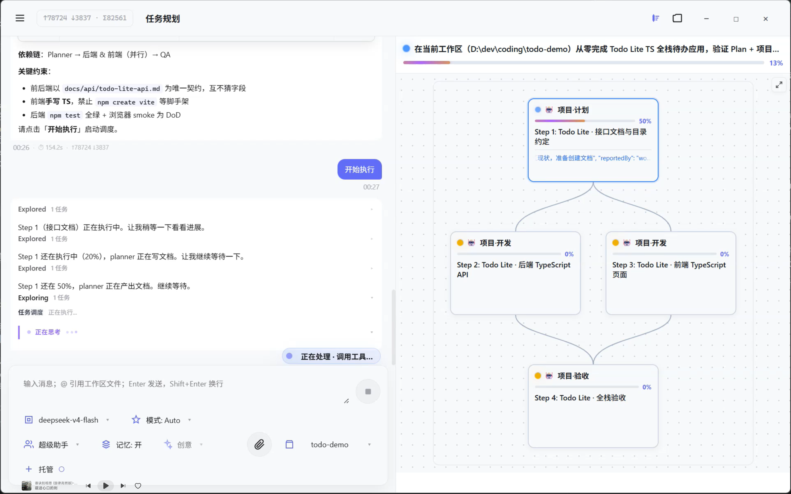
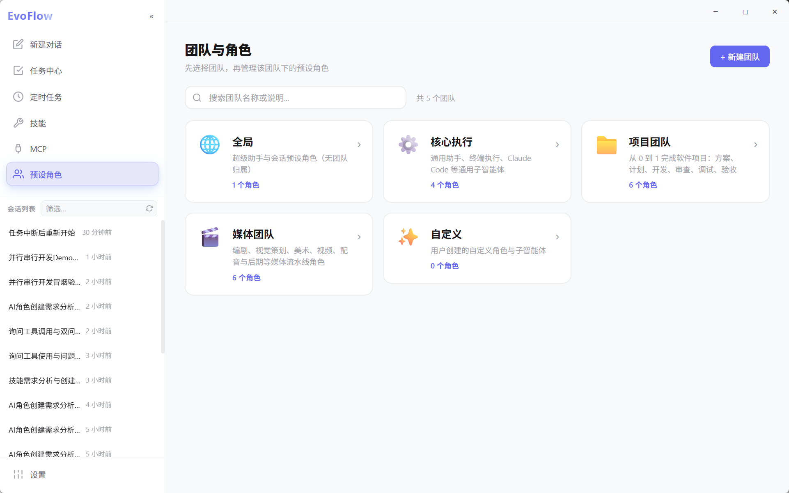
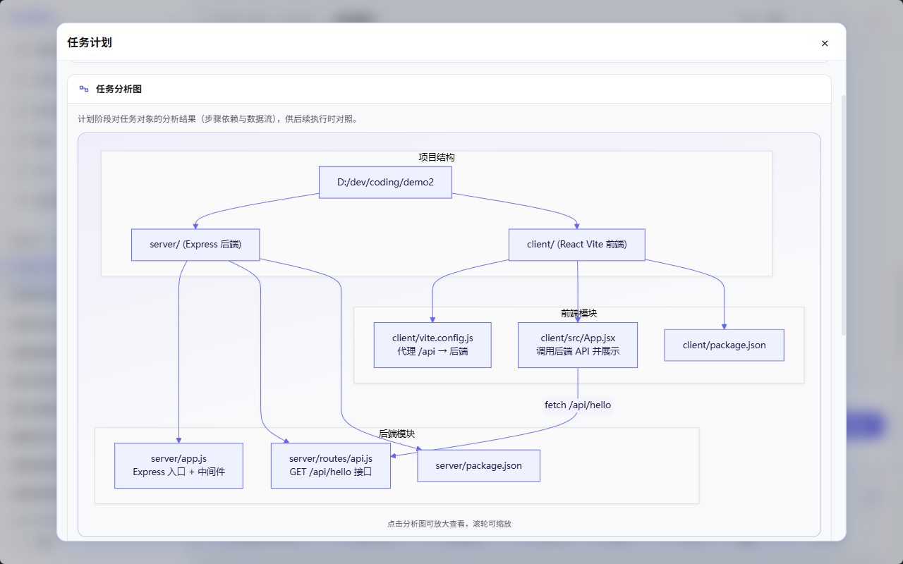
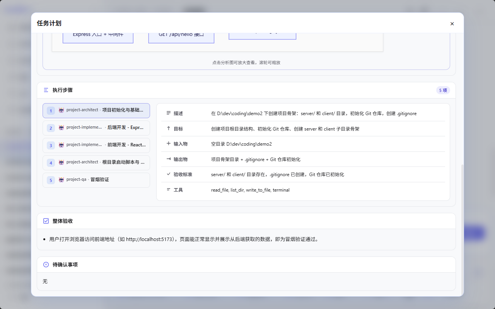
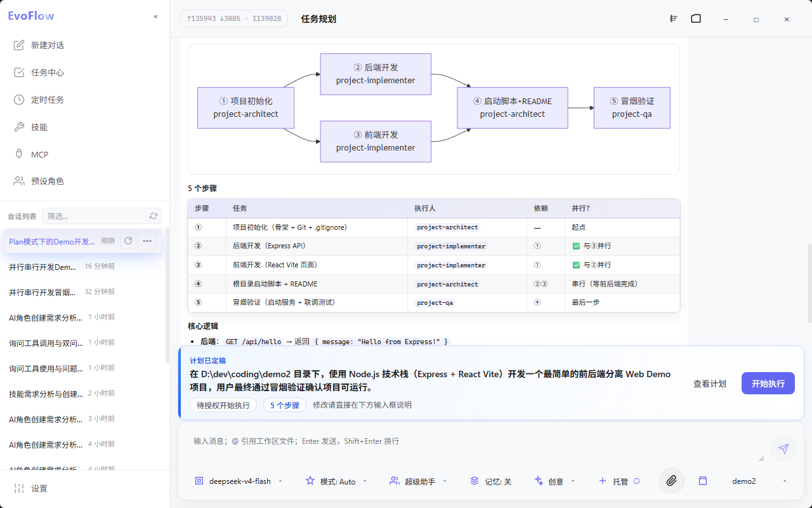
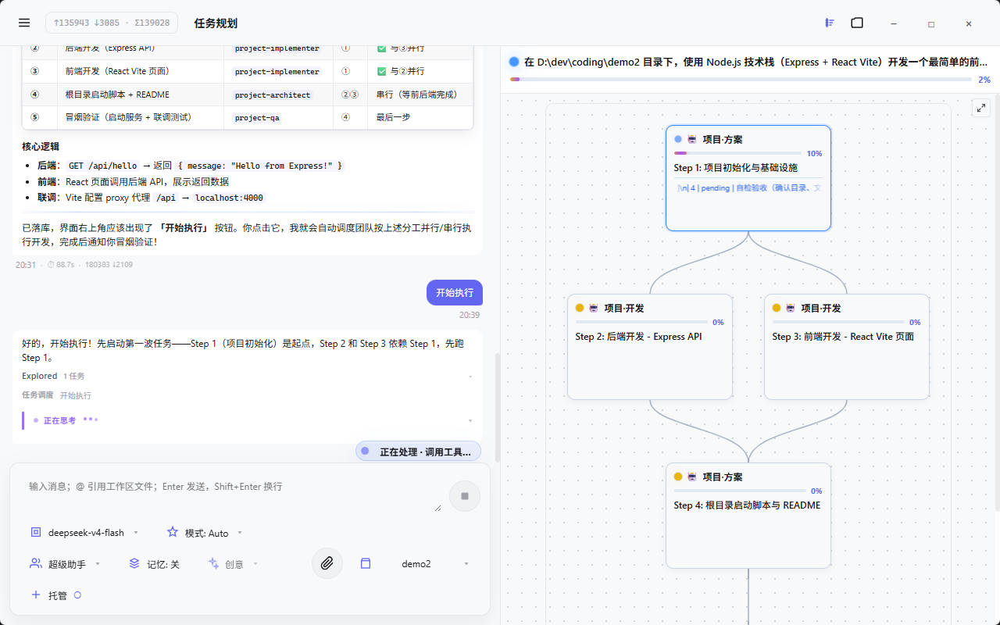
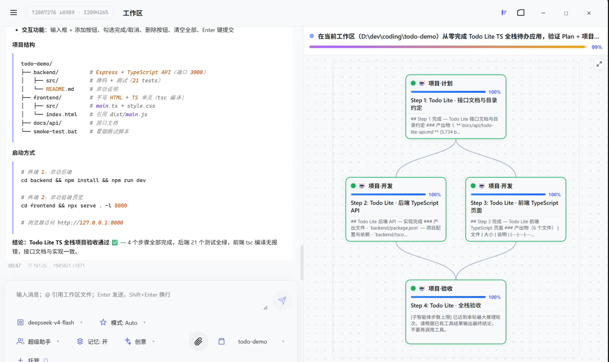

<!-- _class: lead -->

# EvoFlow Plan 模式

## 从需求到交付的智能协作闭环

**EvovexAI · EvoFlow**

<!-- note -->
开场：今天介绍 EvoFlow 在 Plan 模式下的完整协作流程——从用户一句话需求，到多智能体分工执行，再到验收交付。面向业务和管理层，少讲技术细节，多讲流程与价值。
-->

---

## 目录

| Part | 内容 | 建议时长 |
|------|------|----------|
| **0** | 为什么需要 Plan 模式 | 3 分钟 |
| **1** | 全流程鸟瞰 | 4 分钟 |
| **2** | 规划前：把需求做对 | 8 分钟 |
| **3** | 计划：看得见、改得了、点得动 | 6 分钟 |
| **4** | 执行：主控 + 团队 + 干预 | 6 分钟 |
| **5** | 验收交付与业务价值 | 3 分钟 |

<!-- note -->
总时长约 25–30 分钟，留 5 分钟 Q&A。可按听众调整 Part 2/4 的深度。
-->

---

<!-- _class: lead -->

# Part 0

## 为什么需要 Plan 模式

<!-- note -->
进入 Part 0：先讲痛点，再讲 EvoFlow 的解法。
-->

---

## 传统 Agent 对话的四大痛点

| 痛点 | 表现 | 对业务的影响 |
|------|------|--------------|
| **长任务易中断** | 多步任务中途上下文漂移、会话断开 | 交付不可预期，需人工值守 |
| **误执行风险** | 需求未澄清就开始改代码、跑命令 | 返工成本高、结果偏离预期 |
| **Token 无效消耗** | 工具全开、重复推理 | 使用成本上升 |
| **人工调度负担** | 用户手动分配子任务、盯进度 | 无法规模化、难以无人值守 |

<!-- note -->
这四点来自 EvoFlow 产品定位。Plan 模式不是「多一个功能」，而是长任务闭环的基础设施。
-->

---

## 一句话定义 EvoFlow Plan 模式

> **Supervisor 超级智能体全局主控** + **Agent Teams 智能体团队分工** + **用户全程可见、可确认、可干预**

核心节奏：**先澄清 → 再规划 → 用户确认后才执行**

- 计划持久化落库，非口头说说
- 执行前有明确 **「开始执行」** 闸口
- 子任务按依赖图（DAG）自动推进，主控持续跟进

<!-- note -->
强调三个关键词：主控、团队、可控。与「一个 Chat 框聊到底」形成对比。
-->

---

<!-- _class: lead -->

# Part 1

## 全流程鸟瞰

<!-- note -->
Part 1：给听众一张 mental map，后面逐段展开。
-->

---

## 六阶段总览

```
┌─────────┐   ┌─────────┐   ┌─────────┐   ┌─────────┐   ┌─────────┐   ┌─────────┐
│ 阶段一  │ → │ 阶段二  │ → │ 阶段三  │ → │ 阶段四  │ → │ 阶段五  │ → │ 阶段六  │
│  启动   │   │  澄清   │   │  摸底   │   │  计划   │   │  执行   │   │  收尾   │
└─────────┘   └─────────┘   └─────────┘   └─────────┘   └─────────┘   └─────────┘
 用户描述目标   Lead 结构化    只读调研 +     结构化 Plan    用户授权后     监控干预 +
 选择任务规划   追问确认       能力摸排       查看/修改      Supervisor     验收交付
```

| 阶段 | 关键角色 | 用户动作 |
|------|----------|----------|
| 启动 | 用户 | 选场景、绑工作区、描述目标 |
| 澄清 | Lead 主控智能体 | 回答侧栏问卷 |
| 摸底 | Lead + 只读子任务 | 等待调研与能力对照 |
| 计划 | Lead | 查看计划、提出修改 |
| 执行 | Supervisor + Agent Teams | **点击「开始执行」** |
| 收尾 | Lead 监工 | 验收结果、领取交付物 |

<!-- note -->
Walk through left to right once. 强调阶段五的闸口——执行不是自动开始的。
-->

---

## 协作状态机（用户视角）

| 状态 | 中文 | 用户看到什么 |
|------|------|--------------|
| 空闲 / 需求确认 | 启动 | 输入需求；可能出现澄清问卷 |
| **规划中** | planning | Lead 调研、摸排、写计划；**规划期禁止误执行** |
| **计划已定稿** | plan_ready | 输入框上方 **「查看计划」「开始执行」「修改计划」** |
| **等待授权** | awaiting_exec | 已点「开始执行」，系统准备派发 |
| **执行中** | executing | 侧栏子任务工作流；多 Agent 并行/串行 |
| **验收中 / 总结** | verifying / reflecting | Lead 对照验收清单跑测试 |
| **已暂停** | paused | 可暂停/恢复，不新派发 |
| **已完成** | done | 交付物链接 + 结果小结 |

<!-- note -->
状态机是线程级协作阶段，与任务中心里的任务状态互补。业务听众只需理解：规划期 → 确认条 → 执行 → 验收 → 完成。
-->

---

<!-- _class: lead -->

# Part 2

## 规划前：把需求做对

<!-- note -->
Part 2 最长：澄清、调研、能力摸排、三项门禁。这是 Plan 质量的基础。
-->

---

## 阶段一 · 用户输入



**入口**
- EvoFlow 桌面端（主通道）
- 飞书 / Slack / Telegram 等 IM 渠道

**用户操作**
1. 顶栏选择 **「任务规划」** 场景
2. 绑定本地工作区（代码/文档类任务）
3. 用自然语言描述目标（如「做一个带 API 的待办 Web 应用」）

**系统响应**
- 自动进入 **规划中**，绑定会话主任务
- Lead 主控智能体接管后续流程

<!-- note -->
配图来自 Plan 演示视频封面。若现场有桌面端，可切到 live demo 对照。
-->

---

## 阶段二 · Lead 需求澄清

**机制**：主控智能体发起 **结构化澄清问卷**（侧栏展示，最多 3 问）

| 澄清类型 | 典型场景 |
|----------|----------|
| 信息缺失 | 缺目标、范围、交付物、验收标准 |
| 需求歧义 | 「优化一下」——优化什么、做到什么程度？ |
| 方案选择 | 技术栈、架构路线 A/B |
| 风险确认 | 删数据、改生产配置等 |
| 建议确认 | 主控建议方案，请用户拍板 |

**规划期保护（PlanGuard）**：澄清完成前，**禁止**写文件、跑命令等副作用操作

<!-- note -->
澄清后系统暂停等待用户回答，再继续。这是「先澄清再规划」的第一道关。
-->

---

## 阶段三 · 需求调研

**分工原则**：Lead **不亲自**大篇幅读代码、跑命令、做交付

| 谁 | 做什么 |
|----|--------|
| **Lead 主控** | 拆解要摸清什么、综合结论、决定是否可写 Plan |
| **只读子任务** | 读仓库结构、文档、现有能力；**只调研、不改动** |

**产出**：调研结论清晰——边界、约束、关键路径、现有资产

<!-- note -->
对标真实项目管理：PM 不自己写全部代码，但要把背景摸清楚再排计划。
-->

---

## 阶段三 · 智能体能力摸排



**目的**：为每一步选 **「做得成这件事」** 的执行人

1. **快速列队** — 查看可用 Agent Teams 与预设角色
2. **深度摸底** — 委派只读子任务，核对工具、技能、限流等
3. **能力对照表** — 步骤 ↔ 执行人 ↔ 能力是否匹配

**团队示例**：项目团队含方案、计划、开发、审查、QA 等角色

<!-- note -->
右侧为 Agent Teams 团队总览截图。强调「人岗匹配」——不是随便派一个通用 Agent。
-->

---

## 三项门禁：不齐不写 Plan

Plan 落库前，**必须同时满足**：

| # | 门禁 | 含义 |
|---|------|------|
| ① | **需求清晰** | 目标、范围、交付物、验收标准明确 |
| ② | **调研清晰** | 只读调研子任务已有可支撑规划的结论 |
| ③ | **人岗匹配** | 每步执行人与能力对照表一致 |

任一未满足 → 继续澄清或继续调研/摸排，**不生成正式计划**

<!-- note -->
这是系统级硬约束，避免「需求没搞清就出一堆 Step」。业务上等同于立项前三件套。
-->

---

<!-- _class: lead -->

# Part 3

## 计划：看得见、改得了、点得动

<!-- note -->
Part 3：结构化计划长什么样、用户如何确认与修改。
-->

---

## 结构化计划包含什么



| 组成部分 | 说明 |
|----------|------|
| **目标（Goal）** | 本次协作要达成的总目标 |
| **执行步骤** | 带依赖关系的步骤列表（DAG） |
| **任务分析图** | Mermaid 图：模块结构、调用链、数据流（非简单 Step1→2） |
| **每步详情** | 执行人、目标、输入物、输出物、验收标准 |
| **整体验收清单** | Plan 级 validation，收尾时逐项核对 |

计划 **持久化落库**，子任务 **一次性同步** 到侧栏

<!-- note -->
左文右图：任务分析图是「对任务对象的分析」，不是执行顺序流程图。
-->

---

## 执行步骤与智能体分工



- 每步指定 **执行智能体**（对用户展示中文角色名）
- 明确 **输入物 / 输出物**，便于上下游交接
- 每步自带 **验收标准**，执行完可对照检查
- 依赖关系决定 **串行 vs 可并行** 的步骤

<!-- note -->
点开「查看计划」弹窗即可看到此视图。讲解时可指认某一步的 assigned_agent 与 acceptance。
-->

---

## 用户确认闸口



计划定稿后，输入框上方出现 **确认条**：

| 按钮 | 作用 |
|------|------|
| **查看计划** | 打开结构化计划弹窗（分析图 + 步骤详情） |
| **修改计划** | 在对话中说明修改意见，Lead 重新生成计划 |
| **开始执行** | **唯一正式授权入口** — 进入执行阶段 |

侧栏同步展示子任务列表（状态多为「已规划」，尚未运行）

<!-- note -->
强调：不是聊天里口头说「好的开始吧」，而是界面闸口 + 系统写入执行授权。
-->

---

## 关键设计：执行权在用户

**Plan 定稿后**
- Lead **不再**追问「是否开始执行？」
- 界面已提供「开始执行」按钮，等待用户主动操作

**修改计划后**
- 若计划内容变更，**执行授权自动撤销**
- 用户需 **重新点击「开始执行」**

→ 降低误触、避免「计划改了却还在跑旧版」

<!-- note -->
这是产品护栏设计，适合向管理层强调「可控」与「合规」。
-->

---

<!-- _class: lead -->

# Part 4

## 执行：主控 + 团队 + 干预

<!-- note -->
Part 4：Supervisor 如何派活、团队如何协作、用户如何介入。
-->

---

## Supervisor 主控职责

用户点击 **「开始执行」** 后：

```
用户授权 → Lead 触发调度 → 派发首波子任务 → 持续跟进 → 异常处理 → 验收收敛
```

| 环节 | 主控做什么 |
|------|------------|
| **派发** | 按依赖图启动当前可执行的步骤 |
| **跟进** | 持续查看各子任务进度与阻塞原因 |
| **推进** | 上游完成后，**自动启动下一波**（无需每步手动点） |
| **异常** | 失败重试、续聊、换策略（同 Step 最多重试 3 次） |

Lead 定位：**监工** — 拆解、选人、跟进、验收；**不替代** 子 Agent 做专项交付

<!-- note -->
Supervisor 是调度引擎，Lead 是面向用户的总控大脑。对业务层可合并称为「主控智能体」。
-->

---

## Agent Teams 协作



- **DAG 依赖**：Step 2 依赖 Step 1 完成 → 自动 blocked / 自动 follow-up
- **并行**：无依赖的步骤可同时跑（如前端 + 后端）
- **上下文隔离**：每个子任务独立上下文，结果回传主会话
- **完成标准**：以 **正式 outcome 回报** 为准，非口头「做完了」

**典型分工**：架构设计 → 实现计划 → 编码 → 代码审查 → QA 测试

<!-- note -->
右侧为 Supervisor 子任务工作流侧栏。可指出状态标签与依赖关系。
-->

---

## 进度可视化

| 界面 | 看到什么 |
|------|----------|
| **主会话** | 流式对话 + 子任务执行过程回传 |
| **协作侧栏 / 工作流面板** | 子任务列表、DAG、状态、进度百分比 |
| **任务中心** | 历史任务、批量操作、暂停/恢复/终止 |

全程 **透明可观测** — 不是黑盒 Autopilot

<!-- note -->
若听众用过项目管理工具，可类比看板 + 主频道汇总。
-->

---

## 节点干预能力

**子任务级**

| 能力 | 业务含义 |
|------|----------|
| **定向指导** | 对卡住的节点发送新指令，纠正方向 |
| **重试** | 从零重新跑该步骤 |
| **续聊** | 编码类任务接续同一会话（如 Claude Code） |
| **中断** | 停止当前子任务 |

**任务级**：暂停 / 恢复 / 终止

**安全闸口**：敏感工具操作需用户 **审批** 后才执行

<!-- note -->
强调「随时可干预」——这是 EvoFlow 与完全无人值守方案的重要差异点。
-->

---

## Plan 模式 vs 普通 Chat

| 维度 | 普通 Chat | Plan 模式 |
|------|-----------|-----------|
| 计划 | 口头/临时 | **持久化结构化计划** |
| 执行 | 随时可能副作用 | **用户授权闸口** |
| 分工 | 单 Agent 或 ad-hoc | **Agent Teams + DAG** |
| 进度 | 难追踪 | **子任务 + 工作流面板** |
| 验收 | 主观 | **逐步 + Plan 级清单** |
| 干预 | 只能新消息 | **steer / retry / 暂停等** |

<!-- note -->
帮助听众理解何时该开 Plan 模式：多步骤、多角色、要交付、要可控。
-->

---

<!-- _class: lead -->

# Part 5

## 验收交付与业务价值

<!-- note -->
Part 5：收尾流程 + 四条业务价值 + Q&A 资源。
-->

---

## 验收与交付



**两层验收**
1. **逐步验收** — 每 Step 的 acceptance 标准
2. **Plan 级验收** — validation 清单（测试、构建、冒烟等）

**协作阶段**：执行中 → **验收中** → **总结** → **已完成**

**交付形式**
- 文件 → 工作区 `outputs/` 目录
- 对话中 **可点击链接** 预览/下载
- 可选：飞书推送 Markdown 结果小结

<!-- note -->
右侧为项目跑通结果演示封面。若有 video-02，可在 Q&A 播放 1–2 分钟。
-->

---

## 业务价值总结

| 价值 | 说明 |
|------|------|
| **降本** | 工具渐进暴露、减少无效 Token；长任务自动推进，降低人工值守 |
| **可控** | 澄清 + 计划闸口 + 执行授权 + 节点干预 |
| **可交付** | 结构化 I/O、验收标准、Plan 级 validation |
| **可扩展** | Agent Teams、技能生态、MCP 扩展；IM / 目标 / 自动化 |

**EvoFlow Plan 模式** = 把「一句话需求」变成 **可观测、可确认、可验收** 的协作闭环

<!-- note -->
四条价值对应 opening 痛点。可根据听众行业替换例子（研发、运营、内容等）。
-->

---

<!-- _class: lead -->

# 谢谢

## Q & A

**资源**
- 官网演示：https://www.evovexai.com/showcase/
- EvoFlow 文档：https://www.evovexai.com/docs/getting-started
- 实操教程：https://www.evovexai.com/presentations/guides/
- GitHub：https://github.com/EvovexAI/EvoFlow
- 联系：cloud@evovexai.com

<!-- note -->
附录页。可展示微信交流群二维码（docs/assets/screenshots/wechat-group-qr.jpg）若现场需要。演示视频见 docs/assets/plan-supervisor/。
-->
