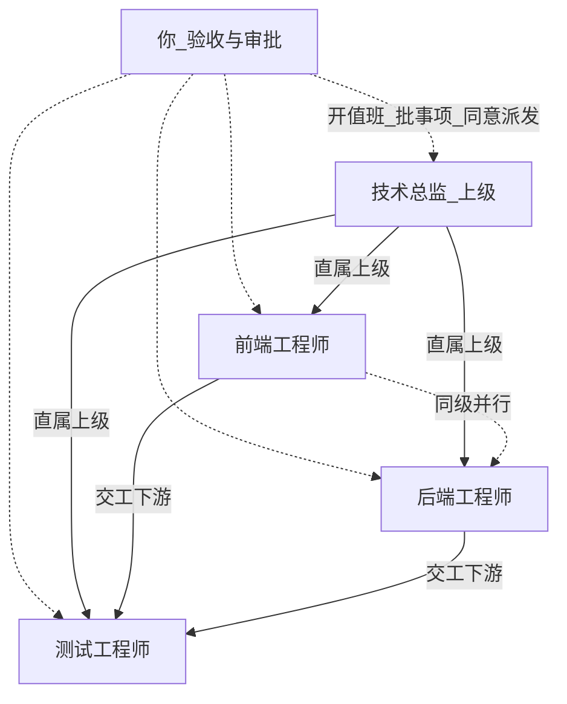
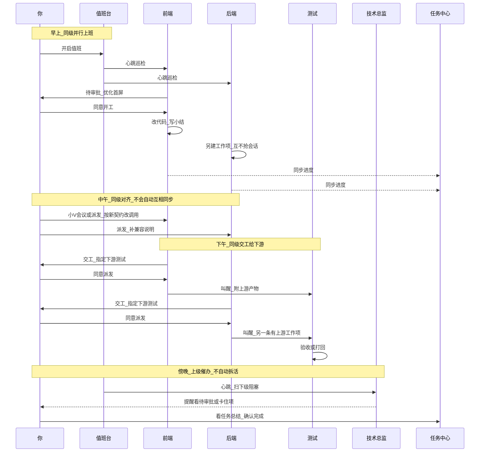

# 智能体员工是什么

> **一句话**：智能体员工 = 把已有「智能体」编成**岗位合同**——规定职责、工作区、心跳节奏与审批策略，让它在值班时段主动巡检、建项、交班，而不是等你每句点名。
>
> 操作步骤见 [智能体员工指南](../guides/configuration/smart-employees.md) 与 [雇佣第一个员工](../tutorials/hire-first-smart-employee.md)。本文讲**怎么工作、多岗关系、能干嘛**。

---

## 能干嘛（你雇它是为了什么）

适合交给智能体员工的，通常是这几类：

| 类型 | 例子 | 你平时干什么 |
|------|------|--------------|
| **定时盯盘** | 服务健康、仓库脏文件、文档是否过期、竞品页是否更新 | 开值班，看待审批 / 交班报告 |
| **周期交付** | 每周五数据报表、每日站会纪要草稿、定期代码审查意见 | 到点收任务总结，确认或打回 |
| **岗位流水线** | 调研 → 写作 → 校对；实现 → 测试 | A 交工指定下游 B，你点「同意派发」 |
| **临时委派** | 今天让运营岗出一版对外说明 | 小V 选员工发目标，看汇报 |
| **催办与前台** | 系统前台岗帮你盯全局待办 | 少改职责，当协调岗用 |

**不太适合**：一次性深度探索（用聊天 / Plan）、流程已完全固定只换参数（用应用中心）、到点跑同一句 Prompt（用自动化）。

---

## 单个员工怎么工作

每个员工是**独立岗位**：自己的职责、工作区、节奏、审批策略、岗位会话。

```text
你：开启值班（全局）+ 该岗「上班中」
        │
        ├─ 到点心跳（上岗节奏）
        ├─ 你点「立即开工」
        ├─ 你「派发任务」/ 小V 委派
        └─ 上游交工后被叫醒（下游接力）
                │
                ▼
     岗位会话 proactive:{agent_code}
      看职责 + 工作区现状 → 决定本轮干什么
                │
                ├─ 可能：建工作项
                ├─ 可能：进「待审批」（谨慎型更常见）
                ├─ 干活：深度工作=调工具循环；轻量工作=少轮生成
                └─ 本轮小结（wrap_up）/ 交工写任务总结
                        │
                        ├─ 你验收（工作项详情 / 任务中心）
                        └─ 可选：指定下游继续
```

要点：

1. **不会共享一个大脑会话**：前端工程师和后端工程师各跑各的 `proactive:…` 会话。  
2. **「会什么」在智能体页**；员工页只决定**何时干、盯哪、要不要先问你**。  
3. **自动心跳**依赖：全局值班开着 + 岗未请假 + 多在上班时间内；「立即开工」可随时打断等待。  
4. **产出**常落在工作区 `docs/roles/<agent_code>/…`，并在交工时留下**任务总结**方便你验收。

---

## 整套体系举例：上下级 + 同级怎么转起来

用一个小团队故事把编制、并行同级、交工下游串起来。假设你开了全局值班，四个人都在岗。

### 编制关系（组织树）



| 岗位 | 直属上级 | 职责（简化） | 关系角色 |
|------|----------|--------------|----------|
| 技术总监 | （无） | 每天扫风险与阻塞，催办跨岗 | **上级** |
| 前端工程师 | 技术总监 | 盯 `frontend/`，修体验与前端债 | **同级**之一 |
| 后端工程师 | 技术总监 | 盯 `backend/`，修接口与稳定性 | **同级**之一 |
| 测试工程师 | 技术总监 | 验收交付、写回归清单 | **下游**常客 |

> 实线「直属上级」= 编制；虚线「同级」= 并行同事；实线「交工下游」= 任务链。组织树上的「上级」**不会**自动给下级派活。

### 一天怎么转（时序）



### 单岗一轮（心跳到交班）

```mermaid
sequenceDiagram
  participant You as 你
  participant Role as 某员工岗
  participant Item as 工作项
  participant Trail as 工作轨迹

  You->>Role: 开启值班后到点心跳或立即开工
  Role->>Role: 读职责与工作区
  alt 需审批
    Role->>You: 待审批
    You->>Role: 同意或驳回
  end
  Role->>Item: 建项或继续事项
  Role->>Trail: 调工具干活
  Role->>Role: 本轮小结_wrap_up
  opt 指定下游
    Role->>You: 交接审批
    You->>Role: 同意派发
    Role->>Role: 叫醒下游岗
  end
  Role->>You: 交工待验收_任务总结
  You->>Item: 确认完成或打回
```



### 上午：同级各干各的（并行）

1. **09:00** 值班台已开。前端、后端按各自上岗节奏心跳。  
2. 前端巡检发现首页加载变慢 → 建工作项「优化首屏」→（谨慎型）进**待审批** → 你点**同意** → 改代码、写小结。  
3. **同时**后端巡检发现某个 API 超时 → 另一条工作项，互不抢会话。  
4. 你在名册看到两个「工作中」；任务中心「智能体员工」里也能分别看到两条。

这就是**同级关系的默认态**：共享一个仓库也可以，用「关注子路径」划界；没有谁指挥谁，只是并列上班。

### 中午：同级对齐（会议 / 你调度）

后端改完接口契约，前端还按旧字段在写。你可以：

- 打开小V **会议**，话题写「API 字段变更，前后端对齐」让相关岗讨论；或  
- 分别给前端、后端**派发任务**：「按新契约改调用 / 补兼容说明」。

同级**不会**自动互相叫醒；对齐要靠会议、你派发，或下面这种交工链。

### 下午：上下游交接（同级 → 测试）

1. 前端把「优化首屏」**交工**，任务总结写清改了什么、如何验收，并指定下游 **测试工程师**，附上产物路径。  
2. 按交接审批策略：可能出现「交接审批」→ 你点 **同意派发**（不是普通「同意」）。  
3. 测试岗被叫醒，详情里能看到**上游参考产物**，开始写验收 / 打回。  
4. 后端那条也可以同样交工给测试 → 测试侧出现另一条带「有上游」的工作项。

### 傍晚：上级催办（编制树发挥作用）

技术总监心跳时看到组织上下文里有直属下级；若配置了催办类职责，它更偏向**扫阻塞、提醒你看待审批**，而不是替前端写 CSS。

你也可以：

- 在组织架构里确认「前端 / 后端的直属上级 = 技术总监」；  
- 用小V 对**技术总监**说：「看看今天下级有没有卡住的交工」；  
- 自己在待审批 / 健康页清掉「同意派发」和卡住执行。

上级岗 = **编制上的汇报线 + 可选催办职责**；把活拆给下级，仍建议你派发或下级自己交工下游，而不是指望「上级一开口下级自动开工」的隐式魔法。

### 你这一天实际点了哪些按钮

| 时刻 | 你的动作 |
|------|----------|
| 早 | 确认值班台开启；处理前端「待审批」同意开工 |
| 中 | （可选）小V 会议或分别派发，对齐前后端 |
| 午后 | 交接审批里点「同意派发」→ 测试开工 |
| 晚 | 任务中心看任务总结，确认完成或打回；扫健康 |

整条链在任务中心里可以按根单聚合看：谁上游、谁下游、总结写了什么。

### 对照：三种关系各管什么

| 关系 | 例子里谁 | 管什么 | 不管什么 |
|------|----------|--------|----------|
| **上下级（编制）** | 总监 ↔ 前后端 / 测试 | 通讯录、催办视角 | 自动拆任务给下级 |
| **同级（并行）** | 前端 ↔ 后端 | 同时上班、划界巡检 | 自动同步契约 |
| **上下游（交接）** | 前端/后端 → 测试 | 交工叫醒、产物传递 | 代替你的验收拍板 |

---

## 多个员工之间是什么关系

多岗不是「一个大模型里的多个分身」，而是**编制上的同事关系**，常见三种：

### 1. 组织关系（编制树）

雇佣/编辑时可设 **部门**、**直属上级**（`reports_to`）。

- 在「组织架构」Tab 看树、改上级  
- 影响催办视图、「谁管谁」——**不是**自动把活拆给下级的 Supervisor  
- **系统前台**类岗位偏全局催办，不要当普通业务开发岗乱用

可以想成：通讯录里的汇报线；真正干活仍按各自职责与工作项。完整一天怎么转，见上一节举例。

### 2. 交接关系（上下游任务链）

这是多岗**真正一起交付**的主路径：

```text
产品经理岗交工
  → 指定下游「前端工程师」，附上产物路径
  →（按交接审批策略）可能挂「交接审批」
  → 你点「同意派发」
  → 前端岗被叫醒，带着「上游参考产物」开工
```

- 看板卡片可标「有上游」；详情里能点进下游  
- **同意派发** ≠ 普通「同意」：前者放行跨岗，后者放行本岗事项  
- 交接审批策略（全自动 / 平衡型 / 谨慎型）主要管：**结案并指定下游后，要不要先问你再叫醒下一岗**

### 3. 并行同事（默认）

多数情况下，多岗是**并行、互不打扰**的：

- 各按自己的心跳巡检自己的工作区 / 职责  
- 可以绑**不同工作空间**，也可以共享同一仓库但用「关注子路径」划界  
- 需要对齐时：用小V **会议**开话题讨论，或你分别委派 / 派发

没有隐式「全员共享一个待办池」——协作要靠**职责划分 + 交工下游 + 你的审批/委派**。

---

## 多个员工怎么一起干活（四种玩法）

| 玩法 | 怎么发生 | 你做什么 |
|------|----------|----------|
| **各干各的** | 各自心跳 / 立即开工 | 看名册近况；失败看工作轨迹 |
| **你当调度** | 小V 或「派发任务」点名某岗 | 写清目标；按需打开工作轨迹 |
| **流水线交接** | A 交工指定 B | 处理交接审批；在任务中心看整链 |
| **开会对齐** | 小V → 会议 → 发起讨论 | 出题、看讨论结果，再落到派发/职责 |

和 Plan / 项目团队的差别：

- **Plan + 项目团队**：一次复杂软件交付，主控拆图、子角色在同一次任务里协作  
- **智能体员工多岗**：长期编制、按班次上班；协作是「交班式」而不是「同一次 Plan 图里并行节点」

两者可配合：大项目仍走 Plan；日常盯盘、周期稿、跨岗接力用员工。

---

## 和「智能体」两个身份，不要混

| | **智能体** | **智能体员工** |
|--|------------|----------------|
| 侧栏 | 智能体 `#/expert` | 智能体员工 `#/proactive` |
| 回答的问题 | 会什么（人设、工具、技能、MCP） | 何时主动干、干到哪（职责、工作区、节奏、审批） |
| 改哪里 | SOUL / 工具白名单 | 岗位表单 / 值班台 |
| 多角色 | 可在一次聊天/Plan 里被调度 | 多岗并行 + 交工下游 + 组织树 |

雇佣 = 给某个 `agent_code` 签岗位合同。同一智能体理论上可对应岗位编制；日常建议**一岗一责**，避免一个 code 身兼多岗职责打架。

---

## 和相邻能力怎么划界

| 能力 | 适合 | 不适合当成员工的替代 |
|------|------|----------------------|
| **实时聊天 / Plan** | 探索、一次性复杂交付 | 每天重复的岗位巡检 |
| **任务中心** | 跨来源观测与验收看板 | 定义「谁值班、职责是什么」 |
| **应用中心** | 流程已定、只换参数再跑 | 开放式「看仓库再决定干什么」 |
| **自动化** | 到点固定 Prompt | 要审批、交班、组织关系 |
| **目标 Goal** | 聊天里长程自驱一项目标 | 编内多岗、长期排班 |
| **智能体员工** | 编内值班、审批、交班、委派 | 单次聊聊改两行代码 |

---

## 交接审批策略在控什么

界面文案是 **交接审批策略**（全自动 / 平衡型 / 谨慎型）：

- 控的是「哪些动作必须先问你」——尤其是**本岗结案并指定下游之后，要不要审核才叫醒下一岗**
- **不**替代工具权限：没勾 terminal，员工仍然调不了终端  
- **不**替代值班台：策略再松，全局关值班也不会自动心跳  

上手用谨慎型；流水线跑顺后再平衡型或全自动。

---

## 失败时先查哪一层

1. **值班台 / 请假 / 上班时间**——有没有轮到它跑？  
2. **待审批 / 交接审批**——是不是卡在等你同意或同意派发？  
3. **工作轨迹**——有没有工具、有没有报错、有没有交班？  
4. **健康 / 摸鱼中**——是空转还是真在干？  
5. **上下游**：是不是上一段没交工、或下游没被叫醒？  
6. 最后才改 **职责** 或 **SOUL**

详细操作与 FAQ：[智能体员工指南](../guides/configuration/smart-employees.md)。

---

## 相关阅读

- [智能体员工（操作指南）](../guides/configuration/smart-employees.md)
- [雇佣第一个智能体员工](../tutorials/hire-first-smart-employee.md)
- [智能体管理](../guides/configuration/agent-management.md)
- [任务中心](../guides/tasks/task-center.md)
- [为什么是 EvoFlow](why-evoflow.md)
