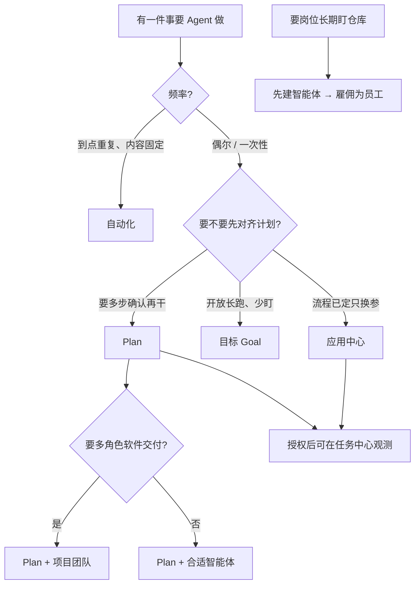

# 给谁用 · 解决什么 · 功能怎么串

> **比如你刚知道 EvoFlow，想搞清"这玩意儿到底能帮我干嘛？"**：
>
> - **写代码**：你让 AI"重构飞书渠道的消息格式化模块，拆文件、补单测、跑通过"——AI 自己拆步骤、写代码、跑测试
> - **盯服务器**：设个目标"每小时检查 gateway 和 langgraph 是否健康，异常就推飞书"——跑 7 天自动停，中间不用管
> - **定时出周报**：配个自动化，每周五下午 5 点自动汇总本周进展，推送到飞书
> - **飞书里干活**：在群里 @机器人 "帮我查一下今天 AI 圈有什么新闻"——AI 直接回复
>
> 读完本页你会搞清三个问题：**这个产品适合谁？我的问题该用哪条能力？几条能力怎么配合，而不是互相当成同一功能？**
>
> 操作细节见各指南；设计理念见 [为什么是 EvoFlow](../explanation/why-evoflow.md)；安装上手见 [快速上手](quick-start.md)。

---

## 一、产品一句话

EvoFlow 是让 **Agent 把事做完** 的桌面/Web 产品：不只聊天，还能规划、授权执行、看板观测、定时值班、沉淀成可再跑的应用，并可接到飞书等 IM。

适合：**多步、要结果、要可恢复** 的工作。  
不太适合：只想随口问一句就走的轻量问答（也能聊，但不是主战场）。

---

## 二、目标人群

| 人群 | 典型身份 | 核心痛点 | 优先用什么 |
|------|----------|----------|------------|
| **研发与构建者** | 独立开发者、全栈/后端、技术负责人 | 需求到可运行成果链路长；怕上下文丢、怕盯屏 | Plan、项目团队、工作区、Claude Code、任务中心 |
| **知识工作者** | 研究、分析、咨询、学生 | 检索—归纳—成稿易中断；怕幻觉堆砌 | 聊天 + 知识库/上传文档、记忆、技能、长任务 |
| **内容与运营** | 文案、运营、自媒体 | 环节多、工具杂、要反复出同类稿 | 应用中心、自动化、技能、创意相关场景 |
| **业务与综合岗** | 运营、项目、行政 | 日报巡检、整理资料；习惯在 IM 办事 | 自动化、目标、飞书渠道、自然语言下指令 |
| **团队赋能者** | Founder、数字化接口人 | 要给同事开箱角色，又要可控可观测 | 智能体、预设角色、任务中心、智能体员工 |

**主战场**：个人与小团队（约 1～30 人），没有专职 AI 平台组，但需要长任务 + 多角色 + 桌面/IM。  
**暂不主打**：仅单次问答；要重度企业权限/审计的大型组织（需商用与专项集成）。

更细的人群表见 [项目介绍](introduction.md)。

---

## 三、你想解决什么问题 → 用哪条能力

| 问题 / 诉求 | 用这个 | 不要误当成 |
|-------------|--------|------------|
| 跟 Agent 聊清楚、试想法、改文件 | **实时聊天**（Ask / Agent） | — |
| 多步任务要先对齐计划再动手 | **Plan 模式** | 目标 Agent、自动化 |
| 软件类多角色交付（规划/实现/验收） | **Plan + 项目团队** | 智能体员工（那是值班岗） |
| 要看板看进度、暂停/验收多任务 | **任务中心** | 聊天里的 Plan（Plan 是发起与主控对话） |
| 开放长任务、后台多轮自驱到边界 | **目标 Agent**（聊天 Goal） | 任务中心、自动化 |
| 每天/每周到点跑固定指令 | **自动化** | 智能体员工、任务中心 |
| 流程已跑通，以后只换参数再跑 | **应用中心** | 每次从零 Plan |
| 岗位定时巡检、审批、交班写报告 | **智能体员工** | 自动化（无岗位合同/看板） |
| 记得用户偏好与事实 | **记忆文件** | 知识库、上传文档 |
| 本地 Obsidian / Markdown 笔记可搜 | **知识库（Vault）** | 上传文档 RAG、记忆 |
| PDF/Word 等做成长期可检索库 | **上传文档（RAG）** | 会话里拖文件、Vault |
| 当前这一轮附带几个文件 | **会话文件上传** | 长期知识库 |
| 给角色配人设/工具/技能 | **智能体** | 智能体员工（雇佣才是岗位） |
| 在飞书里对话、收结果 | **消息渠道** | — |

---

## 四、功能地图（按侧栏心智）

```text
聊天壳
├── 新建对话 ── Ask / Agent / Plan / Goal（目标）
├── 任务中心 ── 多任务看板、详情、工作流 DAG
├── 应用中心 ── 画布编排 → 发布 → 填参再跑
├── 自动化   ── 到点 / 一次性固定 Prompt
├── 智能体员工 ── 雇佣岗位、值班、待审批、交班
├── 智能体   ── 角色 / 技能 / 连接器（MCP）
├── 知识库   ── Obsidian / 本地 Markdown Vault
└── 设置     ── 模型、IM、记忆等
     （上传文档 RAG 默认可隐藏，直达 #/knowledge）
```

| 能力 | 一句话 | 操作指南 |
|------|--------|----------|
| 实时聊天 | 主入口；模式决定怎么干 | [基础功能](../guides/chat/basic-functions.md) |
| Plan | 先定稿再「开始执行」 | [Plan 模式](../guides/chat/plan-mode.md) |
| 目标 | 聊天里长程自驱 | [目标 Agent](../guides/chat/goal-agent.md) |
| 任务中心 | 观测与验收任务 | [任务中心](../guides/tasks/task-center.md) |
| 应用中心 | 工作流产品化 | [应用中心](../guides/configuration/app-center.md) |
| 自动化 | 定时触发 | [自动化](../guides/tasks/scheduled-tasks.md) |
| 智能体员工 | 编内值班岗 | [智能体员工](../guides/configuration/smart-employees.md) |
| 智能体 | 能力包配置 | [智能体管理](../guides/configuration/agent-management.md) |
| 知识库 / 上传文档 / 记忆 | 三类「知道」 | [知识库](../guides/configuration/knowledge-vault.md) · [上传文档](../guides/configuration/document-knowledge-base.md) · [记忆](../guides/configuration/memory-management.md) |

面板入口总表：[EvoPanel 指南](../guides/configuration/evopanel-guide.md)。

---

## 五、功能之间怎么配合

### 5.1 决策：我该开哪条「做事」路径？



### 5.2 常见组合（怎么串）

| 组合 | 怎么用 |
|------|--------|
| **聊天 Plan → 任务中心** | 底部选 Plan → 定稿 →「开始执行」→ 右侧工作流；需要看板时打开任务中心「对话」 |
| **Plan → 另存为应用** | 确认条「另存为应用」或任务详情沉淀 → 以后填参再跑 |
| **智能体 → 智能体员工** | 先在「智能体」配好人设/工具 →「智能体员工」雇佣并绑工作区 → 开值班 |
| **员工交工 → 任务中心待确认** | 员工看板「待确认」与任务中心验收相关；待审批是开工前拍板，别混 |
| **知识库 / 上传文档 → 聊天** | 先连库或建 RAG → 对话里让 Agent 检索（工具权限要勾上） |
| **自动化 → IM** | 配好渠道 → 自动化开「完成后推送」→ 到点结果进飞书等 |
| **目标 → IM** | 聊天 Goal 跑完可推送小结（需渠道允许） |

### 5.3 三组最容易混的概念

| 组 | 区别一句话 |
|----|------------|
| **Plan vs 目标 vs 自动化 vs 任务中心** | Plan=先计划再授权；目标=聊天长跑；自动化=到点固定 Prompt；任务中心=看板观测层 |
| **智能体 vs 智能体员工** | 智能体=会什么；员工=何时主动干、职责与审批 |
| **记忆 vs 知识库 vs 上传文档 vs 会话上传** | 记忆=关于你的事实；Vault=本地笔记；RAG=上传向量库；会话上传=仅本轮附件 |

---

## 六、三条典型路径（按人群）

### 路径 A · 开发者：从需求到可运行小功能

1. 配模型 → 绑工作区  
2. 底部 **Plan**，用项目团队提示词（见 [项目级 Plan](../guides/chat/project-team-plan-workflow.md)）  
3. 「开始执行」→ 看右侧工作流 / 任务中心  
4. 跑通后可 **另存为应用** 供下次填参  

### 路径 B · 运营：每日汇总推飞书

1. 配模型 + 飞书渠道  
2. **自动化** 写清 Prompt、选每天时刻、开推送  
3. 点「运行」试一次 → 看历史 / 飞书是否收到  

### 路径 C · 小团队：岗位盯仓库

1. 「智能体」准备好角色（或复制预设）  
2. 「智能体员工」雇佣、绑仓库工作区、自主权先「谨慎型」  
3. 开值班 → 处理待审批 → 交班文档在 `docs/roles/…`  
4. 大工程仍走 Plan / 任务中心，不要全塞给值班岗  

---

## 七、接下来读什么

| 目的 | 文档 |
|------|------|
| 安装与第一次对话 | [下载](downloads.md) · [快速上手](quick-start.md) · [第一个任务](first-task.md) |
| 功能怎么点 | [操作指南总目录](../guides/README.md) |
| 面板有哪些入口 | [EvoPanel 指南](../guides/configuration/evopanel-guide.md) |
| 产品定义与能力清单 | [项目介绍](introduction.md) |
| 设计为什么这样 | [为什么是 EvoFlow](../explanation/why-evoflow.md) |
| 踩坑 | [FAQ](../guides/faq.md) |
