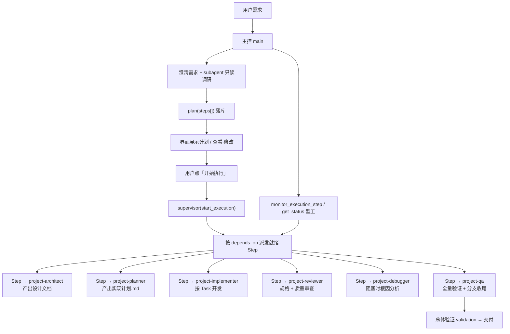
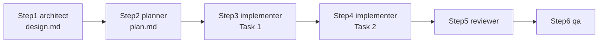
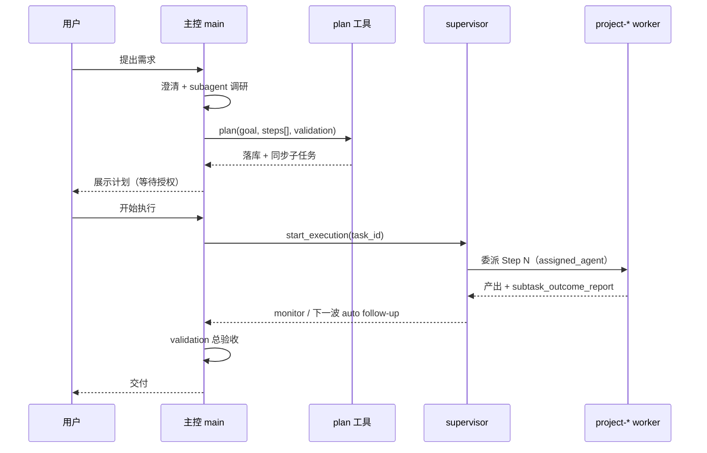

# 项目团队与 Plan 模式协作流程

> **比如你要做一个"Todo 全栈应用"**：
>
> 1. 主智能会先出 Plan：方案设计→数据库设计→后端开发→前端开发→测试→部署
> 2. 每一步指定执行角色：`project-architect` 出方案，`project-implementer` 写代码，`project-tester` 跑测试
> 3. 你确认计划后，Supervisor 按依赖图分发：先跑方案，方案通过后再跑开发……
> 4. 中间有问题，主智能体自动调整；你随时可以暂停查进度
>
> 读完本文你会掌握"主控编排 + 角色分工"的完整协作流程，以及可直接复用的提示词模板。
>
> **功能关系**：本文是 [Plan 模式](plan-mode.md) 与[预设角色与团队](preset-roles.md) 的深度结合文档——Plan 模式提供编排机制，项目团队提供专业执行角色，两者配合形成完整的工程协作流水线；与[任务中心](../tasks/task-center.md)共享同一套任务系统。

本文说明：**EvoFlow Plan 模式**（主控 `plan` 工具）与**项目团队**（`project-*` 内置角色）如何配合，从 0 到 1 完成软件类任务。可与 [Plan 模式使用](plan-mode.md)、[Agent 管理](../configuration/agent-management.md) 对照阅读。

---

## 1. 核心结论（先读这段）

- **Plan 模式的 plan** = 主控给**整次用户任务**排的执行表（Step、执行人、依赖、验收）。
- **项目团队的「方案 / 计划」** = 某个 Step 里子智能体产出的**文档**（设计说明、实现计划 Markdown），不是另一套 Plan 系统。
- **多角色不会自动串联**：主控在 `plan(steps[])` 里为每一步指定 `assigned_agent` 和 `depends_on`；用户点「开始执行」后，由 `supervisor` 按 DAG 派发。
- **`general-purpose` / `bash` / `claude-code`** 属于**核心执行**团队，简单 Step 仍可派它们；需要 superpowers 工程流水线时，再派 `project-*`。

---

## 2. 两层「计划」对比

| 维度 | EvoFlow Plan 模式（`plan` 工具） | 项目团队角色产出 |
|------|----------------------------------|------------------|
| **谁写** | 主控 `main` | 子智能体（如 `project-architect`、`project-planner`） |
| **是什么** | 整次任务的**执行 DAG**：Step1→Step2→…，每步有执行人、输入输出、验收 | 某一阶段的**交付物文档** |
| **粒度** | 「这一步谁干什么、依赖谁、怎么验收」 | 「这个功能怎么设计 / 怎么拆成 TDD 小任务」 |
| **落库位置** | 任务系统（`plan_goal` / `plan_steps` → 同步为 supervisor 子任务） | 通常 `docs/evoflow/runs/<run-id>/specs/` 或 `plans/` |
| **类比** | 项目经理排期表 | 架构师出方案、Tech Lead 出开发任务单 |

同名「计划」容易混淆：

- 主控说的 **Plan** → 产品层任务编排。
- `project-planner` 写的 **implementation plan** → 开发视角的实现计划，是 Plan 里**某一步的产出文件**。

---

## 3. 总体协作流程图



---

## 4. Plan 模式主控阶段（与项目团队无关的「外层」）

主控在 Plan 模式下按固定顺序工作（详见系统提示 `<plan_workflow>`）：

| 阶段 | 主控做什么 | 工具 |
|------|------------|------|
| 1. 需求澄清 | 目标、范围、交付物、验收边界 | `ask_clarification` |
| 2. 调研与能力盘点 | 只读摸底、列出可用 agent 与能力对照表 | `subagent`（调研型） |
| 3. 写 Plan 落库 | 拆解 Step、选人、写依赖与验收 | `plan` |
| 4. 等待授权 | plan 成功后**不再**问「是否开始执行」 | 用户点按钮或发「开始执行」 |
| 5. 派发执行 | 启动首波就绪 Step | `supervisor(start_execution)` |
| 6. 监工 | 跟进进度、失败重试、验收 | `monitor_execution_step`、`get_status`、`continue_subtask_session` |
| 7. 总体验收 | 对照 Plan 的 `validation` | 主控宣告完成 |

**要点**：`plan` 成功后会**一次性**把 `steps[]` 同步为子任务，无需再 `create_subtasks`。

---

## 5. 项目团队角色与 superpowers 技能

项目团队是内置的 6 个 `project-*` 子智能体，默认绑定 public 目录下的 superpowers 技能链（从 0 到 1 做软件项目）：

| agent_code | 界面名称 | 主要职责 | 典型绑定技能 |
|------------|----------|----------|--------------|
| `project-architect` | 项目·方案 | 需求澄清、方案设计、设计文档 | `superpowers-brainstorming` |
| `project-planner` | 项目·计划 | 实现计划、Task 拆分、worktree 说明 | `superpowers-writing-plans`、`superpowers-using-git-worktrees` |
| `project-implementer` | 项目·开发 | TDD 实现、测试、提交 | `superpowers-subagent-driven-development`、`superpowers-test-driven-development`、`coding-agent` 等 |
| `project-reviewer` | 项目·审查 | 规格符合性 + 代码质量审查 | `superpowers-requesting-code-review`、`superpowers-receiving-code-review` |
| `project-debugger` | 项目·调试 | 根因分析，禁止未调查就乱改 | `superpowers-systematic-debugging` |
| `project-qa` | 项目·验收 | 全量 test/lint/build + 分支收尾 | `superpowers-verification-before-completion`、`superpowers-finishing-a-development-branch` |

另有 **核心执行** 团队（`core`）：`general-purpose`、`bash`、`claude-code`——通用执行，不属于项目流水线专用角色。

---

## 6. 多角色如何「串起来」

串联靠三件事，**不是**系统自动跑完 6 人：

### 6.1 主控在 Plan 里指定执行人

`plan(steps[])` 每一步需包含（与 `create_subtasks` 对齐）：

- `name` / `goal`：这一步做什么
- `assigned_agent`：如 `"project-implementer"`
- `inputs` / `outputs`：上一步产出路径 → 本步输入
- `acceptance`：可客观核对的验收标准
- `depends_on`：依赖的上游 Step 编号，如 `["1"]`

### 6.2 依赖链决定顺序



- 上游 Step 未完成 → 下游出现在 `blockedSubtasks`，不会派发。
- 上游 `completed` 后，后端 **auto follow-up** 启动下一波就绪 Step。

### 6.3 主控持续监工

派发后主控职责：

- `monitor_execution_step` / `get_status` / `get_subtask_conversation` 看各 Step 状态与对话
- **`project-*` 子任务卡住**：`steer_subtask(task_id, subtask_id, agent_message=…)` — 中断当前 background run 并异步续跑同一 Step（`subtask_id` 不变，下游仍等 `subtask_outcome_report`）
- 仅需停止、暂不续跑：`interrupt_subtask`
- Claude/ACP 路径仍用 `continue_subtask_session`（本文档暂不展开）
- 需从零重来：`retry_subtask`（会重置 progress）
- 全部 Step 完成后执行 Plan 里的 `validation`，再宣告完成

---

## 7. 示例：从 0 做新功能的 Plan 步骤

主控可为「从 0 开发某功能」写出如下 Plan（可按任务规模压缩或省略步骤）：

| Step | assigned_agent | 目标 | depends_on | 主要产出 |
|------|----------------|------|------------|----------|
| 1 | `project-architect` | 澄清并写设计 | — | `.../specs/xxx-design.md` |
| 2 | `project-planner` | 读设计，写实现计划 | [1] | `.../plans/xxx-plan.md` |
| 3 | `project-implementer` | 实现计划中 Task 1 | [2] | 代码 + 测试 + commit |
| 4 | `project-implementer` | 实现 Task 2 | [3] | 同上 |
| 5 | `project-reviewer` | 审查 Step 3–4 | [4] | 审查结论 Approved / Needs Changes |
| 6 | `project-qa` | 全量验证与收尾 | [5] | 测试报告 + merge/PR 结果 |

**小任务可简化**：例如跳过 architect，直接 `project-planner` + 开发；全栈小项目可把 **后端 API** 与 **前端页面** 拆成 **两个 `project-implementer` Step**（`depends_on` 串行），工作流里即「两个人」各做一步；不必凑满 6 个角色。

---

## 8. 与媒体团队的类比

| | 媒体团队 `media-*` | 项目团队 `project-*` |
|--|-------------------|----------------------|
| **场景** | 短视频 / 媒体流水线 | 软件从 0 到 1 |
| **串联方式** | 主控 Plan 里按顺序派编剧→策划→美术→… | 主控 Plan 里按顺序派方案→计划→开发→… |
| **外层编排** | 同样是 Plan + supervisor | 同样是 Plan + supervisor |
| **参考案例** | [多 Agent 协作教程](../../tutorials/multi-agent-collab.md) | 本文 |

两套团队**共用同一套 Plan 模式机制**；区别只在 Step 里填的 `assigned_agent` 和验收标准。

---

## 9. 数据流简图（工具层）



---

## 10. 常见问题

### Q1：Plan 模式和 superpowers 的 brainstorming / writing-plans 冲突吗？

不冲突。superpowers 技能挂在 **worker** 上，指导**怎么做这一步**；Plan 模式是 **主控** 层的任务编排。主控把「写设计文档」派给 `project-architect`，该 worker 内部按 `superpowers-brainstorming` 执行。

### Q2：为什么 plan 成功后还要等用户点「开始执行」？

Plan 定稿与执行授权分离：先让用户查看/修改 Plan，再显式授权，避免未确认就改仓库或跑长任务。

### Q3：6 个 project 角色必须全用吗？

不必。主控按任务复杂度选人；核心是 **Plan 的 Step 与 assigned_agent 一致**，且 **depends_on** 反映真实依赖。

### Q4：和 TodoList（write_todos）什么关系？

Plan 模式可配合 TodoList 中间件做会话内勾选；**持久化协作计划**以 `plan` 工具写入任务表为准，二者互补而非替代。

---

## 11. 相关文档

- [Plan 模式使用](plan-mode.md)
- [Agent 管理](../configuration/agent-management.md)
- [多 Agent 协作教程](../../tutorials/multi-agent-collab.md)
- [技能参考](../../../system/reference/skills-reference.md)（superpowers-* 技能说明）

---

## 12. 可复制提示词（Plan + 项目团队）

使用前请：

1. 输入框底部模式选 **Plan**（Ask / Agent / Plan）
2. 绑定 **工作区**（本地空目录或新建子目录，例如 `~/projects/todo-lite-ts`）
3. 在侧栏 **智能体 → 技能** 中启用相关 `superpowers-*` 技能（简易示例可不强制全开）

> **建议**：先用 **12.1 简易示例**（4 步：计划 → **后端** → **前端** → 验收，前后端各 1 个 implementer Step）验证 Plan → 开始执行 → 工作流面板；熟悉后再用 **12.5 完整 6 角色示例**。

### 12.1 简易示例提示词（推荐入门，可直接复制）

**单页 Todo（TypeScript 前后端分工）**：`project-planner` 先写 **接口文档**（前后端对齐真源）；**两个 `project-implementer` Step** 分别做后端 TS 与前端 TS（各 1 人、各读文档开发），最后 `project-qa` 验收。**不必凑满 6 人**。

  ```
  请使用 Plan 模式，调用 plan 工具，用「项目团队」完成下面这个小项目（TypeScript 全栈，不要扩 scope）。

  ## 项目（已确定，勿再问「做什么项目」）

  - **名称**：Todo Lite TS（单页待办）
  - **目标**：在当前工作区从零做一个「浏览器能打开、能增删改待办」的最小全栈应用，验证 Plan + 项目团队派发；**前后端以接口文档为唯一契约**，两人按文档开发、互不猜字段。
  - **技术栈（固定，勿换语言/框架）**：
    - **后端**：TypeScript（Node.js 20+）、推荐 Express 或 Fastify 任一；`tsc` 编译或 `tsx` 直跑
    - **前端**：TypeScript **手写**（见下方文件清单），`tsc` 编译为 JS；**禁止** Vite/Webpack 脚手架、`npm create vite`、`create-react-app`、React/Vue/Angular
    - **存储**：内存数组或单文件 JSON 即可（无需用户系统、无需 ORM）
    - **测试**：后端用 vitest 或 jest + supertest 测 API；前端手工 smoke 由 qa 说明
  - **工作区**：使用当前会话已绑定目录；greenfield，`git init`；建议目录：
    - `docs/api/todo-lite-api.md`（或 `openapi.yaml`）— **接口文档，Step1 产出，Step2/3 只读此文件**
    - `backend/` — 后端 TS
    - `frontend/` — 前端 TS
  - **接口文档（Step1 必须写清，Step2/3 不得擅自改字段名）**：
    - Base URL 示例：`http://127.0.0.1:3000`（后端端口写死在文档里）
    - 统一错误体：`{ "error": string }`（4xx/5xx）
    - 端点：
      1. `GET /health` → `200` `{ "status": "ok" }`
      2. `GET /api/todos` → `200` `[{ "id": number, "text": string, "done": boolean }]`
      3. `POST /api/todos` body `{ "text": string }` → `201` 返回完整条目
      4. `PATCH /api/todos/:id` body `{ "done": boolean }` → `200` 返回更新后条目
      5. `DELETE /api/todos/:id` → `204` 无 body
    - 文档须含：请求/响应 JSON 示例、CORS 说明（前端静态页来源：后端托管 `frontend/` 或 `http://127.0.0.1:8080`，须在文档写明）
  - **后端（Step2，只实现文档中的 API）**：
    - 实现上述路由 + 内存/JSON 存储
    - 开启 CORS（允许文档中的前端 Origin）
    - 提供 `npm run dev` / `npm test`
    - **不要**写前端页面；可选在验收前用 `express.static` 托管 `frontend/`（若文档约定单端口）
  - **前端（Step3，手写 TS，只按文档调 API）**：
    - **禁止**运行 `npm create vite`、`pnpm create vite` 或任何前端脚手架；**手写**下列最少文件（可自行增补 CSS，但不要引入 React/Vue）：
      - `frontend/index.html`
      - `frontend/src/main.ts`（`fetch` 调 API）
      - `frontend/src/style.css`
      - `frontend/tsconfig.json`
      - `frontend/package.json`（仅 `typescript` + `"build": "tsc"` 即可，不要装 Vite）
    - `main.ts` 编译输出到 `frontend/dist/`（或 `frontend/js/`，在 plan 里写死路径）
    - `index.html` 引用编译后的 JS；Base URL 从 `frontend/src/config.ts` 或常量读取，与接口文档一致
    - 单页功能：标题 + 输入 + 添加；列表勾选完成；删除；错误提示在页面上
    - 本地预览：优先 **后端托管静态目录**；或文档约定的 `npx --yes serve frontend -l 8080`（不要用 create-vite）
  - **明确不做**：Python/Java 后端、登录/JWT、WebSocket、Docker、CI、React/Vue、**Vite/Webpack 脚手架**（`npm create vite` 等）、微服务拆分
  - **验收（DoD）**：
    - 后端 `npm test` 全绿（覆盖 CRUD + health）
    - 根目录 README：如何装依赖、先启后端再启前端、访问地址
    - 浏览器：添加 2 条 → 勾选 1 条 → 删除 1 条；与接口文档行为一致

  ## Plan 要求

  1. 用 `list_agents(team=project)` 看可用角色；本任务 **4 步**（前后端 **必须拆成 2 个 implementer Step**）：

    | Step | assigned_agent | 目标 | depends_on | 交付物 |
    |------|----------------|------|------------|--------|
    | 1 | project-planner | 接口文档 + 目录约定 | — | `docs/api/todo-lite-api.md`（或 `openapi.yaml`）+ `docs/evoflow/runs/<run-id>/plans/todo-lite-plan.md`（线框、端口、验收清单） |
    | 2 | project-implementer | **仅后端 TS** | [1] | `backend/` 按文档实现 API + 测试 + `backend/README.md`（**禁止改接口文档；若发现文档缺口在 taskReport 说明**） |
    | 3 | project-implementer | **仅前端 TS（手写）** | [1] | 手写 `frontend/`（见上文文件清单），`tsc` 编译后按接口文档 `fetch`；**禁止 create-vite** |
    | 4 | project-qa | 全栈验收 | [2，3] | 对照接口文档做 API + 浏览器 smoke，输出通过/未通过 |
  后端和前端可以并行开发
  2. **依赖链**：`planner → 后端 implementer → 前端 implementer → qa`（前端 depends_on 须同时引用 **接口文档 Step** 与 **后端 Step**，以便后端先跑通再联调）。
  3. Step2 / Step3 的 `name` 须区分，例如「Todo Lite · 后端 TypeScript API」「Todo Lite · 前端 TypeScript 页面」。
  4. 每步 `goal` 中写明：**须先阅读 `docs/api/todo-lite-api.md`（或 plan 约定的 OpenAPI 路径）再开发**。
  5. 每步写全 `name`, `goal`, `inputs`, `outputs`, `acceptance`, `assigned_agent`, `depends_on`。
  6. `flowchart_mermaid` 画 **页面 ↔ API（按文档路径）↔ 存储**，不要画 Step 执行顺序图。
  7. plan 落库成功后结束本轮，等我「开始执行」；**不要** ask_clarification 泛问需求。

  请直接 plan 落库。
  ```

**一行压缩版：**

```
Plan 模式：Todo Lite TS（Node TS 后端 API；前端手写 index.html+main.ts+tsc，禁止 npm create vite/Vite/React）。docs/api/todo-lite-api.md 为唯一契约。四步 planner→backend/→手写 frontend/→qa，两人各一步、先读文档，落库后等我「开始执行」。
```

### 12.2 授权执行（Plan 落库后）

查看计划无误后发送：

```
开始执行
```

或点击界面 **「开始执行」**。

### 12.3 执行中追加（可选）

**后端 Step 未完成：**

```
Todo Lite TS 的 Step【2 后端 API】未完成，请 continue_subtask_session 让 project-implementer 严格按 docs/api/todo-lite-api.md 补全 backend/ 与 npm test。
```

**前端 Step 未完成：**

```
Todo Lite TS 的 Step【3 前端页面】未完成，请 continue_subtask_session：先读 docs/api/todo-lite-api.md，**手写** frontend/（禁止 npm create vite），tsc 编译后联调。
```

**测试失败：**

```
Todo Lite TS 后端 npm test 失败或前端无法调通 API，请先对照 docs/api/todo-lite-api.md 定位是 Step2 还是 Step3，continue_subtask_session 对应 implementer。
```

### 12.4 自定义项目（模板）

复制 **12.1** 结构，替换「项目」整段；角色数量按规模选 **3～6 步**，小任务不必凑满 6 角色（见 §7）。

### 12.5 完整示例（6 角色 · HabitFlow Lite，进阶）

以下为 **长跑 / 全链路压测** 用例，步骤多、耗时长；日常验证协作流程请优先用 **12.1**。

```
请使用 Plan 模式，调用 plan 工具，组织「项目团队」全部 6 个内置角色，从 0 到 1 完成以下软件项目的开发与交付。

## 项目信息（已确定，勿再泛问「想做什么项目」）

- **项目名称**：HabitFlow Lite（个人习惯打卡 REST API）
- **项目目标**：提供一个可本地运行的轻量后端服务，让用户创建习惯、每日打卡、查看连续打卡天数（streak），用于验证 EvoFlow 项目团队 Plan 协作全流程。
- **目标用户 / 场景**：开发者本机自测、CLI/Postman 调用；无多用户、无登录场景。
- **技术栈（固定）**：
  - Python 3.12
  - FastAPI + Uvicorn
  - SQLite（单文件 `habits.db`，禁止上 PostgreSQL）
  - pytest + httpx（TestClient 测 API）
  - 项目根目录提供 `pyproject.toml` 或 `requirements.txt` + `README.md`
- **工作区**：使用当前会话已绑定的本地目录；greenfield，在该目录从零创建仓库结构（含 `git init`）。
- **必须实现的功能（MVP）**：
  1. `GET /health` → `{"status":"ok"}`
  2. 习惯 CRUD：`POST/GET/GET{id}/PUT/DELETE /api/habits`（字段：`id`, `name`, `created_at`）
  3. 打卡：`POST /api/habits/{id}/check-in`（同一天重复打卡返回 409 或明确错误）
  4. 统计：`GET /api/habits/{id}/stats` → `total_check_ins`, `current_streak`, `longest_streak`
  5. 列表：`GET /api/habits/{id}/check-ins?from=&to=` 按日期范围返回打卡记录
- **明确不做（Out of scope）**：
  - 用户注册/登录/JWT
  - 前端页面、Docker、CI、云部署
  - 邮件提醒、时区复杂规则（统一用 UTC 或服务器本地日期即可，在设计文档里写清）
- **验收标准（Definition of Done）**：
  - `pytest -q` 全绿，覆盖率不要求数字但核心路径有测试
  - `uvicorn` 或 README documented 方式可启动，curl 能走通：建习惯 → 打卡 → 查 stats
  - README 含：安装依赖、启动命令、3 条示例 curl
  - 设计文档 + 实现计划 Markdown 已写入 `docs/evoflow/runs/.../specs/` 与 `plans/`

## 协作要求（强制）

1. 先快速确认工作区是否为空目录；若非空，用 subagent 只读调研现有文件，避免覆盖用户数据。
2. 用 `list_agents(team=project)` 确认 6 个角色可用。
3. 写 `plan` 时，`steps[]` **必须**覆盖以下 agent（implementer 按实现计划拆多步，debugger 作为「测试/构建失败时」的明确 Step 或带 failure 说明的 Step）：

   | 顺序 | assigned_agent | 交付物 |
   |------|----------------|--------|
   | 1 | project-architect | `docs/evoflow/runs/<run-id>/specs/YYYY-MM-DD-habitflow-lite-design.md`（API 设计、数据模型、错误码、日期规则） |
   | 2 | project-planner | `docs/evoflow/runs/<run-id>/plans/YYYY-MM-DD-habitflow-lite-plan.md`（TDD 粒度 Task，含文件路径） |
   | 3+ | project-implementer | 按 plan 逐 Task：模型、路由、测试、README（每 Task 一 Step 或合并相邻 Task） |
   | N | project-reviewer | 对 implementer 的 git 范围做规格 + 质量审查，输出 Approved / Needs Changes |
   | N+1 | project-debugger | 若 reviewer 或 qa 前测试失败：根因分析 + 修复指引（可与 implementer 配合） |
   | 最后 | project-qa | 跑全量 `pytest`、启动 smoke、对照 DoD checklist、分支收尾建议 |

4. 每一步写全：`name`, `goal`, `inputs`, `outputs`, `acceptance`（可执行命令或断言）, `assigned_agent`, `depends_on`。
5. `flowchart_mermaid` 画 **HabitFlow 领域模型 / API 依赖**，不要画「Step1→Step2」执行顺序图。
6. plan 落库成功后**结束本轮**，等我查看；我发「开始执行」后再 `supervisor(start_execution)`。

## 依赖链（请写入 depends_on）

architect → planner → implementer（多步串行）→ reviewer → qa  
（debugger：depends_on reviewer 或 implementer，acceptance 写「仅在前序 Step 测试失败时执行，否则标记 skipped 并说明无故障」）

请现在开始规划；信息已足够，**不要**再 ask_clarification 问「做什么项目」，直接进入调研（若需要）→ plan 落库。
```

**HabitFlow 压缩版：**

```
用 Plan 模式 + 项目团队 6 角色，从 0 在工作区开发 HabitFlow Lite：Python 3.12 + FastAPI + SQLite 的习惯打卡 REST API（health、习惯 CRUD、打卡、streak 统计、pytest 全绿、README+curl 示例）。plan 里 architect→planner→implementer 多步→reviewer→debugger→qa 全用上，depends_on 串好，docs 放 docs/evoflow/runs/...。需求已齐，直接 plan 落库，等我「开始执行」。
```

---

## 13. 长跑任务超时与 LangGraph 限制

与 **单次工具超时**（`tool_timeout_middleware`，如 `terminal` 默认 10 分钟）分开；下列为 **Plan / 主会话 / 子智能体** 长跑预算（默认 **4 小时**，环境变量 `EVOFLOW_LONG_RUN_WALL_SECONDS` 可改）。

| 层级 | 默认值 | 说明 |
|------|--------|------|
| project crew 子智能体墙钟 | 4h | `PROJECT_CREW_TIMEOUT_SECONDS` ← `long_run_limits` |
| Gateway → LangGraph `runs/stream` HTTP 读超时 | 4h | `langgraph_proxy` / `background_worker` |
| 主对话 `recursion_limit` | 2500 | EvoFlow `ws-client`、Channel、Plan 授权执行 |
| 子智能体 `recursion_limit` 上限 | 3000 | `max_turns×8` 推导，封顶 `EVOFLOW_SUBAGENT_RECURSION_LIMIT_MAX` |
| EvoFlow Guardian Plan 保护 | 4h | 执行中 defer 自动 `reload_gateway` |
| 自动化 LangGraph `runs.wait` 上限 | 4h | `EVOFLOW_AUTOMATION_LANGGRAPH_TIMEOUT` 默认同墙钟 |

**未改**：`tool_timeout_middleware` 里各工具的单次调用超时（避免一次 `pytest`/构建 hang 占满 4h）。

---

*文档版本：与内置项目团队（`project-architect` … `project-qa`）及 schema v36 团队划分一致。*

