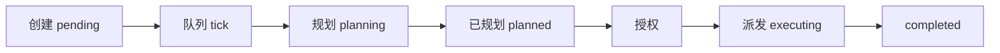

# 任务中心

> **任务中心就是你所有"多步骤任务"的驾驶舱——不管任务从哪来的，都在这里看进度、处理、验收。**
>
> ---
>
> **场景一：你在 Plan 模式里启动了一个"全栈项目开发"**
>
> 你让 AI 执行"开发一个 Todo 全栈应用，需要方案设计→后端→前端→测试→部署"。
>
> 在聊天里确认计划后，AI 开始执行。你切到**任务中心**，看到：
> - **执行中**：方案设计这一步已完成，后端开发正在跑
> - **进度条**：显示 2/5 步完成
> - **点详情**：能看到每一步谁在执行、输出了什么、卡在哪
>
> 如果后端开发卡住了，你可以点**暂停**，在详情里补充指令，再点**继续**。全部完成后，你可以在详情页点**另存为应用**，下次直接复用这个流程。
>
> ---
>
> **场景二：你雇了个"巡检员工"，它每天巡检服务器**
>
> 智能体员工每天 9 点自动上岗，检查服务器健康、写巡检报告。交工后，任务中心会显示：
> - **待确认**：一条"服务器巡检报告"等你验收
> - 点进去看报告内容，没问题点**确认完成**，有问题**打回重做**
>
> 你不需要盯它干活，它干完找你验收就行。
>
> ---
>
> **场景三：你把"竞品调研"存成了应用，现在填参数跑了一次**
>
> 在应用中心选了"竞品调研"应用，填上"AI 编程助手"作为调研目标，点运行。切换到任务中心，就看到这条任务在**执行中**，跑完后状态变为**已完成**，点进去看结果。
>
> ---
>
> **任务中心里你能做这些操作：**
>
> | 操作 | 说明 |
> |------|------|
> | **筛选** | 按来源（对话/员工/应用）、状态、时间范围过滤 |
> | **暂停/继续** | 任务卡住了先暂停，改完指令再继续 |
> | **验收** | 员工交工后确认或打回 |
> | **另存为应用** | 把跑通的任务沉淀成可复用的应用 |
> | **再跑一次** | 失败或想重新跑，一键重来 |
> | **批量操作** | 全选→批量暂停/启动/删除 |
>
> **几个关键区分：**
> - 任务中心 vs Plan 模式：Plan 是"单会话内边聊边执行"，任务中心是"跨会话看板"——Plan 完成后自动出现在任务中心
> - 任务中心 vs 自动化：自动化是"到点跑固定指令"，任务中心是"看板与观测"
> - 任务中心 vs 智能体员工：员工是"上岗巡检"，任务中心是"收工验收"
>
> 侧栏入口：**任务中心**（`#/tasks`）。

任务中心用来跟踪**多步骤、可观测**的任务：从主对话 Plan、智能体员工、应用中心汇聚到同一驾驶舱，按来源与状态处理、暂停、验收。

侧栏入口：**任务中心**（`#/tasks`）。

> 新建任务时可选择 **自动执行**（创建后自动规划并跑完）或 **手动确认**（规划后需你再启动）。手动确认可用右上角进入批量后 **批量启动**。

---

## 一、何时用

| 你想做的事 | 推荐路径 |
|----------|---------|
| 单会话多步骤、边聊边确认 | [Plan 模式](../chat/plan-mode.md)（聊天顶栏，不是任务中心） |
| 复杂多角色协作、要看板与观测 | **任务中心**（本文） |
| 到点重复固定指令 | [自动化](scheduled-tasks.md) |
| 流程已固定、只换参数再跑 | [应用中心](../configuration/app-center.md) |
| 岗位定时巡检与交班 | [智能体员工](../configuration/smart-employees.md) |

> **目标 Agent** 在实时聊天输入栏（Goal 模式），与任务中心无关，见 [目标 Agent](../chat/goal-agent.md)。

典型特征：**一次性、复杂、要看进度与验收**——例如完整竞品报告、模块重构（方案 + 代码 + 测试 + 文档）。

---

## 二、路由

| 路由 | 页面 |
|------|------|
| `#/tasks` | 驾驶舱列表 |
| `#/task/:id` | 任务详情（进度、子任务、观测、决策、总结）；任务中心点详情统一进此页 |
| `#/workflow/:id` | 全屏工作流（DAG / 主控与子任务） |

列表约每 **15 秒**静默刷新。

---

## 三、驾驶舱 `#/tasks`

页头副标题：按来源跟踪任务——岗位、智能体、状态与进度一目了然。

### 今日关注

动态摘要与可点 Chip，例如：**待确认**、**执行中**、**失败**、**待审批** 等。

### 来源 Tab（类型）

| Tab | 含义 |
|-----|------|
| **全部** | 所有来源 |
| **对话** | 主对话 Plan / 手动新建 |
| **智能体员工** | 值班派发或岗位产生的任务 |
| **应用中心** | 应用 / 工作流触发 |

### 条件筛选

来源 Tab 与筛选条 **类型** 同步（对话 / 智能体员工 / 应用中心）；另可筛应用、智能体、状态。

| 控件 | 说明 |
|------|------|
| **类型** | 对话 / 智能体员工 / 应用中心 |
| **应用** | 按应用来源筛选 |
| **智能体** | 按指派智能体或岗位筛选 |
| **状态** | 执行中 / 规划中 / 待开始 / … |
| **清除** | 清空来源、状态、应用、岗位与搜索 |

### 筛选与队列

| 控件 | 说明 |
|------|------|
| 搜索 | 任务 / 岗位 / 智能体 / 应用名 |
| **更多** | 时间范围、每页条数、批量暂停 |
| 时间范围 | 全部 / 今天 / 近 1 周 / 近 1 月 |
| 每页条数 | 10 / 20 / 50；列表底部分页翻页 |

### 区块

| 区块 | 内容 |
|------|------|
| **需要你处理** | 待确认、待审批（失败请用状态筛选查看） |
| **全部任务** | 表格：名称 · 类型 · 岗位 · 智能体 · 进度 · 状态 · 时间 · 操作 |
| **按状态查看** | 折叠区；状态卡含执行中 / 规划中 / 待开始 / 已暂停 / **待确认** / 已完成 / 失败 / 已取消 |

行内操作：**详情** + **⋯** 菜单（编辑 / 启动 / 暂停 / 取消 / 删除，按状态显隐；菜单浮层 fixed，不被卡片裁切）。

### 批量删除

点右上角 **批量删除** 进入多选：

| 操作 | 说明 |
|------|------|
| **表头勾选** | 全选 / 取消本页 |
| **批量删除**（底栏） | 删除选中任务及子任务，不可恢复；≥3 条需输入数量确认 |
| **批量启动 / 暂停** | 对选中项操作 |
| **取消选择 / 退出批量** | 退出多选 |

---

## 四、创建任务

### 界面

1. 点 **＋ 新建任务**
2. 填写：
   - **任务名称**（如：竞品分析与报告）
   - **任务描述**（必填：要做什么、产出什么、约束）
   - **执行模式**：**手动确认**（规划后需你再启动）/ **自动执行**（创建后自动规划并跑完）
3. 提交

也可从模板卡片快速开建（若列表有模板入口）。

### 对话触发

在聊天里说明目标，让主智能体创建任务（与 GUI 等价）。描述技巧：写清产出物、划红线（不要动某模块）、可点名项目团队。

---

## 五、状态速查

| 展示态 | 含义 | 常见操作 |
|--------|------|----------|
| 待开始 / 待处理 | 已创建，等队列或手动启动 | 批量启动 / 删除 |
| 规划中 | 正在生成 plan | 暂停 / 删除 |
| 已规划 / 规划就绪 | plan 已绑定 | 暂停 / 启动（视模式） |
| 执行中 | 子任务在跑 | 暂停 / 看详情与工作流 |
| 等待派发 / 验证中 / 反思中 等 | 执行中间态（列表「执行中」分组常含这些） | 暂停 |
| **待确认** | 员工已交工，等你验收 | 详情决策区确认 / 打回 |
| 已暂停 | 授权已撤 | 继续 |
| 已完成 | 收束成功 | 查看总结；可另存为应用 |
| 失败 | 执行失败 | 再跑一次 / 看工作流 / 删除 |
| 已取消 | 手动取消 | 删除 |

**待确认 ≠ 待审批**：待审批多在智能体员工侧「开工前拍板」；待确认是任务中心「交工后验收」。

---

## 六、详情页 `#/task/:id`

### 顶栏

| 按钮 | 说明 |
|------|------|
| ← 返回列表 | 回 `#/tasks` |
| **查看计划** | 仅主对话任务，且有计划时 |
| **另存为应用** | 仅主对话任务，有计划时 → 沉淀到 [应用中心](../configuration/app-center.md) |
| **再跑一次** | 来自应用运行时常见 |
| **查看工作流** | 仅主对话任务 → `#/workflow/:id` |
| **暂停** / **继续** | 按状态切换 |
| **刷新** | 拉最新状态 |

### 主体

| 区块 | 内容 |
|------|------|
| **任务信息** | 侧栏：岗位、类型、时间、原始需求；员工任务可跳转工作项 |
| **进度条** | 仅执行中 / 规划中 / 已暂停显示 |
| **完成结果** | 结论摘要 + 产出卡片 + 发现 + 下一步（不再堆整段长文） |
| **子任务进度** | 执行中展示；完成态隐藏以免重复强调 |
| **运行观测** | 侧栏汇总（有数据时） |
| **待你处理** | 仅待确认 / 失败决策；删除收入「更多」菜单 |

### 决策区（示例）

| 情境 | 按钮 |
|------|------|
| 待确认 | **确认完成** · **打回重做** · **标记失败** · **取消任务** · **删除** |
| 失败 | **再跑一次** · **查看工作流** · **删除** |
| 已完成 / 已取消 | **删除任务** |

子任务行若出现 **分配**，用于指定执行角色；更细的节点对话在工作流页。

---

## 七、工作流页 `#/workflow/:id`

全屏 DAG / 主控视图（详情页内不再嵌旧版 React 面板）。

- Chip：**主控** · **工作流**
- 点击节点查看对话与执行详情
- 可返回 `#/task/:id`
- 与 Plan / Supervisor 协作关系见 [Plan 模式](../chat/plan-mode.md)、[Supervisor 案例](../../cases/supervisor-mode.md)

---

## 八、暂停、继续与删除

**暂停**：主任务暂停、撤销执行授权、取消活跃 worker / 子任务。  
**继续**：无人值守可再入流水线；上下文与中间产物保留。  
**删除**：主任务与子任务记录一并移除，**不可恢复**。

人工纠偏：先暂停 → 在计划/对话中改目标或约束 → 继续；或在工作流节点上继续说明修改意见。

---

## 九、跨模块

| 来源 | 在任务中心 |
|------|------------|
| 主对话 Plan「开始执行」 | 来源 Tab「对话」 |
| 智能体员工派发 / 交工 | 「智能体员工」；待确认在此验收 |
| 应用填参运行 | 「应用中心」；可再跑一次、另存为应用 |

智能体员工侧的「待审批」与任务中心「待确认」分工见 [智能体员工](../configuration/smart-employees.md)。

---

## 十、常见问题

**Q：一直停在待开始？**  
1）是否关闭了无人值守却未批量启动；2）Gateway 是否在跑；3）`EVOFLOW_TASK_QUEUE_ENABLED` 是否为 `0`；4）并发是否已满。

**Q：详情页找不到「启动」？**  
正常。手动模式用右上角进入批量 → **批量启动**，或打开无人值守。

**Q：失败会自动重试吗？**  
默认会，最多 `EVOFLOW_TASK_QUEUE_RETRY_MAX`（默认 3）次，超出后停在失败等人工处理。

**Q：工作流在哪看？**  
详情顶栏 **查看工作流** → `#/workflow/:id`，不是详情页内嵌大图。

**Q：删错能恢复吗？**  
不能。建议定期备份 `~/.evoflow/`。

---

## 附录 A：环境变量

| 变量 | 默认 | 说明 |
|------|------|------|
| `EVOFLOW_TASK_QUEUE_ENABLED` | `1` | `0` 关闭队列，任务易停在 pending |
| `EVOFLOW_TASK_QUEUE_INTERVAL_SECONDS` | `15` | 队列 tick |
| `EVOFLOW_TASK_QUEUE_MAX_CONCURRENT` | `3` | 同时活跃无人值守上限 |
| `EVOFLOW_TASK_QUEUE_RETRY_MAX` | `3` | 失败自动重试次数 |
| `EVOFLOW_LANGGRAPH_URL` | 见 `.env.example` | LangGraph API；错误会导致线程创建失败 |

修改后需重启 Gateway。

---

## 附录 B：无人值守流水线

手动确认模式在「已规划」后等待你 **批量启动**（或之后改为无人值守），不会自动授权执行。

---

## 相关阅读

- [Plan 模式](../chat/plan-mode.md)
- [应用中心](../configuration/app-center.md)
- [智能体员工](../configuration/smart-employees.md)
- [自动化](scheduled-tasks.md)
- [Supervisor 模式案例](../../cases/supervisor-mode.md)
- [EvoFlow 桌面端使用指南](../configuration/evopanel-guide.md)
